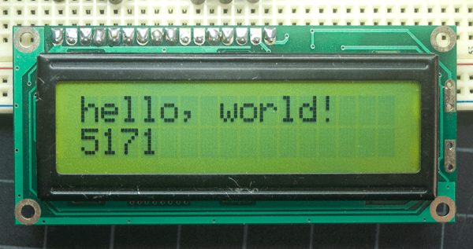
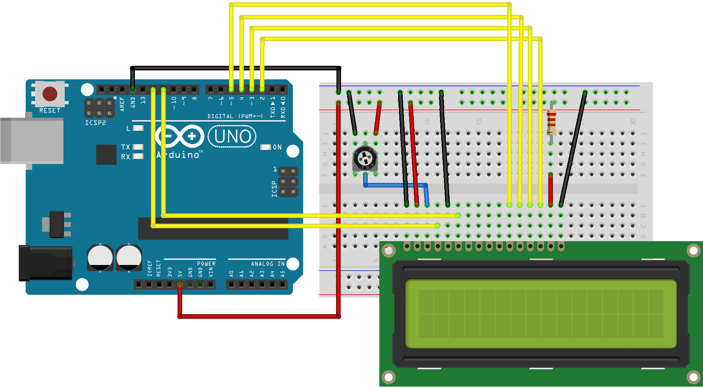

>This article was revised on 2021/11/18 by Karl Söderby.

The [LiquidCrystal library](https://www.arduino.cc/reference/en/libraries/liquidcrystal/) allows you to control LCD displays that are compatible with the Hitachi HD44780 driver. There are many of them out there, and you can usually tell them by the 16-pin interface.



The LCDs have a parallel interface, meaning that the microcontroller has to manipulate several interface pins at once to control the display. The interface consists of the following pins:

- A **register select (RS) pin** that controls where in the LCD's memory you're writing data to. You can select either the data register, which holds what goes on the screen, or an instruction register, which is where the LCD's controller looks for instructions on what to do next.
- A **Read/Write (R/W) pin** that selects reading mode or writing mode
- An **Enable pin** that enables writing to the registers
- 8 **data pins (D0 -D7)**. The states of these pins (high or low) are the bits that you're writing to a register when you write, or the values you're reading when you read.

There's also a **display contrast pin (Vo)**, **power supply pins (+5V and GND)** and **LED Backlight (Bklt+ and BKlt-)** pins that you can use to power the LCD, control the display contrast, and turn on and off the LED backlight, respectively.

The process of controlling the display involves putting the data that form the image of what you want to display into the data registers, then putting instructions in the instruction register.  The [LiquidCrystal Library](https://www.arduino.cc/reference/en/libraries/liquidcrystal/) simplifies this for you so you don't need to know the low-level instructions.

The Hitachi-compatible LCDs can be controlled in two modes: 4-bit or 8-bit. The 4-bit mode requires seven I/O pins from the Arduino, while the 8-bit mode requires 11 pins.  For displaying text on the screen, you can do most everything in 4-bit mode, so example shows how to  control a 16x2 LCD in 4-bit mode.

## Hardware Required

- Arduino Board
- LCD Screen (compatible with Hitachi HD44780 driver)
- pin headers to solder to the LCD display pins
- 10k ohm potentiometer
- 220 ohm resistor
- hook-up wires
- breadboard

## Circuit

***Note that this circuit was originally designed for the Arduino UNO. As the Arduino is communicating with the display using [SPI](), pin 11 & 12 will change depending on what board you are using. For example, on a MKR WiFi 1010, the SPI bus is attached to pin 8 & 11.***

Before wiring the LCD screen to your Arduino board we suggest to solder a pin header strip to the 14 (or 16) pin count connector of the LCD screen, as you can see in the image further up.

To wire your LCD screen to your board, connect the following pins:

- LCD RS pin to digital pin 12
- LCD Enable pin to digital pin 11
- LCD D4 pin to digital pin 5
- LCD D5 pin to digital pin 4
- LCD D6 pin to digital pin 3
- LCD D7 pin to digital pin 2
- LCD R/W pin to GND
- LCD VSS pin to GND
- LCD VCC pin to 5V
- LCD LED+ to 5V through a 220 ohm resistor
- LCD LED- to GND

Additionally, wire a 10k potentiometer to +5V and GND, with it's wiper (output) to LCD screens VO pin (pin3).



## Schematic


### Hello World Example

This example sketch prints `Hello World!` to the LCD and shows the time in seconds since the Arduino was reset.

```arduino
/*
  LiquidCrystal Library - Hello World

 Demonstrates the use a 16x2 LCD display.  The LiquidCrystal
 library works with all LCD displays that are compatible with the
 Hitachi HD44780 driver. There are many of them out there, and you
 can usually tell them by the 16-pin interface.

 This sketch prints "Hello World!" to the LCD
 and shows the time.

  The circuit:
 * LCD RS pin to digital pin 12
 * LCD Enable pin to digital pin 11
 * LCD D4 pin to digital pin 5
 * LCD D5 pin to digital pin 4
 * LCD D6 pin to digital pin 3
 * LCD D7 pin to digital pin 2
 * LCD R/W pin to ground
 * LCD VSS pin to ground
 * LCD VCC pin to 5V
 * 10K resistor:
 * ends to +5V and ground
 * wiper to LCD VO pin (pin 3)

 Library originally added 18 Apr 2008
 by David A. Mellis
 library modified 5 Jul 2009
 by Limor Fried (http://www.ladyada.net)
 example added 9 Jul 2009
 by Tom Igoe
 modified 22 Nov 2010
 by Tom Igoe
 modified 7 Nov 2016
 by Arturo Guadalupi

 This example code is in the public domain.

 https://docs.arduino.cc/learn/electronics/lcd-displays

*/

// include the library code:
#include <LiquidCrystal.h>

// initialize the library by associating any needed LCD interface pin
// with the arduino pin number it is connected to
const int rs = 12, en = 11, d4 = 5, d5 = 4, d6 = 3, d7 = 2;
LiquidCrystal lcd(rs, en, d4, d5, d6, d7);

void setup() {
  // set up the LCD's number of columns and rows:
  lcd.begin(16, 2);
  // Print a message to the LCD.
  lcd.print("hello, world!");
}

void loop() {
  // set the cursor to column 0, line 1
  // (note: line 1 is the second row, since counting begins with 0):
  lcd.setCursor(0, 1);
  // print the number of seconds since reset:
  lcd.print(millis() / 1000);
}


```

### Autoscroll Example

This example sketch shows how to use the `autoscroll()` and `noAutoscroll()` methods to move all the text on the display left or right. 

- `autoscroll()` moves all the text one space to the left each time a letter is added
- `noAutoscroll()` turns scrolling off

This sketch prints the characters `0` to `9` with autoscroll off, then moves the cursor to the bottom right, turns autoscroll on, and prints them again.

```arduino

/*

  LiquidCrystal Library - Autoscroll

 Demonstrates the use a 16x2 LCD display.  The LiquidCrystal

 library works with all LCD displays that are compatible with the

 Hitachi HD44780 driver. There are many of them out there, and you

 can usually tell them by the 16-pin interface.

 This sketch demonstrates the use of the autoscroll()

 and noAutoscroll() functions to make new text scroll or not.

 The circuit:

 * LCD RS pin to digital pin 12

 * LCD Enable pin to digital pin 11

 * LCD D4 pin to digital pin 5

 * LCD D5 pin to digital pin 4

 * LCD D6 pin to digital pin 3

 * LCD D7 pin to digital pin 2

 * LCD R/W pin to ground

 * 10K resistor:

 * ends to +5V and ground

 * wiper to LCD VO pin (pin 3)

 Library originally added 18 Apr 2008

 by David A. Mellis

 library modified 5 Jul 2009

 by Limor Fried (http://www.ladyada.net)

 example added 9 Jul 2009

 by Tom Igoe

 modified 22 Nov 2010

 by Tom Igoe

 modified 7 Nov 2016

 by Arturo Guadalupi

 This example code is in the public domain.

 http://www.arduino.cc/en/Tutorial/LiquidCrystalAutoscroll

*/

// include the library code:
#include <LiquidCrystal.h>

// initialize the library by associating any needed LCD interface pin
// with the arduino pin number it is connected to

const int rs = 12, en = 11, d4 = 5, d5 = 4, d6 = 3, d7 = 2;

LiquidCrystal lcd(rs, en, d4, d5, d6, d7);

void setup() {

  // set up the LCD's number of columns and rows:

  lcd.begin(16, 2);
}

void loop() {

  // set the cursor to (0,0):

  lcd.setCursor(0, 0);

  // print from 0 to 9:

  for (int thisChar = 0; thisChar < 10; thisChar++) {

    lcd.print(thisChar);

    delay(500);

  }

  // set the cursor to (16,1):

  lcd.setCursor(16, 1);

  // set the display to automatically scroll:

  lcd.autoscroll();

  // print from 0 to 9:

  for (int thisChar = 0; thisChar < 10; thisChar++) {

    lcd.print(thisChar);

    delay(500);

  }

  // turn off automatic scrolling

  lcd.noAutoscroll();

  // clear screen for the next loop:

  lcd.clear();
}
```

### Blink Example

This example sketch shows how to use the `blink()` and `noBlink()` methods to blink a block-style cursor.

```arduino
/*

  LiquidCrystal Library - Blink

 Demonstrates the use a 16x2 LCD display.  The LiquidCrystal

 library works with all LCD displays that are compatible with the

 Hitachi HD44780 driver. There are many of them out there, and you

 can usually tell them by the 16-pin interface.

 This sketch prints "Hello World!" to the LCD and makes the

 cursor block blink.

 The circuit:

 * LCD RS pin to digital pin 12

 * LCD Enable pin to digital pin 11

 * LCD D4 pin to digital pin 5

 * LCD D5 pin to digital pin 4

 * LCD D6 pin to digital pin 3

 * LCD D7 pin to digital pin 2

 * LCD R/W pin to ground

 * 10K resistor:

   * ends to +5V and ground

   * wiper to LCD VO pin (pin 3)

 Library originally added 18 Apr 2008

 by David A. Mellis

 library modified 5 Jul 2009

 by Limor Fried (http://www.ladyada.net)

 example added 9 Jul 2009

 by Tom Igoe

 modified 22 Nov 2010

 by Tom Igoe

 modified 7 Nov 2016

 by Arturo Guadalupi

 This example code is in the public domain.

 http://www.arduino.cc/en/Tutorial/LiquidCrystalBlink

*/

// include the library code:
#include <LiquidCrystal.h>

// initialize the library by associating any needed LCD interface pin
// with the arduino pin number it is connected to

const int rs = 12, en = 11, d4 = 5, d5 = 4, d6 = 3, d7 = 2;

LiquidCrystal lcd(rs, en, d4, d5, d6, d7);

void setup() {

  // set up the LCD's number of columns and rows:

  lcd.begin(16, 2);

  // Print a message to the LCD.

  lcd.print("hello, world!");
}

void loop() {

  // Turn off the blinking cursor:

  lcd.noBlink();

  delay(3000);

  // Turn on the blinking cursor:

  lcd.blink();

  delay(3000);
}
```

### Cursor

This example sketch shows how to use the `cursor()` and `noCursor()` methods to control an underscore-style cursor.

```arduino

/*

  LiquidCrystal Library - Cursor

 Demonstrates the use a 16x2 LCD display.  The LiquidCrystal

 library works with all LCD displays that are compatible with the

 Hitachi HD44780 driver. There are many of them out there, and you

 can usually tell them by the 16-pin interface.

 This sketch prints "Hello World!" to the LCD and

 uses the cursor()  and noCursor() methods to turn

 on and off the cursor.

 The circuit:

 * LCD RS pin to digital pin 12

 * LCD Enable pin to digital pin 11

 * LCD D4 pin to digital pin 5

 * LCD D5 pin to digital pin 4

 * LCD D6 pin to digital pin 3

 * LCD D7 pin to digital pin 2

 * LCD R/W pin to ground

 * 10K resistor:

 * ends to +5V and ground

 * wiper to LCD VO pin (pin 3)

 Library originally added 18 Apr 2008

 by David A. Mellis

 library modified 5 Jul 2009

 by Limor Fried (http://www.ladyada.net)

 example added 9 Jul 2009

 by Tom Igoe

 modified 22 Nov 2010

 by Tom Igoe

 modified 7 Nov 2016

 by Arturo Guadalupi

 This example code is in the public domain.

 http://www.arduino.cc/en/Tutorial/LiquidCrystalCursor

*/

// include the library code:
#include <LiquidCrystal.h>

// initialize the library by associating any needed LCD interface pin
// with the arduino pin number it is connected to

const int rs = 12, en = 11, d4 = 5, d5 = 4, d6 = 3, d7 = 2;

LiquidCrystal lcd(rs, en, d4, d5, d6, d7);

void setup() {

  // set up the LCD's number of columns and rows:

  lcd.begin(16, 2);

  // Print a message to the LCD.

  lcd.print("hello, world!");
}

void loop() {

  // Turn off the cursor:

  lcd.noCursor();

  delay(500);

  // Turn on the cursor:

  lcd.cursor();

  delay(500);
}
```

### Display Example

This example sketch shows how to use the `display()` and `noDisplay()` methods to turn on and off the display. The text to be displayed will still be preserved when you use noDisplay() so it's a quick way to blank the display without losing everything on it.

```arduino
/*
  LiquidCrystal Library - display() and noDisplay()

 Demonstrates the use a 16x2 LCD display.  The LiquidCrystal
 library works with all LCD displays that are compatible with the
 Hitachi HD44780 driver. There are many of them out there, and you
 can usually tell them by the 16-pin interface.

 This sketch prints "Hello World!" to the LCD and uses the
 display() and noDisplay() functions to turn on and off
 the display.

 The circuit:
 * LCD RS pin to digital pin 12
 * LCD Enable pin to digital pin 11
 * LCD D4 pin to digital pin 5
 * LCD D5 pin to digital pin 4
 * LCD D6 pin to digital pin 3
 * LCD D7 pin to digital pin 2
 * LCD R/W pin to ground
 * 10K resistor:
 * ends to +5V and ground
 * wiper to LCD VO pin (pin 3)

 Library originally added 18 Apr 2008
 by David A. Mellis
 library modified 5 Jul 2009
 by Limor Fried (http://www.ladyada.net)
 example added 9 Jul 2009
 by Tom Igoe
 modified 22 Nov 2010
 by Tom Igoe
 modified 7 Nov 2016
 by Arturo Guadalupi

 This example code is in the public domain.

 http://www.arduino.cc/en/Tutorial/LiquidCrystalDisplay

*/

// include the library code:
#include <LiquidCrystal.h>

// initialize the library by associating any needed LCD interface pin
// with the arduino pin number it is connected to
const int rs = 12, en = 11, d4 = 5, d5 = 4, d6 = 3, d7 = 2;
LiquidCrystal lcd(rs, en, d4, d5, d6, d7);

void setup() {
  // set up the LCD's number of columns and rows:
  lcd.begin(16, 2);
  // Print a message to the LCD.
  lcd.print("hello, world!");
}

void loop() {
  // Turn off the display:
  lcd.noDisplay();
  delay(500);
  // Turn on the display:
  lcd.display();
  delay(500);
}
```

### Scroll Example

This example sketch shows how to use the `scrollDisplayLeft()` and `scrollDisplayRight()` methods to reverse the direction the text is flowing.  It prints "Hello World!", scrolls it offscreen to the left, then offscreen to the right, then back to home.

```arduino
/*
  LiquidCrystal Library - scrollDisplayLeft() and scrollDisplayRight()

 Demonstrates the use a 16x2 LCD display.  The LiquidCrystal
 library works with all LCD displays that are compatible with the
 Hitachi HD44780 driver. There are many of them out there, and you
 can usually tell them by the 16-pin interface.

 This sketch prints "Hello World!" to the LCD and uses the
 scrollDisplayLeft() and scrollDisplayRight() methods to scroll
 the text.

  The circuit:
 * LCD RS pin to digital pin 12
 * LCD Enable pin to digital pin 11
 * LCD D4 pin to digital pin 5
 * LCD D5 pin to digital pin 4
 * LCD D6 pin to digital pin 3
 * LCD D7 pin to digital pin 2
 * LCD R/W pin to ground
 * 10K resistor:
 * ends to +5V and ground
 * wiper to LCD VO pin (pin 3)

 Library originally added 18 Apr 2008
 by David A. Mellis
 library modified 5 Jul 2009
 by Limor Fried (http://www.ladyada.net)
 example added 9 Jul 2009
 by Tom Igoe
 modified 22 Nov 2010
 by Tom Igoe
 modified 7 Nov 2016
 by Arturo Guadalupi

 This example code is in the public domain.

 http://www.arduino.cc/en/Tutorial/LiquidCrystalScroll

*/

// include the library code:
#include <LiquidCrystal.h>

// initialize the library by associating any needed LCD interface pin
// with the arduino pin number it is connected to
const int rs = 12, en = 11, d4 = 5, d5 = 4, d6 = 3, d7 = 2;
LiquidCrystal lcd(rs, en, d4, d5, d6, d7);

void setup() {
  // set up the LCD's number of columns and rows:
  lcd.begin(16, 2);
  // Print a message to the LCD.
  lcd.print("hello, world!");
  delay(1000);
}

void loop() {
  // scroll 13 positions (string length) to the left
  // to move it offscreen left:
  for (int positionCounter = 0; positionCounter < 13; positionCounter++) {
    // scroll one position left:
    lcd.scrollDisplayLeft();
    // wait a bit:
    delay(150);
  }

  // scroll 29 positions (string length + display length) to the right
  // to move it offscreen right:
  for (int positionCounter = 0; positionCounter < 29; positionCounter++) {
    // scroll one position right:
    lcd.scrollDisplayRight();
    // wait a bit:
    delay(150);
  }

  // scroll 16 positions (display length + string length) to the left
  // to move it back to center:
  for (int positionCounter = 0; positionCounter < 16; positionCounter++) {
    // scroll one position left:
    lcd.scrollDisplayLeft();
    // wait a bit:
    delay(150);
  }

  // delay at the end of the full loop:
  delay(1000);

}
```

### Serial to Display Example

This example sketch accepts serial input from a host computer and displays it on the LCD. To use it, upload the sketch, then open the Serial Monitor and type some characters and click Send. The text will appear on your LCD.

```
/*
  LiquidCrystal Library - Serial Input

 Demonstrates the use a 16x2 LCD display.  The LiquidCrystal
 library works with all LCD displays that are compatible with the
 Hitachi HD44780 driver. There are many of them out there, and you
 can usually tell them by the 16-pin interface.

 This sketch displays text sent over the serial port
 (e.g. from the Serial Monitor) on an attached LCD.

 The circuit:
 * LCD RS pin to digital pin 12
 * LCD Enable pin to digital pin 11
 * LCD D4 pin to digital pin 5
 * LCD D5 pin to digital pin 4
 * LCD D6 pin to digital pin 3
 * LCD D7 pin to digital pin 2
 * LCD R/W pin to ground
 * 10K resistor:
 * ends to +5V and ground
 * wiper to LCD VO pin (pin 3)

 Library originally added 18 Apr 2008
 by David A. Mellis
 library modified 5 Jul 2009
 by Limor Fried (http://www.ladyada.net)
 example added 9 Jul 2009
 by Tom Igoe
 modified 22 Nov 2010
 by Tom Igoe
 modified 7 Nov 2016
 by Arturo Guadalupi

 This example code is in the public domain.

 http://www.arduino.cc/en/Tutorial/LiquidCrystalSerialDisplay

*/

// include the library code:
#include <LiquidCrystal.h>

// initialize the library by associating any needed LCD interface pin
// with the arduino pin number it is connected to
const int rs = 12, en = 11, d4 = 5, d5 = 4, d6 = 3, d7 = 2;
LiquidCrystal lcd(rs, en, d4, d5, d6, d7);

void setup() {
  // set up the LCD's number of columns and rows:
  lcd.begin(16, 2);
  // initialize the serial communications:
  Serial.begin(9600);
}

void loop() {
  // when characters arrive over the serial port...
  if (Serial.available()) {
    // wait a bit for the entire message to arrive
    delay(100);
    // clear the screen
    lcd.clear();
    // read all the available characters
    while (Serial.available() > 0) {
      // display each character to the LCD
      lcd.write(Serial.read());
    }
  }
}
```

### Set Cursor Example

This example sketch shows how to use the `setCursor()` method to reposition the cursor.  To move the cursor, just call `setCursor()` with a row and column position. For example, for a 2x16 display:

```arduino
lcd.setCursor(0, 0); // top left
lcd.setCursor(15, 0); // top right
lcd.setCursor(0, 1); // bottom left
lcd.setCursor(15, 1); // bottom right
```

Here is the full example:

```arduino
/*

  LiquidCrystal Library - setCursor

 Demonstrates the use a 16x2 LCD display.  The LiquidCrystal

 library works with all LCD displays that are compatible with the

 Hitachi HD44780 driver. There are many of them out there, and you

 can usually tell them by the 16-pin interface.

 This sketch prints to all the positions of the LCD using the

 setCursor() method:

  The circuit:

 * LCD RS pin to digital pin 12

 * LCD Enable pin to digital pin 11

 * LCD D4 pin to digital pin 5

 * LCD D5 pin to digital pin 4

 * LCD D6 pin to digital pin 3

 * LCD D7 pin to digital pin 2

 * LCD R/W pin to ground

 * 10K resistor:

 * ends to +5V and ground

 * wiper to LCD VO pin (pin 3)

 Library originally added 18 Apr 2008

 by David A. Mellis

 library modified 5 Jul 2009

 by Limor Fried (http://www.ladyada.net)

 example added 9 Jul 2009

 by Tom Igoe

 modified 22 Nov 2010

 by Tom Igoe

 modified 7 Nov 2016

 by Arturo Guadalupi

 This example code is in the public domain.

 http://www.arduino.cc/en/Tutorial/LiquidCrystalSetCursor

*/

// include the library code:
#include <LiquidCrystal.h>

// initialize the library by associating any needed LCD interface pin
// with the arduino pin number it is connected to

const int rs = 12, en = 11, d4 = 5, d5 = 4, d6 = 3, d7 = 2;

LiquidCrystal lcd(rs, en, d4, d5, d6, d7);

// these constants won't change.  But you can change the size of
// your LCD using them:

const int numRows = 2;

const int numCols = 16;

void setup() {

  // set up the LCD's number of columns and rows:

  lcd.begin(numCols, numRows);
}

void loop() {

  // loop from ASCII 'a' to ASCII 'z':

  for (int thisLetter = 'a'; thisLetter <= 'z'; thisLetter++) {

    // loop over the columns:

    for (int  thisRow = 0; thisRow < numRows; thisRow++) {

      // loop over the rows:

      for (int thisCol = 0; thisCol < numCols; thisCol++) {

        // set the cursor position:

        lcd.setCursor(thisCol, thisRow);

        // print the letter:

        lcd.write(thisLetter);

        delay(200);

      }

    }

  }
}
```

### Text Direction Example

This example sketch shows how to use the `leftToRight()` and `rightToLeft()` methods. These methods control which way text flows from the cursor.

- `rightToLeft()` causes text to flow to the left from the cursor, as if the display is right-justified.
- `leftToRight()` causes text to flow to the right from the cursor, as if the display is left-justified.

This sketch prints `a` through `l` right to left, then `m` through `r` left to right, then `s` through `z` right to left again.

```arduino
/*

 LiquidCrystal Library - TextDirection

 Demonstrates the use a 16x2 LCD display.  The LiquidCrystal

 library works with all LCD displays that are compatible with the

 Hitachi HD44780 driver. There are many of them out there, and you

 can usually tell them by the 16-pin interface.

 This sketch demonstrates how to use leftToRight() and rightToLeft()

 to move the cursor.

 The circuit:

  * LCD RS pin to digital pin 12

  * LCD Enable pin to digital pin 11

  * LCD D4 pin to digital pin 5

  * LCD D5 pin to digital pin 4

  * LCD D6 pin to digital pin 3

  * LCD D7 pin to digital pin 2

  * LCD R/W pin to ground

  * 10K resistor:

  * ends to +5V and ground

  * wiper to LCD VO pin (pin 3)

 Library originally added 18 Apr 2008

 by David A. Mellis

 library modified 5 Jul 2009

 by Limor Fried (http://www.ladyada.net)

 example added 9 Jul 2009

 by Tom Igoe

 modified 22 Nov 2010

 by Tom Igoe

 modified 7 Nov 2016

 by Arturo Guadalupi

 This example code is in the public domain.

 http://www.arduino.cc/en/Tutorial/LiquidCrystalTextDirection

*/

// include the library code:
#include <LiquidCrystal.h>

// initialize the library by associating any needed LCD interface pin
// with the arduino pin number it is connected to

const int rs = 12, en = 11, d4 = 5, d5 = 4, d6 = 3, d7 = 2;

LiquidCrystal lcd(rs, en, d4, d5, d6, d7);

int thisChar = 'a';

void setup() {

  // set up the LCD's number of columns and rows:

  lcd.begin(16, 2);

  // turn on the cursor:

  lcd.cursor();
}

void loop() {

  // reverse directions at 'm':

  if (thisChar == 'm') {

    // go right for the next letter

    lcd.rightToLeft();

  }

  // reverse again at 's':

  if (thisChar == 's') {

    // go left for the next letter

    lcd.leftToRight();

  }

  // reset at 'z':

  if (thisChar > 'z') {

    // go to (0,0):

    lcd.home();

    // start again at 0

    thisChar = 'a';

  }

  // print the character

  lcd.write(thisChar);

  // wait a second:

  delay(1000);

  // increment the letter:

  thisChar++;
}
```

### Custom Character

This example demonstrates how to add custom characters on an LCD  display. 

Note that this example requires an additional potentiometer:
- Outer pins connected to 5V and GND.
- Inner pin (wiper) connected to A0.

This potentiometer controls the `delayTime` variable.

```arduino
/*
  LiquidCrystal Library - Custom Characters

 Demonstrates how to add custom characters on an LCD  display.
 The LiquidCrystal library works with all LCD displays that are
 compatible with the  Hitachi HD44780 driver. There are many of
 them out there, and you can usually tell them by the 16-pin interface.

 This sketch prints "I <heart> Arduino!" and a little dancing man
 to the LCD.

  The circuit:
 * LCD RS pin to digital pin 12
 * LCD Enable pin to digital pin 11
 * LCD D4 pin to digital pin 5
 * LCD D5 pin to digital pin 4
 * LCD D6 pin to digital pin 3
 * LCD D7 pin to digital pin 2
 * LCD R/W pin to ground
 * 10K potentiometer:
 * ends to +5V and ground
 * wiper to LCD VO pin (pin 3)
 * 10K poterntiometer on pin A0

 created 21 Mar 2011
 by Tom Igoe
 modified 11 Nov 2013
 by Scott Fitzgerald
 modified 7 Nov 2016
 by Arturo Guadalupi

 Based on the Adafruit® example at
 https://github.com/adafruit/SPI_VFD/blob/master/examples/createChar/createChar.pde

 This example code is in the public domain.
 https://docs.arduino.cc/learn/electronics/lcd-displays#custom-character

 Also useful:
 http://icontexto.com/charactercreator/

*/

// include the library code:
#include <LiquidCrystal.h>

// initialize the library by associating any needed LCD interface pin
// with the arduino pin number it is connected to
const int rs = 12, en = 11, d4 = 5, d5 = 4, d6 = 3, d7 = 2;
LiquidCrystal lcd(rs, en, d4, d5, d6, d7);

// make some custom characters:
byte heart[8] = {
  0b00000,
  0b01010,
  0b11111,
  0b11111,
  0b11111,
  0b01110,
  0b00100,
  0b00000
};

byte smiley[8] = {
  0b00000,
  0b00000,
  0b01010,
  0b00000,
  0b00000,
  0b10001,
  0b01110,
  0b00000
};

byte frownie[8] = {
  0b00000,
  0b00000,
  0b01010,
  0b00000,
  0b00000,
  0b00000,
  0b01110,
  0b10001
};

byte armsDown[8] = {
  0b00100,
  0b01010,
  0b00100,
  0b00100,
  0b01110,
  0b10101,
  0b00100,
  0b01010
};

byte armsUp[8] = {
  0b00100,
  0b01010,
  0b00100,
  0b10101,
  0b01110,
  0b00100,
  0b00100,
  0b01010
};

void setup() {
  // initialize LCD and set up the number of columns and rows:
  lcd.begin(16, 2);

  // create a new character
  lcd.createChar(0, heart);
  // create a new character
  lcd.createChar(1, smiley);
  // create a new character
  lcd.createChar(2, frownie);
  // create a new character
  lcd.createChar(3, armsDown);
  // create a new character
  lcd.createChar(4, armsUp);

  // set the cursor to the top left
  lcd.setCursor(0, 0);

  // Print a message to the lcd.
  lcd.print("I ");
  lcd.write(byte(0)); // when calling lcd.write() '0' must be cast as a byte
  lcd.print(" Arduino! ");
  lcd.write((byte)1);

}

void loop() {
  // read the potentiometer on A0:
  int sensorReading = analogRead(A0);
  // map the result to 200 - 1000:
  int delayTime = map(sensorReading, 0, 1023, 200, 1000);
  // set the cursor to the bottom row, 5th position:
  lcd.setCursor(4, 1);
  // draw the little man, arms down:
  lcd.write(3);
  delay(delayTime);
  lcd.setCursor(4, 1);
  // draw him arms up:
  lcd.write(4);
  delay(delayTime);
}
```