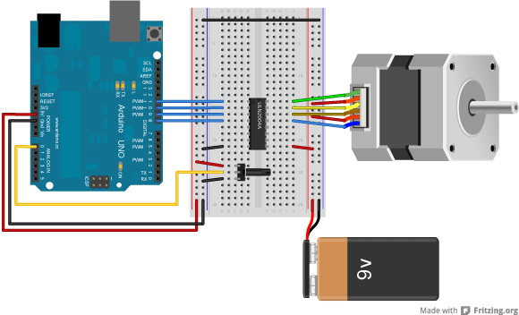
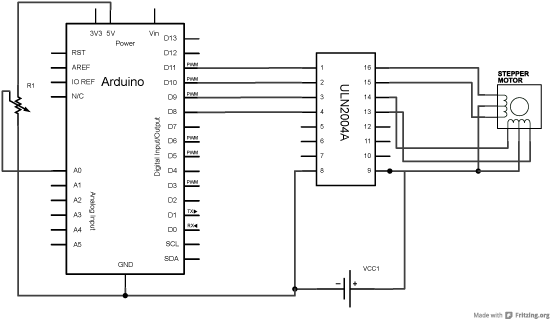
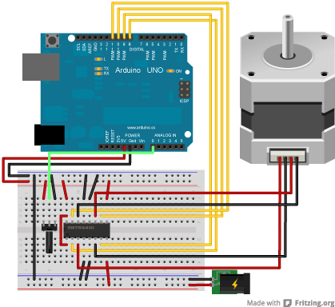

Stepper motors, due to their unique design, can be controlled to a high degree of accuracy without any feedback mechanisms. The shaft of a stepper, mounted with a series of magnets, is controlled by a series of electromagnetic coils that are charged positively and negatively in a specific sequence, precisely moving it forward or backward in small "steps".

There are two types of steppers, Unipolars and Bipolars, and it is very important to know which type you are working with. For each of the motors, there is a different circuit. The example code will control both kinds of motors. See the  [unipolar](https://www.arduino.cc/en/Reference/StepperUnipolarCircuit) and [bipolar](https://www.arduino.cc/en/Reference/StepperBipolarCircuit) motor schematics for information on how to wire up your motor.

The stepper is controlled by with digital pins 8, 9, 10, and 11 for either unipolar or bipolar motors. The Arduino board will connect to a [U2004 Darlington Array](http://octopart.com/uln2004a-stmicroelectronics-4798) if you're using a unipolar stepper or a [SN754410NE H-Bridge](http://octopart.com/sn754410ne-texas+instruments-1320) if you have a bipolar motor.

## Hardware Required

- Arduino Board
- stepper motor
- U2004 Darlington Array (if using a unipolar stepper)
- SN754410ne H-Bridge (if using a bipolar stepper)
- power supply appropriate for your particular stepper
- hook-up wires
- breadboard
  
## Circuit

Below you'll find circuits for both unipolar and bipolar steppers. In either case, it is best to power your stepper motors from an external supply, as they draw too much to be powered directly from your Arduino board.

***Note: Both circuits below are four wire configurations. Two wire configurations will not work with the code provided.***

### Unipolar Stepper Circuit and schematic





### Bipolar Stepper Circuit and Schematic




## Examples

### MotorKnob

A stepper motor follows the turns of a potentiometer (or other sensor) on analog input 0.

```arduino
#include <Stepper.h>

// change this to the number of steps on your motor
#define STEPS 100

// create an instance of the stepper class, specifying
// the number of steps of the motor and the pins it's
// attached to
Stepper stepper(STEPS, 8, 9, 10, 11);

// the previous reading from the analog input
int previous = 0;

void setup() {
  // set the speed of the motor to 30 RPMs
  stepper.setSpeed(30);
}

void loop() {
  // get the sensor value
  int val = analogRead(0);

  // move a number of steps equal to the change in the
  // sensor reading
  stepper.step(val - previous);

  // remember the previous value of the sensor
  previous = val;
}
```

### StepperOneRevolution

The motor should revolve one revolution in one direction, then one revolution in the other direction.

```arduino
#include <Stepper.h>

const int stepsPerRevolution = 200;  // change this to fit the number of steps per revolution
// for your motor

// initialize the stepper library on pins 8 through 11:
Stepper myStepper(stepsPerRevolution, 8, 9, 10, 11);

void setup() {
  // set the speed at 60 rpm:
  myStepper.setSpeed(60);
  // initialize the serial port:
  Serial.begin(9600);
}

void loop() {
  // step one revolution  in one direction:
  Serial.println("clockwise");
  myStepper.step(stepsPerRevolution);
  delay(500);

  // step one revolution in the other direction:
  Serial.println("counterclockwise");
  myStepper.step(-stepsPerRevolution);
  delay(500);
}
```

### StepperOneStepAtATime

The motor will step one step at a time, very slowly.  You can use this to test that you've got the four wires of your stepper wired to the correctpins. If wired correctly, all steps should be in the same direction.

```arduino
#include <Stepper.h>

const int stepsPerRevolution = 200;  // change this to fit the number of steps per revolution
// for your motor

// initialize the stepper library on pins 8 through 11:
Stepper myStepper(stepsPerRevolution, 8, 9, 10, 11);

int stepCount = 0;         // number of steps the motor has taken

void setup() {
  // initialize the serial port:
  Serial.begin(9600);
}

void loop() {
  // step one step:
  myStepper.step(1);
  Serial.print("steps:");
  Serial.println(stepCount);
  stepCount++;
  delay(500);
}
```

### StepperSpeedControl

The motor will rotate in a clockwise direction. The higher the potentiometer value, the faster the motor speed. Because setSpeed() sets the delay between steps,
you may notice the motor is less responsive to changes in the sensor value at low speeds.

```arduino
#include <Stepper.h>

const int stepsPerRevolution = 200;  // change this to fit the number of steps per revolution
// for your motor


// initialize the stepper library on pins 8 through 11:
Stepper myStepper(stepsPerRevolution, 8, 9, 10, 11);

int stepCount = 0;  // number of steps the motor has taken

void setup() {
  // nothing to do inside the setup
}

void loop() {
  // read the sensor value:
  int sensorReading = analogRead(A0);
  // map it to a range from 0 to 100:
  int motorSpeed = map(sensorReading, 0, 1023, 0, 100);
  // set the motor speed:
  if (motorSpeed > 0) {
    myStepper.setSpeed(motorSpeed);
    // step 1/100 of a revolution:
    myStepper.step(stepsPerRevolution / 100);
  }
}
```