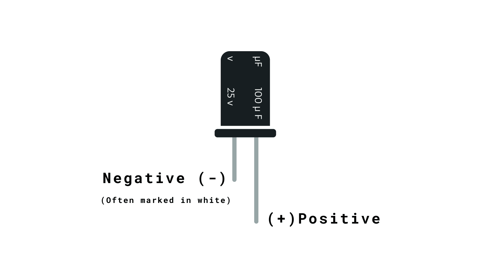
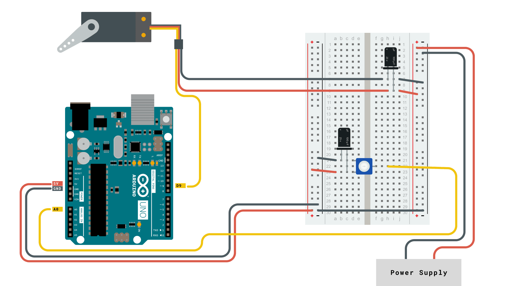

The [Servo Library](https://www.arduino.cc/reference/en/libraries/servo/) is a great library for controlling servo motors. In this article, you will find two easy examples that can be used by any Arduino board.

The first example controls the position of an RC (hobby) [servo motor](<https://en.wikipedia.org/wiki/Servo_(radio_control)>) with your Arduino and a potentiometer. The second example sweeps the shaft of an RC servo motor back and forth across 180 degrees.

You can also visit the [Servo GitHub repository](https://github.com/arduino-libraries/Servo) to learn more about this library.

## Hardware Required

- Arduino Board
- Servo Motor
- 10k ohm potentiometer
- hook-up wires
- capacitors
- power supply

## Powering Servo Motors

Servo motors have different power requirements depending on their size and the workload they are experiencing. A common servo motor such as the [Feetech Mini Servo Motor](https://store.arduino.cc/products/feetech-mini-servo-motor-120-degrees-9g) requires between 4.8 - 6 V at 5 – 6 mA when idle. But as soon as the motor experiences heavier loads such as added weight or an object blocking its movement the current consumption can reach up to 800 mA.

This amount of current is significantly above the max ratings for any Arduino board. To avoid damaging our board we need to power the servo motor through an external power supply. Choosing the correct power supply depends on the servo motor you are using, so always check the specifications. Pay especially close attention to the:

- **operating voltage range**
- **idle current** (in mA) - consumption when **not** moving
- **running current** (in mA) - consumption when moving freely
- **stall current** (in mA) - consumption under max load or when blocked

To power a 4.8 - 6 V servo you could use a **5 V 1 A** AC Adapter, cut the cable, and connect the wires to the servo using e.g. a breadboard.

**_Note that USB wall chargers are limited to 500 mA (USB 2.0) or 900 mA (USB 3.0)._**

If your project needs to move around freely without being attached to a power outlet you can also choose batteries to power the servo. If you need 5 V exactly you can use two 18650 Li-Ion batteries together with a step-down converter.

A step-down converter is needed because 18650 Li-Ion batteries will give you around 7.4 V. The max current depends on the specific battery but most of them are designed to output above 1A which is enough to power our small servo.

**_If you are using bigger or more servos make sure to check your power requirements accordingly._**

**Capacitors** are recommended for powering servo motors. While not strictly necessary, they help stabilize the power supply, minimize voltage drops, and reduce electrical noise. The specific capacitor values may vary based on the servo motor's requirements, but including them is good practice for better performance and reliability.

When using a [Feetech Mini Servo Motor](https://store.arduino.cc/products/feetech-mini-servo-motor-120-degrees-9g) we recommend using a **100 µF** capacitor.



**_When using capacitors, make sure to connect them correctly by checking for markings such as a white stripe, a '+' symbol, or a longer lead. Match these indicators with the corresponding signs on the capacitor and in your circuit (pay attention to the + and - signs), and be careful not to exceed the voltage limits. This precaution helps prevent issues like leaks or damage that could harm your circuit._**

You can read more about capacitors [here](https://learn.sparkfun.com/tutorials/capacitors/all).

## Circuit

Servo motors have three wires: power, ground, and signal. The power wire is typically red, and should be connected to positive pole (+) of your power source. The ground wire is typically black or brown and should be connected to the negative pole (-) of your power source.

The signal pin is typically yellow or orange and should be connected to PWM pin on the board. In these examples, it is pin number 9.

### Knob Circuit

For the **Knob** example, wire the potentiometer so that its two outer pins are connected to power (+5V) and ground, and its middle pin is connected to `A0` on the board. Then, connect the servo motor as shown in the circuit below.


### Sweep Circuit

For the **Sweep** example, connect the servo motor as shown in the circuit below.



## Examples

### Knob

Controlling a servo position using a potentiometer (variable resistor).

```arduino
#include <Servo.h>

Servo myservo;  // create servo object to control a servo

int potpin = 0;  // analog pin used to connect the potentiometer
int val;    // variable to read the value from the analog pin

void setup() {
  myservo.attach(9);  // attaches the servo on pin 9 to the servo object
}

void loop() {
  val = analogRead(potpin);            // reads the value of the potentiometer (value between 0 and 1023)
  val = map(val, 0, 1023, 0, 180);     // scale it to use it with the servo (value between 0 and 180)
  myservo.write(val);                  // sets the servo position according to the scaled value
  delay(15);                           // waits for the servo to get there
}
```

### Sweep

Sweeps the shaft of a RC servo motor back and forth across 180 degrees.

```arduino
#include <Servo.h>

Servo myservo;  // create servo object to control a servo
// twelve servo objects can be created on most boards

int pos = 0;    // variable to store the servo position

void setup() {
  myservo.attach(9);  // attaches the servo on pin 9 to the servo object
}

void loop() {
  for (pos = 0; pos <= 180; pos += 1) { // goes from 0 degrees to 180 degrees
    // in steps of 1 degree
    myservo.write(pos);              // tell servo to go to position in variable 'pos'
    delay(15);                       // waits 15ms for the servo to reach the position
  }
  for (pos = 180; pos >= 0; pos -= 1) { // goes from 180 degrees to 0 degrees
    myservo.write(pos);              // tell servo to go to position in variable 'pos'
    delay(15);                       // waits 15ms for the servo to reach the position
  }
}
```
