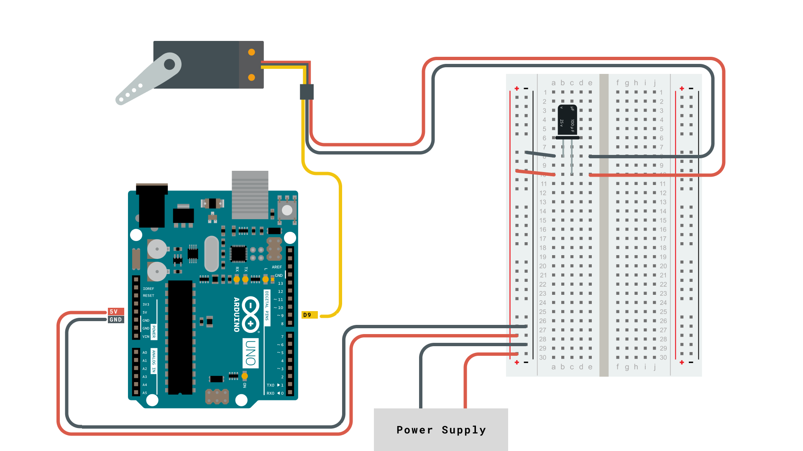
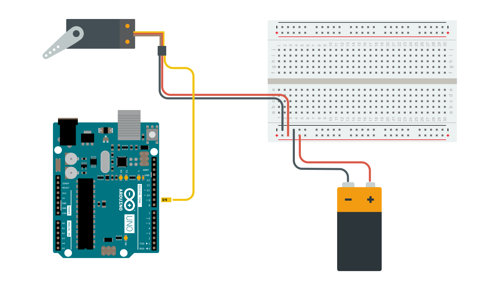

The [Servo Library](https://www.arduino.cc/reference/en/libraries/servo/) is a great library for controlling servo motors. In this article, you will find two easy examples that can be used by any Arduino board.

The first example controls the position of a RC (hobby) [servo motor](https://en.wikipedia.org/wiki/Servo_(radio_control)) with your Arduino and a potentiometer. The second example sweeps the shaft of a RC [servo motor](https://en.wikipedia.org/wiki/Servo_(radio_control)) back and forth across 180 degrees.

You can also visit the [Servo GitHub repository](https://github.com/arduino-libraries/Servo) to learn more about this library.

## Hardware Required

- Arduino Board
- Servo Motor
- 10k ohm potentiometer
- hook-up wires

## Circuit

Servo motors have three wires: power, ground, and signal. The power wire is typically red, and should be connected to positive pole (+) of your power source. The ground wire is typically black or brown and should be connected to the negative pole (-) of your power source. 

The signal pin is typically yellow or orange and should be connected to PWM pin on the board. In these examples, it is pin number 9.

***Always make sure to power your servo motor with a external power source. Connecting a servo directly to your board will cause your board to behave erratically and can damage your board***

### Knob Circuit

For the **Knob** example, wire the potentiometer so that its two outer pins are connected to power (+5V) and ground, and its middle pin is connected to `A0` on the board. Then, connect the servo motor as shown in the circuit below.



### Sweep Circuit

For the **Sweep** example, connect the servo motor as shown in the circuit below.



## Examples

### Knob

Controlling a servo position using a potentiometer (variable resistor).

```arduino
#include <Servo.h>

Servo myservo;  // create servo object to control a servo

int potpin = 0;  // analog pin used to connect the potentiometer
int val;    // variable to read the value from the analog pin

void setup() {
  myservo.attach(9);  // attaches the servo on pin 9 to the servo object
}

void loop() {
  val = analogRead(potpin);            // reads the value of the potentiometer (value between 0 and 1023)
  val = map(val, 0, 1023, 0, 180);     // scale it to use it with the servo (value between 0 and 180)
  myservo.write(val);                  // sets the servo position according to the scaled value
  delay(15);                           // waits for the servo to get there
}
```

### Sweep

Sweeps the shaft of a RC servo motor back and forth across 180 degrees.

```arduino
#include <Servo.h>

Servo myservo;  // create servo object to control a servo
// twelve servo objects can be created on most boards

int pos = 0;    // variable to store the servo position

void setup() {
  myservo.attach(9);  // attaches the servo on pin 9 to the servo object
}

void loop() {
  for (pos = 0; pos <= 180; pos += 1) { // goes from 0 degrees to 180 degrees
    // in steps of 1 degree
    myservo.write(pos);              // tell servo to go to position in variable 'pos'
    delay(15);                       // waits 15ms for the servo to reach the position
  }
  for (pos = 180; pos >= 0; pos -= 1) { // goes from 180 degrees to 0 degrees
    myservo.write(pos);              // tell servo to go to position in variable 'pos'
    delay(15);                       // waits 15ms for the servo to reach the position
  }
}
```
