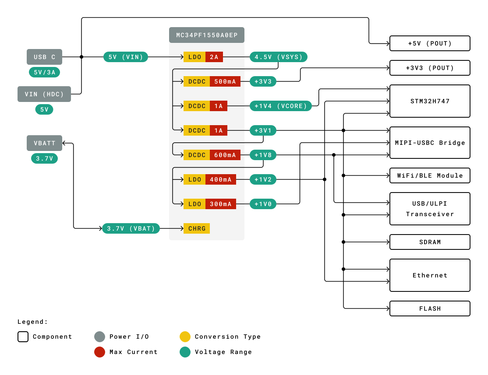
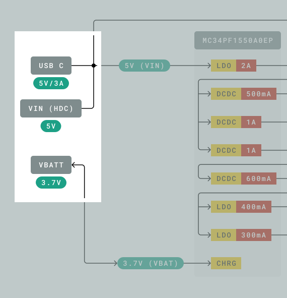
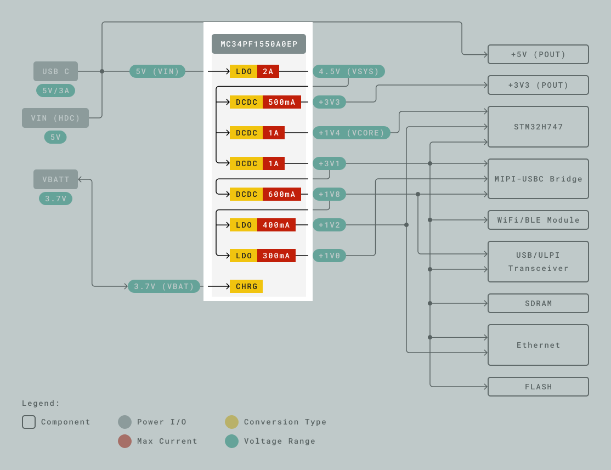
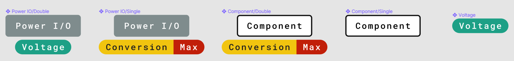

## Why are we Providing the Power Tree?
Arduino provides a wide range of boards, shield and carrier each design to meet a specific need. This ranges from the classic Arduino UNO serving as a standard entry point to the world of Arduino to the Arduino Portenta H7 that incorporates features to meet industry-level demands. The power delivery system is thus designed to take into considerations of you, the end users of our products. In order to help users, both new and advanced, better understand the power structure of your board we have developed graphical power trees to provide a high level understanding that you can see in the relevant datasheets. In this article, we will explore the concepts of Power Trees and guide you through a representative example. We welcome any feedback and comments from the Arduino Community to further improve the Power Trees.

## A Look at the Portenta H7 Power Tree
Lets take a look together at one of our power trees. The Portenta H7 was one of the first products to be bestowed with a graphical power tree.

To the left, you will see three grey boxes. Each one of these represents a voltage input. In the case of the Arduino Portenta H7, we can either provide power via the USB-C® cable, the VIN pin on the high density connector or a battery.

***You can see more information about the precise schematic location and pins in the schematic diagram and pinout graphics respectively. The Power Tree is there to provide a visual aid to better understanding the product and some intermediate components may not be displayed. If in doubt, refer to the schematics or contact us.***

We can also see that the USB-C® and the VIN are connected together. Under each grey box, we can see that the voltage is listed as 5V. This is the nominal value (see the datasheet for the allowed voltage ranges). In general, you can expect there to be no difference in the operation between each approach. 

A bit further down, we can see another grey component titled `VBATT`. In this case, we see two distinct features: first of all, the arrows are bi-directional. Secondly, the voltage (in the turquoise box underneath it) is lower. While this can be difficult to understand from a text based table, having this information can be beneficial to the user when trying to understand the product from a Model-Based Design approach.

***For more information about Model-Based Design, check out the [Engineering Kit Rev 2](https://store.arduino.cc/products/arduino-engineering-kit-rev2) for hands on projects.***

The current specification noted in the diagram tells you about the maximum amount of current that can be drawn from that specific voltage source. Consequently you can attach any sensor or actuator, so long as the maximum current draw is not exceeded. A device always only draws as much current as it needs to operate. 
However, the case for voltage is different. As a general rule, the voltage values must match with a low tolerance and it is not possible to power a 5V sensor via a 3.3V pin or vice versa. Voltages have to match, while the currents don't have to match (just be lower).
That said, connecting a data line from e.g. a 3.3V sensor to a 5V micro controller input pin may work depending on the defined [TTL levels](https://en.wikipedia.org/wiki/Logic_level) as long as the communication is unidirectional. If 5V are applied from the 5V micro controller to the 3.3V peripheral, it may destroy it.

***In some cases, components can function over a wide voltage range. Consult the datasheet of the component to find the supported range.***

Next, let us take a look at the block representing the MC34PF1550A0EP component.

The input of the power component, as stated previously, can come from either the 5V power source or the battery. The voltage and net of these two (as seen in the schematic view) is written on the turquoise box on the connecting lines. Recall that since the USB-C® and VIN voltage inputs are connected (as denoted by the black dot connecting the lines together). The 5V voltage is fed to a LDO that has a maximum current capacity of 2A, producing a 4.5V rail. LDO stands for a **L**ow **D**rop**o**ut linear regulator. These are a type of linear regulator that are designed to work when the input voltage is slightly above the output voltage. The output of this LDO is a voltage rail (shown again in a turquoise box) with a voltage of 4.5V. Given that this is slightly lower than 5V input, it is important that the input voltage is stable since, if it drops below 4.7V the stability of the Portenta board may be compromised.

***Since all other system voltages go through the noted LDO, the maximum current that can pass through the PMIC is at most 2A. Losses in subsequent voltage conversion will reduce the real current available to the user. For further details, please refer to the MC34PF1550A0EP datasheet. ***

The generated 4.5V is then available for use by DC-DC converters. Here, DC-DC conversion refers to switching regulators. Depending on their architecture, switching regulators can increase (boost) or reduce (buck) the voltage levels. A major benefit compared to linear regulators is their lower PCB footprint and power consumption. However, they can also be susceptible to noise. 

***All official Arduino boards have been designed to reduce the noise level to the minimum, with the use of premium PCB manufacturing and stringent quality control. Purchasing counterfeit boards may lead to reduced power quality and loss of functionality.***

To the right, we can see components that make use of these generated voltages. Note that in some cases, components may make use of multiple voltage levels to operate.

## Graphical styles
As you may have noticed, each type of component has its own visual style. The input blocks are grey, with a turquoise label underneath showing the nominal voltage. Interconnecting power rails are shown with a black dot. The power lines themselves are marked by a turquoise box with the voltage/net.  The power conversion blocks are also grey. Under that, one or more power conversion sub-components are shown. The conversion type (LDO/CHRG/DCDC) is in yellow, while the maximum current output is in red. These sub-components are all right aligned. To the bottom left, a Legend is shown.

## Further Resources
Various IC manufacturers have material for understanding power conversion, including switch mode power supplies. These can help advanced users better understand power conversion that you see in the Power Trees included in the Arduino datasheets. See [ON Semiconductor's Switch-Mode Power Supply Reference Manual](https://www.onsemi.com/pub/Collateral/Smpsrm-D.PDF) or the [Power Topologies Handbook by Texas Instruments](https://www.ti.com/seclit/ug/slyu036/slyu036.pdf).

In order to explain complex interactions, conceptual diagrams similar to the Power Tree are widely used by domain experts to quickly and efficiently convey information. For a survey of how conceptual diagrams are used in various disciplines, see:
- [Ma’ayan, Dor, et al. ‘How Domain Experts Create Conceptual Diagrams and Implications for Tool Design’. Proceedings of the 2020 CHI Conference on Human Factors in Computing Systems, ACM, 2020](https://doi.org/10.1145/3313831.3376253)
- [Tippett, Christine D. ‘What Recent Research on Diagrams Suggests about Learning with Rather than Learning from Visual Representations in Science’. International Journal of Science Education, vol. 38, no. 5, Mar. 2016](https://doi.org/10.1080/09500693.2016.1158435)

The [Engineering Kit Rev2](https://store.arduino.cc/products/arduino-engineering-kit-rev2) goes into more detail about how Model-based Design can be used to develop and understand complex systems.
