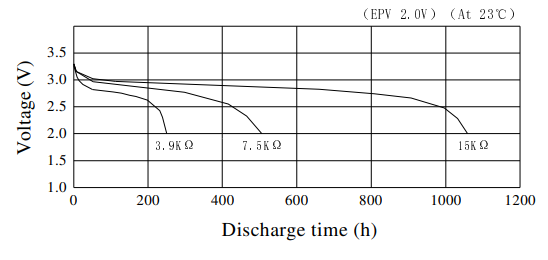
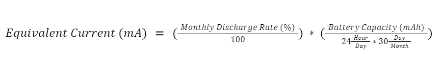
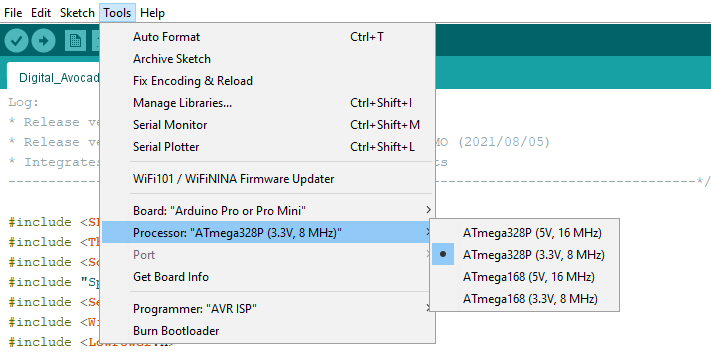
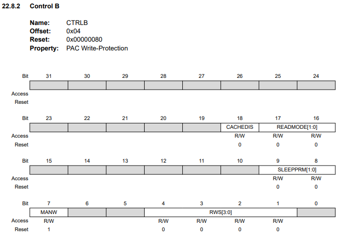
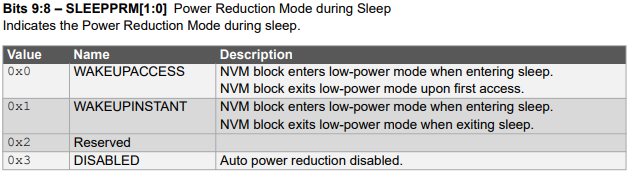
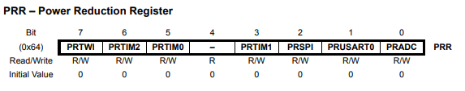

The objective of **Low Power** is to reduce the device’s power consumption by controlling its behavior to extend its operation lifetime. Electronic devices fed directly from a power source usually do not require the implementation of Low Power or similar techniques to extend their life. On the other hand, it is necessary to save its power consumption to expand its operation lifetime for the devices running from a power source such as batteries. 

The present guide for achieving low power system are applicable for every Arduino boards. For example, [Arm Cortex-M0 32-bit SAMD21](https://content.arduino.cc/assets/mkr-microchip_samd21_family_full_datasheet-ds40001882d.pdf) processor based Arduino boards can take advantage of low-power features. The Arduino SAMD21 boards with wireless protocol using LoRa® technology, with module as [Murata CMWX1ZZABZ](https://content.arduino.cc/assets/mkrwan1310-murata_lora_module-type_abz.pdf) featured from [MKR WAN 1310](https://docs.arduino.cc/hardware/mkr-wan-1310), can be combined with low power features to operate for an extensive period. With advanced techniques, such tools as power source guide and self-discharge rates design applies to every Arduino boards for designing power efficient systems. You can check out [Arduino Documentation Hardware](https://docs.arduino.cc/) page to find out about Arduino boards. 

## Low Power Library

To enable the Low Power feature on Arduino boards, we can download the [Arduino Low Power](https://www.arduino.cc/reference/en/libraries/arduino-low-power/) library from the libraries manager in the Arduino IDE. This library enables the low power features for MKR family boards. 

- The library can be managed by going under **Sketch -> Include Library -> Manage Libraries** in Arduino IDE and searching for **"Arduino Low Power"** choosing the latest version. 
- For when board components needs to be updated, it can be managed by going under **Tools -> Board -> Boards Manager** and searching for respective Arduino board family.

You can download the different Arduino IDE version through the link below:

- [Arduino Software Page](https://www.arduino.cc/en/software)
- 
To learn more about the Arduino IDE, follow the links below:

- [Arduino IDE 1](https://docs.arduino.cc/software/ide-v1)
- [Arduino IDE 2](https://docs.arduino.cc/software/ide-v2)

## Low-Power Design Techniques 

There are several different options to reduce the power consumption in microcontrollers:

- Sleep Mode
- External Events
- ADC
- Stand-by

### The Sleep Technique

The best method of enabling low power features is by putting the processor to sleep. **Deep Sleep** mode will allow the device to turn off a variety of internal modules to save most power consumption. The Deep Sleep mode can be set with a timer to wake up after a defined length of time is achieved. Additionally there is also a **Light Sleep** mode, which will allow some of the internal modules to be powered on to keep such required tasks alive. Usually Deep Sleep mode is applied to save most power consumption, while the Light Sleep mode will help to keep some settings alive to track state of external modules when it wakes up. 

Within these sleep modes, **Stand-By** and **Idle** modes provide different levels of configuration for putting the microcontroller to low power mode. Depending on the devices requirements, some components or modules may still have to be running when it is in sleep state. Stand-By mode is one of the lowest power consumption mode for SAMD21 based boards. This will stop every clock sources of the microcontroller and set the voltage regulators to be in low power state. Oscillators can be in 3 different states where it stops or run, and run on behalf of peripheral request. The device will be then in deep sleep while WFI (Wait For Interrupt) is active. An interrupt or **WDT (Watchdog Timer)** will be the triggers to wake up the device from sleep state. 

The same goes for Idle mode as Stand-By mode. The Idle mode will still have the peripherals running while WFI (Wait For Interrupt) is active. However the device will not be in deep sleep mode, meaning it will have higher power consumption level compared to Stand-By mode. The clock sources, on other hand, are dependent on software architect whether to leave it running or turn it off to lower the power consumption. An interrupt or WDT (Watchdog Timer) will be the triggers to wake up the device from sleep state as same for this present mode. 

### External Events for Waking up from Sleep State

The application is not always meant to remain in sleep state after finishing scheduled tasks, but to have environmental awareness capability for processing desired trigger response required task. External events are the cause that will make the microprocessor to wake from sleep state whenever such designed conditions are met. Ordinarily these External Events are issued by **ADC (Analog to Digital Converter)**, peripherals such as **UART**, and **I/O (Input and Output)** ports available for usage. 

Thus whenever it distinguishes the change in the signal, the microprocessor will wake up and proceed to initialize designed tasks. For example, for sensing the vibration intensity, low or excessive level or such resources to be quantified as gas components present in the air. 

### ADC (Analog to Digital Converter) Triggered Wake Up

A triggered response caused by **ADC (Analog to Digital Converter)** to wake up is considered part of external event wake-up cases. As it will trigger based on voltage shift recognized through the analog pin of the board. The change in voltage level can be decoded in many different ways of meaning, and commonly it can be understood as some device connected via analog pin is powering off so the voltage will hit low threshold.

While the same connected device can be powered on, so will the voltage hit upper threshold. Defining how to use this behavior as a wake up signal is the task of the software architect to manage long battery life while accomplishing desired task.

## Power Source Guide & Self-Discharge Rates

The power source guide is to help understand, other than controlling Arduino boards to save power consumption, it is also important to know the power source itself has its discharging rate. There is no point of saving power consumption using all these resources and techniques if the power source itself is self-discharging at higher current than the device’s low power current. 

Batteries will be quoted as a power source as it will power up the device. There are different batteries with different capacities and self-discharge rates which are not flat. Meaning it will discharge faster at the beginning. This factor is usually influenced by temperature, which makes it behave differently depending on the environment it is in. So this must be considered as a guide and take it into account to design efficient Low Power device. 

Batteries like CR2032 possess capacity of 210 mAH with discharging rate of 1% per month. NiMH AAA batteries possess 900 mAH of higher capacity than CR2032 but discharging rate of 30% per month; while the AA sized version has 2400 mAH of capacity but same discharging rate. Li-Ion batteries are 4400 mAH of capacity but 10% discharging rate per month. 



It is clear that there are several types of power sources that can used for the device with divergent characteristics that can used for design factors. Some more specific design cases may require strict power source chemical composite requirement, but we will use the capacity and the discharge rate as main ingredient for designing power efficient devices. As chemical composite requirement is for safety assurance for the device to be able to stay inside strictly maintained environment.

Self-Discharging rates can be expressed by the following equation:




This Self-Discharing rate equation can assist you into knowing the discharge rate in which the power source will suffer in an hour. This value will let you know then it is a similar approximate rate as continuously consumed rate. 

Several design factors comes in play when building a power efficient device. Here, the power sources suffer from these conditions so it must be taken into account to design consideration. This is to avoid risk, as mentioned before, on having higher consumption than the actual device consumption. 

However, it is also important to know the form factor of the power source as it will define the size of the device and will limit the selection of power sources if the device requires to be very small. For this, advanced low power techniques might be able to guide you through the design considerations to fully take advantage of this low power guide.

## Low-Power Applications Examples

With following simple examples, you will be able to understand and implement Low Power mode.

### Standard Low Power Example 

- Hardware Needed: Any SAMD21 Based Arduino Boards (MKR Family)

This is the most simple way of implementing the Low Power mode. It will use the LED as an indicator for telling if the device is in active state or sleep state. The device will be in sleep state for 5 seconds. 

```arduino
#include "ArduinoLowPower.h"

void setup() {
  pinMode(LED_BUILTIN, OUTPUT);
}

void loop() {
  digitalWrite(LED_BUILTIN, HIGH);
  delay(1000);
  digitalWrite(LED_BUILTIN, LOW);
  delay(1000);
  LowPower.sleep(5000);
}
```

Here we can also change a line of the code to perform Deep Sleep mode of the device. 

```arduino
//LowPower.sleep(5000);
LowPower.deepSleep(5000);
```

This will set the device into Deep Sleep mode when the device is powered on. Having this simple example code it is possible to see that it is written inside the loop function, but this low power code line can be written inside the setup function. 

Bear in mind that the setup function runs in first place, as it is the sector where it configures the board appropriately before it executes different tasks. So it is always recommended to design the software structure and later start writing the actual code, which will be helpful for achieving power efficient device.  

### External Events Based Low Power Example

- Hardware Needed: Any SAMD21 Based Arduino Boards (MKR Family)

Following example demonstrates how a board wakes up every 10 seconds unless it detected an external event on a desired pin. 

```arduino
#include "ArduinoLowPower.h"

void setup() {
  pinMode(LED_BUILTIN, OUTPUT);
  pinMode(pin, mode);
  LowPower.attachInterruptWakeup(pin, callback, mode);
}

void loop() {
  digitalWrite(LED_BUILTIN, HIGH);
  delay(1000);
  digitalWrite(LED_BUILTIN, LOW);
  delay(1000); 
  LowPower.sleep(10000);
}

void callback() {
  // This function will be called once on device wakeup
  // You can do some little operations here (like changing variables which will be used in the loop)
  // Remember to avoid calling delay() and long running functions since this functions executes in interrupt context
}
```

Here requires to define `LowPower.attachInterruptWakeup(pin, callback, mode)` function with pin of the device to be handled, the design the task inside the callback, and the mode to define the transition to sense change on the defined pin. The mode can be defined within 3 different settings: FALLING, RISING, and CHANGE. 

Falling mode means when the signal on the defined pin sense is in negative trend; Rising mode is when the signal is in positive trend; and Change mode is either trends whenever the defined pin senses any type of shift. For `pinMode(pin, mode)`, the modes are `INPUT`, `OUTPUT`, or `INPUT_PULLUP`. A defined external event based low power example can be seen as follows. This example can be found by navigating to **Examples -> Arduino Low Power -> ExternalWakeup**.

```arduino
#include "ArduinoLowPower.h"

// Blink sequence number
// Declare it volatile since it's incremented inside an interrupt
volatile int repetitions = 1;

// Pin used to trigger a wakeup
const int pin = 8;

void setup() {
  pinMode(LED_BUILTIN, OUTPUT);
  // Set pin 8 as INPUT_PULLUP to avoid spurious wakeup
  pinMode(pin, INPUT_PULLUP);
  // Attach a wakeup interrupt on pin 8, calling repetitionsIncrease when the device is woken up
  LowPower.attachInterruptWakeup(pin, repetitionsIncrease, CHANGE);
}

void loop() {
  for (int i = 0; i < repetitions; i++) {
    digitalWrite(LED_BUILTIN, HIGH);
    delay(500);
    digitalWrite(LED_BUILTIN, LOW);
    delay(500);
  }
  // Triggers an infinite sleep (the device will be woken up only by the registered wakeup sources)
  // The power consumption of the chip will drop consistently
  LowPower.sleep();
}

void repetitionsIncrease() {
  // This function will be called once on device wakeup
  // You can do some little operations here (like changing variables which will be used in the loop)
  // Remember to avoid calling delay() and long running functions since this functions executes in interrupt context
  repetitions ++;
}
```

### ADC (Analog to Digital Converter) Based Low Power Example

- Hardware Needed: Any SAMD21 Based Arduino Boards (MKR Family)

Modifying a bit of the previous external event based low power example, it is possible to configure ADC (Analog to Digital Converter) as a wake up source given a defined range of voltage detection reading. This example can be found by navigating to **Examples -> Arduino Low Power -> AdcWakeup**.

```arduino
#include "ArduinoLowPower.h"

// Blink sequence number
// Declare it volatile since it's incremented inside an interrupt
volatile int repetitions = 1;

// Pin used to trigger a wakeup
const int pin = A0;
// How sensitive to be to changes in voltage
const int margin = 10;

void setup() {
  pinMode(LED_BUILTIN, OUTPUT);
  pinMode(pin, INPUT);
}

void loop() {
  for (int i = 0; i < repetitions; i++) {
    digitalWrite(LED_BUILTIN, HIGH);
    delay(500);
    digitalWrite(LED_BUILTIN, LOW);
    delay(500);
  }

  // Read the voltage at the ADC pin
  int value = analogRead(pin);

  // Define a window around that value
  uint16_t lo = max(value - margin, 0);
  uint16_t hi = min(value + margin, UINT16_MAX); 

  // Attach an ADC interrupt on pin A0, calling repetitionsIncrease when the voltage is outside the given range.
  // This should be called immediately before LowPower.sleep() because it reconfigures the ADC internally.
  LowPower.attachAdcInterrupt(pin, repetitionsIncrease, ADC_INT_OUTSIDE, lo, hi);

  // Triggers an infinite sleep (the device will be woken up only by the registered wakeup sources)
  // The power consumption of the chip will drop consistently
  LowPower.sleep();

  // Detach the ADC interrupt. This should be called immediately after LowPower.sleep() because it restores the ADC configuration after waking up.
  LowPower.detachAdcInterrupt();
}

void repetitionsIncrease() {
  // This function will be called once on device wakeup
  // You can do some little operations here (like changing variables which will be used in the loop)
  // Remember to avoid calling delay() and long running functions since this functions executes in interrupt context
  repetitions ++;
}
```

Getting in more deeper with the previous code, we will be defining the value window in which the analog pin A0 of the device will operate. 

```arduino
uint16_t lo = max(value - margin, 0);
uint16_t hi = min(value + margin, UINT16_MAX); 
```

The ADC (Analog to Digital Converter) interrupt configuration is done inside the loop function so it is possible to reconfigure immediately before the device goes into sleep state. 

```arduino
LowPower.attachAdcInterrupt(pin, repetitionsIncrease, ADC_INT_OUTSIDE, lo, hi);
```

After the device wakes up within configured ADC (Analog to Digital Converter) interrupt, it will detach the ADC interrupt so it restores its ADC configuration. 

```arduino
LowPower.detachAdcInterrupt();
```

Callback functions are to be used when the system wakes up from sleep state via configured interruption. In this function, and as an entire software architecture, usually it is a good practice to avoid using delay() and long running functions. This is to avoid what is called **Blocking Operation** and to be designed in **Non-Blocking Operation** fashion, which very helpful for this types of design cases. In this instances, this will help design power efficient system in parallel being a responsive system. 

### Low Power Example Using LoRa® Technology Transmitter

- Hardware Needed: MKR WAN 1300/1310 (On-Board Murata Module)

***For extended detail and example about LoRa® Technology using MKR WAN 1310 with its Murata Module, please [this documentation](https://docs.arduino.cc/tutorials/mkr-wan-1310/lora-send-and-receive)***

This example shows MKR WAN1300/1310 as a remote transmitter device that sends alive beacon status message periodically. This is to simulate a device broadcasting beacon data every certain amount of time and requires extensive operation lifetime. The receiver device will be stationary as reception tower. The remote transmitter device will have the SAMD21 go into sleep state, but also the On-Board Murata module to remove unnecessary power consumption.

***For more information on the `LoRa` library, please refer to [this library](https://github.com/sandeepmistry/arduino-LoRa) repository on GitHub.***

```arduino
// Low Power Library
#include "ArduinoLowPower.h"

// LoRa Library
#include <SPI.h>
#include <LoRa.h>

// LoRa Packet Content 
char* message = "Hello LoRa!";

void setup() {
  Serial.begin(9600);
  while (!Serial);

  // LoRa Setup
  Serial.println(F("LoRa Sender"));
  if (!LoRa.begin(868E6)) {
    Serial.println(F("Starting LoRa failed!"));
    while (1);
  } else {
    Serial.println(F("Starting LoRa Successful!"));
  }
}

void loop() {
  LoRa_Packet_Sender();
  GoToSleep();
}

// LoRa Task
void LoRa_Packet_Sender() {
  Serial.print(F("Sending packet: "));
  Serial.println(message);

  // send packet
  LoRa.beginPacket();
  LoRa.print(message);
  LoRa.endPacket();

  // Putting LoRa Module to Sleep 
  Serial.println(F("LoRa Going in Sleep"));
  LoRa.sleep();
}

// Sleep Task 
void GoToSleep(){
  Serial.println(F("MKR WAN 1310 - Going in Sleep"));
  LowPower.deepSleep(20000);
}
```

It is important to know that the Low Power task applies only to microcontroller. This means that external modules such as Murata module we used here, found on MKR WAN 1310 board, must be coded in the task separately to make the module go into sleep state. 

***If external modules such as Murata (LPWAN) Module and sensors are to be used, please remember to put into sleep state before making the MCU go into sleep. Otherwise the device will not go into complete sleep state and maximum power saving will not be possible. This includes turning off for example peripheral interfaces such as TWI and SPI.***

### Simple Low Voltage Detection Example

- Hardware Needed: Arduino Board from any Family

This is an example showing how to implement the simplest low voltage detection task. This will detect when the power source is running out of energy and to avoid the device to shutdown itself due to no power left. It is a simple task yet requires such parameters to be used as a reference to be clear, as otherwise it will observe incorrect measurements. Following example is configured for use with MKR WAN 1310 with direct feed to an analog pin to be able to extract the battery percentage. 

```arduino

/*
Low Power - Low Voltage Detection - SAMD21 Specific Configuration Example
*/

// Manual Power Management 
#include "ArduinoLowPower.h"

float voltValue, battery_volt, battery_percentage;
float minimal_voltage = 1800;
float battery_voltage_ref = 3.3;

void setup() {
  Serial.begin(57600);
  delay(100);

  // Low Power Indicator Set 
  pinMode(LED_BUILTIN, OUTPUT);

  // Default Analog Reference of 3.3V
  analogReference(AR_DEFAULT);

  // Setting up for resolution of 12-Bits
  analogReadResolution(12);
}

void loop() { 
  // Reading from the Battery Pin
  voltValue = analogRead(A0);

  // Calculate current voltage level
  battery_volt = ((voltValue*battery_voltage_ref)/4095)*1000;
  
  // Battery level expressed in percentage
  battery_percentage = 100*abs((battery_volt - minimal_voltage)/((battery_voltage_ref*1000) - minimal_voltage));

  Serial.print(F("Battery: "));
  Serial.print(battery_percentage);
  Serial.println(F(" % "));
  
  if (battery_volt <= minimal_voltage){
    //LED Notification for low voltage detection
    lowBatteryWarning();
  }

  delay(2000);
  
  // Going into Low Power for 20 seconds 
  LowPower.deepSleep(20000);
}

// Low battery indicator
void lowBatteryWarning(){
  digitalWrite(LED_BUILTIN, HIGH);  
  delay (1);             
  digitalWrite(LED_BUILTIN, LOW);    
  delay (999);             
}
```

Here are 4 important configurations:

- The **[analogReference()](https://www.arduino.cc/reference/en/language/functions/analog-io/analogreference/)** is used to configure the reference voltage for analog input.
- The **[analogReadResolution()](https://www.arduino.cc/reference/en/language/functions/analog-io/analogreadresolution/)** is used to determine the resolution of the value returned by **analogRead()**.
- The **[analogRead()](https://www.arduino.cc/reference/en/language/functions/analog-io/analogread/)** is used to set an analog pin to read the value from. 
- Last but not least, the respective resolution divider value. For the present example it uses **4095** for 12-Bit resolution applicable for MKR WAN 1310. If it uses different resolution, such as 10-Bits, you will need to define it to **1023**. 

If voltage divider is to be used for the application, it is necessary to define and set the resistor relationship inside the code to be able to obtain correct value. 

***For more advanced low voltage detection please see the last section of the presente guide about **Advanced Low-Power Techniques in Arduino*****

## Advanced Low-Power Techniques in Arduino 

Following advanced Low Power techniques are applicable for every Arduino boards as it will take advantage of the entire board inside out to make sure the power consumption goes low as much as possible. These methodologies will help you to be creative yet flexible on your low power system design with any Arduino boards.

### Low Frequency & Low Voltage

For more advanced use cases, there are some methods to further reduce power consumption. Putting the processor at low frequency and at low voltage. For low frequencies, it may depend the functionality of the device as it requires minimum level of frequency to enable communication modules as WiFi. Also, it is possible to operate the device at low voltage of 3.3V, helping it to step down the overall power consumption. This configuration can be done with Arduino IDE before uploading the sketch to the device. 



The processor usually will be changing the frequency depending on the workloads. This processor frequency varies as to speed up the compute process in a minimal amount of time. Some modules such as Wi-Fi and Bluetooth® Low Energy requires minimum frequency level. Otherwise, operating at even lower frequencies will result in modules not working correctly, or not run in any instance. At some instances, going further low frequency requires external crystal oscillator as it will require matching oscillator. 

So forcefully lowering the frequency will not be of help as it will scramble the modules or the operations. While leaving the frequency unrestricted or unlimited also won't help provide long battery life. It is recommended to set frequency levels depending on the software architecture to maintain power consumption while accomplishing designed tasks. Frequency levels can be referenced via datasheet of the board, so it can used to design the software architecture and improve power consumption. 

With the voltage, commonly the boards can defined at 5V or at 3.3V of operating voltage. This operating voltage usually depends on external components which will be interfaced to work with the central boards, in which it will be Arduino boards. However, not always the requirements of external components or such similar cases require high voltage. So in cases like this, it is possible to set operating voltage of 3.3V. Providing much better chance of having power efficient device. The power consumption beginning with these 2 factors can reduce or even halve the overall power consumption.

### Power Management On Microcontroller Level

For the most cases, using the [library](https://github.com/arduino-libraries/ArduinoLowPower) class is sufficient to achieve low power consumption. However, if the system design requires to turn off things individually inside the microcontroller, power management mode or register can help you fulfill this requirement. 

#### SAMD21 Microcontroller - Power Reduction Mode

For [SAMD21 microcontrollers](https://content.arduino.cc/assets/mkr-microchip_samd21_family_full_datasheet-ds40001882d.pdf), found on [MKR Family](https://docs.arduino.cc/) boards, are seen with **Power Reduction Mode**. 

The Power Reduction mode is tied to Non-Volatile Memory Controller and CTRLB register is used to control its mode. The Power Reduction Mode bit is set in Status Register (STATUS.PRM), when the Non-Volatile Memory controller and block is in power reduction mode. The Set and Clear Power Reduction Mode commands are used to take in and out the Non-Volatile Memory controller and block. For register table visualization, you can see following references and the datasheet for more detail. 







#### Atmega328P Microcontroller - Power Reduction Register

The [Classic Family](https://docs.arduino.cc/) and [Arduino Nano](https://docs.arduino.cc/hardware/nano) that uses the [Atmega328P](https://ww1.microchip.com/downloads/en/DeviceDoc/Atmel-7810-Automotive-Microcontrollers-ATmega328P_Datasheet.pdf) microcontrollers are found with **Power Reduction Register**.

This Power Reduction Register can turn off several things inside the Microcontroller. It can cut off TWI, SPI, USART0, timers and counters, and Analog-to-Digital Converter. If Analog-to-Digital Converter bit is to be turned off, ADCRSA bust be set to Zero as it will stay frozen in an active state. 




### Peripherals & Internal Modules

Turning off unnecessary internal modules depending on the designed application is very helpful in further reducing power consumption. These modules can be SPI, I2C, Serial and ADC (Analog to Digital Converter). On top of these modules, there are Brown-out Detection and Watchdog timer. 

Peripheral interfaces such as SPI, I2C, Serial communications are used regularly to establish bridge with sensors. Having the overall design requirement, it will be known that some peripherals will not be implemented in the application. Instead of leaving peripherals floating, it is good practice to turn off these peripherals that are not going to be used to save some power consumption. On top of it, the sensors also have the capability of putting themselves into low power state if commanded to do so. Via established peripherals, commands can be sent to turn the sensors into low power state before cutting off peripherals to get into sleep. 

ADC (Analog to Digital Converter) can be used as wake up source as previously discussed. But it can also be turned off to save power consumption if it will not be used as a wakeup source. This peripherals sometimes drain significant amount of power, so turning off may help to gain extra power to attain longer battery life. 

The **Brown-out Detection** and **Watchdog timer** are internal modules which can be manually controlled, if required, to ahieve even lower power consumption. Brown-out detection usually is comparison purposes for when the processor requires low voltage detection. The Watchdog timer is crucial as it monitors the microcontroller operation state. 

If the microcontroller ever gets stuck and stops or goes through illegal process, the watchdog timer will be triggered to reset and put the microcontroller back on track. On the other hand, this same watchdog timer can be disabled temporarily to save power consumption. This is always recommended to be implemented after the software is verified to be stable enough. Otherwise, it won't help reduce power consumption and break the system. 

### External Devices

If there are external devices such as SD devices and sensors, these can be turned off by adding Mosfets in between. The **MOSFET** can help to cut off the power for SD devices connected to the Arduino board to reduce power consumption if the device ever goes into deep sleep mode for example. In case of sensors, if it is required to completely save power consumption, can be cut off with MOSFET. This method is helpful when device periodically goes into sleep state, so it can save the power consumption to its fullest. 

### Low-Dropout Regulator

Some designs require voltage regulators for it to work properly. If the design requires the use of voltage regulator, try to look for Low-Dropout regulators with low Quiescent Current. This will help the device to be on a much lower power consumption level when it is in sleep state. These types of details can be found on the datasheets of regulator manufacturers.  

### Power Budgeting

It is good practice to keep record of power budget of the system. As it provides an overview and details to analyze how the power distribution is handled throughout the whole design. This can help to design better power consumption as it might give you information about possible sleep state timer increase for example. 

### Power Consumption Measurement Method 

With all the methods and tricks to attain low power consumption on Arduino board, you will also need to measure the power consumption of its system to confirm its correct functionality. You can use [Multimeter Basics](https://docs.arduino.cc/learn/electronics/multimeter-basics) in section **Reading Current** to measure the current and find the system's actual power consumption. 

### Low Voltage Detection 

The device working correctly its designed tasks and that has low power consumption is already good overall design. Nonetheless, the device at some point it will run out of power source no matter how long it can be up and running. Surely, it might even be able to run an entire year perhaps with the right configuration and code architecture. However, there is no escape that the device and some point will drop out due to low power level. It is possible to know the device is being supplied with minimal power capacity before it goes out of operation, and that is when it detects **Low Voltage** in the system.

***You can use the following battery life calculator to obtain estimated lifetime: https://www.omnicalculator.com/other/battery-life***

For this we will use power management method of **avr** microcontrollers, in which Atmega328P are based of and found in [Arduino Nano](https://docs.arduino.cc/hardware/nano) and [Classic Family](https://docs.arduino.cc/) for example. The low voltage detection method developed by Nick Gammon, Retrolefty, and Coding Badly, will be combined with that is capable of going into low power state to save power. 

```arduino
// Nick Gammon
// Code courtesy of "Coding Badly" and "Retrolefty" from the Arduino forum

#include <avr/sleep.h>
#include <avr/power.h>
#include <avr/wdt.h>

const long InternalReferenceVoltage = 1062;  // Adjust this value to your board's specific internal BG voltage

void setup() {
  Serial.begin(57600);
  delay(100);

  // Low Power Indicator Set 
  pinMode(LED_BUILTIN, OUTPUT);
  
  // Pre-eliminary Low Power 
  resetWatchdog(); // In Case WDT fires
}

void loop() { 
  // Tuning on peripherals, timers, and ADC
  manual_periph_ctrl(1);
  
  // Voltage Level Detection
  Serial.println(getBandgap());
  // Low voltage detection at 3V (300)
  if (getBandgap() < 300){
    //LED Notification for low voltage detection
    lowBatteryWarning();
    
    // Turns off peripherals, timers, and ADC 
    manual_periph_ctrl(0);
  }

  // Low Level Handler
  i2c_switch_off();
  Manual_LowPower_Mode(1);    
}

// Fixed at 8 second variant - On the contrary IT TURNS EVERYTHING OFF
void Manual_LowPower_Mode(uint8_t multiplier){
  delay(70);                                              // Requires at least 68ms of buffer head time for module booting time
  for(int i = 0; i <= multiplier; i++){                   // Multiplier for Power Down Tick
    Deep_Sleep_Manual();
  }
}

/*
* Low Voltage Detection Task
*/
// Nick Gammon
// Code courtesy of "Coding Badly" and "Retrolefty" from the Arduino forum
// results are Vcc * 100
// So for example, 5V would be 500.
int getBandgap(){
  // REFS0 : Selects AVcc external reference
  // MUX3 MUX2 MUX1 : Selects 1.1V (VBG)  
   ADMUX = bit (REFS0) | bit (MUX3) | bit (MUX2) | bit (MUX1);
   ADCSRA |= bit( ADSC );  // start conversion
   while (ADCSRA & bit (ADSC)){ 
   }  // wait for conversion to complete
   int results = (((InternalReferenceVoltage * 1024) / ADC) + 5) / 10; 
   return results;
} // end of getBandgap

/*
* Low Power Related Tasks 
*/
// Enabling Watchdog Timer 
void WatchdogEnable() {
  // clear various "reset" flags
  MCUSR = 0;     
  // allow changes, disable reset
  WDTCSR = bit (WDCE) | bit (WDE);
  // set interrupt mode and an interval 
  WDTCSR = bit (WDIE) | bit (WDP3) | bit (WDP0);    // set WDIE, and 8 seconds delay
  wdt_reset();  // pat the dog

  // disable ADC
  ADCSRA = 0;  

  // ready to sleep
  set_sleep_mode (SLEEP_MODE_PWR_DOWN);  // Should throw ~0.4mA at best case 
  noInterrupts();
  sleep_enable();

  // turn off brown-out enable in software
  MCUCR = bit (BODS) | bit (BODSE);
  MCUCR = bit (BODS); 
  interrupts();       // Guarantees next instruction executed
  sleep_cpu ();  

  // cancel sleep as a precaution
  sleep_disable();
} 

void resetWatchdog (){
  // clear various "reset" flags
  MCUSR = 0;     
  // allow changes, disable reset, clear existing interrupt
  WDTCSR = bit (WDCE) | bit (WDE) | bit (WDIF);
  // set interrupt mode and an interval (WDE must be changed from 1 to 0 here)
  WDTCSR = bit (WDIE) | bit (WDP3) | bit (WDP0);    // set WDIE, and 8 seconds delay
  // pat the dog
  wdt_reset();  
}  // end of resetWatchdog

void i2c_switch_off(){
  // turn off I2C
  TWCR &= ~(bit(TWEN) | bit(TWIE) | bit(TWEA));

  // turn off I2C pull-ups
  digitalWrite (A4, LOW);
  digitalWrite (A5, LOW);
}

// Runs for 8 seconds aprox counting as a cycle
void Deep_Sleep_Manual(){
  // CORE State
  set_sleep_mode (SLEEP_MODE_PWR_DOWN);
  ADCSRA = 0;            // turn off ADC
  power_all_disable ();  // power off ADC, Timer 0 and 1, serial interface

  // Interrupts are not counted as ADXL require
  noInterrupts ();       // timed sequence coming up
  resetWatchdog ();      // get watchdog ready
  sleep_enable ();       // ready to sleep
  interrupts ();         // interrupts are required now
  sleep_cpu ();          // sleep                
  sleep_disable ();      // precaution
  power_all_enable ();   // power everything back on
  
}  // end of goToSleep 

// Manual Peripheral controller
void manual_periph_ctrl(uint8_t selector){
  byte old_ADCSRA = ADCSRA;
  // disable ADC
  ADCSRA = 0; 
   
  if (selector == 0){
    power_adc_disable();
    power_spi_disable();
    power_timer0_disable();
    power_timer1_disable();
    power_timer2_disable();
    power_twi_disable();

    UCSR0B &= ~bit (RXEN0);  // disable receiver
    UCSR0B &= ~bit (TXEN0);  // disable transmitter
  } 
  if (selector >= 1){
    power_adc_enable();
    power_spi_enable();
    power_timer0_enable();
    power_timer1_enable();
    power_timer2_enable();
    power_twi_enable();
    
    UCSR0B |= bit (RXEN0);  // enable receiver
    UCSR0B |= bit (TXEN0);  // enable transmitter
  } 

  ADCSRA = old_ADCSRA;
}

// Low battery indicator
void lowBatteryWarning(){
  digitalWrite(LED_BUILTIN, HIGH);  
  delay (1);             
  digitalWrite(LED_BUILTIN, LOW);    
  delay (999);             
}
```

To find internal reference voltage, you can run either scripts. When running following scripts, measure the AREF pin of the microcontroller with a multimeter and multiply the obtained valued by 1000 to use it as Internal Reference Voltage. 

- Using ADMUX register to obtain the value.

```arduino
// Find internal 1.1 reference voltage on AREF pin
void setup ()
{
  ADMUX = bit (REFS0) | bit (REFS1);
}

void loop () { }
```

- Using analogReference and analogRead functions to obtain the value. 

```arduino
// Find internal 1.1 reference voltage on AREF pin
void setup ()
{
  analogReference (INTERNAL);
  analogRead (A0);  // force voltage reference to be turned on
}

void loop () { }
```

***To read more about the Low Power systems topic In-Depth, you can check the following link: https://www.gammon.com.au/power***

## Trademark Acknowledgments

- **LoRa®** is a registered trademark of Semtech Corporation.