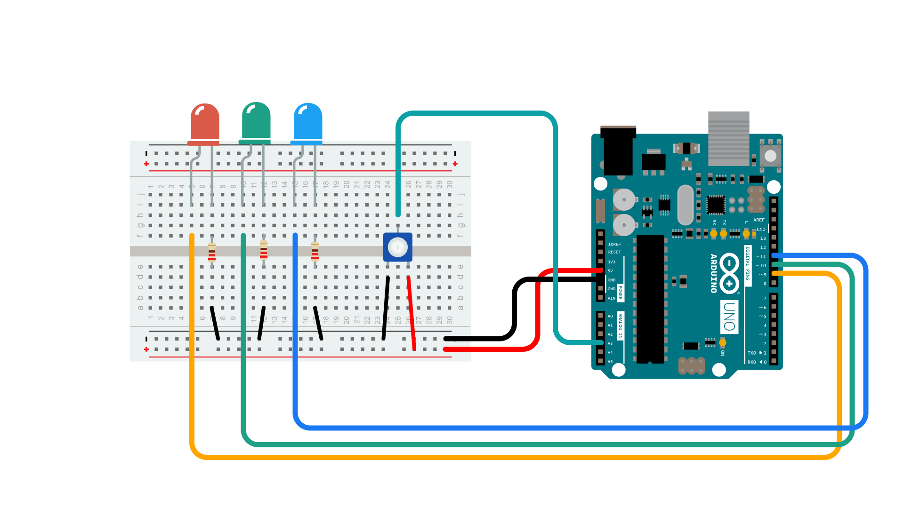

A potentiometer is a simple mechanical device that comes in many different forms. It provides a variable amount of resistance that changes as you manipulate it. The examples in this article uses a potentiometer with a twisting shaft, one of the more common versions of a potentiometer you will find.

By passing voltage through a potentiometer into an analog input on your Arduino, it is possible to measure the amount of resistance of the potentiometer as an analog value. This article will showcase use cases of potentiometers, as well as teach you how to connect and read data from them. One shows how you can use a potentiometer as an input for a color mixer, and the other shows how to accurately choose colors and how to smoothly fade between them. 

The typical potentiometer will have 3 pins, two power supply pins (+5V and GND), and one pin that connects to an analog input pin on your Arduino to read the value output. 

***To learn how to read data from a potentiometer, and display it in the Serial Monitor, visit the [Analog Read Serial example](/built-in-examples/basics/AnalogReadSerial).***

## Hardware Required

- [Arduino board](https://store.arduino.cc/)
- Potentiometer
- 1x Red, 1x Green, 1x Blue LED
- 3x 220 Ohm Resistors 

## Circuit

- Potentiometer + Pin to 5V
- Potentiometer - Pin to GND
- Potentiometer Data Pin to A3
- A Red LED connected to pin 9 with a 220 Ohm Resistor
- A Green LED connected to pin 10 with a 220 Ohm Resistor
- A Blue LED connected to pin 11 with a 220 Ohm Resistor



## Color Mixer Example

This example will show you how a potentiometer can be used as an analog input to mix colors with great granularity.


```arduino
/*
* Code for making one potentiometer control 3 LEDs, red, grn and blu, or one tri-color LED
* The program cross-fades from red to grn, grn to blu, and blu to red
* Clay Shirky <clay.shirky@nyu.edu> 
*/

// INPUT: Potentiometer should be connected to 5V and GND
int potPin = A3; // Potentiometer output connected to analog pin 3
int potVal = 0; // Variable to store the input from the potentiometer

// OUTPUT: Use digital pins 9-11, the Pulse-width Modulation (PWM) pins
// LED's cathodes should be connected to digital GND
int redPin = 9;   // Red LED,   connected to digital pin 9
int grnPin = 10;  // Green LED, connected to digital pin 10
int bluPin = 11;  // Blue LED,  connected to digital pin 11

// Program variables
int redVal = 0;   // Variables to store the values to send to the pins
int grnVal = 0;
int bluVal = 0;

void setup()
{
  pinMode(redPin, OUTPUT);   // sets the pins as output
  pinMode(grnPin, OUTPUT);   
  pinMode(bluPin, OUTPUT); 
}

// Main program
void loop()
{
  potVal = analogRead(potPin);   // read the potentiometer value at the input pin

  if (potVal < 341)  // Lowest third of the potentiometer's range (0-340)
  {                  
    potVal = (potVal * 3) / 4; // Normalize to 0-255

    redVal = 256 - potVal;  // Red from full to off
    grnVal = potVal;        // Green from off to full
    bluVal = 1;             // Blue off
  }
  else if (potVal < 682) // Middle third of potentiometer's range (341-681)
  {
    potVal = ( (potVal-341) * 3) / 4; // Normalize to 0-255

    redVal = 1;            // Red off
    grnVal = 256 - potVal; // Green from full to off
    bluVal = potVal;       // Blue from off to full
  }
  else  // Upper third of potentiometer"s range (682-1023)
  {
    potVal = ( (potVal-683) * 3) / 4; // Normalize to 0-255

    redVal = potVal;       // Red from off to full
    grnVal = 1;            // Green off
    bluVal = 256 - potVal; // Blue from full to off
  }
  analogWrite(redPin, redVal);   // Write values to LED pins
  analogWrite(grnPin, grnVal); 
  analogWrite(bluPin, bluVal);  
}
```

### Color Crossfading Example

```arduino
/*
* Code for cross-fading 3 LEDs, red, green and blue (RGB) 
* To create fades, you need to do two things: 
*  1. Describe the colors you want to be displayed
*  2. List the order you want them to fade in
*
* DESCRIBING A COLOR:
* A color is just an array of three percentages, 0-100, 
*  controlling the red, green and blue LEDs
*
* Red is the red LED at full, blue and green off
*   int red = { 100, 0, 0 }
* Dim white is all three LEDs at 30%
*   int dimWhite = {30, 30, 30}
* etc.
*
* Some common colors are provided below, or make your own
* 
* LISTING THE ORDER:
* In the main part of the program, you need to list the order 
*  you want to colors to appear in, e.g.
*  crossFade(red);
*  crossFade(green);
*  crossFade(blue);
*
* Those colors will appear in that order, fading out of 
*    one color and into the next  
*
* In addition, there are 5 optional settings you can adjust:
* 1. The initial color is set to black (so the first color fades in), but 
*    you can set the initial color to be any other color
* 2. The internal loop runs for 1020 iterations; the 'wait' variable
*    sets the approximate duration of a single crossfade. In theory, 
*    a 'wait' of 10 ms should make a crossFade of ~10 seconds. In 
*    practice, the other functions the code is performing slow this 
*    down to ~11 seconds on my board. YMMV.
* 3. If 'repeat' is set to 0, the program will loop indefinitely.
*    if it is set to a number, it will loop that number of times,
*    then stop on the last color in the sequence. (Set 'return' to 1, 
*    and make the last color black if you want it to fade out at the end.)
* 4. There is an optional 'hold' variable, which pasues the 
*    program for 'hold' milliseconds when a color is complete, 
*    but before the next color starts.
* 5. Set the DEBUG flag to 1 if you want debugging output to be
*    sent to the serial monitor.
*
*    The internals of the program aren't complicated, but they
*    are a little fussy -- the inner workings are explained 
*    below the main loop.
*
* April 2007, Clay Shirky <clay.shirky@nyu.edu> 
*/ 

// Output
int redPin = 9;   // Red LED,   connected to digital pin 9
int grnPin = 10;  // Green LED, connected to digital pin 10
int bluPin = 11;  // Blue LED,  connected to digital pin 11

// Color arrays
int black[3]  = { 0, 0, 0 };
int white[3]  = { 100, 100, 100 };
int red[3]    = { 100, 0, 0 };
int green[3]  = { 0, 100, 0 };
int blue[3]   = { 0, 0, 100 };
int yellow[3] = { 40, 95, 0 };
int dimWhite[3] = { 30, 30, 30 };
// etc.

// Set initial color
int redVal = black[0];
int grnVal = black[1]; 
int bluVal = black[2];

int wait = 10;      // 10ms internal crossFade delay; increase for slower fades
int hold = 0;       // Optional hold when a color is complete, before the next crossFade
int DEBUG = 1;      // DEBUG counter; if set to 1, will write values back via serial
int loopCount = 60; // How often should DEBUG report?
int repeat = 3;     // How many times should we loop before stopping? (0 for no stop)
int j = 0;          // Loop counter for repeat

// Initialize color variables
int prevR = redVal;
int prevG = grnVal;
int prevB = bluVal;

// Set up the LED outputs
void setup()
{
  pinMode(redPin, OUTPUT);   // sets the pins as output
  pinMode(grnPin, OUTPUT);   
  pinMode(bluPin, OUTPUT); 

  if (DEBUG) {           // If we want to see values for debugging...
    Serial.begin(9600);  // ...set up the serial output 
  }
}

// Main program: list the order of crossfades
void loop()
{
  crossFade(red);
  crossFade(green);
  crossFade(blue);
  crossFade(yellow);

  if (repeat) { // Do we loop a finite number of times?
    j += 1;
    if (j >= repeat) { // Are we there yet?
      exit(j);         // If so, stop.
    }
  }
}

/* BELOW THIS LINE IS THE MATH -- YOU SHOULDN'T NEED TO CHANGE THIS FOR THE BASICS
* 
* The program works like this:
* Imagine a crossfade that moves the red LED from 0-10, 
*   the green from 0-5, and the blue from 10 to 7, in
*   ten steps.
*   We'd want to count the 10 steps and increase or 
*   decrease color values in evenly stepped increments.
*   Imagine a + indicates raising a value by 1, and a -
*   equals lowering it. Our 10 step fade would look like:
* 
*   1 2 3 4 5 6 7 8 9 10
* R + + + + + + + + + +
* G   +   +   +   +   +
* B     -     -     -
* 
* The red rises from 0 to 10 in ten steps, the green from 
* 0-5 in 5 steps, and the blue falls from 10 to 7 in three steps.
* 
* In the real program, the color percentages are converted to 
* 0-255 values, and there are 1020 steps (255*4).
* 
* To figure out how big a step there should be between one up- or
* down-tick of one of the LED values, we call calculateStep(), 
* which calculates the absolute gap between the start and end values, 
* and then divides that gap by 1020 to determine the size of the step  
* between adjustments in the value.
*/

int calculateStep(int prevValue, int endValue) {
  int step = endValue - prevValue; // What's the overall gap?
  if (step) {                      // If its non-zero, 
    step = 1020/step;              //   divide by 1020
  } 
  return step;
}

/* The next function is calculateVal. When the loop value, i,
*  reaches the step size appropriate for one of the
*  colors, it increases or decreases the value of that color by 1. 
*  (R, G, and B are each calculated separately.)
*/

int calculateVal(int step, int val, int i) {

  if ((step) && i % step == 0) { // If step is non-zero and its time to change a value,
    if (step > 0) {              //   increment the value if step is positive...
      val += 1;           
    } 
    else if (step < 0) {         //   ...or decrement it if step is negative
      val -= 1;
    } 
  }
  // Defensive driving: make sure val stays in the range 0-255
  if (val > 255) {
    val = 255;
  } 
  else if (val < 0) {
    val = 0;
  }
  return val;
}

/* crossFade() converts the percentage colors to a 
*  0-255 range, then loops 1020 times, checking to see if  
*  the value needs to be updated each time, then writing
*  the color values to the correct pins.
*/

void crossFade(int color[3]) {
  // Convert to 0-255
  int R = (color[0] * 255) / 100;
  int G = (color[1] * 255) / 100;
  int B = (color[2] * 255) / 100;

  int stepR = calculateStep(prevR, R);
  int stepG = calculateStep(prevG, G); 
  int stepB = calculateStep(prevB, B);

  for (int i = 0; i <= 1020; i++) {
    redVal = calculateVal(stepR, redVal, i);
    grnVal = calculateVal(stepG, grnVal, i);
    bluVal = calculateVal(stepB, bluVal, i);

    analogWrite(redPin, redVal);   // Write current values to LED pins
    analogWrite(grnPin, grnVal);      
    analogWrite(bluPin, bluVal); 

    delay(wait); // Pause for 'wait' milliseconds before resuming the loop

    if (DEBUG) { // If we want serial output, print it at the 
      if (i == 0 or i % loopCount == 0) { // beginning, and every loopCount times
        Serial.print("Loop/RGB: #");
        Serial.print(i);
        Serial.print(" | ");
        Serial.print(redVal);
        Serial.print(" / ");
        Serial.print(grnVal);
        Serial.print(" / ");  
        Serial.println(bluVal); 
      } 
      DEBUG += 1;
    }
  }
  // Update current values for next loop
  prevR = redVal; 
  prevG = grnVal; 
  prevB = bluVal;
  delay(hold); // Pause for optional 'wait' milliseconds before resuming the loop
}
```