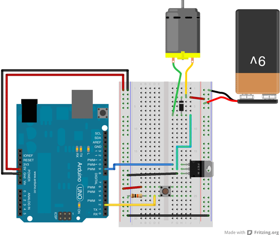
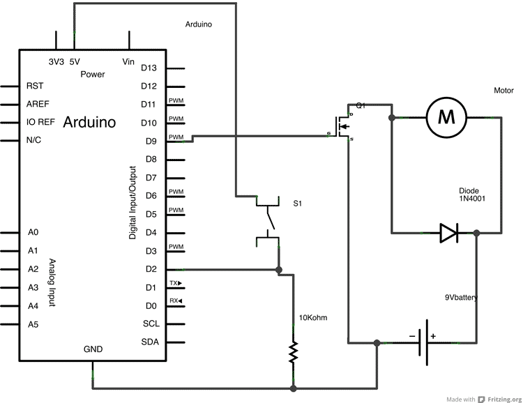

>This article was revised on 2022/01/18 by Karl Söderby.

Motors and transistors are very common electronic components. This article aims to provide some of the basics, along with a working code example, circuits and schematics.

When a pushbutton connected to digital pin 2 is pressed, the Arduino will control a transistor via [pulse-width modulation (PWM)](https://docs.arduino.cc/learn/microcontrollers/analog-output), which will ramp up the motor's speed, then slow it back down.

## About Transistors

The Arduino can only provide 40mA at 5V on its digital pins. Most motors require more current and/or voltage to operate. A transistor can act as a digital switch, enabling the Arduino to control loads with higher electrical requirements. The transistor in this example completes the motor's circuit to ground. This example uses a TIP120, which can switch up to 60V at 5A.

When PWMing a transistor, it's similar to pulsing an LED. The higher the PWM value, the faster the motor will spin. The lower the value, the slower it will spin.

Transistors have three pins. For Bipolar Junction Transistors (BJT), like the one used used in this example, the pins are called base, collector, and emitter. A small amount of current on the base pin closes a circuit between the collector and emitter pins. BJTs come in two different types, NPN and PNP. The TIP120 is a NPN-type transistor, which means the collector will connect to the motor, and the emitter will connect to ground.

## About Motors

Motors work through a process called induction. When you an put electric charge through wire, a magnetic field is created. A coiled wire will create a stronger field, as will increased current. In a DC motor, a coiled wire surrounds the motor's shaft. The generated magnetic field is pulled and repulsed by magnets inside the motor's body.

When a motor stops, there is the potential for a small amount of current to be generated as the shaft continues spinning. A diode placed in parallel with the motor leads will keep any generated electricity from damaging your circuit.

Motors will pull the most current when they start up, or have a load. The stall current is the amount of current a motor will pull when it is stopped by a force. When a motor is up and running, it will pull significantly less current.

The voltage rating describes the peak operating voltage for a motor, when it works at optimum efficiency. Going over or under the motor's rated voltage will, over time, shorten the motor's life. If you provide less than the rated voltage, the motor will spin more slowly. Typically, a motor needs about 1/2 its rated voltage to run. If you provide less than that when starting up, it probably won't begin to move.

## Hardware Required

- [Arduino Board](https://store.arduino.cc/)
- A momentary switch or button
- 10k ohm resistor
- Breadboard
- Hook-up wire
- 9V DC motor
- TIP120 transistor
- 1N4001 diode
- 9V battery

## Circuit



First, connect wires for power and ground. In the illustration, the red (power) and black (ground), connect to the two long vertical rows on the side of the breadboard. This provides access to the 5 volt supply and ground.

Place the pushbutton on the breadboard, straddling the center. A wire connects digital pin 2 to one leg of the pushbutton. That same leg of the button connects through a 10-kilohm pull-down resistor to ground. The leg of the button not connected to the Arduino should be wired to the 5 volt supply.

Connect pin 9 on the Arduino to the base pin of the TIP120. If you are looking at the transistor so that the metal tab is facing away from you, the base pin is on the left side of the transistor. This is the pin that will control open or close. The transistor's collector connects to one lead of the motor, the emitter to ground.

The other end of the motor connects to the positive lead of the 9V battery. Connect the battery's ground to the Arduino's ground.

## Schematic



## Code Example

Below is the full program for controlling a DC motor with a transistor. Further down this article, you will find a more detailed explanation.

```arduino
/*
 Motor Control with a Transistor

 This example shows you how to control a motor's using a transistor.
 When a pushbutton on pin 2 is pressed, the Arduino will control a transistor
 via PWM, which will slowly ramp up the motor's speed, then slow it down.

 The circuit :
 * momentary switch with one end connected to 5V, the other end connected
   to GND through a 10-kilohm resistor, and digital pin 2.
 * TIP120 tranistor, with the Base connected to digital pin 9, the Emitter to ground,
   and the Collector to one lead from a 9V DC motor
 * a 9V battery, with the ground connected to the Arduino's ground, and the power
   connected to the motor
 * 1N4001 diode across the motor's leads, with the striped side connected to the 9V

 The Arduino can only provide 40mA at 5V on its pins. Most motors require
 more current and/or voltage to overcome inertia and run. A transistor
 can act as a digital switch, enabling the Arduino to control loads with
 higher electrical requirements.

 Created on 03 January 2013
 by Scott Fitzgerald

 https://docs.arduino.cc/learn/electronics/transistor-motor-control

 This example code is in the public domain.
 */

// give a name to digital pin 2, which has a pushbutton attached
int pushButton = 2;

// the transistor which controls the motor will be attached to digital pin 9
int motorControl = 9;

// the setup routine runs once when you press reset:
void setup() {
  // make the pushbutton's pin an input:
  pinMode(pushButton, INPUT);

  // make the transistor's pin an output:
  pinMode(motorControl, OUTPUT);  
}

// the loop routine runs over and over again forever:
void loop() {

  // read the state of the button and check if it is pressed
  if(digitalRead(pushButton) == HIGH){
    // ramp up the motor speed
    for(int x = 0; x <= 255; x++){
      analogWrite(motorControl, x);
      delay(50);
    }

    // ramp down the motor speed
    for(int x = 255; x >= 0; x--){
      analogWrite(motorControl, x);
      delay(50);
    }    
  }

  delay(1);        // delay in between reads for stability
}
```

## Code Walkthrough

***In this section, you will find a detailed walkthrough of the program.***

First, create a pair of variables for the pushbutton's state and the motor control pin :

```arduino
int pushButton = 2;
int motorControl = 9;
```

In the setup(), declare these pins as an input and output, respectively :

```arduino
void setup() {
  pinMode(pushButton, INPUT);
  pinMode(motorControl, OUTPUT);  
}
```

Now that your setup has been completed, move into the `loop()`.

```arduino
void loop() {
```

Read the state of the pushbutton and check if it is HIGH. It's possible to make the evaluation directly in your if() statement like this :

```arduino
if(digitalRead(pushButton) == HIGH){
```

If the button is pressed, ramp up the speed of the motor by increasing the PWM value of the motorControl pin. Once it has reached full speed, ramp back down:

```arduino
for(int x = 0; x <= 255; x+=5){
      analogWrite(motorControl, x);
      delay(50);
    }

    for(int x = 255; x >= 0; x-=5){
      analogWrite(motorControl, x);
      delay(50);
    }
```

Close the if() statement and add a small delay() before closing the loop().

```arduino
    }
  delay(1);
}
```
