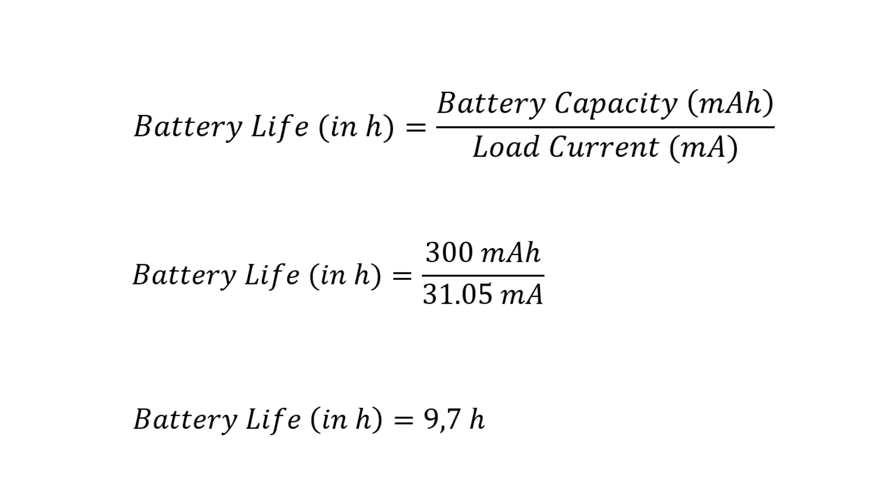
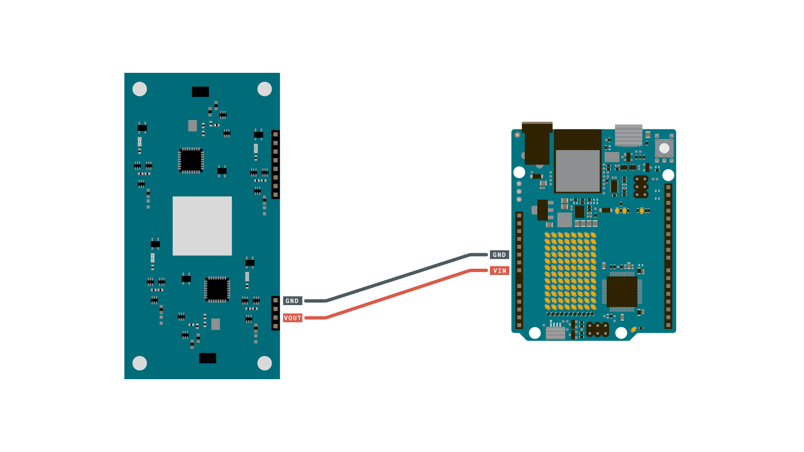
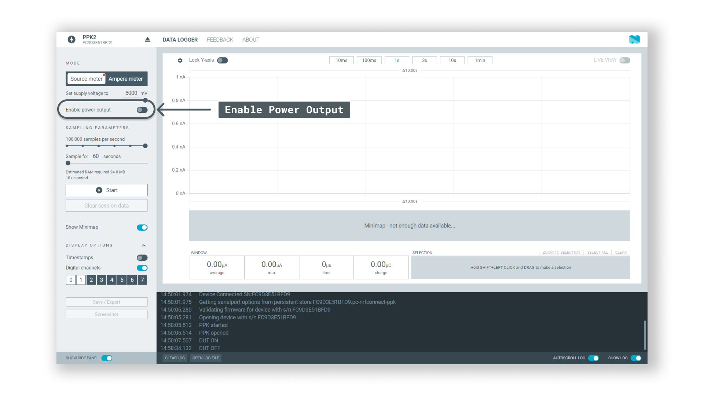
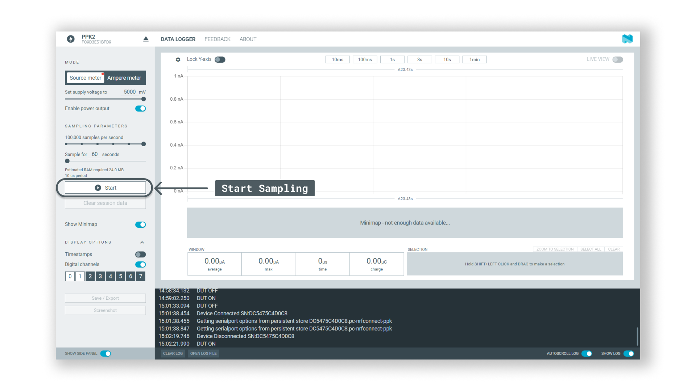
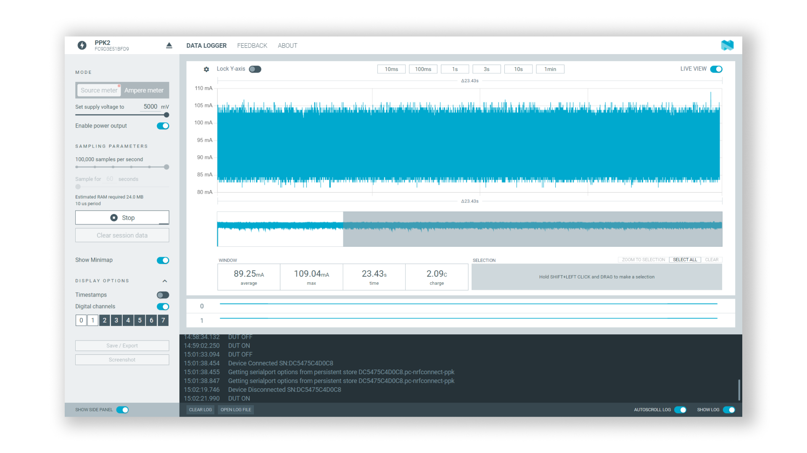

All electronic devices, including Arduino boards, consume power. The power consumption is measured in ampere-hours (Ah), and with low-voltage devices, it is typically measured in mAh.

When creating projects that run on a battery or are power-constrained, taking power consumption into account can be critical. It will among other things help you decide which kind of battery you need to use.

In this article, we will demonstrate how you can perform power consumption tests, using a **power profiler**. A power profiler is used to measure consumption over a specific time, where we record several thousand samples. You will find instructions for both the hardware setup, the software setup, and the actual power consumption tests in this article.

**_Note that in this article, third-party products are being used._**

## Hardware & Software Needed

For the power consumption tests in this article, we used the following hardware & software. Note that there are many alternatives on the market.

- [nRF Connect for Desktop](https://www.nordicsemi.com/Products/Development-tools/nRF-Connect-for-Desktop/Download)
- [Power Profiler Kit II](https://www.nordicsemi.com/Products/Development-hardware/Power-Profiler-Kit-2)
- [Arduino board (link to store)](https://store.arduino.cc/)
- Jumper wires

## Measuring Power Consumption

Power consumption measurements are done by connecting a power profiler between your Arduino board and computer. The power profiler is connected to the computer via USB, and then to the Arduino board via jumper wires. For power consumption measurements, we simply use two wires: **power** and **ground**. The power cable is connected to your Arduino board's power pins, and the ground cable goes to one of the GND pins on the board.

When connected, the power profiler can measure the power consumption of your board with high accuracy. Any power that your board consumes can now be detected, and with a software tool (such as the [nRF Connect for Desktop](https://www.nordicsemi.com/Products/Development-tools/nRF-Connect-for-Desktop/Download)), we can record power consumption over time.

So what is it that we are measuring? In very simple terms, all electronic devices draw current, whether it is small or big. A small LED can for example draw 10 mA (0.01 A), while a servo motor can draw up towards 1000 mA (1 A). If you have an LED on for an hour that draws 10 mA, we can express it as **mAh**, which means **milli-ampers consumed per hour**.

### Power Consumption Example

To provide a practical example, let's take the [Nano ESP32](https://store.arduino.cc/products/nano-esp32) and run a simple sketch on the board, which continuously runs the `analogRead()` function. Running the test for 60 seconds recording 100'000 samples, results in an average consumption of **31.05 mA**.

Now, if we wanted to power this application using a 300 mAh battery we need to calculate the time with the following formula:



With that information, we can make an educated guess of what type of battery we should get. For example, a battery with more capacity, let's say 600 mAh, would in theory last for twice the period.

**_Note that there are other factors at play, such as the battery's discharge rate and the general quality of the battery. The above formulas and measurements are to be considered guidelines._**

## Software Setup

The software setup involves two steps: **uploading a sketch** and **installing nRF Connect for Desktop**.

### Upload Sketch

This step is rather straightforward. Upload the sketch that you want to measure the power consumption of. Below is a minimal sketch that reads an analog pin continuously.

```arduino
void setup() {}

void loop() {
  int analog_value = analogRead(A0);
  delay(1);
}
```

### Install Desktop App

To measure the power consumption, we are going to use the [nRF Connect for Desktop](https://www.nordicsemi.com/Products/Development-tools/nRF-Connect-for-Desktop/Download) tool. This is a program that you install on your computer.

## Hardware Setup

The profiler we used is the [Power Profiler Kit II](https://www.nordicsemi.com/Products/Development-hardware/Power-Profiler-Kit-2).

1. First, disconnect the USB cable from your board. You will be powering the board directly from the power profiler, so there's no need for the USB cable at this point.
2. Use the provided cable from the kit, and connect it to your board's GND and power pin, following the illustration below:



***Important note! In the software setup, you enable the "Power Output" of the power profiler. Make sure that the voltage (3.3 V or 5 V) matches the voltage on the power pin of the board. Applying 5 V to a 3.3 V pin will damage your board.***

## Power Consumption Test

With the hardware and software set up, let's take a look at how to record the power consumption of your device.

1. Open the **nRF Desktop App**.
2. Enable the power output, by clicking the "Enable Power Output" option.

   

3. Select sample period (60 seconds) and number of samples (100k).
4. Click on "Begin Sampling" to start the power consumption test.

   

5. During the test, you can see the power consumption in real-time. After 60 seconds (or when the specified sample period ends), you will have the data, which includes the **max** and **avg** consumption. You can also zoom in to view the data.

   

You have now recorded the power consumption of your device. You can note down the results, export it as a `.csv` or take a screenshot for future reference.

## Example Results

In this section, you will find a number of tests we ran on a set of Arduino boards during different conditions.

### Simple Analog Read

The simple analog read sketch continuously reads an analog pin.

```arduino
void setup() {}

void loop() {
  int analog_value = analogRead(A0);
  delay(1);
}
```

In the table below, you can see the results of each board tested with the sketch:

| Board        | Min      | Max       | Average  |
| ------------ | -------- | --------- | -------- |
| UNO R4 WiFi  | 82.86 mA | 124.04 mA | 92.63 mA |
| GIGA R1 WiFi | 51.02 mA | 94.08 mA  | 58.05 mA |
| Nano ESP32   | 29.18 mA | 46.58 mA  | 31.05 mA |

### Arduino Cloud Basic

The **Arduino Cloud Basic** sketch sends sensor data to the Arduino Cloud and turns on the built-in LED whenever activated from a dashboard.

```arduino
#include "thingProperties.h"

void setup() {
  // Initialize serial and wait for port to open:
  Serial.begin(9600);
  // This delay gives the chance to wait for a Serial Monitor without blocking if none is found
  delay(1500);

  // Defined in thingProperties.h
  initProperties();

  // Connect to Arduino IoT Cloud
  ArduinoCloud.begin(ArduinoIoTPreferredConnection);

  setDebugMessageLevel(2);
  ArduinoCloud.printDebugInfo();
  pinMode(LED_BUILTIN, OUTPUT);
}

void loop() {
  ArduinoCloud.update();
  digitalWrite(LED_BUILTIN, led);
}

/*
  Since Led is READ_WRITE variable, onLedChange() is
  executed every time a new value is received from IoT Cloud.
*/
void onLedChange()  {
  Serial.print("Led status changed:");
  Serial.println(led);
}

```

In the table below, you can see the results of each board tested with the sketch:

| Board        | Min       | Max       | Average   |
| ------------ | --------- | --------- | --------- |
| UNO R4 WiFi  | 94.07 mA  | 513.70 mA | 140.19 mA |
| GIGA R1 WiFi | 121.00 mA | 477.44 mA | 139.83 mA |
| Nano ESP32   | 36.70 mA  | 274.19 mA | 58.81 mA  |

## Summary

In this guide, we have learned how to use a power profiler to record power consumption data from an Arduino board. This is an great utility, as it can help you identify the power requirements of your application, helping your decision in selecting the right power source.
