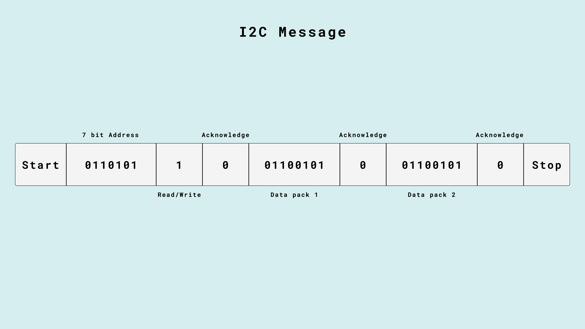
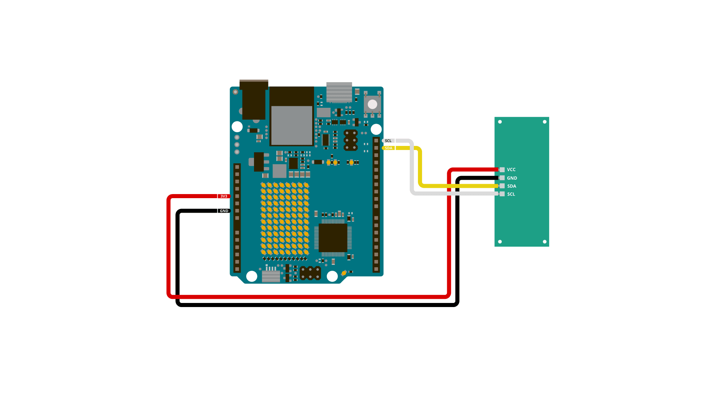
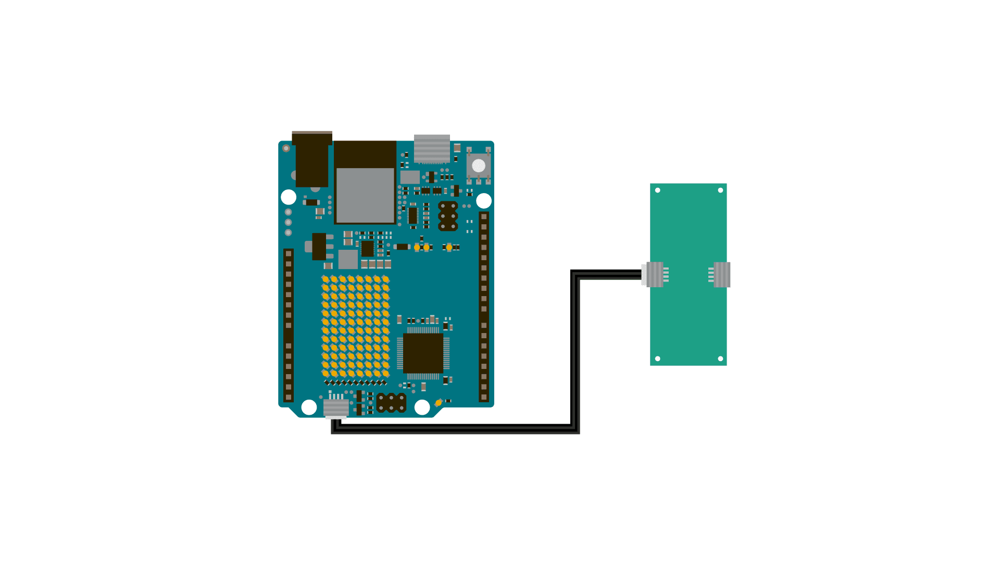
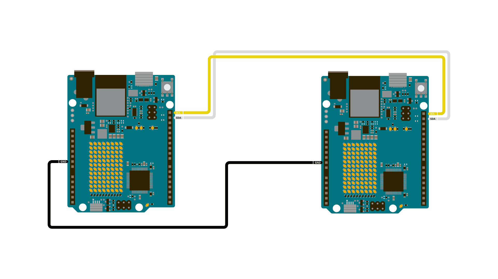
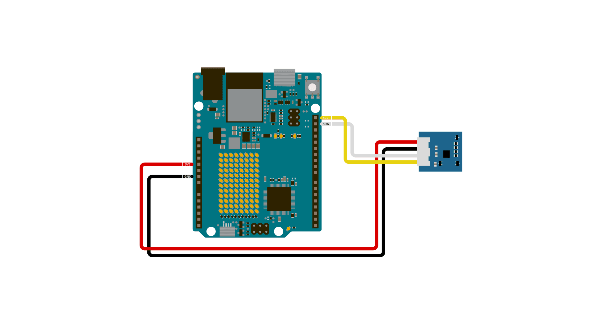
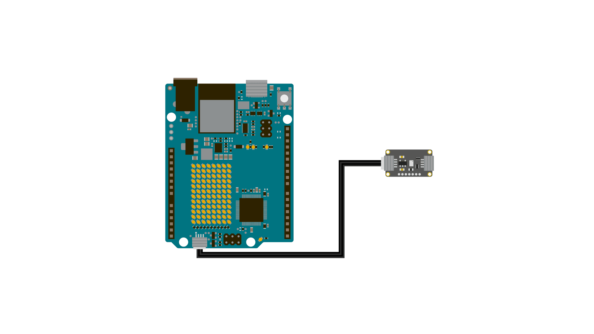
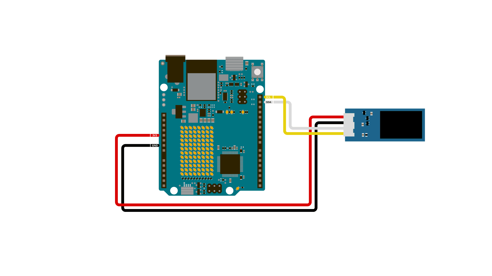

## Introduction
A good way of adding complexity of features to your projects without adding complexity of wiring, is to make use of the Inter-integrated circuit (I2C) protocol. The I2C protocol is supported on all Arduino boards. It allows you to connect several peripheral devices, such as sensors, displays, motor drivers, and so on, with only a few wires. Giving you lots of flexibility and speeding up your prototyping, without an abundancy of wires. Keep reading to learn about how it works, how it is implemented into different standards, as well as how to use the [Wire Library](#wire-library) to build your own I2C devices.

## Overview
This section provides an overview of the topics covered in the article.

- [What Is I2C?](#what-is-i2c)
- [Arduino I2C Pins](#arduino-i2c-pins)
- [I2C Wiring](#i2c-wiring)
- [Wire Library](#wire-library)
- [Examples](#examples)

## What Is I2C?
The I2C protocol involves using two lines to send and receive data: a serial clock pin **(SCL)** that the Arduino Controller board pulses at a regular interval, and a serial data pin **(SDA)** over which data is sent between the two devices. 

In I2C, there is one controller device, with one or more peripheral devices connected to the controllers SCL and SDA lines. 

As the clock line changes from low to high (known as the rising edge of the clock pulse), a single bit of information is transferred from the board to the I2C device over the SDA line. As the clock line keeps pulsing, more and more bits are sent until a sequence of a 7 or 8 bit address, and a command or data is formed. When this information is sent - bit after bit -, the called upon device executes the request and transmits it's data back - if required - to the board over the same line using the clock signal still generated by the Controller on SCL as timing.

Each device in the I2C bus is functionally independent from the controller, but will respond with information when prompted by the controller. 

Because the I2C protocol allows for each enabled device to have it's own unique address, and as both controller and peripheral devices to take turns communicating over a single line, it is possible for your Arduino board to communicate (in turn) with many devices, or other boards, while using just two pins of your microcontroller.

An I2C message on a lower bit-level looks something like this:



- The controller sends out instructions through the I2C bus on the data pin (SDA), and the instructions are prefaced with the address, so that only the correct device listens. 
- Then there is a bit signifying whether the controller wants to read or write.
- Every message needs to be acknowledged, to combat unexpected results, once the receiver has acknowledged the previous information it lets the controller know, so it can move on to the next set of bits.
- 8 bits of data
- Another acknowledgement bit
- 8 bits of data
- Another acknowledgement bit

But how does the controller and peripherals know where the address, messages, and so on starts and ends? That's what the SCL wire is for. It synchronises the clock of the controller with the devices, ensuring that they all move to the next instruction at the same time.

However, you are nearly never going to *actually* need to consider any of this, in the Arduino ecosystem we have the [Wire library](https://www.arduino.cc/reference/en/language/functions/communication/wire/) that handles everything for you.

## Arduino I2C Pins
Below is a table that lists the different board form factors and what pins are for I2C.

| Form factor| SDA    | SCL    | SDA1 | SCL1 | SDA2 | SCL2 |
| :--------- | :----- | :----- | :--- | :--- | :--- | :--- |
| UNO        | SDA/A4 | SCL/A5 |      |      |      |      |
| Nano       | A4     | A5     |      |      |      |      |
| MKR        | D11    | D12    |      |      |      |      |
| GIGA       | D20    | D21    | D102 | D101 | D9   | D8   |
| Mega & Due | D20    | D21    |      |      |      |      |

## I2C Wiring
Below you'll find a couple ways to wire I2C breakout modules. Which way is best depends on each module, and your needs.

### Breakout Boards
Some brekout board modules let you wire them directly, with bare wires on a breadboard. To connect a module like this to your Arduino board, connect it as follows:

- VCC* - 5V/3V3 pin (depending on breakout module)
- GND* - GND
- SDA - SDA
- SCL - SCL 

*Pin name might vary depending on what module, VCC might be named "VIN", "+", etc. GND might be named "-".

Here's an example of how you might connect a sensor to an UNO R4 WiFi:



### Qwiic & STEMMA QT
When delving into the market of breakout modules and sensors, you'll find that there are entire ecosystems, where standards are built around the I2C protocol. Examples of such standards are Qwiic, developed by Sparkfun, and STEMMA QT, developed by Adafruit. Both Qwiic and STEMMA QT use a 4-pin JST SH connector for I2C devices, making it easier for third parties to design hardware with vast compatibility. By having a standardized connector, you'll know that if you see the word Qwiic or STEMMA QT in association with an item, that it will work together with an Arduino board with a Qwiic or STEMMA QT connector, such as the UNO R4 WiFi.

Both Qwiic and STEMMA QT bundle together wires for power, ground, as well as the SDA and SCL wires for I2C, making it a complete kit, one cable that bundles everything together.



**But what's the difference between the two?**

Both Qwiic and STEMMA QT use I2C, and even when inspecting modules using the two standards up close, it may be difficult to tell what makes them unique from each other. But there is a difference! And it has some implications on how and for what you may use them.

Qwiic has level shifting and voltage regulation on the controller (but not on the peripherals). What this means is that Qwiic is 3.3 V logic **only**. This makes it easier to use, as for the end user, there is one less thing that can go wrong when designing and assembling your circuit.

STEMMA QT, on the other hand, doesn't have this. This lets you use both 3.3 V and 5 V logic for modules. This also means that there is one more thing you may need to consider when creating your circuit, but it also grants some more flexibility in power and logic requirements.

The pin order for STEMMA QT is designed to match the pin order for Qwiic, enabling cross-compatibility between the two standards.

### Grove
Grove is another connector standard, this one developed by seeed studio. You can find a plethora of modules with a Grove connector, however only some of them use I2C.
There are no Arduino boards that have a built in Grove connector, however you can use products such as the [MKR connector carrier](https://store.arduino.cc/products/arduino-mkr-connector-carrier-grove-compatible), [Nano Grove Shield](https://store.arduino.cc/products/grove-shield-for-arduino-nano), or the Base Shield from the [Arduino Sensor Kit](https://store.arduino.cc/products/arduino-sensor-kit-base) to connect Grove sensors to your Arduino board. 

## Wire Library
The Wire library is what Arduino uses to communicate with I2C devices. It is included in all board packages, so you don't need to install it manually in order to use it.

To see the full API for the Wire library, visit its [documentation page](https://www.arduino.cc/reference/en/language/functions/communication/wire).

- `begin()` - Initialise the I2C bus
- `end()` - Close the I2C bus
- `requestFrom()`- Request bytes from a peripheral device
- `beginTransmission()` - Begins queueing up a transmission 
- `endTransmission()` - Transmit the bytes that have been queued and end the transmission 
- `write()` - Writes data from peripheral to controller or vice versa
- `available()` - returns the number of bytes available for retrieval
- `read()` - Reads a byte that was transmitted from a peripheral to a controller.
- `setClock()` - Modify the clock frequency
- `onReceive()` - Register a function to be called when a peripheral receives a transmission
- `onRequest()` - Register a function to be called when a controller requests data
- `setWireTimeout()` - Sets the timeout for transmissions in controller mode
- `clearWireTimeoutFlag()` - Clears the timeout flag
- `getWireTimeoutFlag()` - Checks whether a timeout has occurred since the last time the flag was cleared.

### Derived libraries
When you buy basically any breakout module that makes use of the I2C protocol, they will come with some library that helps you use the sensor. This library is more often than not built on top of the Wire library, and uses it under the hood. Adding functionality in order to make, for example, reading temperature easier. 

An example of this is if you want to use Adafruits MCP9808 sensor module, you download the Adafruit_MCP9808 Library from the IDEs library manager, which enables you to use functions such as `tempsensor.readTempC()` in order to read the sensors temperature data by requesting from the right address, and read the information returned with just a single line instead of writing the Wire code yourself. 

To learn how to install libraries, check out our [guide to installing libraries](/software/ide-v2/tutorials/ide-v2-installing-a-library).

## Examples
The remainder of this article is a collection of examples that can get you off the ground with I2C.

### Controller Reader



In some situations, it can be helpful to set up two (or more!) Arduino boards to share information with each other. In this example, two boards are programmed to communicate with one another in a Controller Reader/Peripheral Sender configuration via the [I2C synchronous serial protocol](http://en.wikipedia.org/wiki/I2C). Several functions of Arduino's [Wire Library](https://www.arduino.cc/en/Reference/Wire) are used to accomplish this. Arduino 1, the Controller, is programmed to request, and then read, 6 bytes of data  sent from the uniquely addressed Peripheral Arduino. Once that message is received, it can then be viewed in the Arduino Software (IDE) serial monitor window.

**Controller Reader Sketch**

```arduino
// Wire Controller Reader
// by Nicholas Zambetti <http://www.zambetti.com>

// Demonstrates use of the Wire library
// Reads data from an I2C/TWI peripheral device
// Refer to the "Wire Peripheral Sender" example for use with this

// Created 29 March 2006

// This example code is in the public domain.


#include <Wire.h>

void setup() {
  Wire.begin();        // join i2c bus (address optional for master)
  Serial.begin(9600);  // start serial for output
}

void loop() {
  Wire.requestFrom(8, 6);    // request 6 bytes from peripheral device #8

  while (Wire.available()) { // peripheral may send less than requested
    char c = Wire.read(); // receive a byte as character
    Serial.print(c);         // print the character
  }

  delay(500);
}
```

**Peripheral Sender Sketch**

```arduino
// Wire Peripheral Sender
// by Nicholas Zambetti <http://www.zambetti.com>

// Demonstrates use of the Wire library
// Sends data as an I2C/TWI peripheral device
// Refer to the "Wire Master Reader" example for use with this

// Created 29 March 2006

// This example code is in the public domain.


#include <Wire.h>

void setup() {
  Wire.begin(8);                // join i2c bus with address #8
  Wire.onRequest(requestEvent); // register event
}

void loop() {
  delay(100);
}

// function that executes whenever data is requested by master
// this function is registered as an event, see setup()
void requestEvent() {
  Wire.write("hello "); // respond with message of 6 bytes
  // as expected by master
}

```

### Controller Writer


In some situations, it can be helpful to set up two (or more!) Arduino boards to share information with each other. In this example, two boards are programmed to communicate with one another in a Controller Writer/Peripheral Receiver configuration via the [I2C synchronous serial protocol](http://en.wikipedia.org/wiki/I2C). Several functions of Arduino's [Wire Library](https://www.arduino.cc/en/Reference/Wire) are used to accomplish this. Arduino 1, the Controller, is programmed to send 6 bytes of data every half second to a uniquely addressed Peripheral. Once that message is received, it can then be viewed in the Peripheral board's serial monitor window opened on the USB connected computer running the Arduino Software (IDE).

**Controller Writer Sketch**

```arduino
// Wire Master Writer
// by Nicholas Zambetti <http://www.zambetti.com>

// Demonstrates use of the Wire library
// Writes data to an I2C/TWI Peripheral device
// Refer to the "Wire Peripheral Receiver" example for use with this

// Created 29 March 2006

// This example code is in the public domain.


#include <Wire.h>

void setup()
{
  Wire.begin(); // join i2c bus (address optional for master)
}

byte x = 0;

void loop()
{
  Wire.beginTransmission(4); // transmit to device #4
  Wire.write("x is ");        // sends five bytes
  Wire.write(x);              // sends one byte  
  Wire.endTransmission();    // stop transmitting

  x++;
  delay(500);
}
```

**Peripheral Receiver Sketch**

```arduino
// Wire Peripheral Receiver
// by Nicholas Zambetti <http://www.zambetti.com>

// Demonstrates use of the Wire library
// Receives data as an I2C/TWI Peripheral device
// Refer to the "Wire Master Writer" example for use with this

// Created 29 March 2006

// This example code is in the public domain.


#include <Wire.h>

void setup()
{
  Wire.begin(4);                // join i2c bus with address #4
  Wire.onReceive(receiveEvent); // register event
  Serial.begin(9600);           // start serial for output
}

void loop()
{
  delay(100);
}

// function that executes whenever data is received from master
// this function is registered as an event, see setup()
void receiveEvent(int howMany)
{
  while(1 < Wire.available()) // loop through all but the last
  {
    char c = Wire.read(); // receive byte as a character
    Serial.print(c);         // print the character
  }
  int x = Wire.read();    // receive byte as an integer
  Serial.println(x);         // print the integer
}
```

### Accelerometer


This code lets you read accelerometer data from a [Grove 6-Axis Accelerometer module](https://store.arduino.cc/collections/sensors/products/grove-6-axis-accelerometer-gyroscope) using the [seeed arduino LSM6DS3 library](https://www.arduino.cc/reference/en/libraries/seeed-arduino-lsm6ds3/).

```arduino
#include "LSM6DS3.h"
#include "Wire.h"

//Create instance of Accelerometer class
LSM6DS3 accelerometer(I2C_MODE, 0x6A); 

void setup() {
    // put your setup code here, to run once:
    Serial.begin(9600);
    while (!Serial);

    if (accelerometer.begin() != 0) {
        Serial.println("LSM6DS3 not found, check your wiring.");
    } else {
        Serial.println("LSM6DS3 found!");
    }
}

void loop() {
    //Gyroscope
    Serial.print("\nGyroscope:\n");
    Serial.print(" X1 = ");
    Serial.println(accelerometer.readFloatGyroX(), 4);
    Serial.print(" Y1 = ");
    Serial.println(accelerometer.readFloatGyroY(), 4);
    Serial.print(" Z1 = ");
    Serial.println(accelerometer.readFloatGyroZ(), 4);
    
    //Accelerometer
    Serial.print("\nAccelerometer:\n");
    Serial.print(" X1 = ");
    Serial.println(accelerometer.readFloatAccelX(), 4);
    Serial.print(" Y1 = ");
    Serial.println(accelerometer.readFloatAccelY(), 4);
    Serial.print(" Z1 = ");
    Serial.println(accelerometer.readFloatAccelZ(), 4);

    delay(1000);
}
```

### I2C BMP280



This code example lets you read the temperature over I2C from a BMP280 breakout module from Adafruit:
```arduino
#include <Wire.h>
#include <Adafruit_BMP280.h>

//Create an instance of the BMP280 sensor
Adafruit_BMP280 bmp; 

void setup() {
  Serial.begin(9600); 
  
  // Start the sensor, and verify that it was found
  if (!bmp.begin()) {
    Serial.println("Sensor not found");
    while (1){} 
  }

}

void loop() {
  // Read the values
  float temperature = bmp.readTemperature();

  // Print to the Serial Monitor
  Serial.print("Temperature: ");
  Serial.print(temperature);
  Serial.println(" C");

  Serial.println();
  delay(2000);
}

``` 


### I2C OLED

This code example draws a version of the Arduino logo on a 128x64 I2C Grove OLED:

```arduino
#include <Wire.h>
#include <Adafruit_GFX.h>
#include <Adafruit_SSD1306.h>

Adafruit_SSD1306 display(128, 64, &Wire, -1);

// The Arduino Logo in a bitmap format
const uint8_t arduinoLogo[] = {
  0x00, 0x00, 0x00, 0x00, 0x00, 0x00, 0x00, 0x00, 0x00, 0x00, 0x00, 0x00, 0x00, 0x00, 0x00, 0x00, 
  0x00, 0x00, 0x00, 0x00, 0x07, 0xf8, 0x00, 0x00, 0x00, 0x00, 0x1f, 0xe0, 0x00, 0x30, 0x00, 0x00, 
  0x00, 0x00, 0x00, 0x00, 0x3f, 0xff, 0x00, 0x00, 0x00, 0x00, 0xff, 0xfc, 0x00, 0x70, 0x00, 0x00, 
  0x00, 0x00, 0x00, 0x01, 0xff, 0xff, 0xe0, 0x00, 0x00, 0x07, 0xff, 0xff, 0x80, 0x50, 0x00, 0x00, 
  0x00, 0x00, 0x00, 0x07, 0xff, 0xff, 0xf8, 0x00, 0x00, 0x1f, 0xff, 0xff, 0xe0, 0x40, 0x00, 0x00, 
  0x00, 0x00, 0x00, 0x0f, 0xff, 0xff, 0xfe, 0x00, 0x00, 0x3f, 0xff, 0xff, 0xf0, 0x20, 0x00, 0x00, 
  0x00, 0x00, 0x00, 0x3f, 0xff, 0xff, 0xff, 0x00, 0x00, 0xff, 0xff, 0xff, 0xfc, 0x00, 0x00, 0x00, 
  0x00, 0x00, 0x00, 0x7f, 0xff, 0xff, 0xff, 0x80, 0x01, 0xff, 0xff, 0xff, 0xfe, 0x00, 0x00, 0x00, 
  0x00, 0x00, 0x00, 0xff, 0xff, 0xff, 0xff, 0xc0, 0x03, 0xff, 0xff, 0xff, 0xff, 0x00, 0x00, 0x00, 
  0x00, 0x00, 0x01, 0xff, 0xfc, 0x0f, 0xff, 0xe0, 0x07, 0xff, 0xf0, 0x3f, 0xff, 0x80, 0x00, 0x00, 
  0x00, 0x00, 0x01, 0xff, 0xc0, 0x00, 0xff, 0xf0, 0x0f, 0xff, 0x00, 0x07, 0xff, 0x80, 0x00, 0x00, 
  0x00, 0x00, 0x03, 0xff, 0x80, 0x00, 0x7f, 0xf8, 0x1f, 0xfc, 0x00, 0x01, 0xff, 0xc0, 0x00, 0x00, 
  0x00, 0x00, 0x07, 0xfe, 0x00, 0x00, 0x1f, 0xfc, 0x3f, 0xf8, 0x00, 0x00, 0x7f, 0xe0, 0x00, 0x00, 
  0x00, 0x00, 0x07, 0xfc, 0x00, 0x00, 0x0f, 0xfe, 0x7f, 0xf0, 0x00, 0x00, 0x3f, 0xe0, 0x00, 0x00, 
  0x00, 0x00, 0x0f, 0xf8, 0x00, 0x00, 0x07, 0xff, 0x7f, 0xe0, 0x00, 0x00, 0x1f, 0xf0, 0x00, 0x00, 
  0x00, 0x00, 0x0f, 0xf0, 0x00, 0x00, 0x03, 0xff, 0xff, 0xc0, 0x00, 0x00, 0x0f, 0xf0, 0x00, 0x00, 
  0x00, 0x00, 0x0f, 0xf0, 0x00, 0x00, 0x01, 0xff, 0xff, 0x80, 0x0f, 0x00, 0x0f, 0xf8, 0x00, 0x00, 
  0x00, 0x00, 0x1f, 0xe0, 0x00, 0x00, 0x00, 0xff, 0xff, 0x00, 0x0f, 0x80, 0x07, 0xf8, 0x00, 0x00, 
  0x00, 0x00, 0x1f, 0xe0, 0x00, 0x00, 0x00, 0x7f, 0xfe, 0x00, 0x0f, 0x80, 0x07, 0xf8, 0x00, 0x00, 
  0x00, 0x00, 0x1f, 0xe0, 0x00, 0x00, 0x00, 0x3f, 0xfc, 0x00, 0x0f, 0x80, 0x07, 0xf8, 0x00, 0x00, 
  0x00, 0x00, 0x1f, 0xc0, 0x00, 0x00, 0x00, 0x3f, 0xfc, 0x00, 0x0f, 0x80, 0x03, 0xf8, 0x00, 0x00, 
  0x00, 0x00, 0x1f, 0xc0, 0x1f, 0xff, 0x00, 0x1f, 0xf8, 0x00, 0xff, 0xf8, 0x03, 0xfc, 0x00, 0x00, 
  0x00, 0x00, 0x1f, 0xc0, 0x3f, 0xff, 0x00, 0x1f, 0xf8, 0x00, 0xff, 0xf8, 0x03, 0xfc, 0x00, 0x00, 
  0x00, 0x00, 0x1f, 0xc0, 0x3f, 0xff, 0x00, 0x1f, 0xf0, 0x00, 0xff, 0xf8, 0x03, 0xfc, 0x00, 0x00, 
  0x00, 0x00, 0x1f, 0xc0, 0x1f, 0xff, 0x00, 0x1f, 0xf8, 0x00, 0xff, 0xf8, 0x03, 0xfc, 0x00, 0x00, 
  0x00, 0x00, 0x1f, 0xc0, 0x00, 0x00, 0x00, 0x3f, 0xfc, 0x00, 0x0f, 0x80, 0x03, 0xf8, 0x00, 0x00, 
  0x00, 0x00, 0x1f, 0xc0, 0x00, 0x00, 0x00, 0x3f, 0xfc, 0x00, 0x0f, 0x80, 0x07, 0xf8, 0x00, 0x00, 
  0x00, 0x00, 0x1f, 0xe0, 0x00, 0x00, 0x00, 0x7f, 0xfe, 0x00, 0x0f, 0x80, 0x07, 0xf8, 0x00, 0x00, 
  0x00, 0x00, 0x1f, 0xe0, 0x00, 0x00, 0x00, 0xff, 0xff, 0x00, 0x0f, 0x80, 0x07, 0xf8, 0x00, 0x00, 
  0x00, 0x00, 0x1f, 0xf0, 0x00, 0x00, 0x01, 0xff, 0xff, 0x80, 0x0f, 0x00, 0x0f, 0xf8, 0x00, 0x00, 
  0x00, 0x00, 0x0f, 0xf0, 0x00, 0x00, 0x03, 0xff, 0xff, 0x80, 0x00, 0x00, 0x0f, 0xf0, 0x00, 0x00, 
  0x00, 0x00, 0x0f, 0xf8, 0x00, 0x00, 0x07, 0xff, 0xff, 0xc0, 0x00, 0x00, 0x1f, 0xf0, 0x00, 0x00, 
  0x00, 0x00, 0x07, 0xfc, 0x00, 0x00, 0x0f, 0xfe, 0x7f, 0xf0, 0x00, 0x00, 0x3f, 0xe0, 0x00, 0x00, 
  0x00, 0x00, 0x07, 0xfe, 0x00, 0x00, 0x1f, 0xfc, 0x3f, 0xf8, 0x00, 0x00, 0x7f, 0xe0, 0x00, 0x00, 
  0x00, 0x00, 0x03, 0xff, 0x00, 0x00, 0x7f, 0xf8, 0x1f, 0xfc, 0x00, 0x00, 0xff, 0xc0, 0x00, 0x00, 
  0x00, 0x00, 0x01, 0xff, 0xc0, 0x01, 0xff, 0xf0, 0x0f, 0xff, 0x00, 0x03, 0xff, 0x80, 0x00, 0x00, 
  0x00, 0x00, 0x01, 0xff, 0xf8, 0x07, 0xff, 0xf0, 0x07, 0xff, 0xe0, 0x1f, 0xff, 0x80, 0x00, 0x00, 
  0x00, 0x00, 0x00, 0xff, 0xff, 0xff, 0xff, 0xe0, 0x03, 0xff, 0xff, 0xff, 0xff, 0x00, 0x00, 0x00, 
  0x00, 0x00, 0x00, 0x7f, 0xff, 0xff, 0xff, 0x80, 0x01, 0xff, 0xff, 0xff, 0xfe, 0x00, 0x00, 0x00, 
  0x00, 0x00, 0x00, 0x3f, 0xff, 0xff, 0xff, 0x00, 0x00, 0xff, 0xff, 0xff, 0xfc, 0x00, 0x00, 0x00, 
  0x00, 0x00, 0x00, 0x0f, 0xff, 0xff, 0xfe, 0x00, 0x00, 0x7f, 0xff, 0xff, 0xf0, 0x00, 0x00, 0x00, 
  0x00, 0x00, 0x00, 0x07, 0xff, 0xff, 0xf8, 0x00, 0x00, 0x1f, 0xff, 0xff, 0xe0, 0x00, 0x00, 0x00, 
  0x00, 0x00, 0x00, 0x01, 0xff, 0xff, 0xe0, 0x00, 0x00, 0x07, 0xff, 0xff, 0x80, 0x00, 0x00, 0x00, 
  0x00, 0x00, 0x00, 0x00, 0x7f, 0xff, 0x80, 0x00, 0x00, 0x01, 0xff, 0xfc, 0x00, 0x00, 0x00, 0x00, 
  0x00, 0x00, 0x00, 0x00, 0x07, 0xf8, 0x00, 0x00, 0x00, 0x00, 0x1f, 0xc0, 0x00, 0x00, 0x00, 0x00, 
  0x00, 0x00, 0x00, 0x00, 0x00, 0x00, 0x00, 0x00, 0x00, 0x00, 0x00, 0x00, 0x00, 0x00, 0x00, 0x00, 
  0x00, 0x00, 0x00, 0x00, 0x00, 0x00, 0x00, 0x00, 0x00, 0x00, 0x00, 0x00, 0x00, 0x00, 0x00, 0x00, 
  0x00, 0x00, 0x00, 0x00, 0x00, 0x00, 0x00, 0x00, 0x00, 0x00, 0x00, 0x00, 0x00, 0x00, 0x00, 0x00, 
  0x00, 0x00, 0x00, 0x00, 0x00, 0x00, 0x00, 0x00, 0x00, 0x00, 0x00, 0x00, 0x00, 0x00, 0x00, 0x00, 
  0x00, 0x00, 0x00, 0x0c, 0x07, 0x80, 0xf0, 0x04, 0x18, 0xff, 0x88, 0x18, 0x1c, 0x00, 0x00, 0x00, 
  0x00, 0x00, 0x00, 0x1e, 0x0f, 0xf8, 0xff, 0x1e, 0x1c, 0xff, 0x9e, 0x1c, 0x7f, 0x00, 0x00, 0x00, 
  0x00, 0x00, 0x00, 0x1f, 0x0f, 0xfc, 0xff, 0x9e, 0x1c, 0xff, 0x9f, 0x1c, 0xff, 0x80, 0x00, 0x00, 
  0x00, 0x00, 0x00, 0x3f, 0x0e, 0x3c, 0xe3, 0xce, 0x1c, 0x1c, 0x1f, 0x1d, 0xe3, 0x80, 0x00, 0x00, 
  0x00, 0x00, 0x00, 0x3f, 0x0e, 0x1c, 0xe1, 0xce, 0x1c, 0x1c, 0x1f, 0x99, 0xc3, 0x80, 0x00, 0x00, 
  0x00, 0x00, 0x00, 0x33, 0x8e, 0x1c, 0xe1, 0xce, 0x1c, 0x1c, 0x1f, 0x99, 0xc3, 0xc0, 0x00, 0x00, 
  0x00, 0x00, 0x00, 0x73, 0x8f, 0x3c, 0xe1, 0xce, 0x1c, 0x1c, 0x1d, 0xd9, 0xc3, 0xc0, 0x00, 0x00, 
  0x00, 0x00, 0x00, 0x73, 0x8f, 0xf8, 0xe1, 0xce, 0x1c, 0x1c, 0x1d, 0xf9, 0xc3, 0xc0, 0x00, 0x00, 
  0x00, 0x00, 0x00, 0x7f, 0x8f, 0xf0, 0xe1, 0xce, 0x1c, 0x1c, 0x1c, 0xf9, 0xc3, 0x80, 0x00, 0x00, 
  0x00, 0x00, 0x00, 0xff, 0xce, 0x70, 0xe3, 0xce, 0x1c, 0x1c, 0x1c, 0xf9, 0xc3, 0x80, 0x00, 0x00, 
  0x00, 0x00, 0x00, 0xff, 0xce, 0x78, 0xe7, 0x8e, 0x3c, 0x3c, 0x1c, 0x7d, 0xe7, 0x80, 0x00, 0x00, 
  0x00, 0x00, 0x00, 0xe1, 0xce, 0x3c, 0xff, 0x8f, 0xf8, 0xff, 0x9c, 0x7c, 0xff, 0x00, 0x00, 0x00, 
  0x00, 0x00, 0x01, 0xe1, 0xee, 0x3c, 0xff, 0x07, 0xf0, 0xff, 0x9c, 0x3c, 0x7e, 0x00, 0x00, 0x00, 
  0x00, 0x00, 0x00, 0x00, 0x00, 0x00, 0x00, 0x01, 0xc0, 0x00, 0x00, 0x00, 0x18, 0x00, 0x00, 0x00, 
  0x00, 0x00, 0x00, 0x00, 0x00, 0x00, 0x00, 0x00, 0x00, 0x00, 0x00, 0x00, 0x00, 0x00, 0x00, 0x00, 
};

void setup() {
  Serial.begin(9600);

  if(!display.begin(SSD1306_SWITCHCAPVCC, 0x3C)) {
    Serial.println(F("SSD1306 not found"));
    while(1){}
  }
  
  display.clearDisplay();

  display.drawBitmap(0, 0, arduinoLogo, 128, 64, SSD1306_WHITE);
  display.display();

}

void loop() {
}

```
