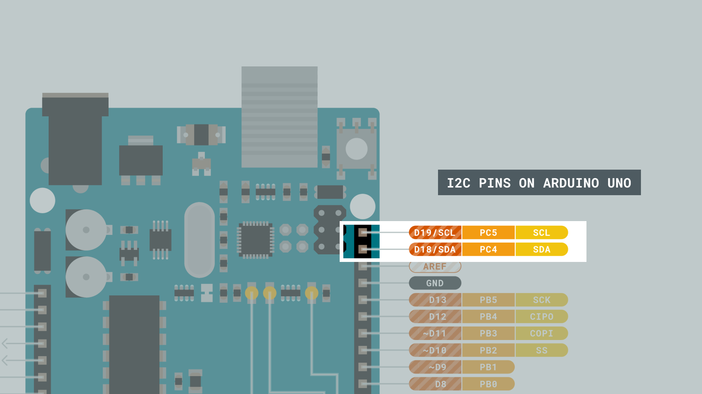
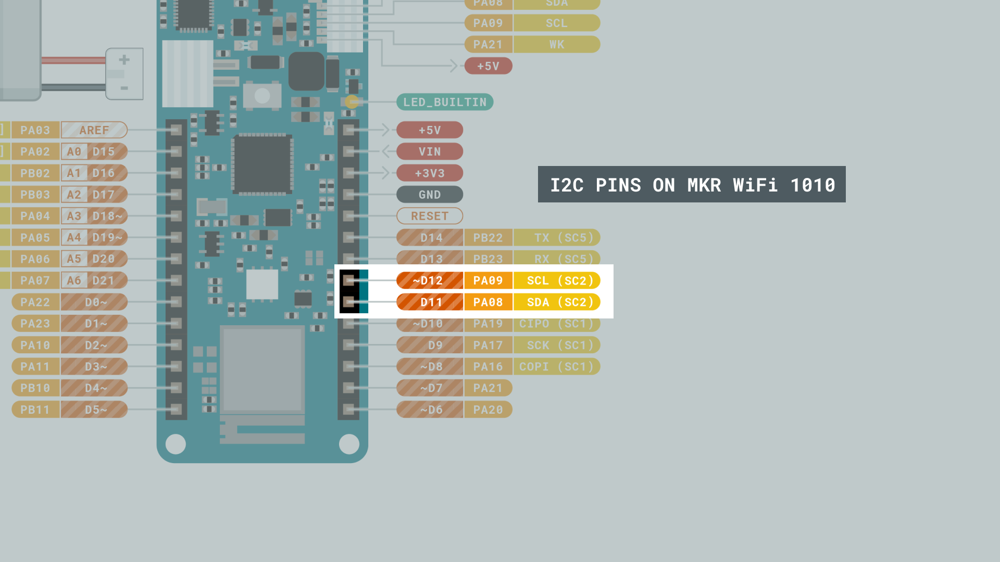
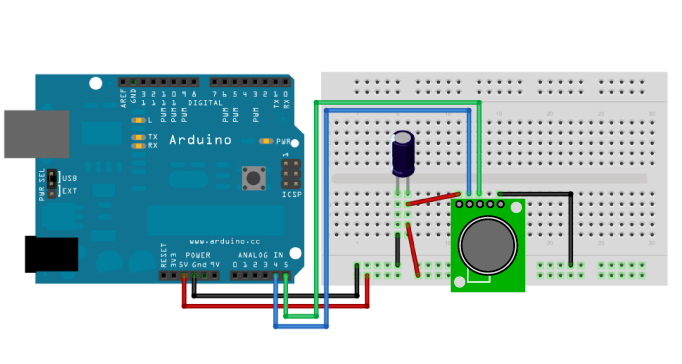
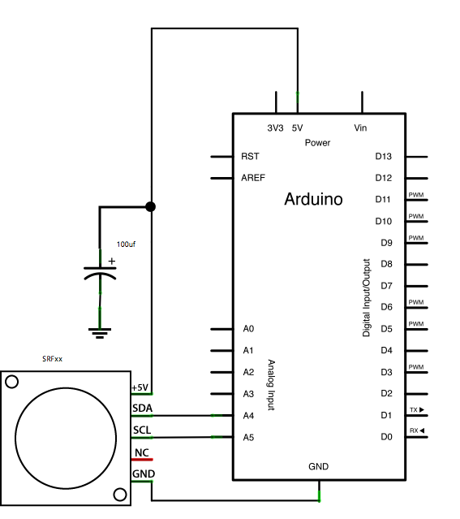
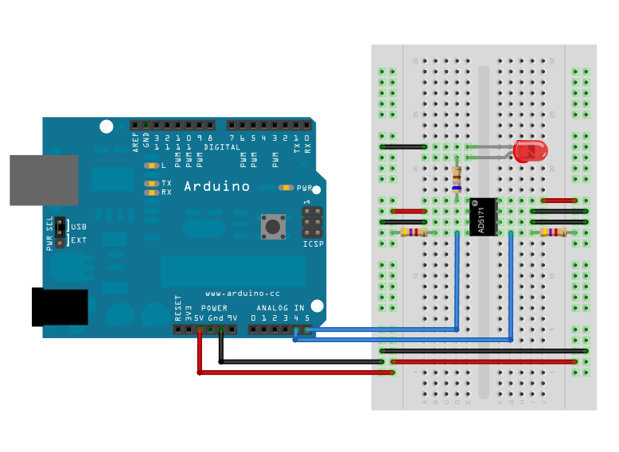
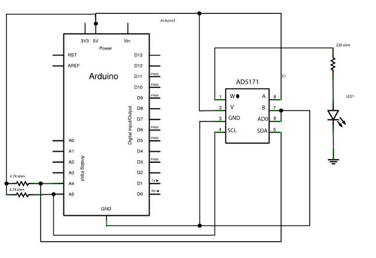
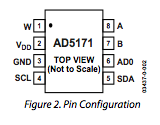

The I2C protocol involves using two lines to send and receive data: a serial clock pin **(SCL)** that the Arduino Controller board pulses at a regular interval, and a serial data pin **(SDA)** over which data is sent between the two devices. 

As the clock line changes from low to high (known as the rising edge of the clock pulse), a single bit of information is transferred from the board to the I2C device over the SDA line. As the clock line keeps pulsing, more and more bits are sent until a sequence of a 7 or 8 bit address, and a command or data is formed. When this information is sent - bit after bit -, the called upon device executes the request and transmits it's data back - if required - to the board over the same line using the clock signal still generated by the Controller on SCL as timing.

Each device in the I2C bus is functionally independent from the controller, but will respond with information when prompted by the controller. 

Because the I2C protocol allows for each enabled device to have it's own unique address, and as both controller and peripheral devices to take turns communicating over a single line, it is possible for your Arduino board to communicate (in turn) with many devices, or other boards, while using just two pins of your microcontroller.

An I2C message on a lower bit-level looks something like this:


- The controller sends out instructions through the I2C bus on the data pin (SDA), and the instructions are prefaced with the address, so that only the correct device listens. 
- Then there is a bit signifying whether the controller wants to read or write.
- Every message needs to be acknowledged, to combat unexpected results, once the receiver has acknowledged the previous information it lets the controller know, so it can move on to the next set of bits.
- 8 bits of data
- Another acknowledgement bit
- 8 bits of data
- Another acknowledgement bit

But how does the controller and peripherals know where the address, messages, and so on starts and ends? That's what the SCL wire is for. It synchronises the clock of the controller with the devices, ensuring that they all move to the next instruction at the same time.

However, you are nearly never going to *actually* need to consider any of this, in the Arduino ecosystem we have the [Wire library](https://www.arduino.cc/reference/en/language/functions/communication/wire/) that handles everything for you.

## Hardware & Software Needed

- Arduino IDE ([online](https://create.arduino.cc/) or [offline](https://www.arduino.cc/en/main/software)).
- 2x Arduino Boards

***Please note that the I2C bus is attached to different pins depending on the board you are using. For example, the pins used for [MKR WiFi 1010](/hardware/mkr-wifi-1010) are D11, D12, while the pins for [UNO](/hardware/uno-rev3) are D18, D19. See the image below to understand how to locate the correct pins on your board.***





## Tutorials

Check out the following tutorials to get a more detailed step-by-step on how to use I2C on Arduino boards:

- [Connecting Two Nano 33 BLE Boards Through I2C](/tutorials/nano-33-ble/i2c)
- [Connecting Two Nano 33 BLE Sense Boards Through I2C](/tutorials/nano-33-ble-sense/I2C)
- [Connecting Two Nano 33 IoT Through I2C](/tutorials/nano-33-iot/I2C)
- [Connecting Two Nano Every Boards Through I2C](/tutorials/nano-every/I2C)

***While the above tutorials were written specifically for the Nano Family boards, they can be adopted to any Arduino board.***

## Controller Reader

In some situations, it can be helpful to set up two (or more!) Arduino boards to share information with each other. In this example, two boards are programmed to communicate with one another in a Controller Reader/Peripheral Sender configuration via the [I2C synchronous serial protocol](http://en.wikipedia.org/wiki/I2C). Several functions of Arduino's [Wire Library](https://www.arduino.cc/en/Reference/Wire) are used to accomplish this. Arduino 1, the Controller, is programmed to request, and then read, 6 bytes of data  sent from the uniquely addressed Peripheral Arduino. Once that message is received, it can then be viewed in the Arduino Software (IDE) serial monitor window.

### Controller Reader Sketch

```arduino
// Wire Controller Reader
// by Nicholas Zambetti <http://www.zambetti.com>

// Demonstrates use of the Wire library
// Reads data from an I2C/TWI peripheral device
// Refer to the "Wire Peripheral Sender" example for use with this

// Created 29 March 2006

// This example code is in the public domain.


#include <Wire.h>

void setup() {
  Wire.begin();        // join i2c bus (address optional for master)
  Serial.begin(9600);  // start serial for output
}

void loop() {
  Wire.requestFrom(8, 6);    // request 6 bytes from peripheral device #8

  while (Wire.available()) { // peripheral may send less than requested
    char c = Wire.read(); // receive a byte as character
    Serial.print(c);         // print the character
  }

  delay(500);
}
```

### Peripheral Sender Sketch

```arduino
// Wire Peripheral Sender
// by Nicholas Zambetti <http://www.zambetti.com>

// Demonstrates use of the Wire library
// Sends data as an I2C/TWI peripheral device
// Refer to the "Wire Master Reader" example for use with this

// Created 29 March 2006

// This example code is in the public domain.


#include <Wire.h>

void setup() {
  Wire.begin(8);                // join i2c bus with address #8
  Wire.onRequest(requestEvent); // register event
}

void loop() {
  delay(100);
}

// function that executes whenever data is requested by master
// this function is registered as an event, see setup()
void requestEvent() {
  Wire.write("hello "); // respond with message of 6 bytes
  // as expected by master
}

```

## Controller Writer

In some situations, it can be helpful to set up two (or more!) Arduino boards to share information with each other. In this example, two boards are programmed to communicate with one another in a Controller Writer/Peripheral Receiver configuration via the [I2C synchronous serial protocol](http://en.wikipedia.org/wiki/I2C). Several functions of Arduino's [Wire Library](https://www.arduino.cc/en/Reference/Wire) are used to accomplish this. Arduino 1, the Controller, is programmed to send 6 bytes of data every half second to a uniquely addressed Peripheral. Once that message is received, it can then be viewed in the Peripheral board's serial monitor window opened on the USB connected computer running the Arduino Software (IDE).

### Controller Writer Sketch

```arduino
// Wire Master Writer
// by Nicholas Zambetti <http://www.zambetti.com>

// Demonstrates use of the Wire library
// Writes data to an I2C/TWI Peripheral device
// Refer to the "Wire Peripheral Receiver" example for use with this

// Created 29 March 2006

// This example code is in the public domain.


#include <Wire.h>

void setup()
{
  Wire.begin(); // join i2c bus (address optional for master)
}

byte x = 0;

void loop()
{
  Wire.beginTransmission(4); // transmit to device #4
  Wire.write("x is ");        // sends five bytes
  Wire.write(x);              // sends one byte  
  Wire.endTransmission();    // stop transmitting

  x++;
  delay(500);
}
```

### Peripheral Receiver Sketch

```arduino
// Wire Peripheral Receiver
// by Nicholas Zambetti <http://www.zambetti.com>

// Demonstrates use of the Wire library
// Receives data as an I2C/TWI Peripheral device
// Refer to the "Wire Master Writer" example for use with this

// Created 29 March 2006

// This example code is in the public domain.


#include <Wire.h>

void setup()
{
  Wire.begin(4);                // join i2c bus with address #4
  Wire.onReceive(receiveEvent); // register event
  Serial.begin(9600);           // start serial for output
}

void loop()
{
  delay(100);
}

// function that executes whenever data is received from master
// this function is registered as an event, see setup()
void receiveEvent(int howMany)
{
  while(1 < Wire.available()) // loop through all but the last
  {
    char c = Wire.read(); // receive byte as a character
    Serial.print(c);         // print the character
  }
  int x = Wire.read();    // receive byte as an integer
  Serial.println(x);         // print the integer
}
```

## Example 1: Ultra-Sonic Range Finder

This example shows how to read a [Devantech SRFxx](http://www.acroname.com/robotics/parts/R287-SRF02.html) , an ultra-sonic range finder which communicates via the [I2C synchronous serial protocol](http://en.wikipedia.org/wiki/I2C).

### Hardware Required

- Arduino Board
- Devantech SRFxx Range Finder (models SRF02, SRF08, or SRF10).
- 100 uf capacitor
- Jumper Wires
- Breadboard

### Circuit

Attach the SDA pin of your SRFxx to analog pin 4 of your board, and the SCL pin to analog pin 5. Power your SRFxx from 5V, with the addition of a 100uf capacitor in parallel with the range finder to smooth it's power supply.



### Schematic



### Code

***If using two SRFxxs on the same line, you must ensure that they do not share the same address. Instructions for re-addressing the range finders can be found at the bottom of the code below.***

```arduino
// I2C SRF10 or SRF08 Devantech Ultrasonic Ranger Finder
// by Nicholas Zambetti <http://www.zambetti.com>
// and James Tichenor <http://www.jamestichenor.net>

// Demonstrates use of the Wire library reading data from the
// Devantech Utrasonic Rangers SFR08 and SFR10

// Created 29 April 2006

// This example code is in the public domain.

#include <Wire.h>

void setup() {

  Wire.begin();                // join i2c bus (address optional for master)

  Serial.begin(9600);          // start serial communication at 9600bps
}

int reading = 0;

void loop() {

  // step 1: instruct sensor to read echoes

  Wire.beginTransmission(112); // transmit to device #112 (0x70)

  // the address specified in the datasheet is 224 (0xE0)

  // but i2c addressing uses the high 7 bits so it's 112

  Wire.write(byte(0x00));      // sets register pointer to the command register (0x00)

  Wire.write(byte(0x50));      // command sensor to measure in "inches" (0x50)

  // use 0x51 for centimeters

  // use 0x52 for ping microseconds

  Wire.endTransmission();      // stop transmitting

  // step 2: wait for readings to happen

  delay(70);                   // datasheet suggests at least 65 milliseconds

  // step 3: instruct sensor to return a particular echo reading

  Wire.beginTransmission(112); // transmit to device #112

  Wire.write(byte(0x02));      // sets register pointer to echo #1 register (0x02)

  Wire.endTransmission();      // stop transmitting

  // step 4: request reading from sensor

  Wire.requestFrom(112, 2);    // request 2 bytes from peripheral device #112

  // step 5: receive reading from sensor

  if (2 <= Wire.available()) { // if two bytes were received

    reading = Wire.read();  // receive high byte (overwrites previous reading)

    reading = reading << 8;    // shift high byte to be high 8 bits

    reading |= Wire.read(); // receive low byte as lower 8 bits

    Serial.println(reading);   // print the reading

  }

  delay(250);                  // wait a bit since people have to read the output :)
}

/*

// The following code changes the address of a Devantech Ultrasonic Range Finder (SRF10 or SRF08)

// usage: changeAddress(0x70, 0xE6);

void changeAddress(byte oldAddress, byte newAddress)

{

  Wire.beginTransmission(oldAddress);

  Wire.write(byte(0x00));

  Wire.write(byte(0xA0));

  Wire.endTransmission();

  Wire.beginTransmission(oldAddress);

  Wire.write(byte(0x00));

  Wire.write(byte(0xAA));

  Wire.endTransmission();

  Wire.beginTransmission(oldAddress);

  Wire.write(byte(0x00));

  Wire.write(byte(0xA5));

  Wire.endTransmission();

  Wire.beginTransmission(oldAddress);

  Wire.write(byte(0x00));

  Wire.write(newAddress);

  Wire.endTransmission();

}

*/
```

## Example 2: Digital Potentiometer

### Hardware Required

- Arduino Board
- AD5171 Digital Potentiometer
- LED
- 680 ohm resistor
- 2 4.7k ohm resistors
- Hook-up wires
- Breadboard

### Circuit

Connect pins 3, 6, and 7 of the AD5171 to GND, and pins 2 and 8 to +5V.

Connect pin 4, the digital pot's clock pin (SCL), to analog pin 5 on the Arduino, and pin 5, the data line (SDA), to analog pin 4. On both the SCL and SDA lines, add 4.7K ohm pull up resistors, connecting both lines to +5 V.

Finally, wire an LED to pin 1, the AD5171's "wiper", with a 680 ohm LED in series.



When the AD5171's pin 6, ADO, is connected to ground, it's address is is 44. To add another digital pot to the same SDA bus, connect the second pot's ADO pin to +5V, changing it's address to 45.

You can only use two of these digital potentiometers simultaneously.

### Schematics





### Code

```arduino
// I2C Digital Potentiometer
// by Nicholas Zambetti <http://www.zambetti.com>
// and Shawn Bonkowski <http://people.interaction-ivrea.it/s.bonkowski/>

// Demonstrates use of the Wire library
// Controls AD5171 digital potentiometer via I2C/TWI

// Created 31 March 2006

// This example code is in the public domain.

// This example code is in the public domain.


#include <Wire.h>

void setup()
{
  Wire.begin(); // join i2c bus (address optional for master)
}

byte val = 0;

void loop()
{
  Wire.beginTransmission(44); // transmit to device #44 (0x2c)
                              // device address is specified in datasheet
  Wire.write(byte(0x00));            // sends instruction byte  
  Wire.write(val);             // sends potentiometer value byte  
  Wire.endTransmission();     // stop transmitting

  val++;        // increment value
  if(val == 64) // if reached 64th position (max)
  {
    val = 0;    // start over from lowest value
  }
  delay(500);
}
```
