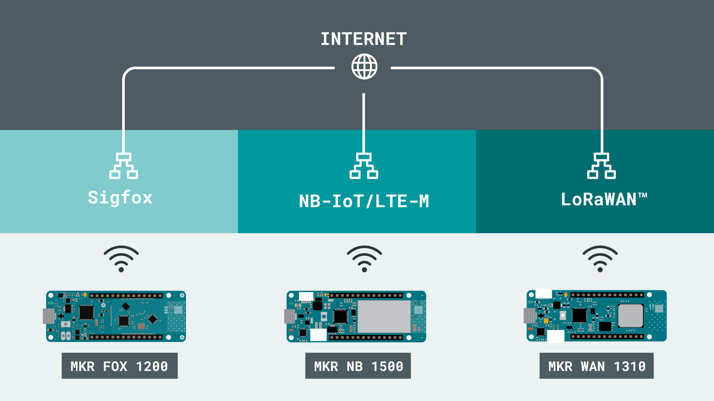
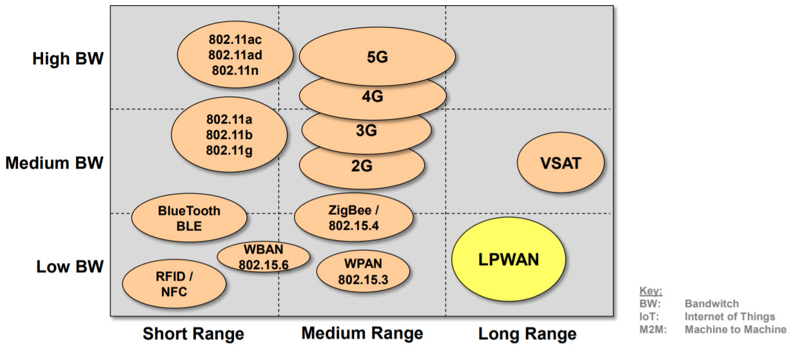
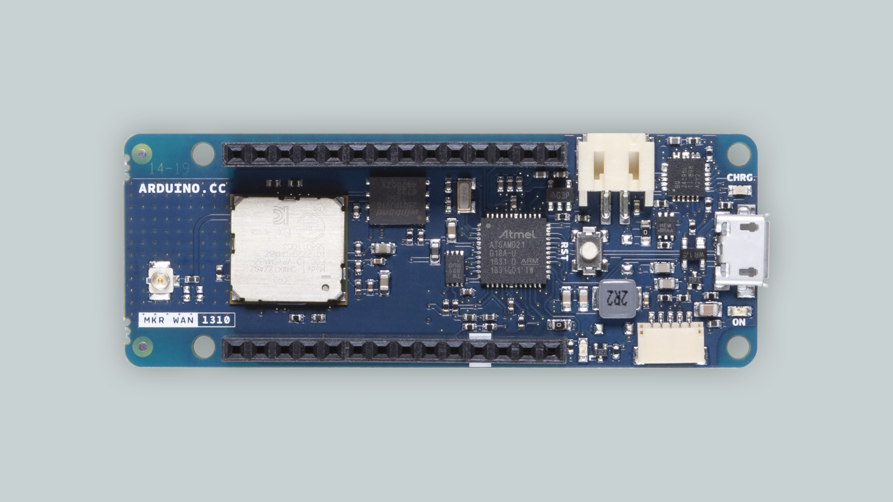
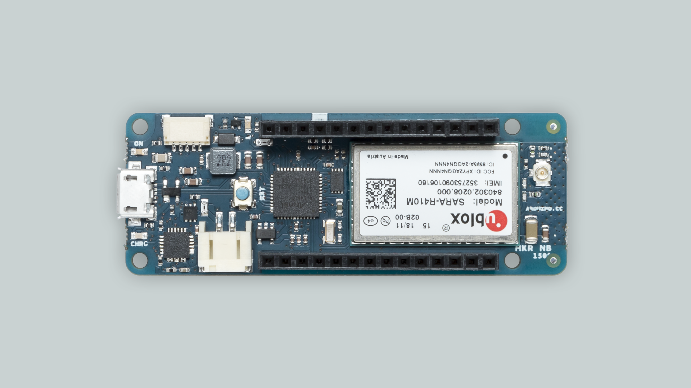
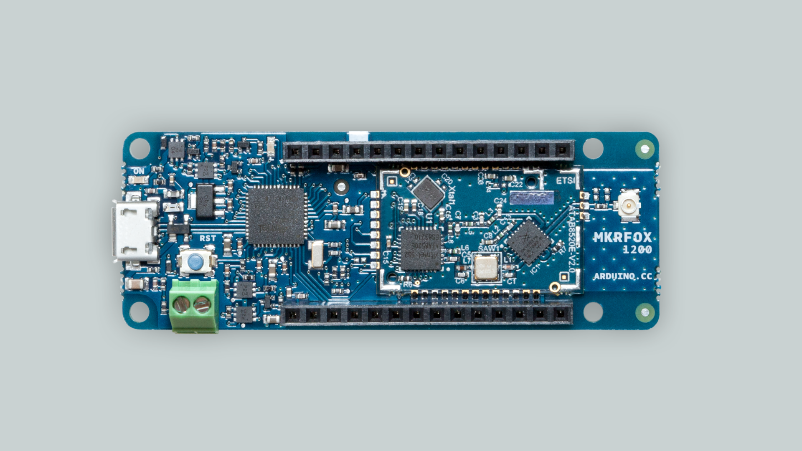

The exponential growth of the Internet of Things (IoT) and machine-to-machine (M2M) communications in the last few years has had an impact on almost every aspect of our daily lives. It is expected that **by 2025 more than 75 billion IoT devices will be connected and working around the world**. But how are these IoT devices connected to the Internet?

Generally speaking, **IoT and M2M applications and devices have low-power and low-data transmission requirements** (the data usually comes from sensors). Until recently, the technologies used for connecting these applications and devices were not the ideal ones for IoT applications, as shown in in the image below. For example, wireless personal area networks (WLANs) and Bluetooth® were designed primarily for medium to high-speed data communication in short-range environments. Wireless cellular networks such as 2G, 3G, 4G, and 5G, were designed for high-speed data communication in medium-range environments. These networks are usually employed in voice, data, and video communication. In order to meet the particular requirements of IoT and M2M applications and devices, something had to _evolve_ to meet the particular requirements of IoT and M2M applications and devices.

The term **LPWAN**, which emerged in 2013, stands for low-power wide-area network. This is a _generic_ term that describes a group of **network technologies designed to communicate small data packets on low transmission data rates wirelessly, over relatively long distances using lower power than common network technologies** (like WLANs or Bluetooth, for example). **Transmission of small packets of data**, **low-power consumption**, and **wide-signal coverage** are ideal characteristics for IoT and M2M devices and applications.

## Types of LPWAN technologies

In recent years, **two main categories of LPWAN technologies** have emerged: **networks based on non-cellular based technologies and cellular-based networks**. These types of technologies can use **licensed** or **unlicensed** frequencies and use **proprietary** or **open standards**. Let’s talk about the major and most widely deployed LPWANs today: **Sigfox**, **LoRaWAN®**, **NB-IoT** and **LTE-M**.

### Non-cellular-based technologies: Sigfox and LoRaWAN®.

One of the most widely utilized LPWANs today is **Sigfox**. This proprietary ultra-narrowband LPWAN technology runs over a network in the 868MHz or 902MHz frequency bands, these frequency bands are unlicensed Industrial, Scientific, and Medical (ISM) frequency bands. This network can deliver messages over distances of 30 to 50 km in rural areas, 3 to 10 km in urban settings and up to 1,000 km in line-of-site applications. Its packet size is limited to 150 messages of 12 bytes per day, with downlink packets limited to four messages of 8 bytes per day.

**LoRa** is a physical layer technology that works in unlicensed ISM frequency bands. It´s based on the chirped spread spectrum (CSS) technique. LoRa is basically a single-hop technology, which relays the messages received from LoRa sensor nodes to a central server via gateways. The data transmission rate supported by Lo Ra varies from 300 bps to 50 kbps. To support LoRa on the Internet, The LoRa Alliance has developed **LoRaWAN®**, which includes network and upper layer functionalities. LoRaWAN® provides three classes of end devices to address the different requirements of a wide range of IoT applications.

### Cellular-based technologies: LTE-M and NB-IoT

**LTE-M**, which stands for _Long Term Evolution for Machines_, and **NB-IoT**, which stands for _Narrowband Internet of Things_, are wireless telecommunications technologies standards developed by the _3rd Generation Partnership Project_ (3GPP), the international standards group responsible for all major mobile telecommunications standards, including the _Global System for Mobile Communications_ (GSM) standards and _Long Term Evolution_ (LTE) standards. Unlike Sigfox and LoRaWAN®, **LTE-M and NB-IoT are operated by wireless network providers**.

**LTE-M** is compatible with existing LTE networks, it provides extended coverage comparable to LTE networks, coverage for M2M applications similar to 5G networks, and offers a seamless path towards 5G M2M solution. **LTE-M is focused on providing variable data rates and support for both real-time and non-real time applications**. It supports low latency applications, as well as deferred traffic applications that can operate with latencies in the range of a few seconds. It has low power requirements and supports operations ranging from low bandwidth to bandwidth as high as 1Mbps. LTE-M also supports devices with a very wide range of message sizes.

**NB-IoT** can coexist with GSM and LTE in the licensed frequency bands of 700MHz, 800MHz, and 900MHz. NB-IoT is designed by optimizing and reducing the functionalities of LTE so that it can be used for infrequent data transmissions and with low power requirements. The data rate supported by NB-IoT is 200 kbps for downlink and 20 kbps for uplink. The maximum payload size for each message is 1600 Bytes.

### Applications of LPWAN technologies

LPWANs are commonly used in smart metering, smart lighting, asset monitoring and tracking, smart cities, precision agriculture, livestock monitoring, energy management, manufacturing, and industrial IoT deployments. Choosing an LPWAN depends on the specific application, namely the desired speed, data amounts and area covered.

LPWANs are best suited for applications requiring infrequent uplink message delivery of smaller messages. Most LPWANs technologies also have downlink capabilities. With lower power requirements, longer ranges and lower costs than traditional mobile networks, LPWANs enable a number of M2M and IoT applications, many of which were previously constrained by budgets and power issues.

Some examples of current LPWAN applications are the following:

* **Smart metering** (connected utility meters: sensors in basements).
* **Smart parking** (connected parking lots: sensors in the ground and basement garages).
* **Smart waste management** (connected municipal trash cans).
* **Asset tracking** (such as countrywide tracking and tracing of cargo carriers like pallet cages, pallets, and containers).
* **Connected buildings** (sensors in bridges or tunnels measure temperature, humidity and corrosion and identify vulnerabilities long before visible damage occurs).
* **Condition monitoring** (sensors in construction machinery and vehicles recognize malfunctions or theft).

## Arduino® and LPWAN technologies

The Arduino's MKR family has some alternatives to offer in terms of connectivity to LPWANs:

### LoRaWAN® (MKR WAN 1300/1310)

The [MKR WAN 1310](https://store.arduino.cc/mkr-wan-1310) is a development board for experimenting with either LoRa® or LoRaWAN®.

It can easily connect to [The Things Network](https://www.thethingsnetwork.org/), a platform with LoRa® coverage all over the world. It can also be used for point-to-point connection, where you can easily set up communication between two MKR WAN boards.

#### Coverage

If you are planning to connect to The Things Network, you can check out the available gateways at their [LoRa® Gateway map](https://www.thethingsnetwork.org/map).

You can also opt to set up your own gateway, which you can have several end-devices connect to (building your own network).

#### MKRWAN library

To access the [Murata CMWX1ZZABZ](https://content.arduino.cc/assets/mkrwan1310-murata_lora_module-type_abz.pdf) module onboard the MKR WAN 1300/1310, you can refer to the [MKRWAN library](https://www.arduino.cc/en/Reference/MKRWAN).

#### LoRa library

To easily set up communication between two MKR WAN 1310 boards, you can refer to the examples in the [LoRa](https://github.com/sandeepmistry/arduino-LoRa) library, credit to Sandeep Mistry.

#### Documentation

You can visit the official documentation for the MKR WAN boards through the links below:

- [MKR WAN 1300 documentation page](/hardware/mkr-wan-1300).
- [MKR WAN 1310 documentation page](/hardware/mkr-wan-1310).

---

### NB-IoT / LTE-M (MKR NB IoT)

The [MKR NB 1500](https://store.arduino.cc/arduino-mkr-nb-1500-1413) is a development board designed for global use, providing connectivity on LTE's Cat M1/NB1 bands 1, 2, 3, 4, 5, 8, 12, 13, 18, 19, 20, 25, 26, 28.

***Operators offering service in that part of the spectrum include: Vodafone, AT&T, T-Mobile USA, Telstra, and Verizon, among others.***

#### Coverage

NB-IoT and LTE-M coverage includes many regions, such as Europe, North & South America and large parts of Asia.

The MKR NB 1500 can be configured to connect to either **NB-IoT or LTE-M**, with the option of choosing a preferred RAT (Radio Access Technology). It is possible to configure the modem with a primary and backup network.

To see the full coverage, you can visit the [NB-IoT / LTE-M coverage map](https://www.gsma.com/iot/deployment-map/).

#### MKR NB Library

To access the [uBlox SARA-R410M-02B](https://content.arduino.cc/assets/Arduino_SARA-R4_DataSheet_%28UBX-16024152%29.pdf) modem onboard the MKR NB 1500, you can refer to the [MKRNB library](https://www.arduino.cc/en/Reference/MKRNB).

#### Documentation

You can visit the official documentation for this board at the [MKR NB 1500 documentation page](/hardware/mkr-nb-1500).

---

### Sigfox (MKR FOX 1200)

The [MKR FOX 1200](/hardware/mkr-fox-1200) is a development board designed for LPWAN solutions using the [Sigfox infrastructure](https://www.sigfox.com/en).

Every MKR FOX 1200 comes with a free one-year subscription to Sigfox' data plan, useful for testing the Sigfox network. Please check the plan’s conditions in terms of messages per day at the Sigfox website.

#### Coverage

The Sigfox network exists in different parts of the world, but it is mainly operating within EU. Other countries that have coverage is USA, Japan, Australia, South Africa, New Zealand and more.

***Note that while there is coverage in countries outside EU, it is limited to certain areas within the country.***

To see the full coverage, you can visit [Sigfox's own coverage map](https://www.sigfox.com/en/coverage).

#### Sigfox Library

To access the Sigfox transceiver [ATA8520](https://content.arduino.cc/assets/Arduino_Atmel-9372-Smart-RF-ATA8520_Datasheet.pdf), you can refer to the [Sigfox library](https://www.arduino.cc/en/Reference/SigFox).

#### Documentation

You can visit the official documentation for this board at the [MKR FOX 1200 documentation page](/hardware/mkr-fox-1200).

