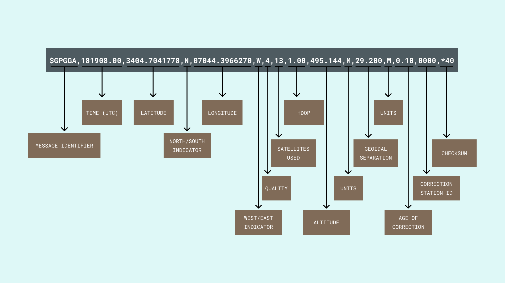

With the help of a smartphone, we can know where we are on the earth to a few meters. Our smartphones can do this with the help of a chip that communicates with a group of satellites in the sky, collectively known as a **Global Navigation Satellite System** (GNSS). A GNSS is a group, or constellation, of 24, or more, satellites working together to **provide positioning and timing services** globally under any weather conditions. 

While the **Global Positioning System** (GPS) from the United States is the **most widely GNSS used in the world**, other GNSS are also available, including:

* **BeiDou Navigation Satellite System** (BDS) from China.
* **Navigation Indian Constellation** (NavIC) from India. 
* **European Global Navigation System** (Galileo) from Europe. 
* **Quasi-Zenith Satellite System** (QZSS) from Japan.
* **Globalnaya Navigazionnaya Sputnikovaya Sistema** (GLONASS) from Russia.

A minimum of **four satellites** from a GNSS are required to compute positions in three dimensions and the time offset in the receiver clock. This means that accuracy and precision of position, velocity and time data increases with more satellites. 
 
***Typically, "GPS" is used as a general term for the overall equipment and process of using a GNSS to estimate position.***

GPS receivers communicate using several "languages" or **protocols**, including **standard** and **non-standard** (i.e., proprietary) **message formats**. In these messaging protocols, information can be transmitted as **binary data** (i.e., 1's and 0's) or using the **ASCII** character encoding. From all message standards that are use with GPS receivers, the **NMEA 0183** is the **most widely used** messaging standard. 

**NMEA** is the acronym for the [National Marine Electronics Association](https://www.nmea.org/). This association was founded in 1957 by electronics dealers to **enhance the technology and safety of marine electronics through installer training and interface standards**. The NMEA 0183 messaging protocol was adopted in 1983 originally for interfacing marine electronics, but its use has expanded to terrestrial electronics also [3]. 

The NMEA 0183 is a simple messaging protocol where **data in this messaging protocol is transmitted in ASCII strings or "sentences" from one "talker" to multiple "listeners" at a time**. Another characteristic of the NMEA 0183 messaging protocol is that it uses the **RS-422 electrical standard**, although it is also compatible with the **RS-232 electrical standard** [3]. The serial configuration of the NMEA 0183 messaging protocol is the following:

* Baud rate: 4800 bauds.
* Data bits: 8.
* Parity: none.
* Stop bit: none.

NMEA 0183 "talkers" can be, for example, a satellite, a depth sounder, or a compass, while the "listeners" can be a chart-plotter, a radar or a GPS receiver like the one used in the [Arduino MKR GPS Shield](https://store.arduino.cc/products/arduino-mkr-gps-shield). 

Sometimes, the NMEA 0183 messaging protocol is confusing because **there is not just one "sentence"**; **there are different NMEA 0183 sentences with different capabilities and purposes**, usually what changes in the sentence sis the information they can provide. To understand the different capabilities, purposes and provided information of these sentences, let us first understand their **structure**. 

## GPS NMEA 0183 Sentences Structure

All NMEA 0183 sentences start with the **$ sign** and end with a **carriage return** and a **line feed**; each data field in the sentence is separated with a **comma**:

```
$aaaaa,df1,df2,df3*hh<CR><LF>
```

A 5 character address field always follow the `$` sign while `hh` is a two hexadecimal checksum. A NMEA 0183 sentence can have a maximum of 80 characters plus a carriage return and a line feed. Let us examine now a GPS NMEA 0183 example sentence:

```
$GPGGA,181908.00,3404.7041778,N,07044.3966270,W,4,13,1.00,495.144,M,29.200,M,0.10,0000,*40
```

In this NMEA 0183 sentence we can identify the following information:

* **GP** defines a **GPS position** (GL would denote GLONASS).
* **181908.00** is the **timestamp** (UTC in hours, minutes, and seconds).
* **3404.7041778** is the **latitude** in DDMM.MMMMM format.
* **N** denotes **north latitude**.
* **07044.3966270** is the **longitude** in DDDMM.MMMMM format. 
* **W** denotes **west longitude**.
* **4** is a **quality indicator** (precision). 
* **13** is the **number of satellites** used to define the coordinate.
* **1.00** is the **horizontal dilution of precision** (HDOP).
* **495.144** is the **altitude of the GPS antenna**. 
* **M** is the **unit of altitude** (meters or feet).
* **29.200** is the **geoidal separation**.
* **M** is the **unit of the geoidal separation** (meters or feet).
* **1.0** is the **age of the correction** (if any).
* **0000** shows the **correction station ID** (if any).
* ***40** is a **checksum**.

`$GPGGA` is a basic and common NMEA 0183 sentence; alternative and companion NMEA 0183 sentences provide similar or additional information. 



## Common GPS NMEA 0183 Sentences

Some common NMEA 0183 messaging protocol sentences that we can find related to GPS are described in the table below:

| **Sentence** |                    **Description**                    |
|:--------:|:-------------------------------------------------:|
|  **$GPGGA**  |       Time, position, fix type data.       |
|  **$GPGLL**  |      Latitude, longitude, UTC time of position fix and status.      |
|  **$GPGSA**  | GPS receiver operating mode, satellites used in the position solution, DOP values. |
|  **$GPGSV**  |              Number of satellites in view, satellite ID numbers, elevation, azimuth, SNR values.             |
|  **$GPRMC**  |       Time, date, position, course, speed data.      |
|  **$GPVTG**  |        Course, speed information relative to the ground.       |

Notice that `$GPRMC` sentence is essential as it provides the recommended minimum navigation data to be provided by a GNSS receiver. 

***To extract information related to the position, record at least one of the following NMEA 0183 sentences: $GPGGA, $GPGLL, $GPRMC.***

## Arduino® and the GPS NMEA 0183 Messaging Protocol

The Arduino's MKR family boards can work with the NMEA 0183 messaging protocol using the [Arduino MKR GPS Shield](https://store.arduino.cc/products/arduino-mkr-gps-shield) and the [Arduino_MKR GPS library](https://www.arduino.cc/en/Reference/ArduinoMKRGPS).


The MKR GPS Shield is based on the **u-blox SAM-M8Q GNSS module**; this module utilizes concurrent reception of up to three GNSS (GPS, Galileo and GLONASS) and supports both SBAS and QZSS. It also recognizes multiple constellations simultaneously and provides outstanding positioning accuracy in scenarios where urban canyon or weak signals are involved. 

The MKR GPS Shield is meant to be used on top of the MKR family boards, but it is also possible to hook it up to other SAM D-based Arduino boards via its UART or I2C pins (the Arduino_MKR GPS library can work with both communications protocols). 

For more information, you can visit the official documentation of the shield [here](/hardware/mkr-gps-shield).

### MKR GPS Shield Tutorials

If you want to learn how to use the MKR GPS Shield, check out the tutorials below:

- [MKR GPS Shield basics tutorial](/tutorials/mkr-gps-shield/mkr-gps-basic)
- [MKR WAN 1310 with MKR GPS Shield](/tutorials/mkr-wan-1310/wan-and-gps)

## References 

* [1] "SAM-M8Q Data Sheet", u-blox.com, 2020. [Online]. Available: https://www.u-blox.com/en/docs/UBX-16012619. [Accessed: 05- Oct- 2021].
* [2] "u-blox 8 / u-blox M8 Receiver Description", u-blox.com, 2021. [Online]. Available: https://www.u-blox.com/en/docs/UBX-16018358. [Accessed: 05- Oct- 2021].
* [3] "NMEA 0183 Interface Standard", NMEA, 2021. [Online]. Available: https://www.nmea.org/nmea-0183.html. [Accessed: 05- Oct- 2021].