The Internet of Things (IoT) is often referred to as a collection of objects connected to the Internet using **wireless networks**; these connected objects aim to collect and exchange information from their surroundings. **IoT enables a connection between the physical and the digital worlds**; that connection produces a massive amount of data that can be used for the **optimization** of resources and to improve the **efficiency** of existing systems.

***By 2025, there will be more than 25 billion IoT devices connected to the Internet.***

Many of the existing IoT devices will be connected to the Internet using short-range wireless networks such as Wi-Fi®, Bluetooth®, Zigbee®, Z-Wave®, etc. Cellular connections using networks such as 2G, 3G, and 4G will also connect IoT devices to the Internet. Still, these **short and medium-range wireless networks are not always suitable for IoT devices** since they were developed for applications where power consumption and battery life are not significant issues. **IoT devices usually have low-power consumption and send and receive low amounts of data**.  

## Low-Power Wide Area Networks

**Low-Power Wide Area Networks** (LPWAN) is a group of wireless networks technologies well suited to the specific needs of IoT devices: **low-bandwidth** and **low-power** devices, usually battery-powered. This type of networks provide **low-bit rates** over **long ranges** with a **low-power** consumption. LPWAN's can accommodate data packets sizes from 10 bytes to 1 kB at uplink speeds up to 200 kbps; long-range connectivity varies from 2 to 1,000 km depending on the network technology. Most LPWAN's technologies have a **star topology**; this means that each device connects directly to a central access point.

Some of the important use cases for LPWAN's include the following applications:

- **Smart cities**: smart parking, intelligent street lighting.
- **Supply chain management**: asset tracking, condition monitoring. 
- **Smart grids**: electricity, water, and gas metering.
- **Smart agriculture**: land condition monitoring, animal tracking, geofencing. 

***If you want to read more about LPWAN's, check out [this article](/learn/communication/low-power-wide-area-networks-101) from the Learn section.***

Several LPWAN technologies use **licensed** or **unlicensed frequencies** and **proprietary** or **open** specifications. **LoRa®** and its Media Access Control (MAC) layer protocol implementation, **LoRaWAN®**, is currently one of the existing LPWAN gaining the most traction to support IoT devices and services. 

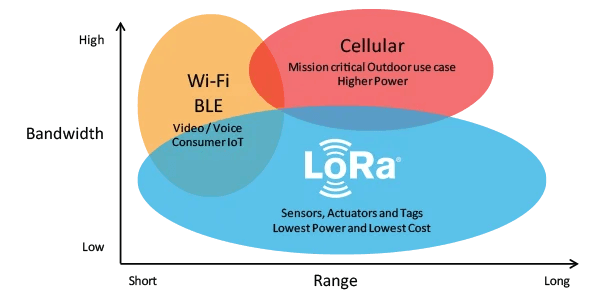

## LoRa® and LoRaWAN®

### What are LoRa® and LoRaWAN®?

**LoRa®** is a **wireless modulation technique** derived from **Chirp Spread Spectrum** (CSS) technology. CSS uses wideband linear frequency modulated chirp pulses to encode information. LoRa® can operate on the following license-free sub-gigahertz ISM (Industrial, Scientific, and Medical) bands: **433 MHz**, **868 MHz**, and **915 MHz**. ISM bands are internationally reserved for industrial, scientific and, medical uses. 

***LoRa® modulation technique was invented in 2010 by the French startup Cycleo; then, it was acquired in 2012 by Semtech.***

Based on LoRa®, the **LoRaWAN®** (LoRa for Wide Area Networks) specification extended the LoRa® physical communication layer into the Internet by adding a **MAC layer**. The LoRaWAN® specification is a software layer that defines how devices must use the LoRa, for example, when they transmit or receive messages. The LoRaWAN specification is open-source; it has been supported and maintained by the LoRa Alliance® since 2015. 

***The LoRa Alliance® is an open, nonprofit organization that collaborates and shares experiences to promote and drive the success of the LoRaWAN® standard as the leading open global standard for secure IoT LPWAN connectivity.***

### LoRaWAN® Network Architecture

A typical LoRaWAN® network architecture includes the following essential parts: **end-devices** (usually sensors), a base station or **gateway**, also known as Long Range Relay (LRR), a **network server** also known as Long Range Controller (LRC), and the **Operation Support System** (OSS) for provisioning and management of the network.

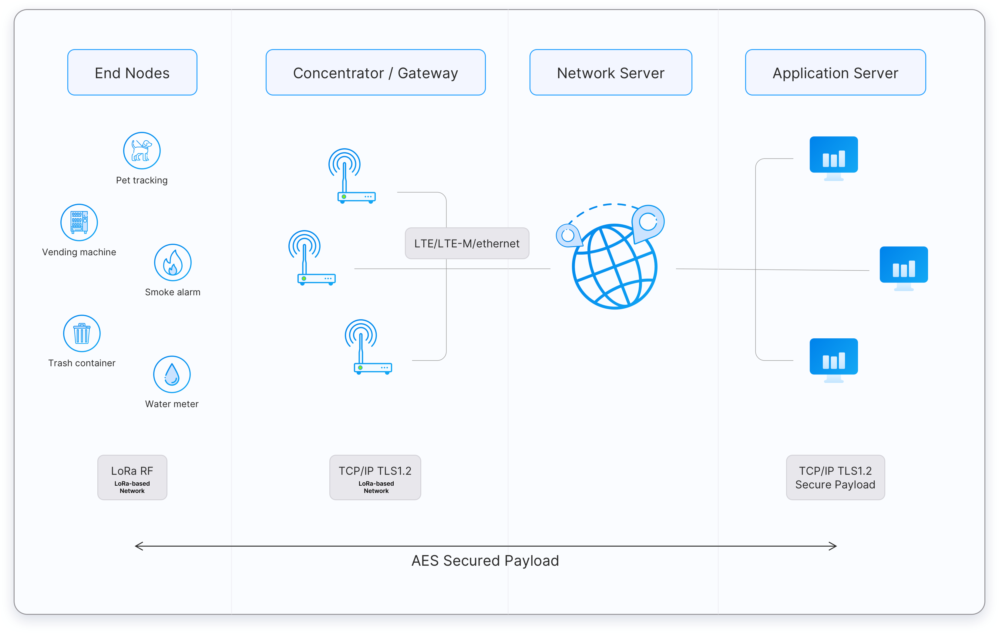

From the image above, notice there is a fundamental difference between a network server and a gateway. The **network server** controls the virtualized MAC layer of the LoRaWAN® network while **gateways** are devices pre-integrated with the network server to ease the LPWAN rollout and provisioning. LoRaWAN® network servers and gateways access can be public or private.

***[The Things Network (TTN)](https://www.thethingsnetwork.org/) is a crowdsourced, open, and decentralized LoRaWAN® network server. This network is a great way to start testing devices, applications, integrations and get familiar with LoRaWAN®. To connect to TTN, you will need to be in the range of a gateway. Check the [world map](https://www.thethingsnetwork.org/map) to see if your local community already has a gateway installed; if not, consider installing one!***

LoRaWAN® networks are usually deployed in a **star-of-stars topology**; this means that **gateways manage data between end-devices and a network server**. Gateways are connected to the central network server via the Internet, while end-devices use LoRa® to send and receive data to and from the gateways; end-devices are not exclusively tied to a single gateway, end-devices broadcast information to all the gateways in range. Communication in LoRaWAN® networks is natively **bi-directional**, although uplink communication between end-devices and the central network server is expected to be predominant in the network.

***Star networks topologies provide the best relationship between long-range communications, the number of gateways or base stations in the network, end-devices power consumption, and battery life.***

Star networks present several advantages compared to other network topologies:

- Gateways can be added to the network anywhere and anytime without prior planning.
- Message delivery is more robust since multiple gateways receive the same data packets during each uplink.

### Data Rates

Communication between end-devices and gateways in LoRaWAN® networks is spread out on different **frequency channels** and **data rates** (communications using different data rates do not interfere with each other).

***LoRa® supports data rates ranging from 300 bps to 5 kbps for a 125 kHz bandwidth.***

To maximize the battery life of each end-device and the overall capacity available through the network, LoRaWAN® uses an **Adaptive Data Rate** (ADR) mechanism for **optimizing data rates, airtime, and power consumption**. ADR controls the following transmission parameters on end-devices:

- **Spreading factor**: the **speed of data transmission**. Lower spreading factors mean a higher data transmission rate. 
- **Bandwidth**: the **amount of data that can be transmitted** from one point to another within the network. 
- **Transmission power**: the energy that the end-device transmitter produces at its output.

The table below shows compares spreading factor, data rate, and time on-air at a bandwidth of 125 kHz (range is an indicative value, it will depend on the propagation conditions):

| **Spreading Factor** | **Data Rate** | **Range** | **Time on-Air** |
|:----------------:|:---------:|:-----:|:-----------:|
|        SF7       |  5470 bps |  2 km |    56 ms    |
|        SF8       |  3125 bps |  4 km |    100 ms   |
|        SF9       |  1760 bps |  6 km |    200 ms   |
|       SF10       |  980 bps  |  8 km |    370 ms   |
|       SF11       |  440 bps  | 11 km |    40 ms   |
|       SF12       |  290 bps  | 14 km |   1400 ms   |

End-devices may transmit on any channel available at any time, using any available data rate, as long as the following rule is respected:

- The end-device changes channel in a pseudo-random fashion for every transmission. The resulting frequency diversity makes the system more robust against interference.
  
Also, local regulations must be respected, for example:

- In the EU868 band, the end-device must respect the maximum transmit duty cycle relative to the sub-band used and local regulations (1% for end-devices).
- In the US915 band, the end-device must respect the maximum transmit duration (or dwell time) relative to the sub-band used and local regulations (400ms).

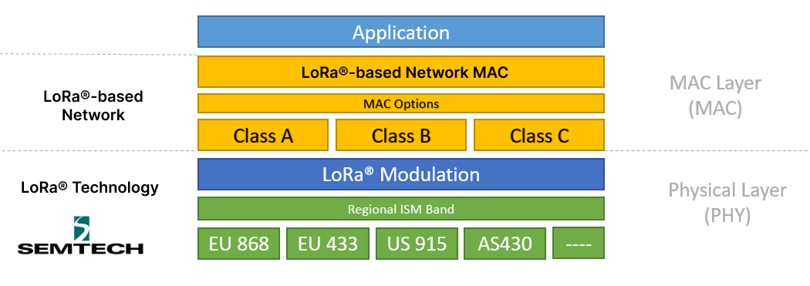

### Regional Parameters

The **LoRaWAN® Regional Parameters specification** is a companion to the LoRaWAN® network layer specification. While the LoRaWAN® network layer specification defines the air interface between a compliant end-device (sensor, actuator, tracker, etc.) and a compliant network core, the LoRaWAN® Regional Parameters specification defines the **adaptation of the LoRaWAN® network layer specification to comply with the various regulations enforced throughout the world on the use of various frequency bands of the unlicensed spectrum which are available**. 

Also, the LoRaWAN® Regional Parameters specification documents the **physical layer configurations required for the compliant operation of LoRaWAN® Link Layer radios** using various radio frequency modulation techniques. 

***The idea behind the LoRaWAN® Regional Parameters specification is to create the smallest number of regional channel plans covering the largest possible number of regulatory regions. With this, complexity is decreased to implementers as well as the certification cost (end-device certification is enumerated by network layer, Regional Parameters and channel plan revision).***

LoRaWAN® Regional Parameters specifications do not specify everything. They only cover a region by specifying the common denominator. For example, the LoRaWAN® Regional Parameters for Asia only specify a common subset of channels, but there are variations between regulations in Asian countries. Furthermore, each network server, for example TTN, is free to select additional parameters, such as additional emission channels. 

For more information, you can read the RP002-1.0.2 LoRaWAN® Regional Parameters document [here](https://lora-alliance.org/wp-content/uploads/2020/11/RP_2-1.0.2.pdf), we also have a more detailed tutorial about LoRaWAN® Regional Parameters and Arduino hardware; the tutorial can be found here [here](https://docs.arduino.cc/tutorials/mkr-wan-1310/lorawan-regional-parameters)

### Classes

The LoRaWAN® specification has **three** different communication profiles between devices and applications: **Class A**, **Class B**, and **Class C**. Each class serves different application needs and has optimized requirements for specific purposes. The main difference between the three classes is latency and power consumption; end-devices can always send uplinks when needed, but its class will determine when to receive downlinks.

***All LoRaWAN devices must implement Class A; Class B, and Class C are extensions of Class A profile.***

 #### Class A: "Aloha"

Class A devices implement a **bi-directional communication profile** where two short downlinks follow the end-device uplink transmission receive windows, usually referred to as RX1 and RX2. If the server does not respond in either RX1 or RX2 windows, the next opportunity will be after the next uplink transmission. Class A devices are often battery-powered and spend most of the time in sleep mode; therefore, they have the lowest energy consumption, keep long intervals between uplinks, and have high downlink latency.

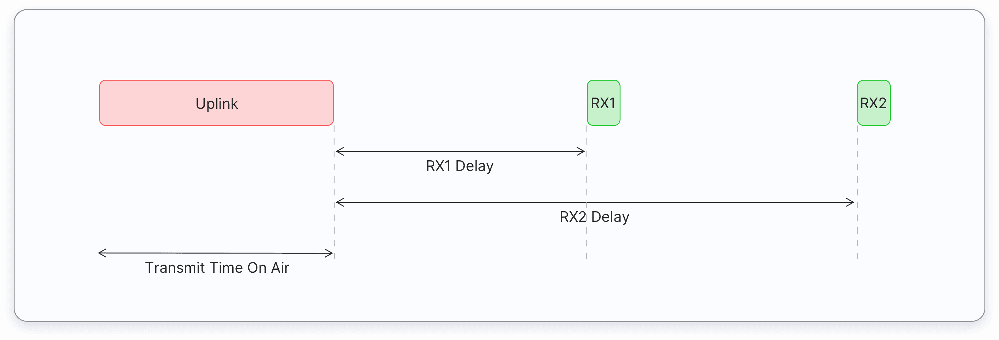

#### Class B: The "Beaconing" Class

Class B devices extend Class A devices by adding scheduled receive windows for downlinks, and, therefore, they **emulate a continuously receiving device by opening receive windows at fixed time intervals**. This class should be implemented when low latency of downlink communication while keeping the power consumption as low as possible is required.

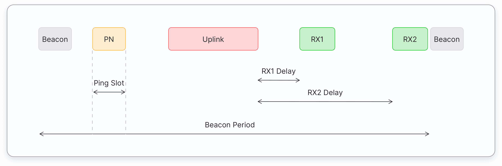

#### Class C: Continuous Reception

Class C communication profile is used in applications with enough power available, so there is no need to minimize the time of the reception windows; this is the case of most actuators (e.g., smart plugs, street lights, electrical meters, etc.) Class C devices always listen for downlinks messages unless they transmit an uplink message. This behavior results in the **lowest latency between the server and the end-device**. 

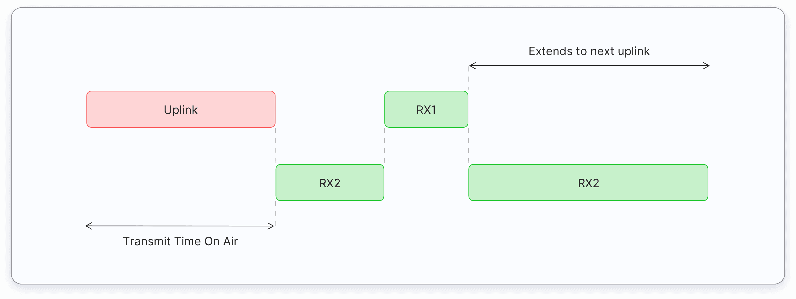

### Authentication and Security

Authentication and security are also important in LoRaWAN® networks. Any LoRaWAN® network has a baseline authentication and security framework based on the AES 128 encryption scheme. Compared to other LPWAN's, which rely on a single key for authentication and encryption, the LoRaWAN® framework separates both. Authentication and integrity control use a **network session key** (NwkSKey) while user data encryption uses an **application session key** (AppSKey). 

***NwkSKey and AppSKey are AES-128 root keys specific to the end-device, end-devices manufacturers, or application owners assigned them.***

LoRaWAN® supports two authentication and activation methods: **Over-The-Air-Activation** (OTAA) and **Activation by Personalization** (ABP). 

- **Over-The-Air Activation (OTAA)**: In this method, end-devices are not initialized for any particular network; they send a JOIN request to a specific LoRaWAN® network and then receive a device address and an authorization token from which session keys are derived; NwkSKey and AppSKey are derived during this procedure from a root AppKey pre-provisioned in the end-devices by its manufacturer. 

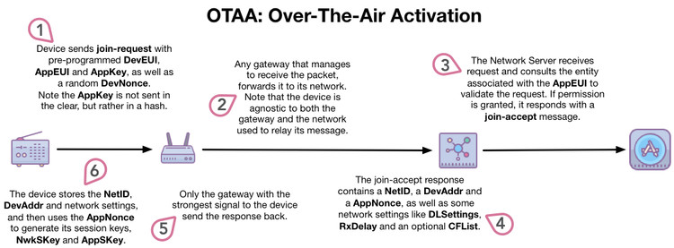

- **Activation by Personalization (ABP)**: In this method, end-devices are personalized to work with a given LoRaWAN® network. End-devices are pre-provisioned with the NwkSKey and AppSKey and the 32-bits device network address. 

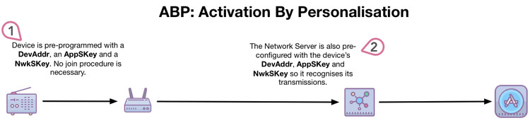

***The recommended authentication and activation method is OTAA since it provides a high level of security; ABP method should be used only for specific situations.***

## Arduino® and LoRa®

Arduino® brings LoRa® connectivity to your projects with several boards, addons and libraries. 

### Arduino® Boards with LoRa® Connectivity

The MKR WAN [1300](https://store.arduino.cc/products/arduino-mkr-wan-1300-lora-connectivity) and [1310](https://store.arduino.cc/products/arduino-mkr-wan-1310) boards provide you with a practical and cost-effective solution to applications that require LoRa® connectivity and low-power consumption. The MKR WAN 1300 and 1310 boards are based on a [SAMD21 microcontroller](https://content.arduino.cc/assets/mkr-microchip_samd21_family_full_datasheet-ds40001882d.pdf) from Microchip®; they also features a [CMCMWX1ZZABZ](https://content.arduino.cc/assets/mkrwan1310-murata_lora_module-type_abz.pdf) module from Murata® for LoRa® connectivity, the [ATECC508](https://ww1.microchip.com/downloads/aemDocuments/documents/OTH/ProductDocuments/DataSheets/20005928A.pdf) cryptoauthentication device for security, and a 2MB SPI Flash memory for onboard storage. 

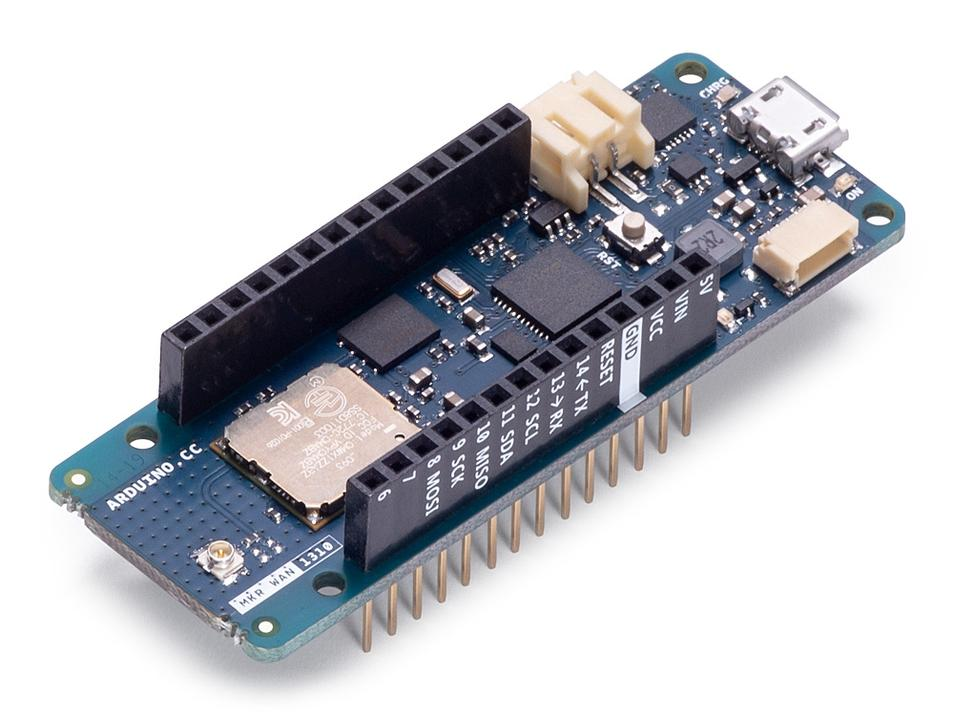

PRO hardware also has  LoRa® connectivity. The Arduino® [Portenta H7](https://store.arduino.cc/collections/boards/products/portenta-h7) board can have LoRa® connectivity with the [Portenta Vision Shield - LoRa](https://store.arduino.cc/products/arduino-portenta-vision-shield-lora%C2%AE); this addon board also features a [CMCMWX1ZZABZ](https://content.arduino.cc/assets/mkrwan1310-murata_lora_module-type_abz.pdf?_gl=1*54znn6*_ga*NzQ5Mzk2MDcwLjE2MjU2MDQ2MjA.*_ga_NEXN8H46L5*MTY0MDAzOTY0Ny4yNTIuMS4xNjQwMDM5NzQ2LjA.) module from Murata® for LoRa® connectivity, the same module present in the MKR 1300 and 1310 boards. 

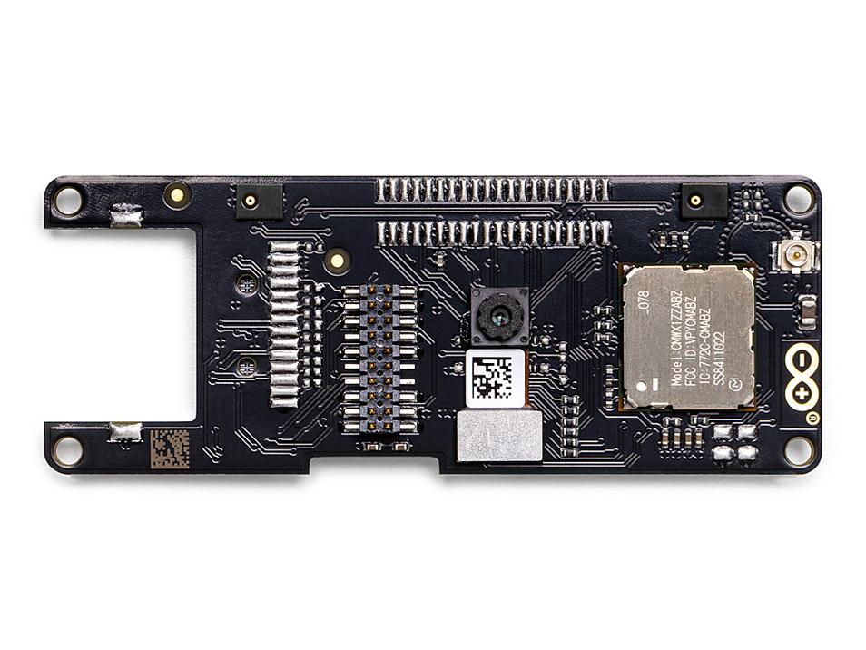

The Arduino® [Edge Control](https://store.arduino.cc/products/arduino-edge-control), a remote monitoring and control solution optimized for outdoor environments, can expand its wireless connectivity capabilities by adding an MKR WAN 1300 or 1310 board. Edge Control can be positioned anywhere and is well suited for smart agriculture and other applications that require intelligent control in remote locations. 

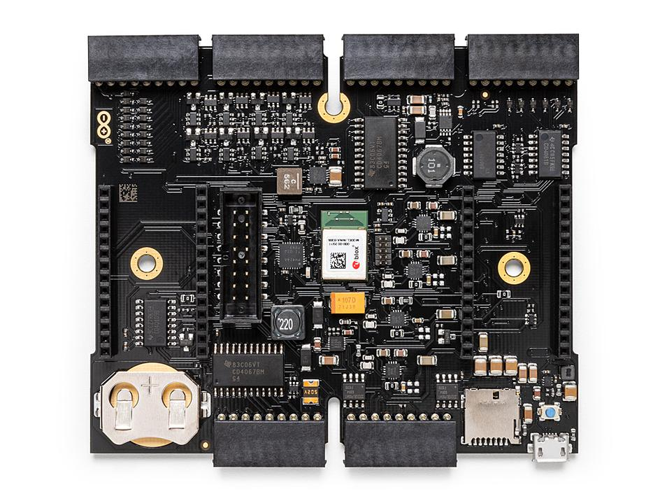

### Arduino® Libraries for LoRa® Connectivity

You can use several Arduino libraries with the CMCMWX1ZZABZ LoRa® module from Murata®; we recommend two: The [MKRWAN library](https://github.com/arduino-libraries/MKRWAN), developed by Arduino, and the [Arduino LoRa](https://github.com/sandeepmistry/arduino-LoRa) library, developed by Sandeep Mistry. The MKRWAN and the Arduino LoRa libraries provide you the APIs to communicate with LoRa® and LoRaWAN networks®.

You can use both libraries in the Arduino IDE, [online](https://store.arduino.cc/digital/create) and [offline](https://www.arduino.cc/en/software). If you are using the online IDE, you don't need to do anything, both libraries are already installed and ready to be used. If you are using the offline IDE, you must install the libraries manually. Installing libraries can be done easily by navigating to **Tools > Manage Libraries...** and then look for **MKRWAN** library by Arduino and **LoRa** by Sandeep Mistry; **remember to install the latest version of the libraries**. 

***Currently, there are two versions of the MKRWAN library; MKRWAN_v2 library is still in beta.***

### Example: Sending and Receiving Data to a Network Server

Using Arduino® hardware and software to communicate with LoRa® and LoRaWAN® networks is simple; let's check out an example. This example uses an MKR WAN 1310 board and the MKRWAN library to send data to a LoRaWAN® network, in this case, TTN. The circuit for this example is shown in the image below:

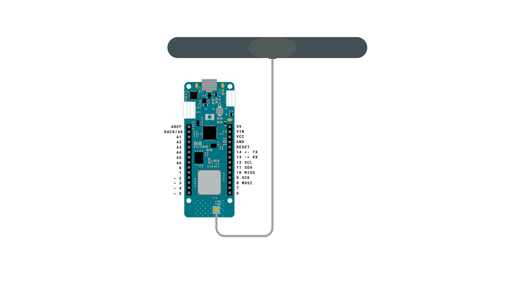

Before sending and receiving messages from TTN, you need to register your board first to the network. For this, you need to know your board's `Device EUI`. You can get your board's `Device EUI` by running the `FirstConfiguration` example from the MKRWAN library. With your Device EUI, you can register your board in TTN by creating an account in TTN, adding an application, and registering your board. This [tutorial](https://www.thethingsnetwork.org/docs/devices/node/quick-start/) from TTN explains the process. 

Once your device is registered on TTN, you can start sending and receiving data with the following code:

```arduino
/*
  Send and receive data from a LoRaWAN network
  This sketch demonstrates how to send and receive data with the MKR WAN 1300/1310 board.
  This example code is in the public domain.
*/

#include <MKRWAN.h>
#include "arduino_secrets.h"

LoRaModem modem;

void setup() {
  // Serial port initialization
  Serial.begin(115200);
  while (!Serial);
  
  // LoRa module initialization
  // Initialize the modem with your regional band (eg. US915, AS923,...)
  if (!modem.begin(EU868)) {
    Serial.println("- Failed to start module");
    while (1) {}
  };

  // With the module initialized, we can get its version and device EUI
  // Your network server provider requires device EUI information to connect to their network
  Serial.print("- Your module version is: ");
  Serial.println(modem.version());
  Serial.print("- Your device EUI is: ");
  Serial.println(modem.deviceEUI());

  // Join procedure to the network server
  // OTAA method need appEUI and appKey, this information is provided by the network server
  int connected = modem.joinOTAA(appEui, appKey);
  if (!connected) {
    Serial.println("- Something went wrong; are you indoor? Move near a window and retry...");
    while (1) {}
  }

  // Set poll interval to 60 secs.
  modem.minPollInterval(60);

  // NOTE: independent of this setting, the modem will not allow sending more than one message every 2 minutes
  // This is enforced by firmware and can not be changed.
}

void loop() {
  Serial.println();
  Serial.println("- Enter a message to send to network");
  Serial.println("(make sure that end-of-line 'NL' is enabled)");

  // Get message from Serial Monitor
  while (!Serial.available());
  String msg = Serial.readStringUntil('\n');

  // Show the sent message to the network in HEX format
  Serial.println();
  Serial.print("- Sending: " + msg + " - ");
  for (unsigned int i = 0; i < msg.length(); i++) {
    Serial.print(msg[i] >> 4, HEX);
    Serial.print(msg[i] & 0xF, HEX);
    Serial.print(" ");
  }
  Serial.println();

  // Check if the message was sent correctly or if there was an error
  int err;
  modem.beginPacket();
  modem.print(msg);
  err = modem.endPacket(true);
  if (err > 0) {
    Serial.println("- Message sent correctly!");
  } else {
    Serial.println("- Error sending message :(");
    Serial.println("(- You may send a limited amount of messages per minute, depending on the signal strength");
    Serial.println("- It may vary from one message every couple of seconds to one  message every minute)");
  }

  // Wait and check if there's a message sent from the network
  delay(1000);
  if (!modem.available()) {
    Serial.println("- No downlink message received at this time");
    return;
  }

  // If there's a message available, store it
  char rcv[64];
  int i = 0;
  while (modem.available()) {
    rcv[i++] = (char)modem.read();
  }

  // Decode and show the received message from the network
  Serial.print("- Received: ");
  for (unsigned int j = 0; j < i; j++) {
    Serial.print(rcv[j] >> 4, HEX);
    Serial.print(rcv[j] & 0xF, HEX);
    Serial.print(" ");
  }
  Serial.println();
}
```

Check out more detailed tutorials we have about sending data between a MKR WAN board to TTN and between two MKR WAN boards; the tutorials can be found [here](https://docs.arduino.cc/hardware/mkr-wan-1310).


## Further Reading and Resources

LoRa® and LoRaWAN® are pretty extensive but exciting topics to study. If you want to learn more about these technologies, check out the following links:

- [The LoRa Alliance® Resource Hub](https://lora-alliance.org/resource-hub/). Here you can access LoRaWAN® technical documents and Whitepapers from The LoRa Alliance®.
- [LoRa Developer Portal from Semtech](https://lora-alliance.org/resource-hub/). Here you can find technical papers and user guides as well as specifications and datasheets from Semtech. 
- [The Things Network documentation](https://www.thethingsnetwork.org/docs/). Here you can learn all about LoRaWAN® and The Things Network!
- [The Things Academy online course in Udemy](https://www.udemy.com/course/lorawan-fundamentals/). A free online course where you'll learn all about LoRa® and LoRaWAN®, and get ready to start building your own Low Power Wide Area Network applications.