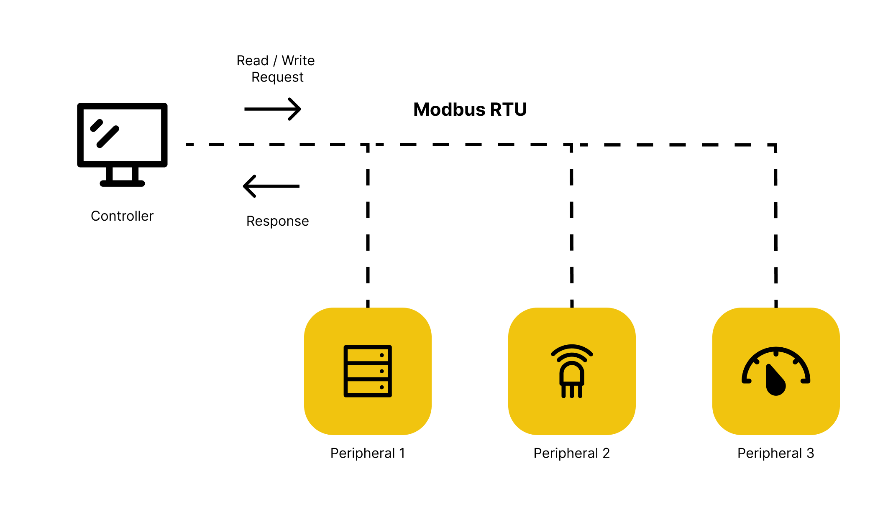
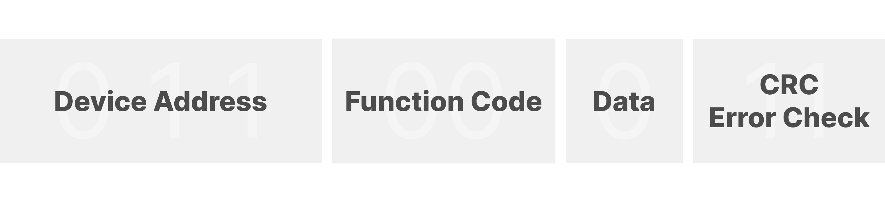

## Introduction

This article contains information about the Modbus serial communication protocol and how it can be used with Arduino hardware. The different elements are highlighted, compatible libraries and boards are shown together with example code. The following section gives an overview of Modbus compatible Arduino boards and the libraries to enable Modbus protocol capability. Depending on the hardware you are using, the libraries might vary. Therefore, it is always important to check your device specifications.

### Modbus compatible hardware
- All boards compatible with the [MKR 485 Shield](https://docs.arduino.cc/hardware/mkr-485-shield) and the [MKR ETH Shield](https://docs.arduino.cc/hardware/mkr-eth-shield)
- All boards compatible with the [Ethernet Shield Rev2](https://docs.arduino.cc/hardware/ethernet-shield-rev2)
- [Portenta Machine Control](https://docs.arduino.cc/hardware/portenta-machine-control)
- [Portenta Max Carrier](https://docs.arduino.cc/hardware/portenta-max-carrier)
- [Opta™](https://docs.arduino.cc/hardware/opta)

### Libraries
- [ArduinoRS485](https://www.arduino.cc/reference/en/libraries/arduinors485/)
- [ArduinoModbus](https://www.arduino.cc/reference/en/libraries/arduinomodbus/)

***Controller/peripheral is formerly known as master/slave. Arduino no longer supports the use of this terminology. Devices formerly known as master are referred to as controller and devices formerly known as slaves are referred to as peripheral.***

## What is Modbus?
Modbus is an open serial communication protocol used for transmitting information over serial lines between electronic devices. It was originally published by Modicon (now Schneider Electric) in 1979. The Modbus protocol is the oldest and by far the most popular automation protocol in the field of automation process. It enables devices, such as energy meters or humidity sensors connected to the same network to communicate the results to a supervisory computer or a Programmable Logic Controller (PLC).

Several versions of the Modbus protocol exist such as Modbus RTU, Modbus ASCII, Modbus TCP and Modbus Plus. It is based on a controller-peripheral (formerly known as master-slave) architecture and communication between nodes is achieved with send request and read response type messages. Modbus communicates over several types of physical media such as RS-232/RS-485 or Ethernet. The original Modbus interface ran on RS-232 serial communication but most of the later Modbus implementations use RS-485 because it allows for longer distances, higher speeds and the possibility of multiple devices on a single multi-drop network. The communication over serial RS-485 physical media works with two-wire transmit and receive connections.

On interfaces like RS-485 and RS-232, the Modbus messages are sent in plain form over the network and the network will be dedicated to only Modbus communication. However, if your network requires multiple heterogeneous devices, TCP/IP over Ethernet based protocol is recommended. In this case, Modbus and other types of mixed protocols can co-exist in the same physical interface simultaneously. The main Modbus message structure is peer-to-peer, but it can also function on point-to-point and multidrop networks. As mentioned, the Modbus protocol communicates using a controller-peripheral technique in which only one device can initiate transactions, called queries.



## How does Modbus work?
Each Modbus message has the same structure, consisting of four basic elements which are present in each message. The sequence and order of these elements are the same for all messages, subsequently allowing for easy content parse. The controller always initiates the conversation. When a message is sent, the peripheral interprets the message and responds to it. Modbus sends functions which communicate read and write instructions to the peripheral’s internal memory registers to configure, monitor and control the peripheral’s inputs and outputs. Modbus devices typically include a register map outlining where the configuration input and output data can be written and read. You should always refer peripheral’s register map of your device to gain a better understanding of its overall operation.

Modbus requests follow a simple structure:


### Device Address
Every peripheral device has its own address which it responds to when addressed by the controller. All other devices ignore the message if the address doesn't match their own. Device addresses are assigned in the range of 1 - 247, but without additional hardware, the stable number of devices should be limited to 32 as it could cause instability when attaching more devices.

### Function Code
The Function code tells the peripheral device if it should read or write data from the internal memory registers. Many of the data types are named from their use in driving relays, for example, a single-bit physical output is called a coil, and a single-bit physical input is called a discrete input or a contact. The following functions are supported by the Modbus poll:

- 01 READ COIL
- 02 READ DISCRETE INPUT
- 03 READ HOLDING REGISTERS
- 04 READ INPUT REGISTERS
- 05 WRITE SINGLE COIL
- 06 WRITE SINGLE REGISTER
- 15 WRITE MULTIPLE COILS
- 16 WRITE MULTIPLE REGISTERS

### Data
The data field contains the requested or send data. In the request form used by the Arduino Modbus library, the data field requires you to enter the starting registers and register count.

### CRC Error Check
CRC stands for Cyclic Redundancy check and is an error detecting code commonly used in digital networks to detect accidental changes in digital data. CRC’s have their name because the check (data verification) value is a redundancy (it expands the message without adding information) and the algorithm is based on [cyclic codes](https://en.wikipedia.org/wiki/Cyclic_code#:~:text=In%20coding%20theory%2C%20a%20cyclic,efficient%20error%20detection%20and%20correction.). They are simple to implement in binary hardware, easy to analyse mathematically, and particularly good at detecting common errors caused by noise in transmission channels.

Two bytes are added to the end of every Modbus message for error detection and every byte in the message is used to calculate the CRC. The receiving device then also calculates the CRC and compares it to the CRC from the sending device. If even one bit in the message is received incorrectly, the CRC’s will be different resulting in an error.

### Byte and word ordering
The Modbus specification doesn't define exactly how the data is stored in the registers. Therefore, some manufacturers implemented Modbus in their equipment to store and transmit the higher byte first followed by the lower byte. Alternatively, others store and transmit the lower byte first. Similarly, when registers are combined to represent 32-bit data types, some devices store the higher 16 bits (high word) in the first register and the remaining low word in the second while others do the opposite. It doesn't matter which order the bytes or words are sent in, as long as the receiving device knows which way to expect it. ([Schneider Eletric, 2022](https://www.se.com/us/en/faqs/FA168406/#:~:text=What%20is%20byte%20and%20word%20ordering%3F))

## Use Modbus with Arduino
Now that you have learned about the basics and functionalities of Modbus, it is time to talk about how you can use your Arduino to establish Modbus communication across devices. You can use your Arduino either as a controller or as a peripheral device depending on the setup. To make your life easier you can use the [Arduino Modbus library](https://www.arduino.cc/reference/en/libraries/arduinomodbus/) which allows you to implement the Modbus protocol over two different types of transport: serial communication over RS485 with RTU or Ethernet and Wi-Fi communication using the TCP protocol. Because the Modbus library is dependent on the [RS-485 library](https://www.arduino.cc/reference/en/libraries/arduinors485/), you must include both of them in your code.

A lot of Arduino boards are Modbus compatible especially if you consider Ethernet-type messages. In case you want to communicate via RS-485, [MKR 485 Shields](https://store-usa.arduino.cc/products/arduino-mkr-485-shield) will help you convert any MKR board into a Modbus compatible device. Check out [this tutorial](https://docs.arduino.cc/tutorials/mkr-485-shield/mkr-485-communication) to learn more about sending data between two [MKR 485 Shields](https://store-usa.arduino.cc/products/arduino-mkr-485-shield).

When using the [Modbus library](https://www.arduino.cc/reference/en/libraries/arduinomodbus/), sending messages is fairly straightforward as you can see in the examplary request format function below:

| Device Address | Function Code   | Starting Register | Register Count  |
| -------------- | --------------- | ----------------- | --------------- |
|       0x21     | INPUT REGISTERS |       30107       |        2        |

***Note that this request form is specific to the [Modbus library](https://www.arduino.cc/reference/en/libraries/arduinomodbus/) and only works with boards compatible with this library. Make sure to check the specifications for the board you are using!***

You have to check the device-specific documentation to attain the correct address, function code, starting registers and register count. The CRC error check is taken care of by the Modbus library. The example below shows how to implement the Modbus library in order to make it easy to understand.

### Example
Let's say you have a Modbus-compatible energy meter working with RS-485. In our case, we use a model from [Finder](https://cdn.findernet.com/app/uploads/2021/09/20090052/Modbus-7M24-7M38_v2_30062021.pdf) which uses Modbus RTU protocol but you can use a different one.

Take a look at the request frame inside the Finder documentation:


We can see that the device address is 33 (or 0x21).

The function code states 04 which we know that it stands for INPUT REGISTERS ([see Function Code](#function-code)).

The starting register is 00 6B (or 0x6B) but for the Modbus library to work we need to change it from hexadecimal to decimal.
In this example, the starting register is stated as hexadecimal but if we scroll down further in the documentation we can see that the registers are written in decimals:


We can also see that the register for U1 takes up 30107 and 30108 which means that the register count is 2.

Using the `readVoltage()` function, defined within the parameters we discussed, will retrieve the voltage measurement from the Finder energy meter.

Inside you can see how the `requestFrom()` is being called with *Device Address*, *Function Code*, *Starting Register* and *Register Count* as parameters.

```
/**
  Dedicated to read voltage information from a Modbus-compatible Finder 7M.24 energy meter.

  @param none
  @return Returns obtained voltage information.
*/
float readVoltage() {
  float volt = 0.;
  // Send reading request over RS485
  if (!ModbusRTUClient.requestFrom(0x21, INPUT_REGISTERS, 30017, 2)) {
    // Error handling
    Serial.print("- Failed to read the voltage! ");
    Serial.println(ModbusRTUClient.lastError());
  } else {
    // Response handler
    uint16_t word1 = ModbusRTUClient.read();  // Read word1 from buffer
    uint16_t word2 = ModbusRTUClient.read();  // Read word2 from buffer
    uint32_t millivolt = word1 << 16 | word2; // Join word1 and word2 to retrieve voltage value in millivolts
    volt = millivolt/1000.0;                  // Convert to volts
  }

  return volt;
}
```

As this article does not cover all types of Modbus implementation, focusing on Modbus RTU, the following section includes more references to read about the different implementation types in more detail.

### Read more
- https://www.se.com/us/en/faqs/FA168406/
- https://modbus.org/
- https://www.csimn.com/CSI_pages/Modbus101.html
- https://en.wikipedia.org/wiki/Modbus
- https://docs.arduino.cc/tutorials/mkr-485-shield/mkr-485-communication
