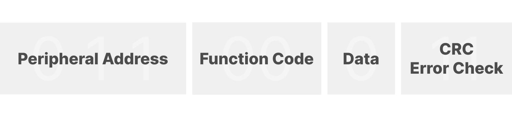

***Controller/peripheral is formerly known as master/slave. Arduino no longer supports the use of this terminology. Devices formerly known as master are referred to as controller and devices formerly known as slaves are referred to as peripheral.***

## What is Modbus?
Modbus is an open serial communication protocol used for transmitting information over serial lines between electronic devices. It was originally published by Modicon (now Schneider Electric) in 1979. The Modbus protocol is the oldest and by far the most popular automation protocol in the field of process automation. It enables devices, such as energy meters or humidity sensors connected to the same network to communicate the results to a supervisory computer or a Programmable Logic Computer (PLC). Several versions of the Modbus protocol exist for the serial port and Ethernet and the most common are Modbus RTU, Modbus ASCII, Modbus TPU and Modbus Plus. It is based on a controller peripheral (formerly known as master slave) architecture and communication between nodes is achieved with send request and read response type messages. Modbus communicates over several types of physical media such as RS-232 and over Ethernet. The original Modbus interface ran on RS-232 serial communication but most of the later Modbus implementations use RS-485 because it allows for longer distancer, higher speeds and the possibility of multiple devices on a single multi-drop network. The communication over serial RS-485 physical media works with two-wire transmit and receive connections. (SEE TWO WIRE TUTORIAL)

On simple interfaces like RS-485 and RS-232 the Modbus messages are sent in plain form over the network and the network will be dedicated to only Modbus communication. However, if your network requires multiple heterogeneous devices using a more versatile system like TCP/IP over ethernet is recommended. In this case Modbus and other types of mixed protocols can co-exist in the same physical interface at the same time. The main Modbus message structure is peer-to-peer, but it can also function on point to point and multidrop networks. As mentioned, the Modbus protocol communicates using a controller peripheral technique in which only one device can initiate transactions, called queries. 

## How does Modbus work?
Each Modbus message has the same structure, consisting of four basic elements which are present in each message and the sequence and order of these elements are the same for all messages. This allows for easy parsing of the content. The conversation is always started by the controller and when a message is sent the peripheral interprets the message and responds to it. Every peripheral device has its own address which it reponds to when addressed by the controller, while all other devices ignore the message if the address doesn't match with their own.

Modbus sends functions which communicate read and write instructions to the peripheral’s internal memory registers to configure, monitor and control the peripheral’s inputs and outputs. Modbus devices will typically include a register map outlining where the configuration input and output data can be written and read from. You should always refer to the peripheral’s register map of your device to gain a better understanding of its overall operation. 

The Modbus data model has a simple structure described in four basic data types:

| Data Type         | Description   | 
| -----------       | -----------   |
| Discrete Input    |               |
| Coils Input       |               |
| Input Registers   | (Input Data)  |
| Holding Registers | (Output Data) |


The Modbus memory registers of a device are organized around the four basic data reference types and this data type is further identified by the leading number used in the devices memory address, such as, 
- 0 based register referencing a message to Read or Write discrete outputs or coils, 
- 1 based register referencing Reading discrete inputs,
- 3 based register referencing Reading input registers,
- 4 based register referencing Reading or Writing to output or holding registers. 



The function code field specifies which register data group it reads or writes to and from the peripheral. Many of the data types are named from its use in driving relays, for example, a single-bit physical output is called a coil, and a single-bit physical input is called a discrete input or a contact. 
For example, the Read Holding Registers command has the function code with 1 byte containing 8 bits is binary 0000 0011. If the peripheral device accepts the request without error, it will return the same code in its response. However, if an error occurs, the peripheral will return 1 byte containing 8 binary bits 1000 0011 in the function code field and appends a unique code in the data field of the response message that tells the controller device what kind of error occurred, or the reason for the error.

## Use Modbus with Arduino
Now that you have learned about the basics and functionalities of Modbus it is time to talk about how you can use your Arduino to establish Modbus communication across devices. You can use your Arduino either as Controller or as peripheral device depending on the setup. To make your life easier you can use the ArduinoModbus library which allows you to implement the Modbus protocol over two different types of transport: serial communication over RS485 with RTU or Ethernet and WiFi communication using with TCP protocol. You can read more about the library here (LINK)!!!
Looking at the hardware side of things a lot of our boards are Modbus compatible especially if you consider Ethernet type messages but if you want to communicate via RS485 there is the MKR 485 Shield (LINK!!!) which can convert any MKR board into a Modbus compatible device. You can check out this tutorial (KARLS TUTORIAL) to learn about communication between two Arduinos using the Modbus protocol and RS485. 
When using the Modbus library sending messages is fairly straight forward as you can see in the request format function below.

| Device Address | Function Code | Starting Register |  Register Count | CRC Code |  
| ----------- | ----------- |----------- |----------- |----------- |
| 0x21      | INPUT REGISTERS       | 0x0011       | 2       |

### Example
```
(!ModbusRTUClient.requestFrom(0x21, INPUT_REGISTERS, 30017, 2))
```