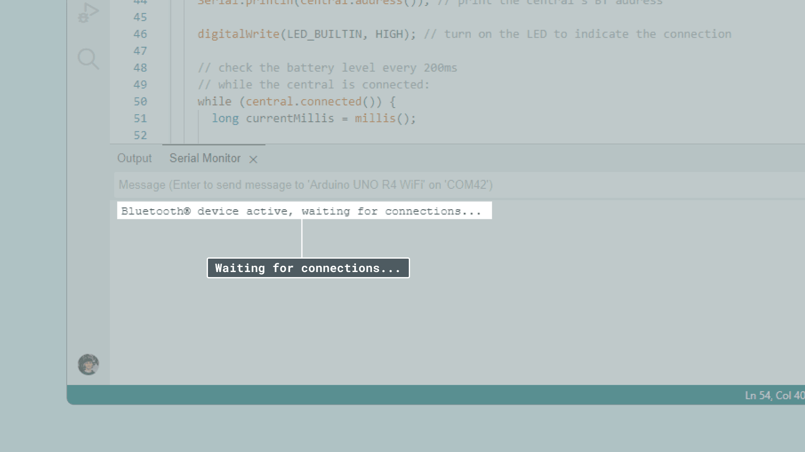

## Introduction

Bluetooth® is a wireless communication technology that enables data exchange between electronic devices over short distances. It emerged during the 90s as an alternative to data cables eliminating the need for a physical connection.

Today it’s often used when connecting a phone to a Bluetooth® speaker or transferring data between two devices. In those scenarios, Bluetooth is designed for relatively high data transfer rates and continuous communication. However, with the growing demand for energy-efficient wireless communication in applications such as fitness tracking, healthcare devices, and Internet of Things (IoT) devices, there was a need for a technology optimized for low power consumption.

This resulted in Bluetooth Low Energy (BLE) which emerged as part of the Bluetooth 4.0 specification, officially released in 2010. This marked the introduction of BLE as a separate and distinct technology within the broader Bluetooth ecosystem.

***Note: Bluetooth® Low Energy is not compatible with Bluetooth® classic***

This article focuses on BLE, how it works and how it can be used together with compatible Arduino boards.

### Harald Blåtand

Harald Blåtand was a 10th-century Danish king who ruled from approximately 958 to 986 AD and he originally inspired the name Bluetooth®. He is best known for his role in uniting various Danish tribes and for his conversion to Christianity, which had a significant impact on the history of Denmark. His nickname “Blåtand” (translated: Bluetooth) is believed to have been inspired by his dead or discoloured tooth, which may have appeared blue or black.

Similar to how Harald Blåtand united Denmark the Bluetooth protocol was meant to unite various devices and communication protocols.

## Technical Specifications

The following parts explore the core concepts and technical specifications of Bluetooth® LE.

### Frequency Bands and Range

Bluetooth® Low Energy (BLE) operates in the 2.4 GHz ISM (Industrial, Scientific, and Medical) band, which is commonly used for various wireless technologies. This frequency band is divided into multiple channels that BLE devices use for communication.

### Typical BLE Range

The range of a Bluetooth® LE connection can vary depending on several factors, but in typical scenarios, it can extend up to approximately 50 meters (or roughly 164 feet) in a line-of-sight environment. This range can be affected by several factors:

**Obstacles**: Physical obstacles such as walls, furniture, and other objects can significantly reduce the range of a BLE connection. Thick walls and materials like concrete can be particularly challenging for Bluetooth® LE signals to penetrate.

**Interference**: As mentioned earlier, the 2.4 GHz band is shared by various wireless devices. Interference from other devices operating in the same frequency range can impact the range and reliability of BLE connections.

**Antenna Design**: The design and quality of the antennas in both the central and peripheral devices can influence the range. Devices with well-designed antennas tend to have better coverage.

**Orientation**: The relative orientation of the central and peripheral devices also affects range. A clear line of sight between devices typically results in the best range, while obstructed lines of sight can reduce it.

### Central / Peripheral Devices

Bluetooth® Low Energy devices operate using different roles and modes that define how devices interact with eacher other.

**Central Device**: A central device in Bluetooth®  LE is typically a more capable device with features like a higher CPU power, more memory, or a larger battery. Central devices take on the role of initiating connections to peripheral devices. For example, your smartphone is often a central device when connecting to BLE peripherals like fitness trackers or smart sensors.

**Peripheral Device**: Peripheral devices are generally resource-constrained compared to central devices. They advertise their presence and data to central devices. Compared to Bluetooth® classic Bluetooth® LE devices don't maintain a continues connection to the central device to save power. Examples of peripheral devices include environmental sensors or health monitors.


### Advertising / Connection Mode

**Advertising Mode**: Advertising mode is primarily used to make a Bluetooth® LE peripheral device discoverable by other devices, particularly central devices. During advertising mode, the peripheral device periodically broadcasts advertising packets. These packets contain information about the peripheral's identity, services, and characteristics. Central devices continuously scan for these advertising packets to discover nearby peripherals. In advertising mode, the peripheral device is not actively connected to any central device. It remains in a low-power state while broadcasting advertising packets. It is "waiting" for a central device to establish a connection.

**Connection Mode**: Connection mode is activated once a central device successfully establishes a connection with a peripheral device. During this mode, devices can exchange data bi-directionally. Central devices can read data from and write data to the peripheral device. The connection mode is crucial for ongoing communication between BLE devices.


### Services and Characteristics

In Bluetooth® LE, services and characteristics are fundamental concepts that organize and describe the data exchanged between devices. Let's explore these concepts in detail:

**Defining Services:**

In Bluetooth® LE, a service can be thought of as a logical grouping of related data measurements or functionalities provided by a peripheral device. These data measurements can represent various aspects of the device's capabilities or the information it collects.

For example, consider a weather monitoring sensor. It might have a service called "Weather Data" that encompasses measurements like temperature, humidity, and wind speed. Another service, "Energy Information," could include data related to battery level and energy consumption.

**Introducing Characteristics**:
Within each service, we have characteristics. Characteristics are individual data points or attributes that provide specific information or measurements.

For instance, in the "Weather Data" service mentioned earlier, characteristics may include "Temperature," "Humidity," and "Wind Speed." These characteristics continuously record data and update as new measurements become available.

Similarly, the "Energy Information" service may consist of characteristics like "Battery Level" and "Energy Consumption."

**UUIDs (Unique Universal Identifier)**

To distinguish services and characteristics, Bluetooth® LE relies on a unique identifier called a UUID (Unique Universal Identifier).

A UUID is a 128-bit value that serves as a universally unique name for a service or characteristic. It acts like a label or identifier that central devices use to identify and communicate with specific services and characteristics.

UUIDs play a crucial role in Bluetooth® LE communication because they ensure that central devices can accurately locate and interact with the desired data points on peripheral devices. They eliminate ambiguity and allow for precise data retrieval and control.

In practical terms, understanding services and characteristics is essential when designing or interacting with BLE devices. Services provide a high-level organization of data, while characteristics represent the individual data points within those services. UUIDs act as the keys that enable central devices to access and utilize the data provided by peripheral devices.

As you explore Bluetooth® LE further, you'll encounter various predefined services and characteristics used in common applications. These standardized profiles simplify the development process, making it easier to create BLE-based projects and applications.

**Profiles**

Bluetooth® LE profiles are predefined sets of services and characteristics that standardize how BLE devices interact with each other. These profiles define the behavior and capabilities of BLE devices, making it easier for different devices to communicate seamlessly. Let's delve into Bluetooth® LE profiles:

**Defining BLE Profiles**:

Bluetooth® LE profiles serve as blueprints that specify how data should be organized and exchanged between devices in a standardized manner. They define the roles, services, and characteristics that devices can use to communicate effectively.

Each profile is tailored to a specific use case or application, ensuring that devices of different manufacturers can work together seamlessly when using the same profile.

**Common Standard Profiles**:

Bluetooth® LE includes a range of standard profiles that simplify the development of BLE applications. Some of the most well-known standard profiles include:

- Battery Service: The Battery Service provides information about the battery level of a device. It typically includes a Battery Level characteristic that central devices can read to monitor the battery status of a peripheral device, such as a wireless headset or smartwatch.

- Heart Rate Service: The Heart Rate Service is commonly used in fitness and health monitoring applications. It includes characteristics that provide real-time heart rate data, allowing central devices like smartphones or fitness trackers to monitor a user's heart rate during exercise.

- Generic Access Profile (GAP): While not a service in itself, GAP defines the roles and procedures for device discovery and connection establishment in BLE. It plays a vital role in enabling devices to find and connect to each other seamlessly.

***You can read more about Bluetooth® profiles [here](https://en.wikipedia.org/wiki/List_of_Bluetooth_profiles)***

**Creating Custom Profiles** :

In addition to standard profiles, developers have the flexibility to create custom profiles tailored to their specific application needs. These custom profiles define unique services and characteristics that match the requirements of a particular project.

By using Bluetooth® LE profiles, developers can leverage existing standardized profiles for common applications or create custom profiles for specialized projects. This standardized approach simplifies the development process, enhances interoperability, and allows for the creation of diverse BLE-based applications, from health monitoring to home automation.

As you explore Bluetooth® LE further, you'll discover a wide range of profiles designed to support various use cases. These profiles play a crucial role in ensuring that BLE devices can seamlessly communicate and provide valuable data to central devices.

## ArduinoBLE Library

The next part introduces how do establish a Bluetooth® LE connectionn, turn on the built in LED using your phone and read analog values via Bluetooth® LE. We will go through the following steps in order to create our sketch:

- Create a new service.
- Create an analog pin characteristic.
- Set the name for our device.
- Start advertising the device.
- Create a conditional that works only if an external device is connected (smartphone).
- Create a conditional that turns on an LED over Bluetooth®.
- Read an analog pin over Bluetooth®.

First, let's make sure we have the drivers for the board you are using installed. If we are using the Web Editor, we do not need to install anything. If we are using an offline editor, we need to install it manually. This can be done by navigating to **Tools > Board > Board Manager....**

Now, we need to install the library needed. If we are using the Web Editor, there is no need to install anything. If we are using an offline editor, simply go to **Tools > Manage libraries..**, and search for ArduinoBLE and install it.


___

>**NOTE:** This section is optional, you can find the complete code further down on this tutorial.

First, we need to include the **ArduinoBLE** library, and create a new service. We will name the service **"180A"** which is translated to **"Device Information"**.  We will then create two characteristics, one for the LED, and one for the analog pin. The name **"2A57"** is translated to **"Digital Output"** and **"2A58** is translated to **"Analog"**. 

```arduino
#include <ArduinoBLE.h
BLEService newService("180A"); // creating the service

BLEUnsignedCharCharacteristic randomReading("2A58", BLERead | BLENotify); // creating the Analog Value characteristic
BLEByteCharacteristic switchChar("2A57", BLERead | BLEWrite); // creating the LED characteristic

long previousMillis = 0;

```

In the `setup()`, we will start by initializing serial communication, define both the in-built LED and the LED we connected to pin 2, and initialize the **ArduinoBLE** library.

We then set the name for our device, using the command `BLE.setLocalName("Arduino Board");`, then add the characteristics we defined previously to the service created earlier, `newService`. After they have been added, we will also add the service, using the command `BLE.addService(newService);`.

The final steps we will take is to set the starting value of 0 for both characteristics. This is mostly important for the LED, since 0 means it will be OFF from the start.

The setup is finished by using the command `BLE.advertise();`, which makes it visible for other devices to connect to.

```arduino
void setup() {
  Serial.begin(9600);    // initialize serial communication
  while (!Serial);       //starts the program if we open the serial monitor.

  pinMode(LED_BUILTIN, OUTPUT); // initialize the built-in LED pin to indicate when a central is connected
  pinMode(ledPin, OUTPUT); // initialize the built-in LED pin to indicate when a central is connected

  //initialize ArduinoBLE library
  if (!BLE.begin()) {
    Serial.println("starting Bluetooth® Low Energy failed!");
    while (1);
  }

  BLE.setLocalName("Arduino Board"); //Setting a name that will appear when scanning for Bluetooth® devices
  BLE.setAdvertisedService(newService);

  newService.addCharacteristic(switchChar); //add characteristics to a service
  newService.addCharacteristic(randomReading);

  BLE.addService(newService);  // adding the service

  switchChar.writeValue(0); //set initial value for characteristics
  randomReading.writeValue(0);

  BLE.advertise(); //start advertising the service
  Serial.println(" Bluetooth® device active, waiting for connections...");
}
```

In the `loop()` we will use the command `BLEDevice central = BLE.central();` to start waiting for a connection. When a device connects, the address of the connecting device (the central) will be printed in the Serial Monitor, and the in-built LED will turn ON. 

After this, we use a `while` loop that only runs as long as a device is connected. Here, we do a reading of Analog pin 1, which will record random values between 0 and 1023. We then use a conditional to check if there's an incoming value: if any value other than 0 comes in, the LED turns ON, but if 0 comes in, it turns it OFF.

If our device (smartphone) disconnects, we exit the `while` loop. Once it exits, it prints the message **"Disconnected from central"** in the Serial Monitor. 

```cpp
void loop() {
  
  BLEDevice central = BLE.central(); // wait for a Bluetooth® Low Energy central

  if (central) {  // if a central is connected to the peripheral
    Serial.print("Connected to central: ");
    
    Serial.println(central.address()); // print the central's BT address
    
    digitalWrite(LED_BUILTIN, HIGH); // turn on the LED to indicate the connection


    
    while (central.connected()) { // while the central is connected:
      long currentMillis = millis();
      
      if (currentMillis - previousMillis >= 200) { 
        previousMillis = currentMillis;

        int randomValue = analogRead(A1);
        randomReading.writeValue(randomValue);

        if (switchChar.written()) {
          if (switchChar.value()) {   // any value other than 0
            Serial.println("LED on");
            digitalWrite(ledPin, HIGH);         // will turn the LED on
          } else {                              // a 0 value
            Serial.println(F("LED off"));
            digitalWrite(ledPin, LOW);          // will turn the LED off
          }
        }

      }
    }
    
    digitalWrite(LED_BUILTIN, LOW); // when the central disconnects, turn off the LED
    Serial.print("Disconnected from central: ");
    Serial.println(central.address());
  }
}
```


## Complete Code

If you choose to skip the code building section, the complete code can be found below:

```arduino
#include <ArduinoBLE.h>
BLEService newService("180A"); // creating the service

BLEUnsignedCharCharacteristic randomReading("2A58", BLERead | BLENotify); // creating the Analog Value characteristic
BLEByteCharacteristic switchChar("2A57", BLERead | BLEWrite); // creating the LED characteristic

long previousMillis = 0;


void setup() {
  Serial.begin(9600);    // initialize serial communication
  while (!Serial);       //starts the program if we open the serial monitor.

  pinMode(LED_BUILTIN, OUTPUT); // initialize the built-in LED pin to indicate when a central is connected

  //initialize ArduinoBLE library
  if (!BLE.begin()) {
    Serial.println("starting Bluetooth® Low Energy failed!");
    while (1);
  }

  BLE.setLocalName("Arduino Board"); //Setting a name that will appear when scanning for Bluetooth® devices
  BLE.setAdvertisedService(newService);

  newService.addCharacteristic(switchChar); //add characteristics to a service
  newService.addCharacteristic(randomReading);

  BLE.addService(newService);  // adding the service

  switchChar.writeValue(0); //set initial value for characteristics
  randomReading.writeValue(0);

  BLE.advertise(); //start advertising the service
  Serial.println(" Bluetooth® device active, waiting for connections...");
}

void loop() {
  
  BLEDevice central = BLE.central(); // wait for a Bluetooth® Low Energy central

  if (central) {  // if a central is connected to the peripheral
    Serial.print("Connected to central: ");
    
    Serial.println(central.address()); // print the central's BT address
    
    digitalWrite(LED_BUILTIN, HIGH); // turn on the LED to indicate the connection

    // check the battery level every 200ms
    // while the central is connected:
    while (central.connected()) {
      long currentMillis = millis();
      
      if (currentMillis - previousMillis >= 200) { // if 200ms have passed, we check the battery level
        previousMillis = currentMillis;

        int randomValue = analogRead(A1);
        randomReading.writeValue(randomValue);

        if (switchChar.written()) {
          if (switchChar.value()) {   // any value other than 0
            Serial.println("LED on");
            digitalWrite(LED_BUILTIN, HIGH);         // will turn the LED on
          } else {                              // a 0 value
            Serial.println(F("LED off"));
            digitalWrite(LED_BUILTIN, LOW);          // will turn the LED off
          }
        }

      }
    }
    
    digitalWrite(LED_BUILTIN, LOW); // when the central disconnects, turn off the LED
    Serial.print("Disconnected from central: ");
    Serial.println(central.address());
  }
}
```

## Testing It Out

Once we are finished with the coding, we can upload the sketch to the board. When it has been successfully uploaded, open the Serial Monitor. In the Serial Monitor, the text **" Bluetooth® device active, waiting for connections..."** will appear. 



We can now discover our MKR WiFi 1010 board in the list of available Bluetooth® devices. To access the service and characteristic we recommend using the **LightBlue** application. Follow <a href="https://apps.apple.com/us/app/lightblue/id557428110">this link for iPhones</a> or <a href="https://play.google.com/store/apps/details?id=com.punchthrough.lightblueexplorer&hl=en">this link for Android phones</a>. 

Once we have the application open, follow the image below for instructions:


To control the LED, we simply need to write any value other than 0 to turn it on, and 0 to turn it off. This is within the **"Digital Output"** characteristic, which is located under **"Device Information"**. We can also go into the **"Analog"** characteristic, where we need to change the data format to **"Unsigned Little-Endian"**, and click the **"Read Again"** button. Once we click the button, we will retrieve the latest value. 


### Troubleshoot

If the code is not working, there are some common issues we can troubleshoot:

- We haven't updated the latest firmware for the board.
- We haven't installed the core required for the board.
- We haven't installed the ArduinoBLE library.
- We haven't opened the Serial Monitor to initialize the program.
- The device you are using to connect has its Bluetooth® turned off.

## Conclusion
In this tutorial we have created a basic Bluetooth® LE peripheral device. We learned how to create services and characteristics, and how to use UUIDs from the official Bluetooth® documentation. In this tutorial, we did two practical things: turning an LED, ON and OFF, and reading a value from an analog pin. You can now start experimenting with this code, and create your own amazing Bluetooth® applications! 
