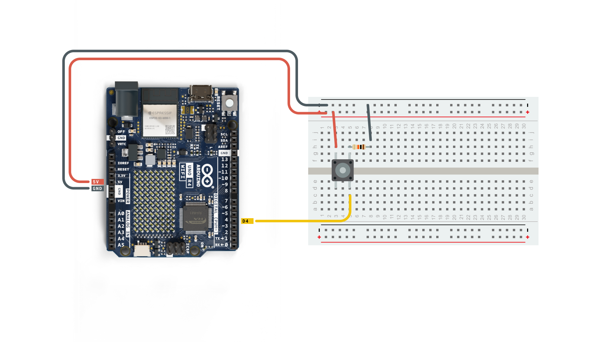
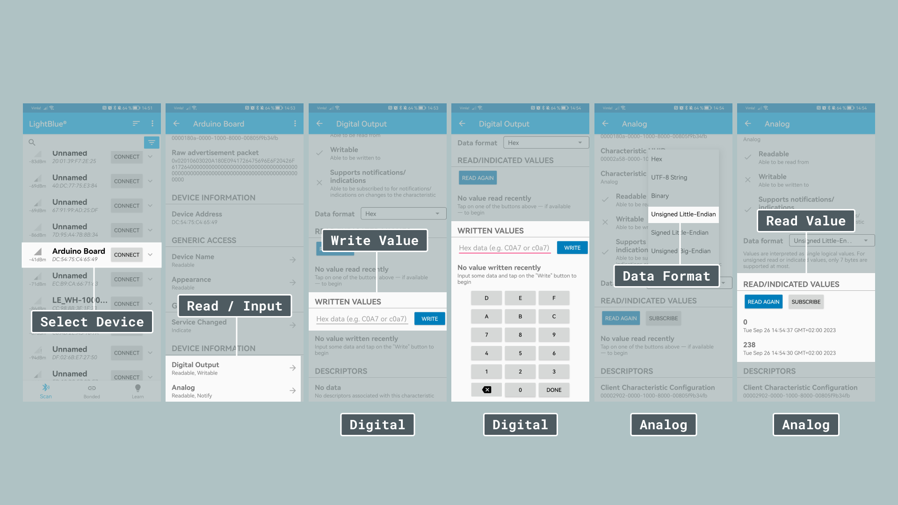

## Introduction

Bluetooth® Low Energy®, often referred to as Bluetooth® LE, is a wireless communication technology designed for short-range data exchange between electronic devices. It emerged as a response to the need for energy-efficient wireless communication in various applications, especially those where power consumption is a critical concern.

Unlike its predecessor, Bluetooth® Classic, which is optimized for continuous and relatively high-data-rate communication, Bluetooth® LE focuses on minimizing energy consumption while maintaining connectivity. This makes Bluetooth® LE particularly suitable for applications that require long battery life, such as fitness trackers, healthcare devices, smart sensors, and Internet of Things (IoT) devices.

The aim of this article is to highlight the basic concepts of Bluetooth® Low Energy and explain how to use the ArduinoBLE library to create Bluetooth® LE projects with compatible Arduino boards.

## Bluetooth® Supported Boards

Below is a list of all supported Bluetooth® boards:

- [MKR WiFi 1010](https://store.arduino.cc/products/arduino-mkr-wifi-1010)
- [UNO R4 WiFi](https://store.arduino.cc/products/uno-r4-wifi)
- [Nano 33 BLE](https://store.arduino.cc/products/arduino-nano-33-ble)
- [Nano 33 BLE Sense](https://store.arduino.cc/products/arduino-nano-33-ble-sense)
- [Nano 33 BLE Sense Rev2](https://store.arduino.cc/products/nano-33-ble-sense-rev2)
- [Nano 33 IoT](https://store.arduino.cc/products/arduino-nano-33-iot)
- [Nano ESP32](https://store.arduino.cc/products/nano-esp32)
- [Nano RP2040 Connect](https://store.arduino.cc/products/arduino-nano-rp2040-connect)
- [Portenta H7](https://store.arduino.cc/products/portenta-h7)
- [Portenta H7 Lite Connected](https://store.arduino.cc/products/portenta-h7-lite-connected)
- [Portenta Machine Control](https://store.arduino.cc/products/arduino-portenta-machine-control)
- [Nicla Voice](https://store.arduino.cc/products/nicla-voice)
- [Opta WiFi](https://store.arduino.cc/collections/opta-family/products/opta-wifi)
- [GIGA R1 WiFi](https://store.arduino.cc/products/giga-r1-wifi)

## Overview

The following section provides an overview of the article. If you want to skip to one particular section simply click the respective link.

- [Frequency](#frequency-bands-and-range) - What frequency does Bluetooth® LE operate on?
- [Range](#range) - How far does Bluetooth® LE's signal reach?
- [Central / Peripheral Devices](#central--peripheral-devices) - How do you set up your device?
- [Advertising / Connection Mode](#advertising--connection-mode) - What different modes are there?
- [Services and Characteristics](#services-and-characteristics) - How do you advertise information?
- [Bluetooth® Classic](#bluetooth-classic) - How does Bluetooth® LE compare to Bluetooth® Classic?
- [ArduinoBLE Library](#arduinoble-library) - Get quick overview of the ArduinoBLE library
- [Examples](#examples) - Try different examples using the ArduinoBLE library

***To follow along this article you need a compatible board and the [ArduinoBLE library](https://www.arduino.cc/reference/en/libraries/arduinoble/)***

### Harald Blåtand (Bluetooth)

Harald Blåtand was a 10th-century Danish king who ruled from approximately 958 to 986 AD and he originally inspired the name Bluetooth®. He is best known for his role in uniting various Danish tribes and for his conversion to Christianity, which had a significant impact on the history of Denmark. His nickname “Blåtand” (translated: Bluetooth®) is believed to have been inspired by his dead or discolored tooth, which may have appeared blue or black.

Similar to how Harald Blåtand united Denmark the Bluetooth® protocol was meant to unite various devices and communication protocols.

## Technical Specifications

The following parts explore the core concepts and technical specifications of Bluetooth® Low Energy.

### Frequency Bands and Range

Bluetooth® Low Energy operates in the 2.4 GHz ISM (Industrial, Scientific, and Medical) band, which is commonly used for various wireless technologies. This frequency band is divided into multiple channels that Bluetooth® devices use for communication.

### Range

The range of a Bluetooth® Low Energy connection can vary depending on several factors, but in typical scenarios, it can extend up to approximately 50 meters (or roughly 164 feet) in a line-of-sight environment. This range can be affected by several factors:

**Obstacles**: Physical obstacles such as walls, furniture, and other objects can significantly reduce the range of a Bluetooth® LE connection. Thick walls and materials like concrete can be particularly challenging for Bluetooth® LE signals to penetrate.

**Interference**: As mentioned earlier, the 2.4 GHz band is shared by various wireless devices. Interference from other devices operating in the same frequency range can impact the range and reliability of Bluetooth® LE connections.

**Antenna Design**: The design and quality of the antennas in both the central and peripheral devices can influence the range. Devices with well-designed antennas tend to have better coverage.

**Orientation**: The relative orientation of the central and peripheral devices also affects range. A clear line of sight between devices typically results in the best range, while obstructed lines of sight can reduce it.

### Central / Peripheral Devices

Bluetooth® Low Energy devices operate using different roles and modes that define how devices interact with each other.

**Central Device**: A central device in Bluetooth® LE is typically a more capable device with features like a higher CPU power, more memory, or a larger battery. Central devices take on the role of initiating connections to peripheral devices. For example, your smartphone is often a central device when connecting to Bluetooth® LE peripherals like fitness trackers, smart sensors or an Arduino board.

**Peripheral Device**: Peripheral devices are generally resource-constrained compared to central devices (e.g. an Arduino board compared with your smartphone). Peripheral devices advertise their presence and data to central devices. Compared to Bluetooth® classic, Bluetooth® LE devices don't maintain a continuous connection to the central device to save power.


### Advertising / Connection Mode

**Advertising Mode**: Advertising mode is primarily used to make a Bluetooth® LE peripheral device discoverable by other devices, particularly central devices. During advertising mode, the peripheral device periodically broadcasts advertising packets. These packets contain information about the peripheral's identity, services, and characteristics. Central devices continuously scan for these advertising packets to discover nearby peripherals. In advertising mode, the peripheral device is not actively connected to any central device. It remains in a low-power state while broadcasting advertising packets. It is "waiting" for a central device to establish a connection.

**Connection Mode**: Connection mode is activated once a central device successfully establishes a connection with a peripheral device. During this mode, devices can exchange data bi-directionally. Central devices can read data from and write data to the peripheral device. The connection mode is crucial for ongoing communication between Bluetooth® LE devices.


### Services and Characteristics

In Bluetooth® LE, services and characteristics are fundamental concepts that organize and describe the data exchanged between devices. Let's explore these concepts in detail:

**Services** 

In Bluetooth® LE, a service can be thought of as a logical grouping of related data measurements or functionalities provided by a peripheral device. These data measurements can represent various aspects of the device's capabilities or the information it collects.

For example, consider a weather monitoring sensor. It might have a service called "Weather Data" that encompasses measurements like temperature, humidity, and wind speed. Another service, "Energy Information," could include data related to battery level and energy consumption.

**Characteristics**

Within each service, we have characteristics. Characteristics are individual data points or attributes that provide specific information or measurements.

For instance, in the "Weather Data" service mentioned earlier, characteristics may include "Temperature," "Humidity," and "Wind Speed." These characteristics continuously record data and update as new measurements become available.

Similarly, the "Energy Information" service may consist of characteristics like "Battery Level" and "Energy Consumption."

**Unique Universal Identifier(UUIDs)**:

To distinguish services and characteristics, Bluetooth® LE relies on a unique identifier called a UUID (Unique Universal Identifier).

A UUID is a 128-bit value that serves as a universally unique name for a service or characteristic. It acts like a label or identifier that central devices use to identify and communicate with specific services and characteristics.

UUIDs play a crucial role in Bluetooth® LE communication because they ensure that central devices can accurately locate and interact with the desired data points on peripheral devices. They eliminate ambiguity and allow for precise data retrieval and control.

In practical terms, understanding services and characteristics is essential when designing or interacting with Bluetooth® LE devices. Services provide a high-level organization of data, while characteristics represent the individual data points within those services. UUIDs act as the keys that enable central devices to access and utilize the data provided by peripheral devices.

As you explore Bluetooth® LE further, you'll encounter various predefined services and characteristics used in common applications. These standardized profiles simplify the development process, making it easier to create Bluetooth® LE-based projects and applications.

**Profiles**

Bluetooth® LE profiles are predefined sets of services and characteristics that standardize how Bluetooth® LE devices interact with each other. These profiles define the behavior and capabilities of Bluetooth® LE devices, making it easier for different devices to communicate seamlessly. Let's delve into Bluetooth® LE profiles:

**Defining Bluetooth® LE Profiles**

Bluetooth® LE profiles serve as blueprints that specify how data should be organized and exchanged between devices in a standardized manner. They define the roles, services, and characteristics that devices can use to communicate effectively.

Each profile is tailored to a specific use case or application, ensuring that devices of different manufacturers can work together seamlessly when using the same profile.

**Common Standard Profiles**

Bluetooth® LE includes a range of standard profiles that simplify the development of Bluetooth® LE applications. Some of the most well-known standard profiles include:

- Battery Service: The Battery Service provides information about the battery level of a device. It typically includes a Battery Level characteristic that central devices can read to monitor the battery status of a peripheral device, such as a wireless headset or smartwatch.

- Heart Rate Service: The Heart Rate Service is commonly used in fitness and health monitoring applications. It includes characteristics that provide real-time heart rate data, allowing central devices like smartphones or fitness trackers to monitor a user's heart rate during exercise.

- Generic Access Profile (GAP): While not a service in itself, GAP defines the roles and procedures for device discovery and connection establishment in Bluetooth® LE. It plays a vital role in enabling devices to find and connect to each other seamlessly.

***You can read more about Bluetooth® profiles [here](https://en.wikipedia.org/wiki/List_of_Bluetooth_profiles).***

**Creating Custom Profiles**

In addition to standard profiles, developers have the flexibility to create custom profiles tailored to their specific application needs. These custom profiles define unique services and characteristics that match the requirements of a particular project.

Using Bluetooth® LE profiles, developers can leverage standardized profiles for common applications or create custom profiles for specialized projects. This standardized approach simplifies the development process, enhances interoperability, and allows for the creation of diverse Bluetooth® LE-based applications, from health monitoring to home automation.

As you explore Bluetooth® LE further, you'll discover a wide range of profiles designed to support various use cases. These profiles play a crucial role in ensuring that Bluetooth® LE devices can seamlessly communicate and provide valuable data to central devices.

### Bluetooth® Classic

Bluetooth® Low Energy is distinctly different from Bluetooth® Classic. Bluetooth® Classic operates in a manner similar to a serial port or UART (Universal Asynchronous Receiver-Transmitter), which is commonly used for point-to-point communication.

Some key differences are:

**Power Consumption**

-	Bluetooth® Classic: is designed for continuous, relatively high-data-rate communication. As a result, it consumes more power, making it less suitable for battery-operated devices with limited power sources.

-	Bluetooth® Low Energy: is optimized for energy efficiency. It is specifically designed for applications where power consumption is a critical consideration, such as fitness trackers, IoT sensors, and wearable devices. Bluetooth® LE devices can operate for extended periods on small batteries or even energy harvesting solutions.

**Data Transfer Rates**

-	Bluetooth® Classic: offers higher data transfer rates suitable for tasks like streaming audio or transferring files between devices.

-	Bluetooth® Low Energy: sacrifices data transfer speed in favor of energy efficiency. It's ideal for applications that require intermittent or small bursts of data, such as sending sensor readings or control commands.

**Connection Types**

-	Bluetooth® Classic: establishes a continuous and relatively power-hungry connection, making it suitable for applications requiring real-time, continuous communication.

-	Bluetooth® Low Energy: supports two primary modes - advertising and connection. In advertising mode, a Bluetooth® LE peripheral periodically broadcasts its presence but doesn't maintain a continuous connection, conserving power. When needed, a central device can establish a connection for data exchange.

## ArduinoBLE Library

The [ArduinoBLE Library](https://www.arduino.cc/reference/en/libraries/arduinoble/) is the main library enabling Bluetooth® Low Energy on compatible Arduino boards. You must first download and install the ArduinoBLE library. See our [instructions](https://docs.arduino.cc/software/ide-v2/tutorials/ide-v2-installing-a-library) on how to install a library. 

In the following section you will find an overview and explanation of the library's most important methods and how to use them:

- `BLE.begin()` - Initialize the library

### Central Device

- `BLE.scan()` - Scan for peripherals

- `BLE.available()` - Check for available peripherals

- `BLE.scanForUuid("UUID")` - Start scanning for peripherals with specific UUID

- `bleDevice.address()` - Check the peripheral's address

- `bleDevice.localName()` - Check the peripheral's name

- `bleDevice.advertisedServiceUuid()` - Check the peripheral's advertised service

- `bleDevice.connect()` - Connect to a Bluetooth® Low Energy device.

- `BLE.connected()` - Check if connection was successful

- `bleDevice.discoverAttributes()` - Discover a peripheral's attributes

- `BLE.stopScan()` - Stop scanning

- `BLE.disconnect()` - Disconnect from a peripheral

### Peripheral

- `BLE.setLocalName(name)` - Give your device a name

- `BLEService newService(service)` - Create a service object

> Read more about standard services in the [Assigned Numbers document](https://www.bluetooth.com/specifications/assigned-numbers/).

- `BLEUnsignedCharCharacteristic customCharacteristic("UUID_here", Properties_here);` - Create characteristic object

- `BLE.setAdvertisedService(bleService)` - Set the advertised service

- `bleService.addCharacteristic(bleCharacteristic)` - Add characteristics to the service

- `bleCharacteristic.writeValue()` - Write the value of the characteristic

- `BLE.advertise()` - Start advertising

***These are just a few of the most important methods. You can find more information about all methods and their details in the [ArduinoBLE reference](https://www.arduino.cc/reference/en/libraries/arduinoble/).***

## Examples

Below you can find examples showing how to send data between two Arduino boards and how to connect to your Arduino board, reading and writing values using your smartphone.

### Remote LED Control

This example can be used with two Bluetooth® LE supported Arduino boards, one with a button, and the other with an LED. When the button is pressed, it will advertise a corresponding value (high/low), which will be received by the board with an LED.

#### Central

This example scans for Bluetooth® Low Energy peripherals with a specific UUID (in this case another Arduino board), connects to it, and lets you control the built-in LED with a button connected to pin 4.

- The circuit below uses an [Arduino UNO R4 WiFi](). You can use any of the Bluetooth® compatible boards from [this list]().



Then upload the code found below:

```arduino
#include <ArduinoBLE.h>

// variables for button
const int buttonPin = 4;
int oldButtonState = LOW;

void setup() {
  Serial.begin(9600);
  while (!Serial);

  // configure the button pin as input
  pinMode(buttonPin, INPUT);

  // initialize the Bluetooth® Low Energy hardware
  BLE.begin();

  Serial.println("Bluetooth® Low Energy Central - LED control");

  // start scanning for peripherals
  BLE.scanForUuid("19b10000-e8f2-537e-4f6c-d104768a1214");
}

void loop() {
  // check if a peripheral has been discovered
  BLEDevice peripheral = BLE.available();

  if (peripheral) {
    // discovered a peripheral, print out address, local name, and advertised service
    Serial.print("Found ");
    Serial.print(peripheral.address());
    Serial.print(" '");
    Serial.print(peripheral.localName());
    Serial.print("' ");
    Serial.print(peripheral.advertisedServiceUuid());
    Serial.println();

    if (peripheral.localName() != "LED") {
      return;
    }

    // stop scanning
    BLE.stopScan();

    controlLed(peripheral);

    // peripheral disconnected, start scanning again
    BLE.scanForUuid("19b10000-e8f2-537e-4f6c-d104768a1214");
  }
}

void controlLed(BLEDevice peripheral) {
  // connect to the peripheral
  Serial.println("Connecting ...");

  if (peripheral.connect()) {
    Serial.println("Connected");
  } else {
    Serial.println("Failed to connect!");
    return;
  }

  // discover peripheral attributes
  Serial.println("Discovering attributes ...");
  if (peripheral.discoverAttributes()) {
    Serial.println("Attributes discovered");
  } else {
    Serial.println("Attribute discovery failed!");
    peripheral.disconnect();
    return;
  }

  // retrieve the LED characteristic
  BLECharacteristic ledCharacteristic = peripheral.characteristic("19b10001-e8f2-537e-4f6c-d104768a1214");

  if (!ledCharacteristic) {
    Serial.println("Peripheral does not have LED characteristic!");
    peripheral.disconnect();
    return;
  } else if (!ledCharacteristic.canWrite()) {
    Serial.println("Peripheral does not have a writable LED characteristic!");
    peripheral.disconnect();
    return;
  }

  while (peripheral.connected()) {
    // while the peripheral is connected

    // read the button pin
    int buttonState = digitalRead(buttonPin);

    if (oldButtonState != buttonState) {
      // button changed
      oldButtonState = buttonState;

      if (buttonState) {
        Serial.println("button pressed");

        // button is pressed, write 0x01 to turn the LED on
        ledCharacteristic.writeValue((byte)0x01);
      } else {
        Serial.println("button released");

        // button is released, write 0x00 to turn the LED off
        ledCharacteristic.writeValue((byte)0x00);
      }
    }
  }

  Serial.println("Peripheral disconnected");
}
```

#### Peripheral

This example is the corresponding sketch to the one above, setting up your Arduino board as peripheral with the correct UUID, advertising a built-in LED characteristic. Since we are only using the built-in LED you don't need to wire any components.

- `LED_BUILTIN` works on all Arduino boards.

```arduino
#include <ArduinoBLE.h>

BLEService ledService("19B10000-E8F2-537E-4F6C-D104768A1214"); // Bluetooth® Low Energy LED Service

// Bluetooth® Low Energy LED Switch Characteristic - custom 128-bit UUID, read and writable by central
BLEByteCharacteristic switchCharacteristic("19B10001-E8F2-537E-4F6C-D104768A1214", BLERead | BLEWrite);

const int ledPin = LED_BUILTIN; // pin to use for the LED

void setup() {
  Serial.begin(9600);
  while (!Serial);

  // set LED pin to output mode
  pinMode(ledPin, OUTPUT);

  // begin initialization
  if (!BLE.begin()) {
    Serial.println("starting Bluetooth® Low Energy module failed!");

    while (1);
  }

  // set advertised local name and service UUID:
  BLE.setLocalName("LED");
  BLE.setAdvertisedService(ledService);

  // add the characteristic to the service
  ledService.addCharacteristic(switchCharacteristic);

  // add service
  BLE.addService(ledService);

  // set the initial value for the characeristic:
  switchCharacteristic.writeValue(0);

  // start advertising
  BLE.advertise();

  Serial.println("BLE LED Peripheral");
}

void loop() {
  // listen for Bluetooth® Low Energy peripherals to connect:
  BLEDevice central = BLE.central();

  // if a central is connected to peripheral:
  if (central) {
    Serial.print("Connected to central: ");
    // print the central's MAC address:
    Serial.println(central.address());

    // while the central is still connected to peripheral:
    while (central.connected()) {
      // if the remote device wrote to the characteristic,
      // use the value to control the LED:
      if (switchCharacteristic.written()) {
        if (switchCharacteristic.value()) {   // any value other than 0
          Serial.println("LED on");
          digitalWrite(ledPin, HIGH);         // will turn the LED on
        } else {                              // a 0 value
          Serial.println(F("LED off"));
          digitalWrite(ledPin, LOW);          // will turn the LED off
        }
      }
    }

    // when the central disconnects, print it out:
    Serial.print(F("Disconnected from central: "));
    Serial.println(central.address());
  }
}
```

### Control an Arduino with a Smartphone App

This example lets you control the built-in LED on your Arduino board with your smartphone. We recommend using the LightBlue app available for [Android](https://play.google.com/store/apps/details?id=com.punchthrough.lightblueexplorer&hl=en&pli=1) and [iOS ](https://apps.apple.com/us/app/lightblue/id557428110) for connecting to your board. Once installed upload the code and follow the steps as shown in the image below.

**Step 1 - Upload Code**
```arduino
#include <ArduinoBLE.h>
BLEService newService("180A"); // creating the service

BLEUnsignedCharCharacteristic randomReading("2A58", BLERead | BLENotify); // creating the Analog Value characteristic
BLEByteCharacteristic switchChar("2A57", BLERead | BLEWrite); // creating the LED characteristic

const int ledPin = 2;
long previousMillis = 0;


void setup() {
  Serial.begin(9600);    // initialize serial communication
  while (!Serial);       //starts the program if we open the serial monitor.

  pinMode(LED_BUILTIN, OUTPUT); // initialize the built-in LED pin to indicate when a central is connected
  pinMode(ledPin, OUTPUT); // initialize the built-in LED pin to indicate when a central is connected

  //initialize ArduinoBLE library
  if (!BLE.begin()) {
    Serial.println("starting Bluetooth® Low Energy failed!");
    while (1);
  }

  BLE.setLocalName("<My Board Name>"); //Setting a name that will appear when scanning for Bluetooth® devices
  BLE.setAdvertisedService(newService);

  newService.addCharacteristic(switchChar); //add characteristics to a service
  newService.addCharacteristic(randomReading);

  BLE.addService(newService);  // adding the service

  switchChar.writeValue(0); //set initial value for characteristics
  randomReading.writeValue(0);

  BLE.advertise(); //start advertising the service
  Serial.println(" Bluetooth® device active, waiting for connections...");
}

void loop() {
  
  BLEDevice central = BLE.central(); // wait for a Bluetooth® Low Energy central

  if (central) {  // if a central is connected to the peripheral
    Serial.print("Connected to central: ");
    
    Serial.println(central.address()); // print the central's BT address
    
    digitalWrite(LED_BUILTIN, HIGH); // turn on the LED to indicate the connection

    // check the battery level every 200ms
    // while the central is connected:
    while (central.connected()) {
      long currentMillis = millis();
      
      if (currentMillis - previousMillis >= 200) { // if 200ms have passed, we check the battery level
        previousMillis = currentMillis;

        int randomValue = analogRead(A1);
        randomReading.writeValue(randomValue);

        if (switchChar.written()) {
          if (switchChar.value()) {   // any value other than 0
            Serial.println("LED on");
            digitalWrite(ledPin, HIGH);         // will turn the LED on
          } else {                              // a 0 value
            Serial.println(F("LED off"));
            digitalWrite(ledPin, LOW);          // will turn the LED off
          }
        }

      }
    }
    
    digitalWrite(LED_BUILTIN, LOW); // when the central disconnects, turn off the LED
    Serial.print("Disconnected from central: ");
    Serial.println(central.address());
  }
}
```

**Step 2 - Run LightBlue App**


## Summary

In this article we explored the basics of Bluetooth® Low Energy and how to set it up on your Arduino board using the ArduinoBLE library. We highlighted the differences between Bluetooth® LE and Bluetooth® Classic and finally we provided examples showcasing how you can send data between two Arduino boards or how to use your smartphone to connect to your Arduino board.