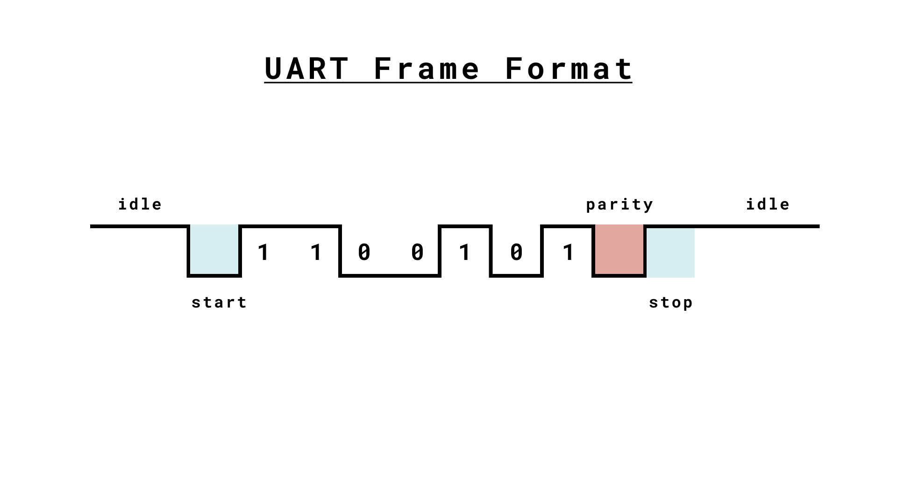
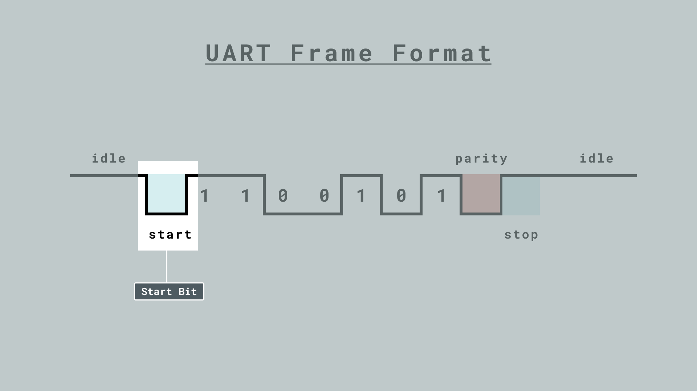
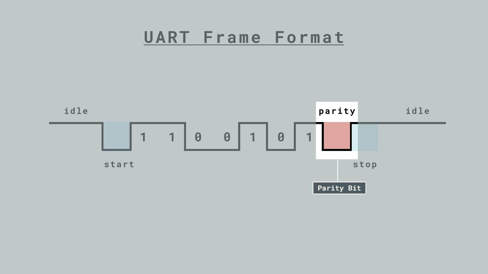

## Introduction

This article dives into the basics of Universal Asynchronous Receiver-Transmitter (UART), a serial communication protocol that can be used to send data between two Arduino boards using only two wires.

UART is one of the most used device-to-device (serial) communication protocols. It’s the protocol used by Arduino boards to communicate with the computer. It allows an asynchronous serial communication in which the data format and transmission speed are configurable. It's among the earliest serial protocols and even though it has in many places been replaced by [SPI](/learn/communication/spi) and [I2C](/learn/communication/wire) it's still widely used for lower-speed and lower-throughput applications because it is very simple, low-cost and easy to implement.

When sending UART messages between two Arduino boards we use `Serial1`. That is because `Serial` is used to communicate between the Arduino and the computer to, e.g. display messages inside the serial monitor.

***If you want to jump straight to the examples click [here](#examples) or go to the end of this article.***

## Overview

- [How UART Works](#how-uart-works)
- [Timing and Synchronization](#timing-and-synchronization)
- [UART Messages](#uart-messages)
- [Examples](#examples)

## Technical Specifications

### How UART Works

UART operates by transmitting data as a series of bits, including a start bit, data bits, an optional parity bit, and stop bit(s). Unlike parallel communication, where multiple bits are transmitted simultaneously, UART sends data serially, one bit at a time. As the name reveals the protocol operates asynchronous which means that it doesn't rely on a shared clock signal. Instead, it uses predefined baud rates to determine the timing of data bits.


As seen in the image above when using parallel communication an 8-bit message would require eight cables while serial communication only requires one cable for sending messages and one for receiving.

***Consider that you need to connect a common ground between the devices to define the high and low signals for UART communication. Without a common ground, devices may not be able to correctly interpret transmitted data.***

**Components**

The key components of UART include the transmitter, receiver, and baud rate. The transmitter collects data from a source, formats it into serial bits, and sends it via a TX (Transmit) pin. The receiver receives it via a RX (Receive) pin, processes incoming serial data and converts it into parallel data for the host system. The baud rate determines the speed of data transmission.

### Timing and synchronization

Timing and synchronization are crucial aspects of UART communication. Unlike synchronous serial communication protocols such as SPI and I2C, UART operates operates asynchronously, meaning it doesn't rely on a shared clock signal to coordinate data transmission. Instead, it uses predefined baud rates to determine the timing of data bits.

**Baud Rate**

The baud rate is a fundamental parameter in UART communication. It defines the speed at which data is transmitted over the communication channel. The baud rate is specified in bits per second (bps) and represents the number of bits transmitted in one second. In UART, both the transmitting and receiving devices must agree on the same baud rate to ensure successful communication.

The significance of the baud rate lies in its direct influence on the data transfer speed. A higher baud rate allows for faster data transmission, but it also demands a more precise timing synchronization between the sender and receiver. On the other hand, a lower baud rate may be suitable for applications where timing accuracy is less critical, but it results in slower data transfer. When programming your Arduino common baud rates are `9600`, `115200`, `4800`, and `57600`. In your code, you set the baud rate like so:

```arduino
Serial.begin(9600);
```

**Flow Control in UART**

UART Flow Control is a method for slow and fast devices to communicate with each other over UART without the risk of losing data.
Consider the case where two units are communicating over UART. A transmitter T is sending a long stream of bytes to a receiver R. R
is a slower device than T, and R cannot keep up. It needs to either do some processing on the data or empty some
buffers before it can keep receiving data.

R needs to tell T to stop transmitting for a while. This is where flow control comes in. Flow control provides extra signaling to inform the
transmitter that it should stop (pause) or start (resume) the transmission.

Several forms of flow control exist. For example, hardware flow control uses extra wires, where the logic level on these wires define
whether the transmitter should keep sending data or stop. With software flow control, special characters are sent over the normal data
lines to start or stop the transmission.

You can read more about UART flow control [here](https://www.silabs.com/documents/public/application-notes/an0059.0-uart-flow-control.pdf).

### UART Messages

In UART communication, each data frame is encapsulated by start and stop bits. These bits serve a vital role in establishing the boundaries of data transmission and ensuring synchronization between the sender and receiver.

**Frame Format**



**Start Bit**

A single start bit is transmitted at the beginning of each UART frame. The primary purpose of the start bit is to indicate the start of the data transmission and prepare the receiver for data reception.

The start bit is always logic low (0) for UART communication. This means that the start bit is transmitted as a voltage level that is lower than the logic high threshold, typically at the receiver's end.

When the receiver detects a start bit, it knows that a new data frame is beginning, and it prepares to receive the incoming bits.



**Data Bits**

Data bits are a fundamental component of UART communication as they carry the actual information to be transmitted. The number of data bits in a UART frame can vary, but a common and widely used configuration is 8 bits. However, UART supports various character sizes, including 7-bit and 6-bit configurations, depending on the specific application requirements.


**Character Size**

The character size in UART communication is defined by the number of data bits within a frame. It's essential to choose the appropriate character size to match the requirements of the data being transmitted. Here are some common character size configurations:

8-Bit: This is the most prevalent character size in UART communication. It allows for the transmission of a byte of data, which can represent a wide range of values, including ASCII characters, numerical values, and more.

7-Bit: In cases where data size needs to be smaller, 7-bit character size is utilized. It's suitable for applications that require less data overhead and can represent 128 different values.

6-Bit: For even more compact data representation, 6-bit character size can be used. This configuration provides the ability to represent 64 different values.

**Data Encoding**

Data bits represent the characters or data using binary encoding, where each bit corresponds to a power of 2. Each bit within the data byte holds a specific position and weight in the binary representation. This encoding allows for the transmission of a wide range of information, making UART versatile for various data types, from simple text characters to complex binary data.

**Data Integrity**

The accuracy of data transmission in UART communication relies on the proper configuration of data bits. It's essential that both the transmitter and receiver agree on the number of data bits and their encoding. If the configuration is incorrect, data corruption can occur. For example, if the transmitter sends data as 8-bit characters, but the receiver is configured to expect 7-bit characters, data may be misinterpreted, leading to errors in the received information.

**Parity**

In addition to data bits, UART communication may include a parity bit as part of the data frame. Parity is an error-checking mechanism that can help detect data transmission errors. Parity can be set to "odd" or "even," and it ensures that the total number of bits set to logic "1" in a character is either even or odd, depending on the chosen parity type. The presence of a parity bit allows the receiver to verify the integrity of the received data. If the number of "1" bits don't match the expected parity, an error is detected.



**Stop Bits**

One or more stop bits are sent after the data bits within each UART frame. The stop bit(s) signal the end of the data byte and serve to indicate the conclusion of data transmission. The most common configuration is to use one stop bit, but in situations where added reliability is required, two stop bits can be employed. 

The polarity of the stop bit(s) can vary, with some systems using a high stop bit and others using a low stop bit based on the specific UART configuration.


## Examples

For the examples below connect your Arduino boards the following way:


### Transmit / Receive Messages

This example allows you to send messages (strings) back and forth between devices. Upload the following sketch to both devices:

```arduino
String sendMessage;
String receivedMessage;

void setup() {
  Serial.begin(9600);    // Initialize the Serial monitor for debugging
  Serial1.begin(9600);   // Initialize Serial1 for sending data
}

void loop() {
  while (Serial1.available() > 0) {
    char receivedChar = Serial1.read();
    if (receivedChar == '\n') {
      Serial.println(receivedMessage);  // Print the received message in the Serial monitor
      receivedMessage = "";  // Reset the received message
    } else {
      receivedMessage += receivedChar;  // Append characters to the received message
    }
  }

  if (Serial.available() > 0) {
    char inputChar = Serial.read();
    if (inputChar == '\n') {
      Serial1.println(sendMessage);  // Send the message through Serial1 with a newline character
      sendMessage = "";  // Reset the message
    } else {
      sendMessage += inputChar;  // Append characters to the message
    }
  }
}
```


We start by declaring two `String` variables for our incoming and outgoing messages.

```arduino
String sendMessage;
String receivedMessage;
```

Inside `setup()` we initialize **both** `Serial` and `Serial1` with a baudrate of 9600, establishing a connection with the computer and the other transmitting Arduino board.

 ```arduino
Serial.begin(9600); 
Serial1.begin(9600);
 ```

 **Reading Messages**

 The core code can be found inside `loop()`. If a new byte is received, meaning `Serial1.available()` is larger than `0` we check the received message.

 ```arduino
   while (Serial1.available() > 0) {
    ...
  }
 ```

We `read` a single character from the `Serial1` input buffer:

```arduino
char receivedChar = Serial1.read();
```

If a newline character `'\n'` is encountered, the received message is processed and printed to the Arduino serial monitor. The `receivedMessage` is then reset to an empty string to prepare for the next incoming message.

***In programming, the newline character ('\n') is like pressing "Enter" key. It's a special character that tells the computer, "Move to the next line." In our case we know that a message is sent after pressing enter which equals the newline character ('n').***

```arduino
 if (receivedChar == '\n') {
   Serial.println(receivedMessage);
   receivedMessage = "";
 }
```

**Send Messages**

For sending messages we first check if there are any characters available in the `Serial` input buffer. In other words we check if there is any text written inside the serial monitor, in which case `Serial.available() > 0`.

```arduino
if (Serial.available() > 0) {
  ...
}
```

When a newline character `'\n'` is detected, the message is sent via `Serial1`. The `sendMessage` is then reset to an empty string for the next outgoing message.

```arduino
char inputChar = Serial.read();
if (inputChar == '\n') {
  Serial1.println(sendMessage);
  sendMessage = "";
}
```

If the input is not a newline (meaning everything is written on the same line) it's added to the same message.

```arduino
else {
  sendMessage += inputChar;  // Append characters to the message
}
```

### Control Built-in LED

The following example lets you control the built-in LED by sending UART messages.

**Receiver**

```arduino
void setup() {
  pinMode(LED_BUILTIN, OUTPUT);      // set LED pin as output
  digitalWrite(LED_BUILTIN, LOW);    // switch off LED pin

  Serial1.begin(9600);            // initialize UART with baud rate of 9600
}
void loop() {
  while (Serial1.available() >= 0) {
    char receivedData = Serial1.read();   // read one byte from serial buffer and save to receivedData
    if (receivedData == '1') {
      digitalWrite(LED_BUILTIN, HIGH); // switch LED On
    }
    else if (receivedData == '0') {
      digitalWrite(LED_BUILTIN, LOW);  // switch LED Off
    }
  }
}
```

**Transmitter**

```arduino
void setup() {
  pinMode(LED_BUILTIN, OUTPUT);      // set LED pin as output
  digitalWrite(LED_BUILTIN, LOW);    // switch off LED pin

  Serial.begin(9600);               // initialize serial communication at 9600 bits per second:
  Serial1.begin(9600);            // initialize UART with baud rate of 9600
}
void loop() {
  if (Serial.read() == '1'){
    Serial1.println('1');
    digitalWrite(LED_BUILTIN, HIGH);
    Serial.println("LEDS ON");
  }
  else if (Serial.read() == '0'){
    Serial1.println('0');
    digitalWrite(LED_BUILTIN, LOW);
    Serial.print("LEDS OFF");
  }
}
``` 

### How the Code Works

**Receiver**

First, we start by setting up our devices setting the built-in LED as `OUTPUT` and writing an initial `LOW` value to it.

```arduino
pinMode(LED_BUILTIN, OUTPUT);  
digitalWrite(LED_BUILTIN, LOW);
```

Inside `setup()` we initialize the UART connection by calling `Serial1` with a baudrate of 9600.
 ```arduino
Serial1.begin(9600);
 ```

If a new byte is received, meaning `Serial1.available()` is larger than `0` we check the received message.

```arduino
    while (Serial1.available() > 0) {
      ...
    }
```

Next, we `read` the received byte and check if it equals '1'. If the condition is met, we turn on the built-in LED by writing `HIGH`.

```arduino
   char receivedData = Serial1.read();   // read one byte from serial buffer and save to receivedData
   if (receivedData == '1') {
     digitalWrite(LED_BUILTIN, HIGH); // switch LED On
   }
```

If the received byte equals '0' we write `LOW` to the buit-in LED. 

```arduino
   else if (receivedData == '0') {
     digitalWrite(LED_BUILTIN, LOW);  // switch LED Off
   }
```

**Transmitter**

First, we start by setting up our devices setting the built-in LED as `OUTPUT` and writing an initial `LOW` value to it.

```arduino
pinMode(LED_BUILTIN, OUTPUT);  
digitalWrite(LED_BUILTIN, LOW);
```

Inside `setup()` we initialize **both** `Serial` and `Serial1` with a baudrate of 9600, establishing a connection with the computer and the other transmitting Arduino board. This is because only the transmitter needs to be connected to the serial monitor.
 ```arduino
Serial.begin(9600); 
Serial1.begin(9600);
 ```

 Inside `loop()` we check if the written message inside the IDE serial monitor (`Serial`) equals '1' and if so we print the same message to `Serial1`, turning the built-in LED on.

 ```arduino
   if (Serial.read() == '1'){
    Serial1.println('1');
    digitalWrite(LED_BUILTIN, HIGH);
    Serial.println("LEDS ON");
  }
 ```

 If the written message inside the IDE serial monitor (`Serial`) equals '0', we print the same message to `Serial1`, turning the built-in LED off.