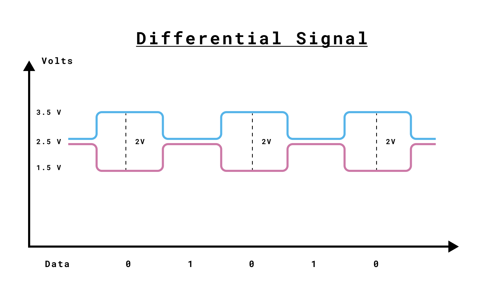
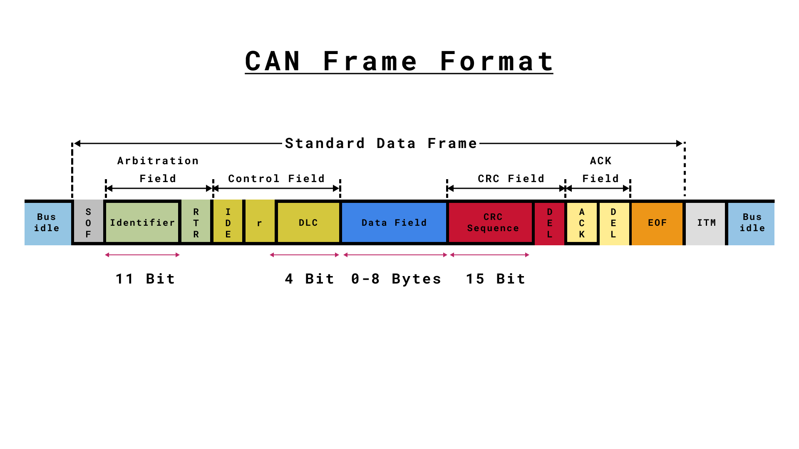

## Introduction

Controller Area Network (CAN), is a robust and versatile communication protocol that can be used to send data between an Arduino board and other devices in a networked environment without a host computer. Originally developed by Bosch for automotive applications, CAN bus offers advantages in scenarios demanding robust, noise-resistant, and error-checked data transmission. 

Communication via CAN is enabled through different CAN libraries and is dependent on the hardware used for the setup. This article will mainly focus on the [Arduino_CAN](https://github.com/arduino/ArduinoCore-renesas/tree/main/libraries/Arduino_CAN) library and its available methods with references to different hardware and respective libraries.

## CAN Class

With the CAN class, you can send and receive data over a Controller Area Network (CAN) bus, enabling communication between an Arduino board and other devices in a networked environment.

- The CAN class provides methods to manage CAN communication typically used with specific Arduino boards that have CAN capability, like the [Arduino UNO R4](https://store.arduino.cc/en-se/products/uno-r4-wifi) or with add-on shields such as the MKR CAN Shield.

The CAN class has several essential methods:

- `begin(CanBitRate rate)` - Initializes the CAN bus with a specified bit rate (e.g., `CanBitRate::BR_250k` for 250 kbps).

- `available()` - Checks if there are any incoming CAN messages available to read.

- `read()` - Reads a CAN message from the bus and returns it as a `CanMsg` object.

- `write(const CanMsg& msg)` - Writes a CAN message to the bus. The message is encapsulated in a `CanMsg` object, which includes the CAN ID, data length, and the data payload.

These methods provide the core functionality for sending and receiving messages over the CAN bus, allowing efficient and reliable communication across multiple devices in a network. For example, these methods can be used to monitor vehicle sensors or control industrial machines.

## Arduino CAN Pins

***Depending on which Arduino board you are using, you will need a transceiver/receiver to read the differential signal properly. Check the product page or cheat sheet of the board you are using for more information.***

## Technical Specifications

### History of CAN

The CAN bus, or Controller Area Network, was developed by the German company Bosch in the 1980s. Its primary purpose was to streamline communication within vehicles, enabling various microcontrollers and devices to communicate with each other without the need for a central host computer. This innovation significantly enhanced the efficiency and reliability of automotive systems, allowing for real-time data exchange and coordinated control across different vehicle components. CAN's robustness and noise immunity made it particularly suitable for harsh environments such as cars.

| Name                        | Year                       | Speed                                                 |
|-----------------------------|----------------------------|-------------------------------------------------------|
| CAN 1.0                     | 1986                       | Up to 125 kilobits per second                         |
| CAN 2.0                     | 1991                       | Up to 1 Megabit per second                            |
| CAN FD                      | 2011                       | Up to 1 Mbps (arbitration), Up to 8 Mbps (data phase) |
| CAN XL (Extra Large)        | Ongoing (as of 08.19.24)   | Higher bit rates (in development)                     |


#### Timeline of Standards

**1986: CAN 1.0**

The first version of the CAN protocol was released in 1986, supporting a bit rate of up to 125 kilobits per second. Initially, it was used primarily for diagnostic communication within vehicles.
  
 **1991: CAN 2.0**

The influential CAN 2.0 standard was released, introducing significant advancements. This version supported bit rates of up to 1 megabit per second and introduced two frame formats: the standard 11-bit identifier and the extended 29-bit identifier. CAN 2.0 became widely adopted not just in automotive applications but also in industrial and other embedded systems. When using an Arduino, this is the version that is as of today (08.15.2024) supported by the [Arduino_CAN](https://github.com/arduino/ArduinoCore-renesas/tree/main/libraries/Arduino_CAN) library.

**2003: ISO Standardization**

CAN technology was standardized under the International Organization for Standardization (ISO) as ISO 11898-1. This helped in formalizing the protocol and ensuring compatibility and reliability across different implementations.

**2011: CAN FD (Flexible Data Rate)**

CAN FD was introduced to meet modern demands for higher data rates and larger payloads. CAN FD supported bit rates of up to 1 megabit per second for the arbitration phase and up to 8 megabits per second for the data phase. It also allowed for payload sizes up to 64 bytes, compared to the 8-byte limit of CAN 2.0.

**2015: ISO 11898-1:2015**

The latest revision of the ISO standard incorporated CAN FD, making it an integral part of the international standard for CAN.

**Ongoing: CAN XL (Extra Large)**

Currently in development, CAN XL aims to further enhance the capabilities of the CAN protocol, offering even higher bit rates and larger payloads. This ongoing evolution is driven by the need to compete with Ethernet and other high-speed communication protocols in automotive and industrial applications. 

### How CAN Works

CAN operates by transmitting data through a structured series of bits called frames. These frames ensure reliable and efficient communication between nodes on a network by encapsulating various fields that serve specific purposes such as message identification, data transmission, and error checking.

**Shared Bus and Absence of a Central Master Node**

One of the unique features of a CAN bus system is its use of a shared communication bus without a central master node. Instead, it operates on a decentralized protocol, where each node on the network has equal rights and can initiate communication as needed. This architecture enhances reliability because there isn't a single point of failure. Each node can communicate directly with any other node on the bus, making the system both flexible and scalable.

**Differential Signaling**



CAN uses a differential signal scheme, meaning data bits are represented by the difference in voltage between two wires: CAN_H (CAN High) and CAN_L (CAN Low). This differential nature makes CAN highly resistant to electrical noise, ensuring robust communication over long distances and in noisy environments typical of automotive and industrial applications.

**Practical Example: CAN in Automotive Systems**

Imagine a modern car where multiple sensors and actuators are connected throughout the vehicle. These include components such as the Anti-lock Braking System (ABS), Engine Control Unit (ECU), and various sensors for monitoring engine performance or temperature. To connect all these devices, a significant number of wires run across the car, often in close proximity to high-power electrical systems like the ignition system or the alternator.
In such an environment, electrical noise is a common issue. Traditional serial communication protocols, which rely on single-ended signaling (measuring voltage relative to a common ground), can be significantly affected by this noise. The noise can induce erroneous signals, leading to data corruption and malfunctioning of the system.
However, the CAN protocol uses differential signaling, which measures the difference in voltage between the CAN_H and CAN_L lines rather than referencing a predefined voltage level. This differential voltage measurement ensures that the data being transmitted is accurately received, regardless of common-mode noise. Even if the CAN signal is increased, decreased, or corrupted by external noise, the difference between CAN_H and CAN_L remains the same, preserving the integrity of the communication.


**Ground Wire Considerations**

Technically, CAN's differential nature means that a ground wire is not strictly necessary for data transmission, as the data is conveyed through the voltage difference between CAN_H and CAN_L. However, in practical applications, it is advisable to include a ground wire for the following reasons:

- **Common Ground Potential:** Including a ground wire helps keep all nodes in the CAN network at a similar ground potential, reducing the risk of large ground potential differences, which can cause issues with the physical layer transceivers.

- **Safety and Reliability:** In an automobile, the chassis often serves as the common ground, ensuring that all devices operate at compatible voltage levels, reducing the chance of communication errors and improving overall system stability.

**Example of Collision and How CAN Handles Bus Arbitration**

CAN bus uses a non-destructive bitwise arbitration method to handle collisions. When two nodes attempt to send messages simultaneously, the node with the highest priority (lowest CAN ID) wins, and the other node backs off and retries.

**Example:**
- Assume Node 1 sends a message with ID 0x100 and Node 2 sends a message with ID 0x101 simultaneously. Since 0x100 has a higher priority (lower numerical value), Node 1 continues transmission while Node 2 stops and retries after Node 1 completes.

### CAN Frame Structure

Each CAN message is encapsulated in a frame made up of several fields:

**Frame Format**



**Standard and Extended CAN IDs**

CAN frames come in two formats: Standard and Extended. The primary difference between these two formats is the length of the identifier field.

- **Standard CAN ID:** Uses an 11-bit identifier, allowing for 2,048 unique message IDs.

- **Extended CAN ID:** Uses a 29-bit identifier, offering a significantly larger address space with 536,870,912 unique message IDs.

A typical CAN frame consists of the following fields:

1. **Start of Frame (SOF):** Marks the beginning of the frame with a dominant bit, synchronizing all nodes to the start of the message.

2. **Arbitration Field:**

  **Identifier:** A unique value used to identify the message and determine its priority during arbitration.
  
  **RTR (Remote Transmission Request):** Differentiates between data frames and remote frames (requests data).

3. **Control Field:**
   
  **IDE (Identifier Extension):** Indicates whether the identifier field is standard (11 bits) or extended (29 bits).
  
  **r (Reserved bit):** Reserved for future use, should always be dominant.
  
  **DLC (Data Length Code):** Specifies the number of bytes of data (0 to 8 bytes).

4. **Data Field:** Contains the actual payload data, from 0 to 8 bytes.

5. **CRC Field:**
   
   **CRC Sequence:** Holds the Cyclic Redundancy Check value for error detection.
   
   **CRC Delimiter (DEL):** A single recessive bit separating the CRC field from the acknowledgment field.

6. **ACK Field:**
   
   **ACK Slot:** Indicates successful receipt of the message by setting a dominant bit.
   
   **ACK Delimiter (DEL):** Follows the acknowledgment bit and is recessive.

7. **End of Frame (EOF):** Consists of seven recessive bits marking the end of the frame.

8. **Interframe Space (ITM):** A period of bus inactivity between consecutive data frames ensuring the bus is idle before the next message.

These structured fields enable CAN to provide robust and error-resilient communication, making it highly suitable for automotive and industrial applications where reliability is crucial.

### Timing and Synchronization

Timing and synchronization are crucial aspects of CAN communication. Unlike synchronous serial protocols such as SPI and I2C, CAN operates asynchronously, meaning it doesn't rely on a shared clock signal. Instead, it uses predefined bit rates to determine the timing of data bits.

**Bit Timing Phases**

Despite being asynchronous, CAN ensures precise timing synchronization between nodes through a mechanism called **bit timing**, which consists of the following phases:

- **Sync Segment:** Used for synchronizing nodes. All nodes recognize the start of a message by identifying the transition from a recessive to a dominant bit.

- **Propagation Segment:** Accounts for physical delay times within the network.

- **Phase Segment 1 (PS1):** Helps compensate for phase edge errors.

- **Phase Segment 2 (PS2):** Provides further compensation for phase errors.

Bit timing is divided into **Time Quanta (TQ)**, which are the smallest units of time in CAN communication. The total number of TQ in a bit period defines the bit timing, adjusted to ensure high reliability in communication.

In your code, you set the bit rate like so:

```arduino
CAN.begin(CanBitRate::BR_250k);
```

### Termination Resistors

Termination resistors are essential for the proper functioning of a CAN bus network. These resistors prevent signal reflections that can cause communication errors. Typically, a 120-ohm resistor is placed between CAN_H and CAN_L at each end of the bus.

**Connecting Termination Resistors**

To add termination resistors, connect a 120-ohm resistor between the CAN_H and CAN_L lines at both ends of the CAN bus. This ensures that the electrical signals are properly terminated, preventing reflections and maintaining signal integrity.

## Examples

Below you can find an overview of tutorials we have created for our different products.

- [Arduino UNO R4 WiFi CAN Bus](https://docs.arduino.cc/tutorials/uno-r4-wifi/can/)

- [Sending Data Between Two MKR CAN Shields](https://docs.arduino.cc/tutorials/mkr-can-shield/mkr-can-communication/)