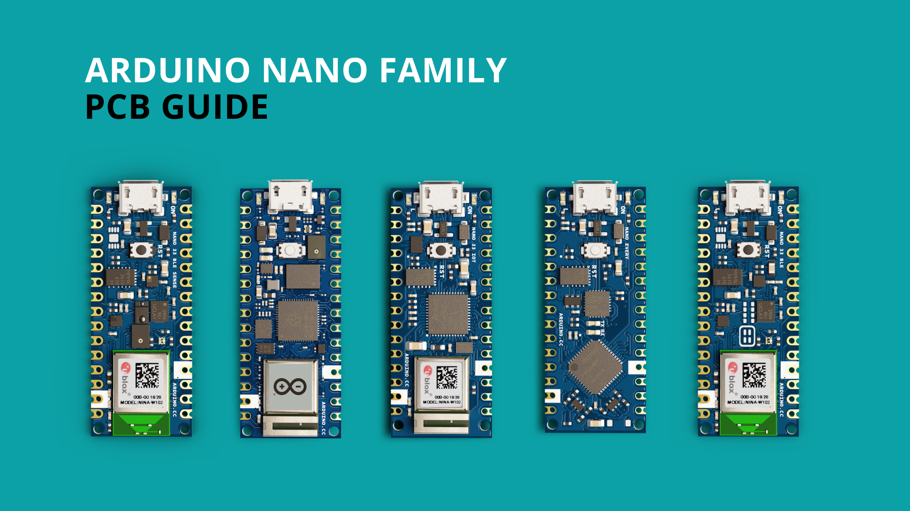
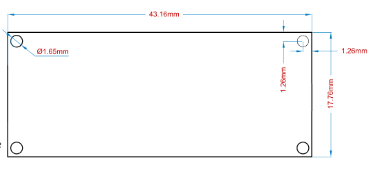
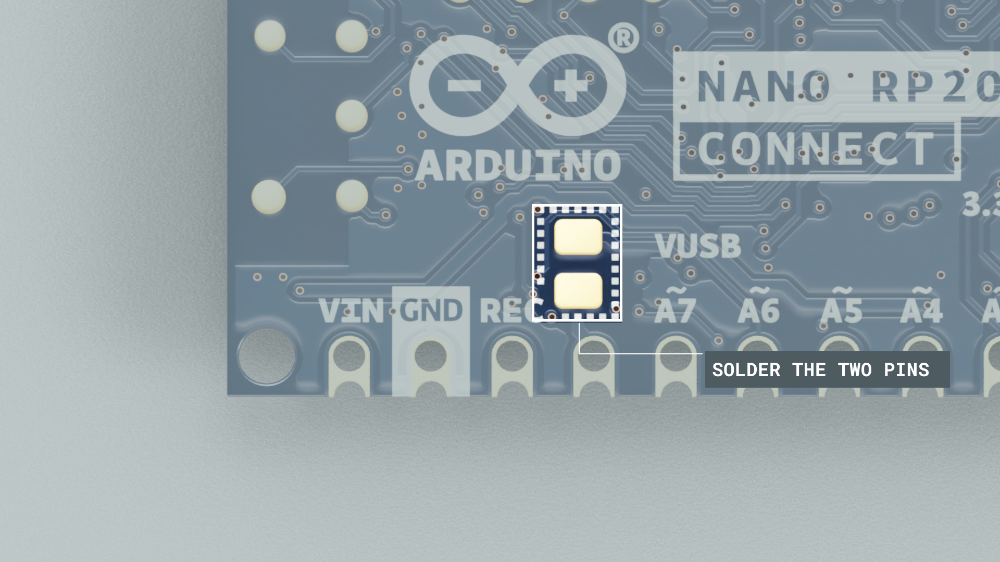
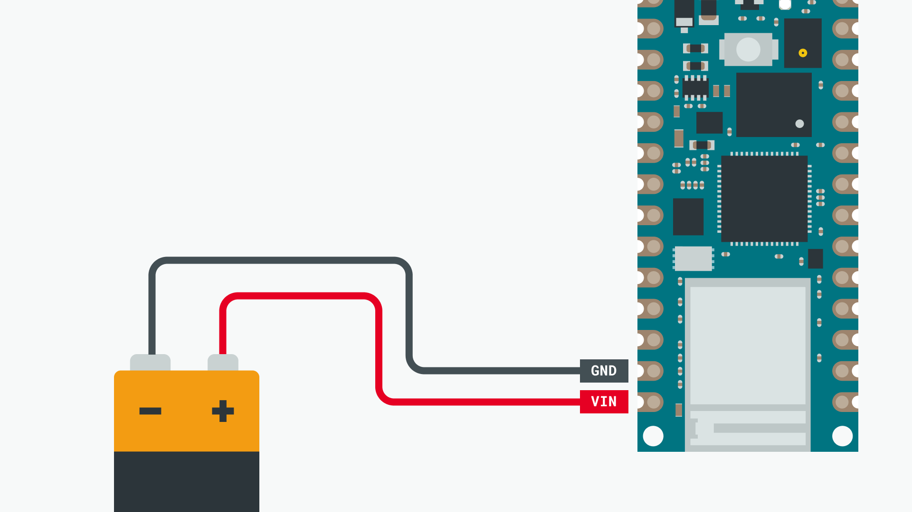
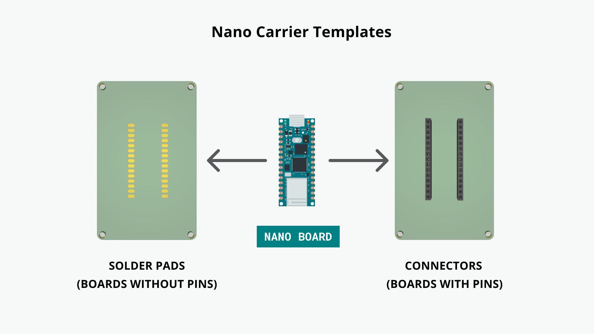
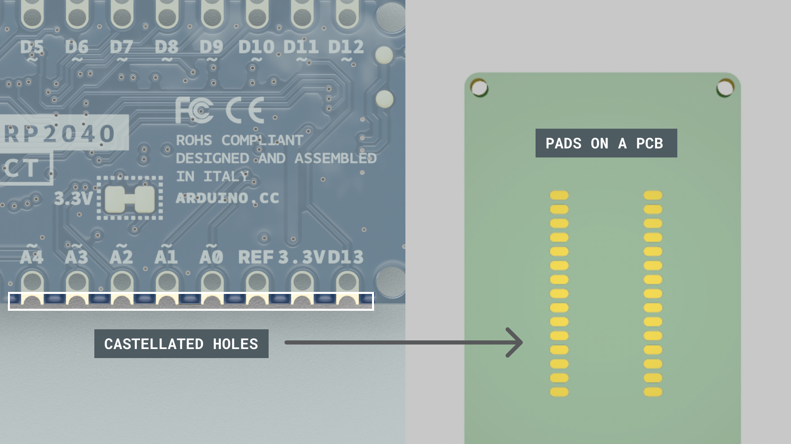

The Arduino Nano Family is a series of boards with a tiny footprint. This guide is dedicated to you who wants to design your own customized hardware for the Nano Family. 

This article aims to provide you with technical information that will aid the design of your own customized Nano hardware.

## Documentation

Each Nano Family board has a dedicated documentation page, see the list below:

- [Nano](/hardware/nano)
- [Nano Every](/hardware/nano-every)
- [Nano 33 BLE](/hardware/nano-33-ble)
- [Nano 33 BLE Sense](/hardware/nano-33-ble-sense)
- [Nano 33 IoT](/hardware/nano-33-iot)
- [Nano RP2040 Connect](/hardware/nano-rp2040-connect)

Inside the documentation page, you will find design files such as full pinout, CAD and Fritzing files. You will also find tutorials and compatible libraries with the respective boards in this page.

## Technical Overview

### Dimensions

The following dimensions apply to all of the Nano boards.

| Format | Measurement |
| ------ | ----------- |
| Width  | 17.76 mm    |
| Length | 43.16 mm    |
| Pitch  | 2.54 mm     |

***Pitch is the space between the pins (e.g. between A1, A2. This specification is important when choosing header pins.***

More detailed blueprints are available for download through the links below (in `.svg` format):

- [Nano General Dimensions](/resources/dimensions/nano-general-dimensions.svg)
- [Nano Header Dimensions](/resources/dimensions/nano-header-dimensions.svg)
- [Nano Pads Dimensions](/resources/dimensions/nano-pads-dimensions.svg)

### Feature Comparisons

Below is a comparison between the different Nano Family boards. 

| Board        | Nano           | Nano Every     | Nano 33 BLE  | Nano 33 BLE Sense | Nano 33 IoT       | Nano RP2040 Connect |
| ------------ | -------------- | -------------- | ------------ | ----------------- | ----------------- | ------------------- |
| Processor    | **ATmega328P** | **ATmega4809** | **nRF52840** | **nRF52840**      | **SAMD21G18A**    | **RP2040**          |
| Radio Module | x              | x              | NINA-B306    | NINA-B306         | NINA-W102         | NINA-W102           |
| Connectivity | x              | x              | Bluetooth®   | Bluetooth®        | Wi-Fi, Bluetooth® | Wi-Fi, Bluetooth®   |
| Clock Speed  | 16 Mhz         | 16 Mhz         | 64 Mhz       | 64 Mhz            | 48 Mhz            | 133 MHz             |
| Flash Memory | 32 KB          | 48 KB          | 256 KB       | 256 KB            | 264 KB            | 16 MB               |
| SRAM         | 2 KB           | 6 KB           | 1 MB         | 1 MB              | 256 KB            | 264 KB              |
| EEPROM       | 1 KB           | 256 byte       | x            | x                 | x                 | x                   |
| I/O Voltage  | 5V             | 5V             | 3.3V         | 3.3V              | 3.3V              | 3.3V                |

There are several embedded sensors on the Nano boards, which can be seen below:

| Board       | Nano | Nano Every | Nano 33 BLE | Nano 33 BLE Sense | Nano 33 IoT | Nano RP2040 Connect |
| ----------- | ---- | ---------- | ----------- | ----------------- | ----------- | ------------------- |
| IMU         | x    | x          | **LSM9DS1** | **LSM9DS1**       | **LSM6DS3** | **LSM6DSOX**        |
| Microphone  | x    | x          | x           | **MP34DT05**      | x           | **MP34DT05**        |
| Gesture     | x    | x          | x           | **APDS-9960**     | x           | x                   |
| Light       | x    | x          | x           | **APDS-9960**     | x           | x                   |
| Color       | x    | x          | x           | **APDS-9960**     | x           | x                   |
| Pressure    | x    | x          | x           | **LPS22HB**       | x           | x                   |
| Temperature | x    | x          | x           | **HTS221**        | x           | x                   |
| Humidity    | x    | x          | x           | **HTS221**        | x           | x                   |

## Power Considerations

### Voltage (3.3V / 5V)

It is important to understand that the Nano family boards operate on different voltage. Any board with a radio module (Nano 33 BLE, Nano 33 BLE Sense, Nano 33 IoT, Nano RP2040 Connect) operates on **3.3V**. The Nano and Nano Every operate on **5V**.

As the boards with radio modules operate on 3.3V logic, the 5V pin is connected to headers via a solder jumper which defaults open. When powering the board via USB, the VIN pin can be used as a 5V output from the board. This is useful when powering carrier boards requiring 5V and powering the system via USB.

### VUSB Pads

The 5V pin is also referred to as **"VUSB"**. The purpose of this pin is to provide direct connection between USB connector's VUSB (5V) to headers. This can be used to power devices on a carrier board directly while when using VIN pin this will exhibit a drop due to the series diodes that prevents VIN to back power the USB. In order to connect VUSB/5V pin headers, you will need to solder together the VUSB pads on the bottom of the board, as shown in the image below:

***If you solder the VUSB pads, and then power the board via USB, it also enables the 5V pin to be used. Be very cautious with this, as you risk damaging your board's ICs.***

### VIN Min/Max

The min/max voltage supply varies between boards. This is important to consider when choosing the battery source, that you do not exceed the limits to damage the board. 

| Nano  | Nano Every | Nano 33 BLE | Nano 33 BLE Sense | Nano 33 IoT | Nano RP2040 Connect |
| ----- | ---------- | ----------- | ----------------- | ----------- | ------------------- |
| 7-12V | 7-18V      | 5-18V       | 5-18V             | 5-18V       | 5-18V               |

### Battery Connection

Nano boards can be powered with batteries, but they do not come with a **battery charging circuit** or **battery protection circuit**. 

Many LiPo batteries have a built-in protection circuit, but some does not. In short, this means overdischarge can happen when powering the board with a LiPo battery. See the section below for more information.

### Battery Overdischarge Warning

If you want to connect a battery to a Nano, do so by using the VIN pin but you have to keep in mind VIN minimum requirements (which means a single cell battery won't be enough). Since there's no under voltage protection, a LiPo battery without a protection circuit will be damaged if it is kept connected to the Nano board even after it is completely discharged. It is thus recommended not to connect a battery directly but rather to use circuits like those in USB battery packs that provide a stabilized 5V power supply and protect the battery from undervoltage.

To connect a battery to a Nano board, you will need to use the VIN pin (refer to the VIN min-max table in the section above).

## Pinout

Nano boards largely share the placement of many pins, to make it easy for accessories to be designed for different Nano boards.

### Serial Buses

The Nano Family boards have serial buses attached to the following pins:

| Protocol | Pins                        |
| -------- | --------------------------- |
| UART     | RX,TX                       |
| SPI      | COPI(11), CIPO(12), SCK(13) |
| I²C      | SDA(A4), SCL(A5)            |

The location of these pins are located in the pinout for each board. These are found in the **Resources Section** product page of each board.

## Carrier Templates

In this section, you will find downloadble files that can be used together with various PCB design programs, such as [Altium](https://www.altium.com/) and [Eagle](https://www.autodesk.com/products/eagle/free-download) to create your own Nano accessories.

You can either download the **connector** template, or the **solder pads** template.

- **Connector template:** empty carrier template with connectors. This is useful if you want to create a design where you can attach and remove a Nano board easily.
- **Solder pads template:** an empty carrier template with solder pads. This is useful if you want to create a design where you solder the Nano directly on top of the PCB.

### Altium

Below are template files for Altium.

- [Nano Carrier PCB template (solder pads)](/resources/cad/NanoCarrier_SolderPads.zip)
- [Nano Carrier PCB template (connectors)](/resources/cad/NanoCarrier_Socket.zip)

### Eagle

Below are template files for Eagle.

- [Nano Carrier PCB template (solder pads)](/resources/cad/eagle_nano_carrier_castellated.zip)
- [Nano Carrier PCB template (connectors)](/resources/cad/eagle_nano_carrier_throughhole.zip)

## 3D Files

The design file(s) below can be used for 3D printing, e.g. enclosures, mounts.

- [Nano Board Enclosure (.stl)](/resources/3d/nano-enclosure.stl)
- [Nano Board Enclosure (.stp)](/resources/3d/nano-enclosure.stp)

## Soldering Directly To PCB

All Nano boards can be purchased **without headers attached.** This makes it possible to solder it directly to a custom PCB, using the castellated holes on the board. 

This method is useful for more robust applications, where the Nano board needs to be permanently attached.

***Do not attempt to solder any Arduino Nano boards shipped in single package using the reflow soldering method. Since Arduino boards are not shipped in a dry pack, the board may absorb humidity and is thus unsuitable for reflow process. Boards should always be soldered manually; in case you're interested in using the reflow soldering process for volume manufacturing, please [contact Arduino PRO](https://www.arduino.cc/pro/contact-us).***
