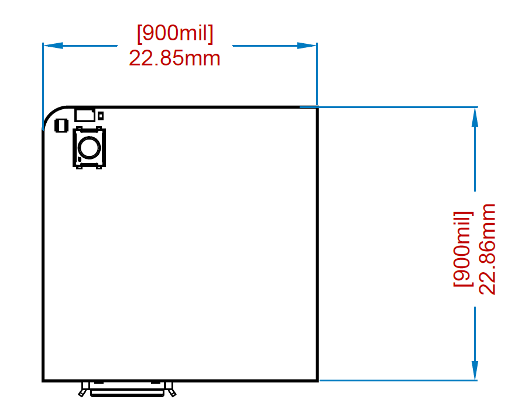
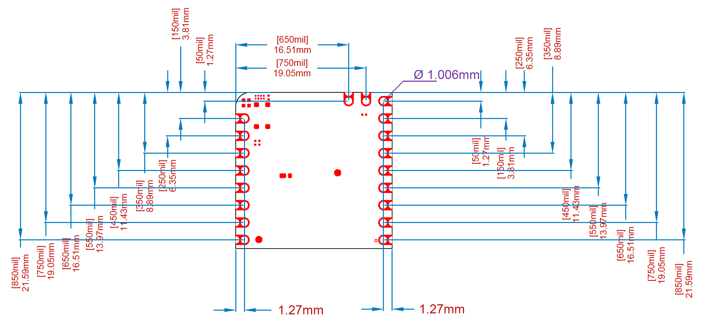
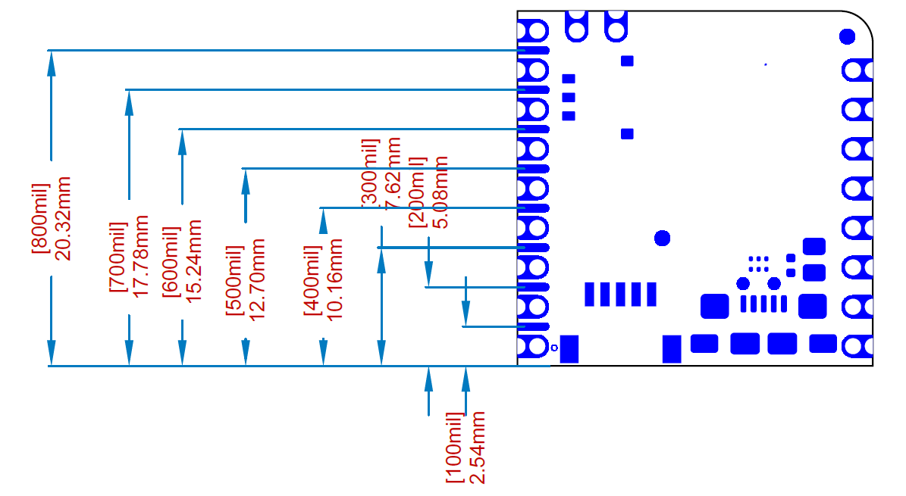
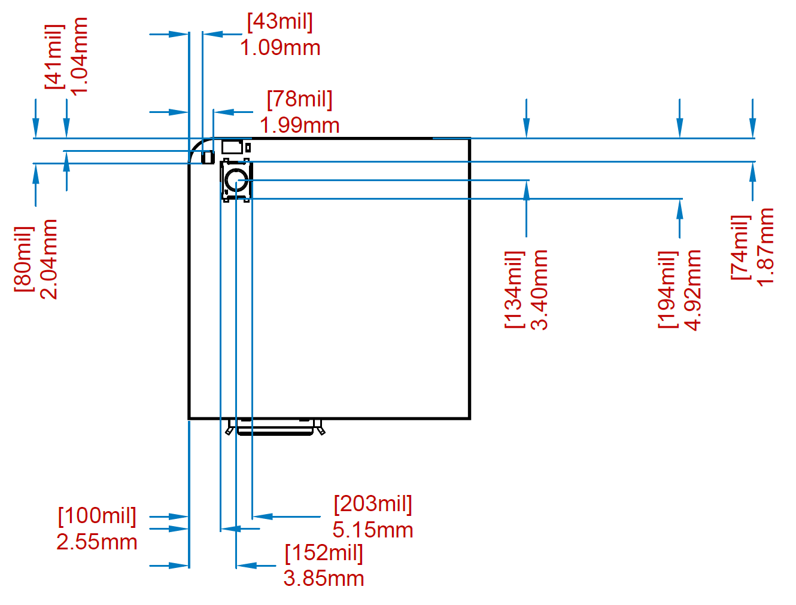
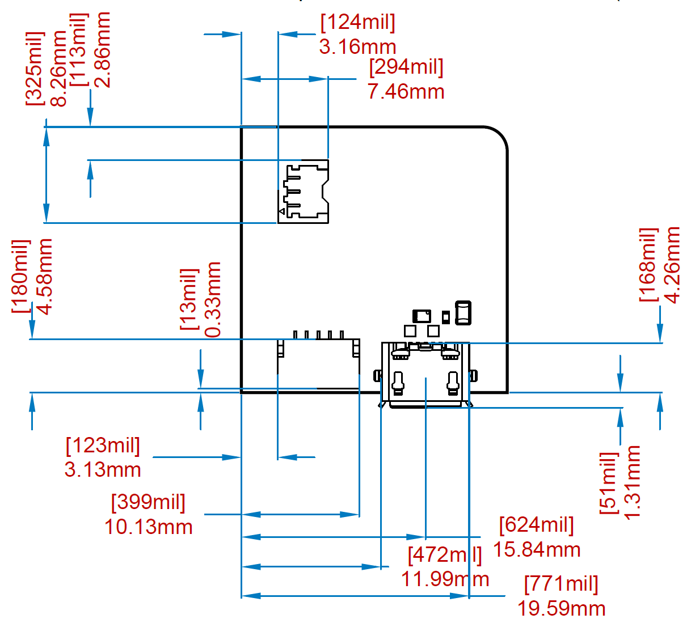
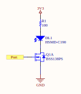

This document aims to describe the design philosophy and technical specifications of the Nicla Form Factor and should be used as a guideline for designing boards and accessories (shields/carriers) compatible with the form factor.

## Nicla Form Factor

The Nicla form factor has been designed to address the needs of industrial applications and makers for an all-in-one package featuring wireless sensing capabilities. Key focus is given to collecting and processing data at the edge with minimal power consumption.
Nicla boards integrate application specific sensors and high performance microcontrollers capable of processing raw data in real time and provide high level measurements to the host board or to the main application.
Nicla boards support programmable I/O voltage ranging between 1.8 and 3.3V whose voltage reference can either be supplied externally or generated internally.

Nicla family has been designed to fulfill the following key needs:
- Low Power
- integrated sensing with AI capabilities
- wireless communication
- partial compatibility with MKR form factor
- industrial temperature range

Nicla boards are designed for the following three use cases:

- **Standalone** - Nicla boards can be used as a traditional Arduino board on which the user can load the final application. In this scenario Nicla's microcontroller is executing the whole application and its interfaces can be used to communicate to external sensors and actuators
- **ESLOV peripheral** - Nicla boards can be connected through the ESLOV connector, consisting of 5 pins including an I2C bus, power supply and a GPIO. Through this connector the board can be interfaced with MKR boards directly or, via adapter cables, to other boards exposing similar interfaces such as QWIIC, STEMMA/STEMMA QT and GROVE. Nicla boards are provided with a readymade firmware which abstracts sensors and allows reading high level measurements processed by Nicla main processor.
- **MKR Shield** - Nicla boards can be fitted on a MKR board as a shield. In this scenario MKR would be running the main application and would communicate with Nicla through I2C as it would do via ESLOV.
- **Wireless** - Nicla boards can be battery operated and can communicate wirelessly to a central processor. As in other use case scenarios Nicla would be processing sensor data and provide high level processed information.

## Mechanical Specification

### Board Size and Shape

Nicla form factor shape is a square with 900 mils edge length, excluding the protrusions of connectors which are meant to be passing though a case.
Although board is square its shape and its connectors are asymmetric to prevent connecting the board in the wrong orientation.

In order to create a consistent ecosystem and allow creation of cases usable across all the family, Nicla form factor fixes the following mechanical positions:
- board to board connectors
  - I/O Headers
  - debug fins
- USER Interface
  - pushbutton
  - RGB LED
- Board to cable connectors
  - USB connector
  - Battery Connector
  - ESLOV connector

### Headers

### Fins

### User Interface

### Connectors

## Power Supply

Nicla boards can be powered from four different power supply rails:
- USB connector
- ESLOV connector
- Vin pin
- Battery

When powered from USB, Vin or ESLOV the board can charge the battery if software is programmed to allow it.
All voltages can be present at the same time without causing any issue as the three voltages are ORed through diodes. Vin pin is directly connected to the PMIC whereas the other two pass through diodes, which means that ESLOV connector will not be able to power external devices and is meant primarily as a peripheral.

Nicla boards provide an on board battery charger for single cell LiPo batteries which have a programmable charge current depending on the specific board. All boards provide sleep mode functionality which minimizes current draw from battery, keeping the system off until the reset button is pressed.

## External Interfaces

### Headers

Header I/O pins are driven by a bidirectional voltage translator that allows decoupling I/O Voltage from internal CPU voltage. Header pins are referenced to the VDDIO pin which can either be generated internally with a programmable voltage or fed externally.
Board has two columns of header+castellated pins that are partially compatible with MKR form factor. Specifically Nicla boards are designed so that a nicla board can be fitted in the first **half** of the MKR connectors.

{/*
, aligning it as in figure:

*/}

Using this connection it's possible to use Nicla as a shield for MKR or Nicla as a controller for MKR shields provided the shield doesn't use the missing pins.

**Pinout**

| Pin  | Name  | MKR Pin | Description                            |
| ---- | ----- | ------- | -------------------------------------- |
| J1-8 | ADC1  | A0      | Analog Capable Pin                     |
| J1-7 | ADC2  | A1      | Analog Capable Pin                     |
| J1-6 | SCLK  | A2      | SPI clock                              |
| J1-5 | CIPO  | A3      | SPI Controller Input/Peripheral Output |
| J1-4 | COPI  | A4      | SPI Controller Output/Peripheral Input |
| J1-3 | CS    | A5      | SPI Chip Select                        |
| J1-2 | ADC3  | A6      | Analog Capable Pin                     |
| J1-1 | LPIO0 | A7      | Low Power IO                           |

| Pin  | Name  | MKR pin | Description                     |
| ---- | ----- | ------- | ------------------------------- |
| J2-9 | VIN   | +5V     | Input Supply Voltage            |
| J2-8 | -     | VIN     | No Connection                   |
| J2-7 | VDDIO | +3V3    | Header I/O Voltage              |
| J2-6 | GND   | GND     | Reference Ground                |
| J2-5 | LPIO3 | RESET   | Low Power IO                    |
| J2-4 | LPIO2 | D14/TX  | Low Power IO/UART               |
| J2-3 | LPIO1 | D13/RX  | Low Power IO/UART               |
| J2-2 | SCL   | D12/SDA | GPIO/I2C SDA, shared with ESLOV |
| J2-1 | SDA   | D11/SDA | GPIO/I2C SCL, shared with ESLOV |

| Pin  | Name | MKR pin | Description                                                |
| ---- | ---- | ------- | ---------------------------------------------------------- |
| J3-2 | VBAT | -       | Battery Positive Terminal                                  |
| J3-1 | NTC  | -       | optional NTC Sensor for Battery Overtemperature Protection |

**Low Power I/Os**

As reported in the table above, Nicla boards have a set of Low Power I/Os.
These I/Os are translated through an 8-Bit Bidirectional Voltage-Level Shifter with Auto Direction Sensing (check [TXB0108 datasheet](https://www.ti.com/product/TXB0108) for further info) and powered by VDDIO_EXT. This shifter is able to convert logic levels from inputs operating at 3.3V or less down to 1.8V (i.e. microcontroller operating voltage). However, it does not feature directional pins, since each input and output connected to it can detect and shift signals in either direction independently and automatically. As a consequence, the nominal behavior of these pins is guaranteed only when they are connected to a CMOS logic.
In the next section, the interaction with Low Power pins as input or output is described.

**Low Power Input Pins**

Any input device operating with a voltage less or equal to 3.3V can be connected to the Low Power pins. The integrated Voltage-Level shifter will automatically detect that an input device has been connected to the pin and it will guarantee the conversion from 3.3.V to 1.8V, i.e. microcontroller operating voltage, to properly interface with the Nicla boards.

**Low Power Output Pins**

Any Low Power device can be directly connected to the Low-Power pins in case it does not absorb any current. The Voltage-Level shifter will automatically detect that an output device has been connected to the pin and switch the port accordingly. The output voltage is digital and its value depends on how VDDIO_EXT has been programmed via software: VDDIO_EXT can be switched off or switched on either at 1.8V or 3.3V.
On the other hand, if the connected output device needs to absorb current (e.g. LEDs, resistive loads, buzzers etc.), the user should connect a MOSFET or a buffer to guarantee the required current flow. A reference schematics showing how to connect an LED to a Low-Power pin through a MOSFET is reported below.

### Fins

Nicla boards have a set of fins interleaved among headers that are mainly for debug and initial programming. These pins are arranged so that they can easily be contacted by inserting the board in a 1.27mm/50 mil dual row header that would allow firmly contacting the fins along with header pins, provided no header has been soldered on it.
The functions of each fin is specific to a board but SWD pins for on board processors have been set up so that they are consistent across boards.

**Pinout**

| Pin | Name  | Description             |
| --- | ----- | ----------------------- |
| P-8 | AUX3  | Auxiliary Pin 3         |
| P-7 | +1V8  | Internal 1.8V Supply    |
| P-6 | AUX2  | Auxiliary Pin 2         |
| P-5 | RESET | Main MCU Reset Pin      |
| P-4 | SWCLK | Main MCU SW Debug Clock |
| P-3 | SWDIO | Main MCU SW Debug Data  |
| P-2 | AUX1  | Auxiliary Pin 1         |
| P-1 | AUX0  | Auxiliary Pin 0         |

### Battery

Battery terminals are available either via a 3 pin connector or via headers. In both cases supported battery is 1 cell Lithium Polymer. Please check board datasheet for available charge current options and make sure to never charge the battery at more than the recommended max limit. If possible use the provided NTC terminal to connect a Negative Temperature Coefficient resistor to sense battery temperature so that charging can be stopped in case battery temperature reaches the programmed limit.

**Pinout**

| Pin  | Name | Description                                                |
| ---- | ---- | ---------------------------------------------------------- |
| J4-3 | GND  | Battery negative terminal                                  |
| J4-2 | NTC  | optional NTC sensor for battery overtemperature protection |
| J4-1 | VBAT | battery positive terminal                                  |

### ESLOV

ESLOV is a 5 pin connector available on MKR and Portenta boards and can be used to connect to a Nicla via cable. Through this connector the board can be interfaced with MKR and Portenta boards directly or, via adapter cables, to other boards exposing similar interfaces such as QWIIC, STEMMA/STEMMA QT and GROVE. Nicla boards are provided with a readymade firmware which abstracts sensors and allows reading high level measurements processed by the Nicla's main processor.

**Pinout**

| Pin  | Name   | Description                       |
| ---- | ------ | --------------------------------- |
| J5-5 | GND    | Ground                            |
| J5-4 | SDA    | GPIO/I2C SDA, Shared with Headers |
| J5-3 | SCL    | GPIO/I2C SCL, Shared with Headers |
| J5-2 | INT    | GPIO Referenced to VDDIO voltage  |
| J5-1 | VESLOV | ESLOV Supply Input                |

### USB

USB connector consists of a micro USB with the Nicla only capable of acting as a peripheral. Voltage from this connector can be used to power the board. USB port can be used to program and debug the board or to expose custom application specific interfaces.
