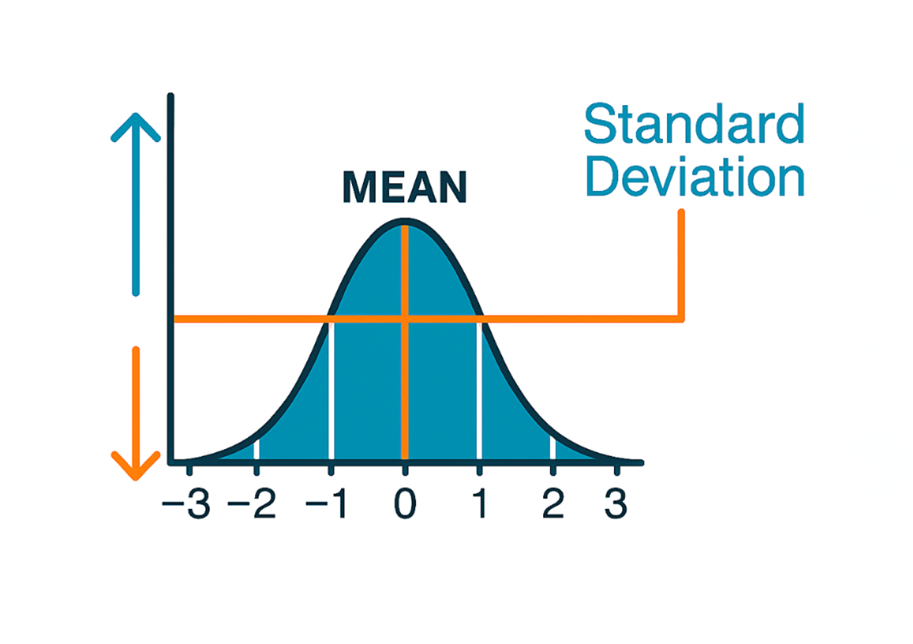

In the previous module, we introduced the Edge AI development cycle and its six phases. Now we will delve deeper into the four central phases of the workflow: data collection, preprocessing, model training, and evaluation. The goal is to understand how each phase is executed in practice and what decisions are key to achieving good results.

## Phase 1: Data Collection

Data is the most important component of any machine learning project. A model can only be as good as the data it was trained on. In this section, we will examine the types of data used in Edge AI, strategies for collecting them correctly, and considerations about their quantity and representativeness.

### Types of Data for Different Applications

Edge AI applications work with data from sensors and cameras. Each type of data has its own characteristics that influence how it is collected, stored, and processed.

#### Motion Sensor Data (IMU)

Motion sensors, such as accelerometers and gyroscopes, measure an object's acceleration and rotation. A three-axis accelerometer produces three numerical values per reading (one for each axis: X, Y, and Z), generating a time-varying data series [1].

This data is used in applications such as gesture recognition (for example, distinguishing between circular and linear movements), human activity detection (walking, running, sitting), and vibration monitoring in industrial machinery.

#### Audio Data

Microphones capture audio signals and represent variations in sound pressure over time. For Edge AI applications, such as voice command recognition (“on”, “off”) or environmental sound classification (alarms, breaking glass), short recordings are used, typically 1 to 3 seconds long [2].

Audio presents particular challenges: background noise varies depending on the environment, and the distance between the sound source and the microphone affects signal quality.

#### Image Data

Images for Edge AI are processed at reduced resolutions (e.g., 96×96 pixels) to accommodate the memory limitations of microcontrollers. They can be in grayscale or color, which directly affects the amount of data the model must process [3].

Applications include object classification (e.g., distinguishing between types of fruit), person detection, and visual quality control on production lines.

#### Environmental Data

Environmental sensors measure variables such as temperature, humidity, atmospheric pressure, and air quality. Unlike audio or image data, these values change slowly and are collected at longer intervals (e.g., once per second or per minute) [4].

They are used in environmental monitoring and prediction applications, such as detecting anomalous conditions in a greenhouse or predicting a building's energy consumption.

### Strategies for Collecting Quality Data

Data quality largely determines the final model’s performance. Poor collection can yield models that perform well in the lab but fail in real-world conditions [5].

#### Defining the Collection Protocol

Before starting the collection, it is necessary to establish a clear plan that defines the experimental conditions. This protocol should specify which sensor will be used and at what frequency, how long each sample lasts, the conditions under which data are captured, how many repetitions are needed, and how each sample will be labeled.

In a gesture recognition project with an accelerometer, for example, the protocol might specify that each participant repeat each gesture 50 times, with a maximum duration of two seconds per gesture, and that the sensor be placed on the right wrist.

#### Diversity in Data

A common mistake is collecting data under overly controlled conditions. For the model to work in the real world, the data must reflect the problem's natural variability.

In the case of audio data, this means recording in different spaces (offices, outdoors, noisy environments), with different speakers, and at various distances from the microphone. For image data, diversity includes variations in lighting (natural, artificial, and shadows), capture angles, and backgrounds.

#### Correct Labeling

Labeling assigns each sample to the correct category (e.g., “circular gesture” or “linear gesture”). Incorrect labeling confuses the model during training and can significantly degrade its performance.

Best practices include defining unambiguous categories, documenting labeling criteria, verifying labels through cross-review when possible, and recording doubtful cases for later review.

#### Data Collection with Edge Impulse

Edge Impulse simplifies data collection by allowing samples to be captured directly from the Arduino board. The process consists of connecting the board to the computer, selecting the sensor to use (accelerometer, microphone, camera, etc.), defining the duration of each sample, capturing the data, and assigning labels in real time [6].

This direct integration with the hardware ensures that the data is captured under the same conditions in which the model will operate during inference.

### Considerations About Quantity and Representativeness

Determining how much data is needed depends on the problem's complexity and the number of categories the model must distinguish.

#### Minimum Amount of Data

As a general reference, the recommended quantities according to task type are as follows:

|            **Task Type**           | **Minimum Samples per Class** | **Recommended Samples per Class** |
|:----------------------------------:|:-----------------------------:|:---------------------------------:|
|  Simple classification (2-3 classes) |              50               |             100 - 500             |
| Complex classification (4+ classes)  |              100              |            500 - 2,000            |
|         Anomaly detection          |    500 (normal class only)    |     1,000+ (normal class only)    |
|         Voice recognition          |        100 per command        |          500+ per command         |
|        Image classification        |              100              |            500 - 1,000            |

**These figures are guidelines**. In general, the more similar the classes are to each other (for example, distinguishing between two similar gestures), the more data the model needs to learn the differences between them.

#### Balance Between Classes

An imbalanced dataset, where some classes have many more samples than others, can bias the model toward the classes with more examples. For example, if there are 500 samples of “walking” but only 50 of “running”, the model will tend to classify everything as “walking” because that is the correct answer most of the time [7].

It is recommended to maintain a similar number of samples in each class. When an imbalance is unavoidable (for example, in anomaly detection, where abnormal events are rare), we can use compensation techniques that will be discussed in the preprocessing section.

#### Dataset Split

The collected data must be divided into three sets with distinct purposes:

- **Training set (60-80%)**: The dataset from which the model learns. The model adjusts its internal parameters to recognize the patterns present in this data.
- **Validation set (10-20%)**: Used during training to verify that the model is not simply memorizing the data. 
- **Test set (10-20%)**: Used only once at the end of the process to obtain a real estimate of the model’s performance with completely new data.

Test data must never be used during training. If the model has already “seen” that data, the evaluation will not reflect its real performance with new data.

## Phase 2: Data Preprocessing

Data captured by sensors is rarely ready to be fed into a machine learning model. Preprocessing transforms raw data into a form suitable for training, improving the quality and efficiency of the process.

### Cleaning and Normalization

#### Data Cleaning

Cleaning identifies and corrects faulty data that could negatively affect training. The most common problems include erroneous readings caused by sensor malfunction, missing data due to connection loss, noise superimposed on the useful signal, and mislabeled samples.

Cleaning techniques depend on the type of data. For sensor signals, filters can smooth the signal by eliminating abrupt variations that do not correspond to the measured phenomenon. For images, cleaning may include removing blurry, overexposed, or otherwise uninformative photos.

#### Normalization

Normalization adjusts the scale of the data to ensure a uniform range. This is important because machine learning models perform better when input values are within a bounded, comparable range [8].

For example, an accelerometer may produce values between -4 and +4, while a temperature sensor may produce values between 0 and 100. Without normalization, the model might give more importance to temperature simply because its values are larger, not because it is more relevant.

The most common technique in Edge AI is **min-max normalization**, which scales all values to the range [0, 1]. It is calculated by dividing each value minus the minimum by the sensor's total range. Thus, the lowest value becomes 0, and the highest becomes 1, maintaining the proportion among all intermediate values.

### Feature Extraction

Feature extraction transforms raw data into more compact representations that capture relevant information for the model. Instead of directly feeding thousands of sensor readings, summary values are calculated that describe the important patterns in the signal [9].

#### Time-Domain Features

These features are calculated directly on the original signal and describe its general properties. For example, the mean indicates the signal's central value, the standard deviation measures how much the values vary from the mean, and the maximum and minimum values delimit the signal’s range.

To illustrate their usefulness, when distinguishing between “walking” and “running” with an accelerometer, the standard deviation is a very informative feature. When running, the acceleration variations are much greater than when walking, so the standard deviation will be significantly higher.

#### Frequency-Domain Features

Some signals contain repetitive patterns that are not evident when observing the data directly but are revealed when analyzing their frequency components. The Fast Fourier Transform (FFT) decomposes a signal into its component frequencies, similar to how a prism decomposes white light into individual colors.

These features are especially useful in audio applications, where different sounds have characteristic frequencies, and in vibration monitoring, where changes in a motor's dominant frequencies can indicate mechanical wear.

#### Processing Blocks in Edge Impulse

Edge Impulse organizes feature extraction into configurable processing blocks, simplifying this task. The most relevant blocks for Arduino applications are as follows:

- **Spectral Analysis**: Calculates frequency features from sensor signals such as accelerometers and gyroscopes.
- **MFCC**: Extracts audio features optimized for voice recognition, mimicking the way the human ear perceives sound.
- **Spectrogram**: Generates a representation that shows how the frequencies of an audio signal change over time.
- **Image**: Resizes and normalizes images for visual classification, allowing configuration of resolution and color mode.

Each block transforms raw data into a set of numerical values that the model uses to learn. The choice of the appropriate block depends on the sensor type and the application.

### Data Augmentation Techniques

Data augmentation generates new samples from existing ones through controlled transformations. It is especially valuable when the amount of collected data is limited, as it allows expanding the dataset without the need to capture additional samples [10].

#### Data Augmentation for Sensor Signals

Audio signals can undergo specific transformations, such as adding background noise recorded in the deployment environment, slightly adjusting the recording speed, and mixing the signal with other ambient sounds.

For voice command recognition, adding background noise is particularly important because it simulates the real conditions in which the model will operate.

#### Data Augmentation for Audio

Audio signals can undergo specific transformations, such as adding background noise recorded in the deployment environment, slightly adjusting the recording speed, and mixing the signal with other ambient sounds.

For voice command recognition, adding background noise is particularly important because it simulates the real conditions in which the model will operate.

#### Data Augmentation for Images

Images offer a wide range of possible transformations. The most commonly used in Edge AI include slight rotation (typically ±15°), brightness and contrast adjustments, random crops, and horizontal flip (when it makes sense for the application).

The transformations must be realistic. For instance, it would not make sense to rotate a product classifier on a shelf 180° because products are always oriented upward.

#### Limitations of Data Augmentation

Data augmentation does not replace real data collection. Generated samples can improve the model’s ability to generalize, but they cannot introduce genuinely new information. If the original dataset does not contain examples of a specific condition (for example, an operation in rain), no transformation can compensate for that lack.

## Phase 3: Model Training

With the data collected, cleaned, and preprocessed, the next step is to train a machine learning model. In this phase, the model type is selected, its training parameters are configured, and it is verified that it works within the constraints of the edge device.

### Selecting Appropriate Architectures

The choice of model type depends primarily on the data type and the problem complexity [11].

#### Models for Sensor and Audio Data

or motion sensor and audio data, the two most common options are simple neural networks and convolutional networks.

**Simple neural networks** (fully connected) are the most basic option. They work well for simple problems where the data has already been reduced to a set of features (for example, classifying human activity from the mean and standard deviation of acceleration). Their main advantage is that they are small and fast.

**Convolutional networks** (CNN) are more powerful. They can learn patterns directly from the data without manually extracting features. They are preferable when the signal has complex temporal patterns, but require more memory and processing capacity.

#### Models for Images

For image classification on edge devices, the most commonly used architectures are optimized versions specifically designed to work with limited resources [12]:

- **MobileNet**: The most popular architecture for computer vision on embedded devices. It uses special techniques to drastically reduce the number of operations without losing too much accuracy. There are two main versions (V1 and V2), with V2 being more efficient.
- **Custom CNN**: For simple problems (e.g., distinguishing between only two categories), a small, custom-designed convolutional network can be more efficient than MobileNet. It typically consists of 2-3 layers.

#### How to Choose?

Model selection can be guided by the following criteria:

|            **Data Type**           |        **Simple Problem**       |           **Complex Problem**          |
|:----------------------------------:|:-------------------------------:|:--------------------------------------:|
| Sensors (accelerometer, gyroscope) |      Simple neural network      |     Convolutional network (1D-CNN)     |
|                Audio               | Simple neural network with MFCC | Convolutional network with spectrogram |
|               Images               |         Small custom CNN        |                MobileNet               |

In practice, Edge Impulse automatically suggests an appropriate architecture based on the data type and selected hardware, making this decision easier for those getting started with Edge AI.

### Adjusting Training Parameters

Training parameters control how the model learns. Configuring them correctly is important to obtain good results [14].

#### Learning Rate

The learning rate determines how much the model adjusts its internal weights at each training step. It is the most important parameter.

It can be visualized as the size of the steps a person takes when searching for the lowest point of a valley blindfolded. Very large steps (at a high rate) cause the person to jump from side to side without reaching the bottom. Very small steps (low rate) cause progress to be so slow that they might get stuck in a depression that is not the lowest point. A typical starting value is 0.005.

#### Number of Epochs

An epoch is a complete pass through all the training data. The number of epochs determines how many times the model reviews the entire dataset.

With few epochs, the model has not seen the data enough times to learn the patterns. With too many epochs, the model may memorize the training data rather than learn general patterns. This is known as **overfitting** and is one of the most common problems in machine learning.

Edge Impulse includes an early stopping technique that monitors the model’s performance during training. It automatically stops the training process when the model stops improving, which prevents overfitting.

#### Batch Size

The batch size defines how many samples the model processes before adjusting its weights. Typical values range from 16 to 32 for Edge AI projects. In general, this parameter has less impact than the learning rate and number of epochs, and Edge Impulse’s default values are usually suitable for most projects.

### Optimization for the Device

Training is done on a computer or in the cloud, but the resulting model must run on a microcontroller with very limited resources. Optimization reduces the model size so it fits on the device without sacrificing too much accuracy [15].

#### Practical Considerations

When training a model for Edge AI, it is important to keep in mind that microcontrollers have much less memory than a computer. Therefore, it is advisable to start with a small, simple model and increase complexity only if performance is insufficient. It is also preferable to reduce the input data resolution when possible: for images, going from 160×160 to 96×96 pixels significantly reduces memory requirements, and for sensor signals, shortening the analysis window duration has a similar effect.

Quantization, which we studied in Module 1.2, is a fundamental step in this phase. By converting model values from 32 bits to 8 bits, the size is reduced by approximately 4 times with minimal precision loss.

#### Optimization with Edge Impulse

Edge Impulse automates much of the optimization. When selecting the target hardware (for example, Arduino UNO R4 WiFi), the platform automatically calculates how much memory the model will occupy, how long each inference will take, and whether the model fits on the device [6]. If the model is too large, the platform suggests specific adjustments such as reducing the number of layers or input resolution.

## Phase 4: Model Evaluation

Evaluation determines whether the model meets the project requirements before deploying it to a real device. Rigorous evaluation prevents problems in production.

### Key Metrics According to Problem Type

In Module 1.2, we presented the evaluation metrics for each task type. Now we will see how to interpret them in the practical context of Edge AI.

#### The Confusion Matrix

The **confusion matrix** is the most useful tool for understanding a classifier’s behavior. It is a table that shows, for each real category, how many samples were correctly classified and how many were misclassified.

For example, in a classifier for three gestures (left, right, up) evaluated with 150 test samples:

|                   | **Predicted: Left** | **Predicted: Right** | **Predicted: Up** |
|:-----------------:|:-------------------:|:--------------------:|:-----------------:|
|  **Actual: Left** |          45         |           3          |         2         |
| **Actual: Right** |          4          |          42          |         4         |
|   **Actual: Up**  |          1          |           5          |         44        |

The values on the diagonal (45, 42, 44) are the correct predictions. The values off the diagonal are the errors. This matrix tells us that the model is correct 87.3% of the time (131 out of 150). Still, it also reveals more specific information: the “right” gesture is frequently confused with “up” (4 cases), suggesting that the two gestures are similar. More data is needed to differentiate them.

#### Choosing the Right Metric

The choice of which metric to prioritize depends on the consequences of each type of error in the specific application.

In a **security system**, failing to detect a real intrusion (false negative) is much more serious than issuing an unnecessary alert (false positive). In this case, sensitivity (recall) is the priority metric: we want the model to detect as many real events as possible, even if it occasionally generates false alarms.

In a **product classification system** where each false positive incurs waste (e.g., discarding a good product), precision is more important: we want the model to be correct when it says a product is defective.

#### Device Metrics

In addition to model accuracy, Edge AI evaluates specific hardware aspects:

- **Inference latency**: How long the model takes to process an input and generate a prediction. It must be fast enough for the application (for example, less than 500 ms for voice recognition).
- **Memory usage**: How much space the model occupies on the device. It must leave enough space for the rest of the program.
- **Power consumption**: How much energy each inference uses. Relevant for battery-powered devices.

### Validation and Testing

The validation and testing process ensures that the model works correctly with data it did not see during training.

#### Detecting Overfitting and Underfitting

During training, performance is monitored on both training and validation data. The relationship between the two indicators reveals potential problems.

**Overfitting** occurs when the model performs very well on training data but poorly on new data. It is like a student who memorizes the answers to a specific exam but cannot solve similar problems with different wording. Solutions include collecting more data, applying data augmentation, or using a simpler model.

**Underfitting** occurs when the model performs poorly on both training and new data. This indicates that the model is too simple for the problem. Solutions include using a more complex model, training for more epochs, or improving feature extraction.

#### Testing on the Real Device

The final evaluation should be performed on the edge device itself, not just on the computer. Performance may vary between the two environments because quantization can slightly affect accuracy, real-world conditions (noise, lighting) may differ from the lab, and the microcontroller’s memory and speed limitations can influence the model’s behavior.

### Interpreting Results

Correctly interpreting results is as important as obtaining them. Some key aspects to consider are as follows.

#### Representativeness of Test Data

Evaluation results are only reliable if the test data represent real usage conditions. A voice recognition model trained and evaluated exclusively with young adult voices in a quiet environment might show 95% accuracy but fail when deployed in a noisy environment with users of different ages.

#### Error Analysis

Beyond global metrics, examining the model’s individual errors provides valuable information for improving it. This includes identifying which classes are most frequently confused using the confusion matrix, examining cases where the model makes high-confidence errors (incorrect but confident predictions), and looking for patterns in errors, such as specific conditions that cause consistent failures.

This analysis guides decisions about what aspects to improve: are more data needed for certain classes? Are the collection conditions diverse enough? Is the model type appropriate for the problem?

## Summary

In this module, we have delved deeper into the four central phases of the Edge AI workflow.

**Data collection** is the foundation of every project. Data quality and diversity are more important than raw quantity. A well-defined collection protocol, data representative of the real environment, and correct labeling are fundamental to the model’s success.

**Preprocessing** transforms raw data into representations suitable for training. Cleaning removes faulty data, normalization unifies scales, feature extraction captures relevant information, and data augmentation helps compensate for limited datasets.

**Model training** requires selecting the appropriate model type for the problem and the available hardware: training parameters, especially the learning rate and number of epochs, significantly impact performance. Optimization for edge devices, including quantization, is an essential step.

**Evaluation** goes beyond obtaining a high accuracy number. It requires understanding the confusion matrix, selecting appropriate metrics based on the consequences of each error type, verifying that the model generalizes correctly, and testing on a real device under representative conditions.

In the next module, we will integrate all these concepts in a transition session toward practical implementation with the Arduino UNO R4 WiFi board and the Edge Impulse platform.

## References

[1] P. Warden and D. Situnayake, *TinyML: Machine Learning with TensorFlow Lite on Arduino and Ultra-Low-Power Microcontrollers*. Sebastopol, CA, USA: O'Reilly Media, 2019.

[2] Y. Zhang, N. Suda, and L. Lai, "Hello Edge: Keyword spotting on microcontrollers," *arXiv preprint arXiv:1711.07128*, 2017.

[3] A. G. Howard et al., "MobileNets: Efficient convolutional neural networks for mobile vision applications," *arXiv preprint arXiv:1704.04861*, 2017.

[4] R. Kallimani et al., "TinyML: Enabling of inference deep learning models on ultra-low-power IoT edge devices for AI applications," *Micromachines*, vol. 13, no. 6, p. 851, May 2022, doi: 10.3390/mi13060851.

[5] A. Garcia, J. Tardos, J. L. Ferrando, D. Aguinaga, D. Perez, and L. Estanga, "Embedded AI and TinyML: A practical analysis of workflows and libraries," in *Distributed Computing and Artificial Intelligence (DCAI 2024)*, vol. 1259, Lecture Notes in Networks and Systems. Cham, Switzerland: Springer, 2025, pp. 1-10.

[6] Edge Impulse, "Edge Impulse Documentation," 2024. [Online]. Available: https://docs.edgeimpulse.com/

[7] I. Goodfellow, Y. Bengio, and A. Courville, "Machine learning basics," in *Deep Learning*. Cambridge, MA, USA: MIT Press, 2016, ch. 5. [Online]. Available: https://www.deeplearningbook.org/contents/ml.html

[8] S. Ioffe and C. Szegedy, "Batch normalization: Accelerating deep network training by reducing internal covariate shift," in *Proc. Int. Conf. Mach. Learn. (ICML)*, Lille, France, 2015, pp. 448-456.

[9] J. Lin, L. Zhu, W.-M. Chen, W.-C. Wang, and S. Han, "Tiny machine learning: Progress and futures," *IEEE Circuits Syst. Mag.*, vol. 23, no. 3, pp. 8-34, 2023, doi: 10.1109/MCAS.2023.3302182.

[10] C. Shorten and T. M. Khoshgoftaar, "A survey on image data augmentation for deep learning," *J. Big Data*, vol. 6, no. 1, p. 60, Jul. 2019, doi: 10.1186/s40537-019-0197-0.

[11] Y. Abadade, A. Temouden, H. Bamoumen, N. Benamar, Y. Chtouki, and A. S. Hafid, "A comprehensive survey on TinyML," *IEEE Access*, vol. 11, pp. 96892-96922, 2023, doi: 10.1109/ACCESS.2023.3294111.

[12] M. Sandler, A. Howard, M. Zhu, A. Zhmoginov, and L. Chen, "MobileNetV2: Inverted residuals and linear bottlenecks," in *Proc. IEEE Conf. Comput. Vis. Pattern Recognit. (CVPR)*, Salt Lake City, UT, USA, 2018, pp. 4510-4520, doi: 10.1109/CVPR.2018.00474.

[13] V. Chandola, A. Banerjee, and V. Kumar, "Anomaly detection: A survey," *ACM Comput. Surv.*, vol. 41, no. 3, pp. 1-58, Jul. 2009, doi: 10.1145/1541880.1541882.

[14] V. J. Reddi et al., "Widening access to applied machine learning with TinyML," *Harvard Data Science Review*, vol. 4, no. 1, 2022, doi: 10.1162/99608f92.a31e8c72.

[15] R. David et al., "TensorFlow Lite Micro: Embedded machine learning for TinyML systems," in *Proc. Mach. Learn. Syst. (MLSys)*, 2021, pp. 800-811.