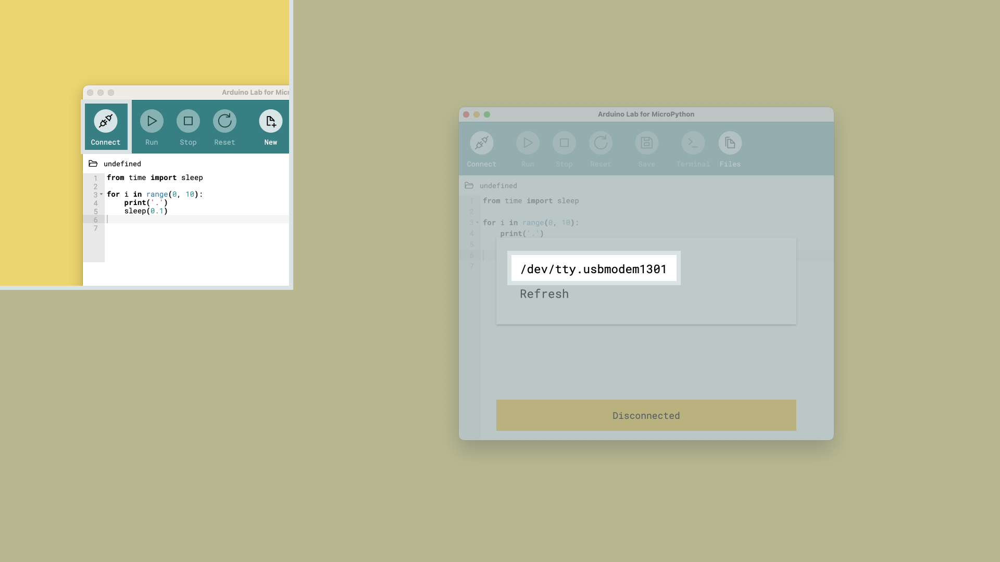

## Goals

In this chapter we will go over how to install the prerequisite software: the **code editor** and the **MicroPython firmware installer**, that will enable you to dive into the learning activities of this course.


The software you will have installed are:

- Arduino Lab for MicroPython
- The Arduino MicroPython Installer


Once this has been completed, you will use the MicroPython firmware installer to install the firmware to your board, which lets you access this new MicroPython Arduino workflow.

## Step by Step Installation

**1. Download the Arduino Lab for MicroPython**

This editor will acts as your development environment, and it is here you will write your code as well as load it to your board.

First, [download the app here](https://labs.arduino.cc/en/labs/micropython). It will be downloaded as a `.zip` archive. Extract the files into a folder on your computer, and launch the `.exe` to start up the code editor.

If you're on macOS, move the application to your **Applications** folder.

**2. Download the Firmware Installer**

The **Firmware Installer** program will help install MicroPython on your board.

It will automatically download the latest version of the MicroPython firmware and install it on your board, so that all you need to do is to connect the board and press a button.

First [download the app here](https://labs.arduino.cc/en/labs/micropython-installer), and extract the files to a folder on your computer.

If you're on macOS, move the application to your **Applications** folder.

**3. Flash Firmware**

Now open the Firmware Installer tool, select the Arduino Nano ESP32, and press **"Install MicroPython"**. Wait for the installer to do its magic and after some seconds, we are ready to go!


If the installer doesn't find the MicroPython firmware automatically, you can download it manually from [here](./assets/nanoesp32_micropython.bin)

**4. Connect your Code Editor and Board**

In the Arduino Lab for MicroPython app, press **connect** in the top left corner and choose the serial port that comes up. This is your Nano ESP32.



**5. Verify**

Now, to verify things are working as they should, copy the script script below into your `main.py` file, and run it by clicking the **"Run"** button.

```python
from machine import Pin
import time

myLED = Pin(0, Pin.OUT)

while True:
    myLED.value(0)
    time.sleep(1)
    myLED.value(1)
    time.sleep(1)
```

After loading the script, we should be seeing a green light blink on the board.


***Some boards from the first limited production batch were assembled with a different RGB LED which has the green and blue pins inverted. Read our full Help Center article [here](https://support.arduino.cc/hc/en-us/articles/9589073738012).***

So what just happened? We just loaded a script to our board, instructing it to blink a green LED every second. This is to confirm things are working, and if you see blinking green light, you successfully installed and uploaded a script to your board!

If you ever want to return your board to program it with the Arduino IDE, you need to put it in bootloader mode. You can read about what this means and how to do it in the [Nano ESP32 Cheat sheet](https://docs.arduino.cc/tutorials/nano-esp32/cheat-sheet#arduino-bootloader-mode).

## Troubleshooting
Got stuck? Here are a few common issues you may run into and tips on how to move forward.

If you can't find what you're looking for in this article, you can have a look in the [Arduino Help Center](https://support.arduino.cc/) for more tips.

### Board not Detected

If your board is not detected by the MicroPython firmware installer app, double check that you've correctly put your board in bootloader mode.

Go back to step 3 in the [Step by Step](#step-by-step) section, and make sure that your board has a purple light by the end of it.

### Connection Fail

If you cannot connect to your board in the code editor, make sure you're selecting the right port.

You can try **disconnecting** any other serial device such as other arduino boards from your computer, to make sure that only one device appears in the list.

## Reset to Arduino / C++

After you've installed MicroPython on your board, you will not be able to program your board in the Arduino IDE unless you reset it to its factory setting.

To do this, **tap the reset button twice**, but not too fast (about 1 second between the taps). If your board is fading its green LED, you've reset the bootloader and your board will now appear in the Arduino IDE.

***Note that you will need to upload a sketch to your board after resetting the bootloader. If you do not, MicroPython will still run on your board.***

## Summary

Congratulations! You’ve completed the installation chapter of MicroPython 101.

Having trouble? Continue to the troubleshooting section. Otherwise, move on to the [Next chapter](/micropython-course/course/introduction-python).