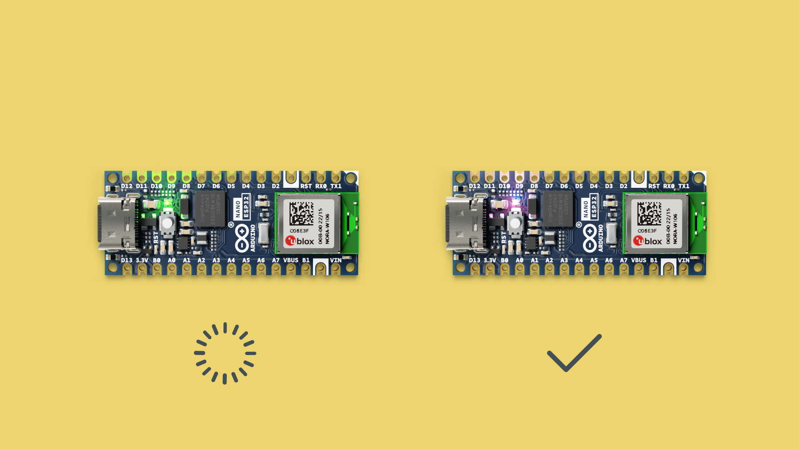

## Goals

In this chapter we will go over how to install the prerequisite software: the **code editor** and the **MicroPython firmware installer**, that will enable you to dive into the learning activities of this course.


The softwares you will have installed are:

- [Arduino Lab for Micropython](https://labs.arduino.cc/en/labs/micropython)
- The Arduino Micropython firmware installer


Once this has been completed, you will use the Micropython firmware installer to install the firmware to your board, which lets you access this new Micropython Arduino workflow.

## Step by Step

1. **Download the Arduino Lab for Micropython.**
This app will acts as your development environment. It is where you will write your code.
[Download the app from here](https://labs.arduino.cc/en/labs/micropython). It will be downloaded as a `.zip` archive, extract the files into a folder on your computer, and launch the `.exe` to start up the code editor. 
If you're on MacOS, move the application to your **Applications** folder.

2. **Download the Firmware Installer**
This app is simply a helper tool, to program your board with Micropython, the board needs a special firmware. This app will automatically download the latest version of this firmware and install it to your board for you, so that all you need to do is to connect the board and press a button. 
[Download the app from here](), and extract the files to a folder on your computer. Now you should be able to launch it and flash the correct firmware.
If you're on MacOS, move the application to your **Applications** folder.

3. **Put the Board in Bootloader Mode**
Connect your board to your computer, and connect B1 to GND with a jumper wire, tweezers, or something else metallic you have handy. Once you see a green light on the board, press the reset button on the board. If you remove the connection between B1 and GND, you should see a dim purple light if this step was successful. If not, then try again.



4. **Flash Firmware**
Now just open the firmware installer tool, select the nano esp32, and press “install micropython”. Wait for the installer to do its magic and you’re ready to go!


5. **Connect your Code Editor and Board**
In the Arduino Lab for Micropython app, press **connect** in the top left and choose the serial port where your board is connected.


6. **Verify**
Now, to verify things are working as they should, run the following code:

```python
from time import sleep
from machine import Pin, PWM

red = PWM(Pin(46), 5000)
blue = PWM(Pin(0), 5000)
green = PWM(Pin(45), 5000)

while True:
  for duty_cycle in range(0, 1024):
        red.duty((1023 - duty_cycle) % 1024)
        green.duty((1023 - duty_cycle + 300) % 1024)
        blue.duty((1023 - duty_cycle + 600) % 1024)
        sleep(0.005)
        
  for duty_cycle in range(0, 1024):
        red.duty((duty_cycle) % 1024)
        green.duty((duty_cycle + 300) % 1024)
        blue.duty((duty_cycle + 600) % 1024)
        sleep(0.005)    
    


```

## Outcome

Congratulations! You’ve completed the installation chapter of Micropython 101. 

Having trouble? Continue to the troubleshooting section. Otherwise, move on to the **[Next chapter](../03.fundamentals/01.python-cc.md)**

### Troubleshooting
Got stuck? Here are a few common issues you may run into and tips on how to move forward.

#### Board not Detected?
If your board is not detected by the Micropython firmware installer app, double check that you've correctly put your board in bootloader mode.
Go back to step 3 in the [Step by Step](#step-by-step) section, and make sure that your board has a purple light by the end of it.

#### Can't connect to your board in Arduino Lab for Micropython?
If you cannot connect to your board in the code editor, make sure you're selecting the right port. 
You can try **disconnecting** any other serial device such as other arduino boards from your computer, to make sure that only one device appears in the list.