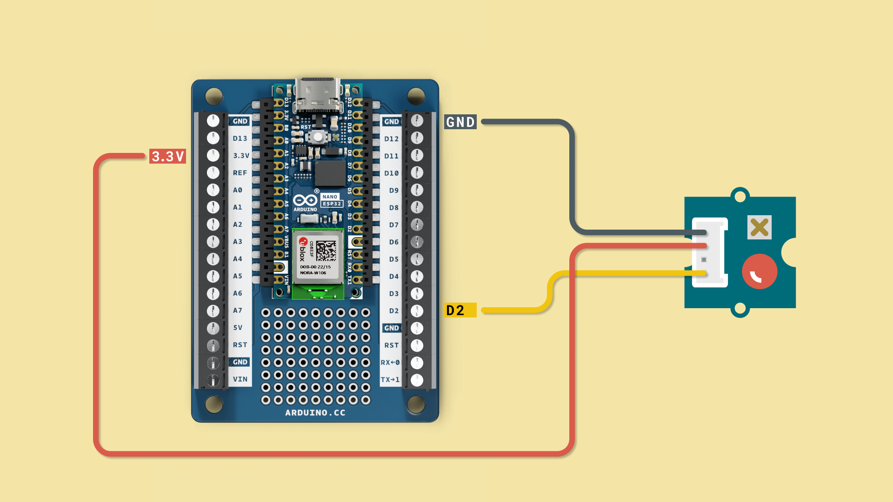
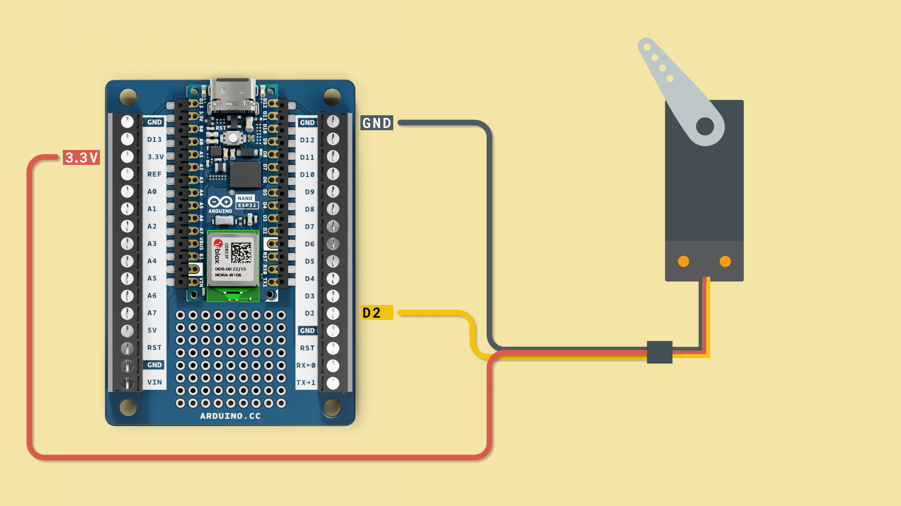
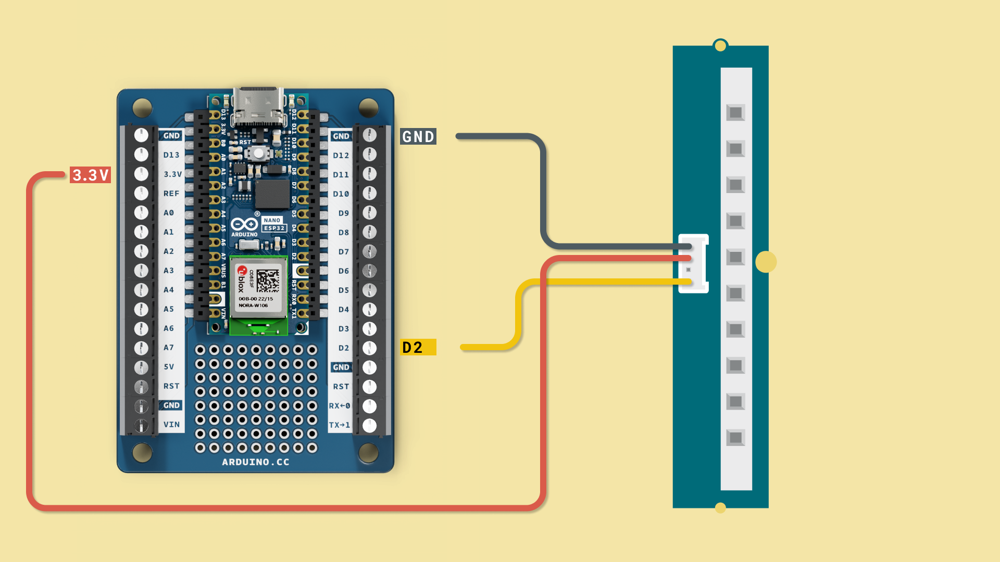
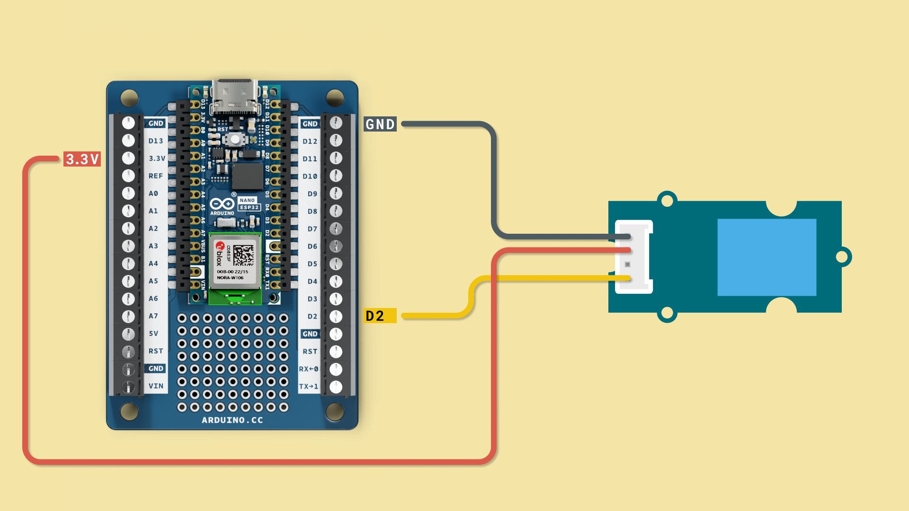
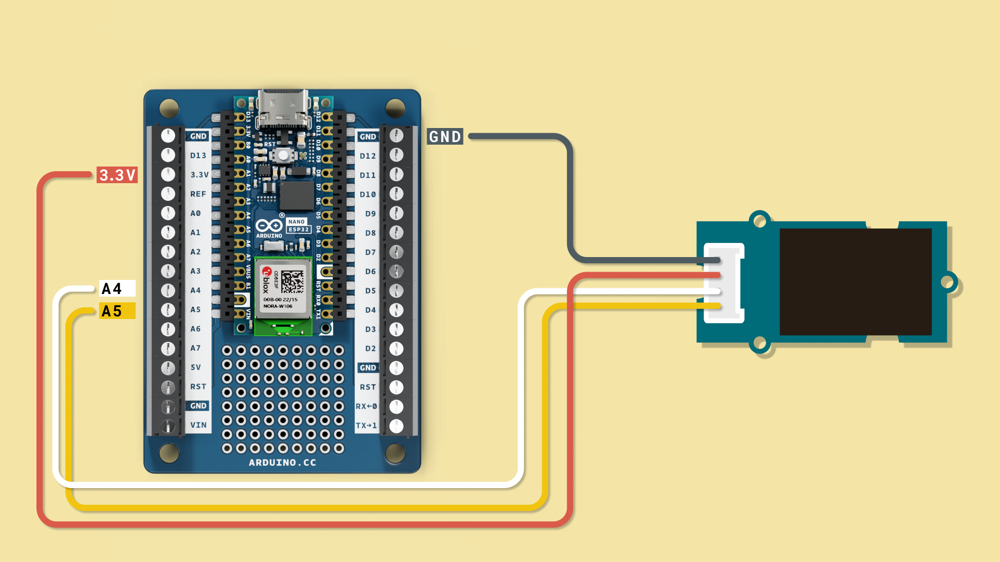
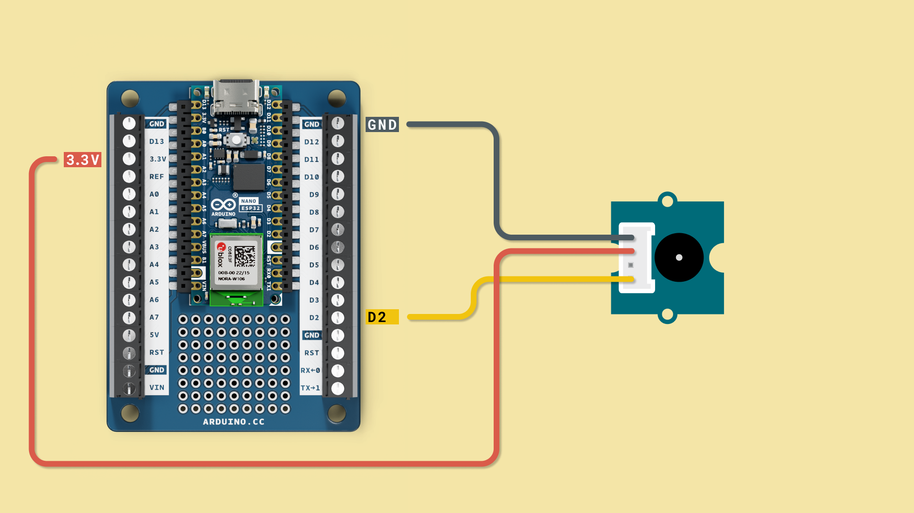
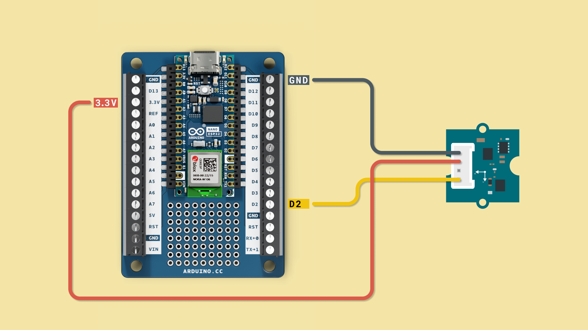
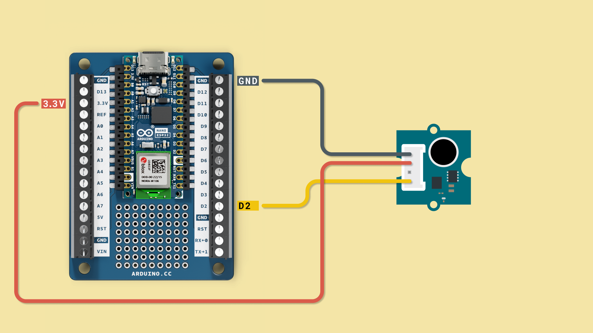
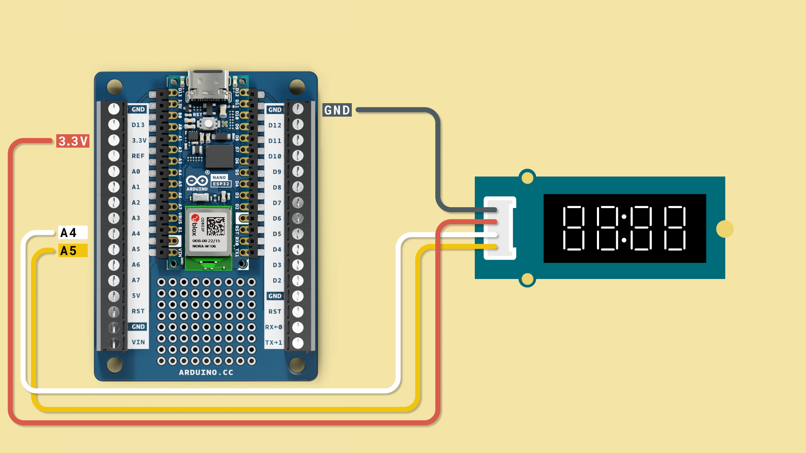
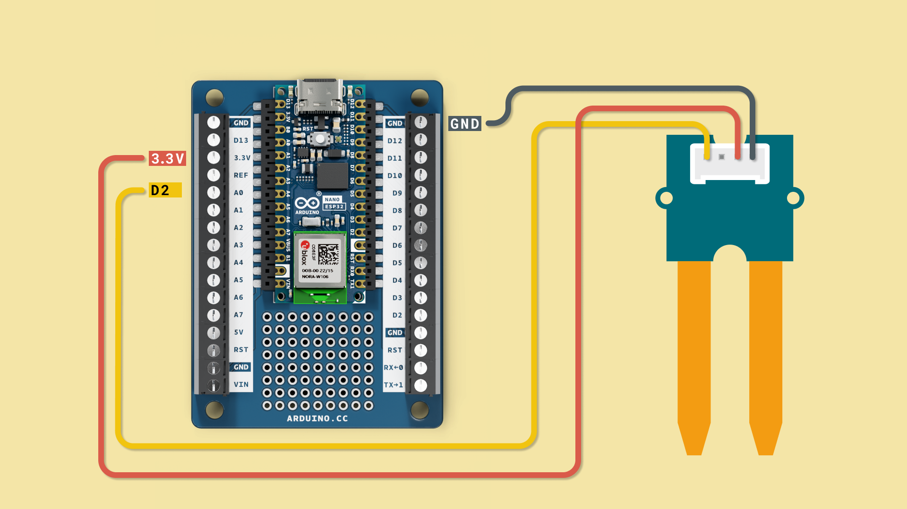

In this final chapter of the MicroPython 101 course, you will find code & circuit examples for popular components, such as motors, displays and sensors. These components can be combined to make fun projects, and works out of the box with the Nano ESP32 & MicroPython.

***External odules used in this chapter are third party and has not been developed by the Arduino team. Credit is due to the developers of these modules.***

## Module Installation

Many of these modules are not included in your MicroPython installation, but don't worry, installing them are very easy and require no additional software!

To install an external module, use the script below. Inside the script, the `URL` variable needs to be replaced with a valid URL that leads to a module. The URL can look like the following:
- https://raw.githubusercontent.com/stlehmann/micropython-ssd1306/master/ssd1306.py

***Make sure to add your own Wi-Fi® network & password to the `WIFI_NETWORK` and `WIFI_PASSWORD` variables.***

```python
"""
This script first connects to Wi-Fi,
then installs the module specified
in the URL variable.
"""

import network
import mip

WIFI_NETWORK='YOUR_NETWORK_NAME'
WIFI_PASSWORD='YOUR_NETWORK_PASSWORD'
URL = "github.com/example"

wlan = network.WLAN(network.STA_IF)
wlan.active(True)
wlan.connect(WIFI_NETWORK, WIFI_PASSWORD)

print()
print("Connected to ",WIFI_NETWORK)

mip.install(URL)
```

Running this script will install the module on your board, inside a folder called `lib`. You can check this out under **"Files"** while your board is connected via your MicroPython editor.

***How to install modules are explained in more detail in the [Introduction to MicroPython](/micropython-course/course/introduction-python) chapter.***

### Removing Modules

If you install too many modules, you will run out of space. You can remove a module directly in the editor, by selecting the file and clicking on the **"Delete"** icon.

***For more detailed instructions, see the [Removing Modules](/micropython-course/course/introduction-python#removing-modules) section in the second chapter.***

## Button

This example shows how to use a [pushbutton](https://store.arduino.cc/products/grove-button-p) with MicroPython. Connect the button as shown below. Even though the Grove cable has four cables we only need three (Power, GND, Signal).


To use this component, copy the script script below into your `main.py` file, and run it by clicking the **"Run"** button.

```python
# Import the Pin class from the machine module
from machine import Pin
# Import the sleep function from the time module
from time import sleep     

# Create a Pin object for pin 5 as an input with a pull-up resistor
button = Pin(5, Pin.IN, Pin.PULL_UP)   

# Start an infinite loop
while True:
    # Read the current state of the button    
    button_state = button.value()    
    # Check if the button state is LOW (0)
    if button_state == 0:    
        # If the button is not pressed, print a message
        print("Button not pressed")    
    else:
        # If the button is pressed, print a message
        print("Button pressed")    
    # Pause the program for 0.5 seconds
    sleep(0.5)    
```

Now whenever you press the button you should see `Button pressed` being printed in the REPL. 

<video width="100%" loop autoplay>
<source src="assets/Button.mp4" type="video/mp4" />
</video>

## LED

This example shows how to create the classic blink example using MicroPython and a [Grove LED](https://www.seeedstudio.com/Grove-Red-LED.html).



To use this component, copy the script script below into your `main.py` file, and run it by clicking the **"Run"** button.

```python
# Import the Pin class from the machine module
from machine import Pin   
# Import the sleep function from the time module 
from time import sleep     

# Create a Pin object for pin 5 as an output
led = Pin(5, Pin.OUT)    

# Start an infinite loop
while True:    
    # Turn on the LED
    led.on()  
    # Pause the program for 1 second  
    sleep(1)   
    # Turn off the LED 
    led.off()  
    # Pause the program for 1 second 
    sleep(1)    
```

You should now see the led blinking. Change the code to make it speed up or slow down. 

<video width="100%" loop autoplay>
<source src="assets/led.mp4" type="video/mp4" />
</video>

## Servo

This code controls a [servo motor](https://store.arduino.cc/products/grove-servo) connected to Pin 5 (D2) using PWM. As with any motor if the current is being drawn due to the motor needing too much power the board resets.

***You should always use an external power supply when powering a servo. Servo motor consume very high amounts of current when initiated, which can reset your board or damage it.***



To use this component, copy the script script below into your `main.py` file, and run it by clicking the **"Run"** button.

```python
# Import the Pin and PWM classes from the machine module
from machine import Pin, PWM   
# Import the time module
import time                    

# Create a PWM object named 'servo' on pin 5 configured as an output
servo = PWM(Pin(5, mode=Pin.OUT))    
# Set the frequency of the PWM signal to 50Hz
servo.freq(50)                      

# Start an infinite loop
while True:    
    # Set the duty cycle of the PWM signal to 26 (position 1 of the servo)
    servo.duty(26)  
    # Pause the program for 1 second  
    time.sleep(1)     
    # Set the duty cycle of the PWM signal to 123 (position 2 of the servo)
    servo.duty(123)  
    # Pause the program for 1 second 
    time.sleep(1)     
```

You should now see the servo moving back and forth in an endless loop.

<video width="100%" loop autoplay>
<source src="assets/servoMotor.mp4" type="video/mp4" />
</video>

## Neopixel

This example shows how to use a [Neopixel](https://www.seeedstudio.com/Grove-RGB-LED-Stick-10-WS2813-Mini.html) strip with 10 RGB LEDs. Although we are addressing 10 LEDs at once we luckily still only need one signal pin making our setup super easy. Connect the RGB strip as seen in the circuit below, copy the code to `main.py` and press play.



To use this component, copy the script script below into your `main.py` file, and run it by clicking the **"Run"** button.

```python
# Import the Pin class from the machine module
from machine import Pin
# Import the sleep class from the time module
from time import sleep
#Import the neopixel module
import neopixel

# Set the number of pixel on the RGB strip
PIXEL_NUMBER = 10
# Create a NeoPixel object with 24 pixels connected to pin 21
np = neopixel.NeoPixel(Pin(21), PIXEL_NUMBER)   

# Define colors
purple = (200, 0, 200)
black = (0, 0, 0)

# Fill the entire strip with black color (turn off all pixels)
np.fill(black)   
# Update the NeoPixel strip to reflect the changes
np.write()       

# Function for turning on all pixels on after the other
def ringUp():
    #loop through all pixels
    for i in range(0, PIXEL_NUMBER):
        # Set the i-th pixel to purple color
        np[i] = purple   
        # Update the NeoPixel strip to reflect the changes
        np.write()   
        # Pause for 0.1 seconds    
        sleep(0.1)       
        
# Function for turning on all pixels off after the other
def ringDown():
    for i in range(0, PIXEL_NUMBER):
        np[i] = black  
        np.write()     
        sleep(0.1)     
        
# Function for turning on all pixels off
def ringOff():
    for i in range(0, PIXEL_NUMBER):
        np[i] = black  
    np.write()         
    
# Function looping through ringUp() and ringDown()
def runPixelRun():
    while(1):             
        ringUp()        
        ringDown()      
    
# Start running the pixel animation
runPixelRun()             
```

You should now see a the LED RGB strip fade in and out.

<video width="100%" loop autoplay>
<source src="assets/neopixel.mp4" type="video/mp4" />
</video>

## DHT11

This example shows how to use a [DHT11](https://www.seeedstudio.com/Grove-Temperature-Humidity-Sensor-DHT11.html) with an Arduino Nano ESP32. DHT sensors are temperature and humidity sensors and make use of the built-in `dht` module.



To use this component, copy the script script below into your `main.py` file, and run it by clicking the **"Run"** button.

```python
#import dht module
import dht
#import Pin class from machine module
from machine import Pin
# Import sleep_ms class from time module
from time import sleep_ms

# Define sensor pin
SENSOR_PIN = 5

# Create a DHT11 object with the specified pin number
TEMP_SENSOR = dht.DHT11(Pin(SENSOR_PIN))  
# Pause for 500 milliseconds to allow the sensor to stabilize 
sleep_ms(500)                             

# Loop indefinitely
while(1):   
    # Trigger a measurement from the DHT11 sensor                              
    TEMP_SENSOR.measure()               
    # Print the measured temperature   
    print("Temperature:",TEMP_SENSOR.temperature())   
    print("Humidity:",TEMP_SENSOR.humidity())          
    # Pause for 1 second before taking the next measurement
    sleep_ms(1000)                         

```

You should now see the temperature and humidity printed in the REPL, every second.

<video width="100%" loop autoplay>
<source src="assets/DHT11.mp4" type="video/mp4" />
</video>

## OLED Screen

This example demonstrates how to use an [OLED](https://store.arduino.cc/products/grove-oled-display-0-96) screen via I2C.



This module is not part of the MicroPython installation, and needs to be installed via the following command:

```python
mip.install("https://raw.githubusercontent.com/micropython/micropython-lib/master/micropython/drivers/display/ssd1306/ssd1306.py")
```

Once installed, you can run the script below, by clicking the **"Run"** button.

***If you are using a different OLED screen make sure to adjust the screen size in the code to display the content properly.***

```python
# Import the Pin class and SoftI2C class (for using I2C) form the machine module
from machine import SoftI2C, Pin
# Import Oled module
import ssd1306
# Import the sleep_ms class from the time module
from time import sleep_ms

# Set the display width to 128 pixels
DISPLAY_WIDTH = 128   
# Set the display height to 64 pixels
DISPLAY_HEIGHT = 64   

class Point():
    def __init__(self, x, y):
        # Initialize the x-coordinate of the point
        self.x = x   
        # Initialize the y-coordinate of the point
        self.y = y   

# Create a Point object with initial coordinates (64, 32)
old_coords = Point(64, 32)   
# Create a Point object with initial coordinates (64, 32)
new_coords = Point(64, 32)  

# Create a SoftI2C object for I2C communication with the specified pins and frequency
i2cbus = SoftI2C(scl=Pin(12), sda=Pin(11), freq=100000)   
print(i2cbus)

# Create an SSD1306 OLED object with the specified width, height, and I2C bus
oled = ssd1306.SSD1306_I2C(DISPLAY_WIDTH, DISPLAY_HEIGHT, i2cbus)   
# oled.fill(0)
oled.show()

# Display the text "Hello" at the specified coordinates
oled.text('Arduino', 40, 12)      

# Display the text "World" at the specified coordinates        
oled.text('MicroPython', 23, 45)     

# Update the OLED display to reflect the changes
oled.show()                          
```

You should now see `Hello World` printed on the screen.


## Buzzer

This example shows how to use a [Grove Buzzer](https://store.arduino.cc/products/grove-buzzer-piezo). Following the same principle connect the button as shown in the circuit below.



To use this component, copy the script script below into your `main.py` file, and run it by clicking the **"Run"** button.

```python
from machine import Pin, PWM
import time

# Pin connected to the Grove Speaker
SPEAKER_PIN = 5

# Frequency and duration of the sound
FREQUENCY = 220  # Hz
DURATION = 2  # seconds

# Create a controllable Pin for the speaker
speaker = PWM(Pin(SPEAKER_PIN))

# Function to play a sound
def play_sound(frequency, duration):
    speaker.freq(frequency)
    speaker.duty(512)
    time.sleep(duration)
    speaker.duty(0)

# Play the sound
play_sound(FREQUENCY, DURATION)
```

Now your buzzer should be making a buzzing sound. You can now change the code and play with the intensity and duration.

## Accelerometer

This example shows how to use a [Grove Accelerometer](https://store.arduino.cc/products/grove-3-axis-digital-accelerometer-16g) using I2C. This particular sensor can measure acceleration and its position in space. Because it's using I2C it needs all four wires as shown in the circuit below.



This module is not part of the MicroPython installation, and needs to be installed via the following command:

```python
mip.install("https://raw.githubusercontent.com/tinypico/tinypico-micropython/master/lis3dh%20library/lis3dh.py")
```

Once installed, you can run the script below, by clicking the **"Run"** button.

```python
# Import lis3dh, time, and math classes
import lis3dh, time, math
# Import Pin and SoftI2C class from the machine module
from machine import Pin, SoftI2C

i2c = SoftI2C(sda=Pin(11), scl=Pin(12)) # I2C
imu = lis3dh.LIS3DH_I2C(i2c, address=0x19)

last_convert_time = 0
convert_interval = 100 #ms
pitch = 0
roll = 0


# Convert acceleration to Pitch and Roll
def convert_accell_rotation( vec ):
    x_Buff = vec[0] # x
    y_Buff = vec[1] # y
    z_Buff = vec[2] # z

    global last_convert_time, convert_interval, roll, pitch

    # We only want to re-process the values every 100 ms
    if last_convert_time < time.ticks_ms():
        last_convert_time = time.ticks_ms() + convert_interval

        roll = math.atan2(y_Buff , z_Buff) * 57.3
        pitch = math.atan2((- x_Buff) , math.sqrt(y_Buff * y_Buff + z_Buff * z_Buff)) * 57.3

    # Return the current values in roll and pitch
    return ( roll, pitch )

# If we have found the LIS3DH
if imu.device_check():
    # Set range of accelerometer (can be RANGE_2_G, RANGE_4_G, RANGE_8_G or RANGE_16_G).
    imu.range = lis3dh.RANGE_2_G

    # Loop forever printing values
    while True:
        # Read accelerometer values (in m / s ^ 2).  Returns a 3-tuple of x, y,
        # z axis values.  Divide them by 9.806 to convert to Gs.
        x, y, z = [value / lis3dh.STANDARD_GRAVITY for value in imu.acceleration]
        print("x = %0.3f G, y = %0.3f G, z = %0.3f G" % (x, y, z))

        # Convert acceleration to Pitch and Roll and print values
        p, r = convert_accell_rotation( imu.acceleration )
        print("pitch = %0.2f, roll = %0.2f" % (p,r))

        # Small delay to keep things responsive but give time for interrupt processing.
        time.sleep(0.1)
```

Move around your sensor to see the numbers in the REPL change. This is the acceleration data recorded. This data can be used to trigger specific things whenever a specific movements is initalized.

<video width="100%" loop autoplay>
<source src="assets/Accelerometer.mp4" type="video/mp4" />
</video>

## Sound Sensor

This example shows how to use a [sound sensor](https://store.arduino.cc/products/grove-sound-sensor). This is a simple microphone that provides an analog output signal.



To use this component, copy the script script below into your `main.py` file, and run it by clicking the **"Run"** button.

```python
# Import Pin and ADC class from the machine module
from machine import Pin, ADC
# Import the time module
import time

# Create an ADC object and associate it with pin 5
pin_adc = ADC(Pin(5))      
# Set the attenuation level to 11dB, which allows for a wider input voltage range
pin_adc.atten(ADC.ATTN_11DB)   

while True:
    sum_value = 0

    for i in range(32):
        # Read the ADC value and add it to the sum
        sum_value += pin_adc.read()   

    # Right shift the sum by 5 bits (equivalent to dividing by 32) to get the average value
    sum_value >>= 5   

    # Print the average value   
    print(sum_value)   
    # Pause for 100 milliseconds
    time.sleep_ms(100)   
```

After running the script, test it out by clapping your hands or making other loud noises next to the sensor. You should see the output change in the REPL. 

<video width="100%" loop autoplay>
<source src="assets/SoundSensor.mp4" type="video/mp4" />
</video>

## 4 Digit Display

This example shows how to use a [Grove 4-digit display](https://store.arduino.cc/products/grove-4-digit-display). 

4 digit displays are very basic types of displays that are often seen in alarm clocks as they can display any number between 0 - 9. This sensors also uses I2C which is why we need all four wires as shown below.



This module is not part of the MicroPython installation, and needs to be installed via the following command:

```python
mip.install("https://raw.githubusercontent.com/mcauser/micropython-tm1637/master/tm1637.py")
```

Once installed, you can run the script below, by clicking the **"Run"** button.

```python
from machine import Pin
from time import sleep
import tm1637

tm = tm1637.TM1637(clk=Pin(10), dio=Pin(11))

tm.write([63, 191, 63, 63])  # Write a specific pattern of segments to the TM1637 display
sleep(1)

tm.numbers(17, 23)  # Display the numbers 17 and 23 on the TM1637 display
sleep(1)
tm.show('abcd')  # Display the characters 'abcd' on the TM1637 display
sleep(1)
tm.show('bcde')  # Display the characters 'bcde' on the TM1637 display
sleep(1)
tm.show('cdef')  # Display the characters 'cdef' on the TM1637 display
sleep(1)

tm.temperature(20)  # Display the temperature value 20 on the TM1637 display

```

You should now see the display showing different numbers, where the final frame is a simulated temperature value (20).


## Moisture Sensor

This example shows how to use a [moisture sensor](https://store.arduino.cc/products/grove-moisture-sensor). 

This sensor is used to measure moisture by measuring the resistance between the two probes. Dry soil has less conductivity than wet soil and the difference in resistance and the resulting drop/increase in voltage can be measured by the Arduino.



To use this component, copy the script script below into your `main.py` file, and run it by clicking the **"Run"** button.

```python
# Import machine module
import machine
# Import time module
import time

# Define sensor pin
adc_pin = machine.Pin(4)
# Create ADC object and associate it with sensor pin
adc = machine.ADC(adc_pin)

#function mapping sensor values from 0 to 100.
def map_value(value, in_min, in_max, out_min, out_max):
    return (value - in_min) * (out_max - out_min) / (in_max - in_min) + out_min

# Infinite loop
while True:
    # Read sensor values
    reading = adc.read_u16()
    # Map sensor readings from 0 - 100 for improved user experience
    mapped_reading = map_value(reading, 0, 65535, 0, 100)
    # Print values in REPL
    print("Moisture: ", reading, " Mapped Moisture: ", mapped_reading)
    # Add short sleep timer for improved readability
    time.sleep_ms(500)
```

After running the script, you should see the values from the moisture sensor printed in the REPl. 

<video width="100%" loop autoplay>
<source src="assets/Moisture.mp4" type="video/mp4" />
</video>