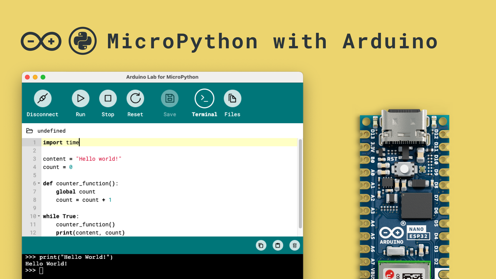
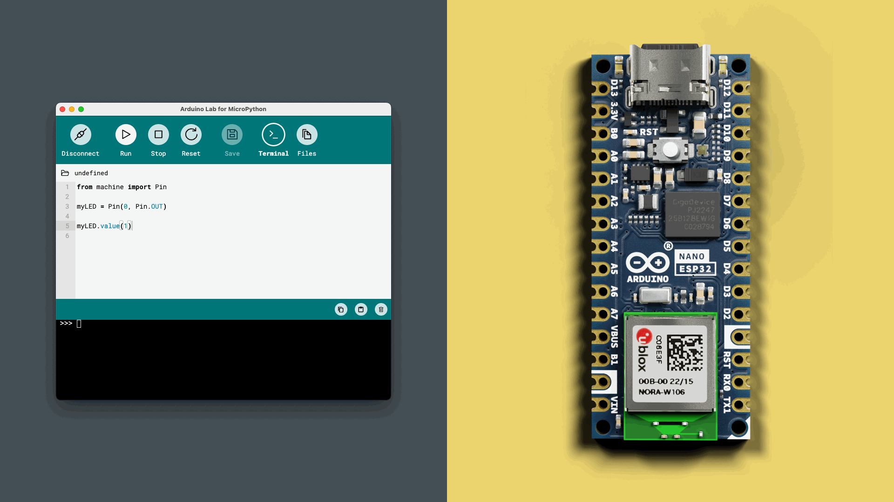

MicroPython is a lightweight implementation of Python 3 designed to run on microcontrollers and embedded systems. Think of it as a mini-version of Python, tailored for hardware with limited resources like memory and processing power. Despite its smaller size, MicroPython retains the simplicity and flexibility of Python, making it an excellent option for programming hardware.

## MicroPython on Arduino Boards

When using MicroPython on Arduino boards, the software is first installed on your Arduino. This allows the board to interpret and run Python code. Once MicroPython is installed on your board (don't worry, we'll cover this [here]()), you can start writing and executing Python scripts instantly.

Unlike traditional development approaches, where you compile code and then flash it to the board, with MicroPython you write Python scripts and run them instantly on your Arduino. This makes the development process much faster and more interactive. 

## Running Programs in MicroPython

Once MicroPython is installed, you can start programming by writing scripts and uploading them to the board. These scripts are interpreted in real-time, meaning you can make quick changes and see immediate results, streamlining the development process.

MicroPython also includes a simple file system where your scripts are stored. For example, when you write a script, it is saved directly on the board and can be executed immediately without compiling. You can also save other scripts that can be activated from the main script!

### How it Works

The MicroPython installation includes several key components:

1. **File System**: MicroPython has a small file system built into the microcontroller. You can store Python scripts and configuration files on the board itself. Common files include:
    - `main.py`: This script runs automatically when the board boots up. It's where you can put the main logic of your program.
    - `boot.py`: This script runs before `main.py` and is often used for setting up configurations like WiFi connections or hardware initialization.

   These files are fully editable, allowing you to control how your board starts and operates.

2. **Base Modules**: MicroPython comes with built-in modules for working with hardware like pins, sensors, and communication protocols (I2C, SPI, etc.). This includes essential modules like `machine`, `network`, and `time`.

## How to Program for MicroPython

Programming in MicroPython involves writing Python scripts in a text editor and then running them on your board. For this, we can use the [Arduino Lab for MicroPython]().

When writing MicroPython code, it's essential to think in terms of **modularity**. A good practice is to break down your code into smaller, reusable modules rather than writing everything in one large file. This approach makes it easier to manage and maintain code, especially for larger projects.

### Structuring Your Code

1. **Main Logic**: This goes into the `main.py` file. You can think of it as your "sketch" in Arduino terms.
2. **Helper Modules**: Break down your code into smaller modules for specific tasks, such as controlling a sensor or managing a display. These modules can be imported into `main.py` as needed.
3. **Interrupts and Background Tasks**: If you're dealing with hardware, you may also need to work with interrupts or periodic tasks, which can be handled in dedicated modules.

## MicroPython vs. C++ for Electronics Projects

MicroPython offers a different approach to programming compared to the traditional C++ used in Arduino development. Here are a few key comparisons:

- **Ease of Use**: Python’s syntax is generally more accessible for beginners. It is less verbose and easier to read, which can speed up the learning process.
- **Real-Time Interactivity**: With MicroPython, you can write and test code interactively, without needing to compile. This makes it faster to experiment and troubleshoot hardware setups.
- **Resource Efficiency**: C++ is more efficient in terms of memory and speed, making it a better option for projects that need to squeeze every bit of performance out of the hardware. MicroPython, on the other hand, prioritizes ease of development over raw performance, but it is still capable of handling many common hardware tasks.

## Summary

In summary, MicroPython provides a powerful and flexible way to develop electronic projects, especially for those familiar with Python. Its ability to run on microcontrollers like Arduino boards makes it an attractive option for both beginners and experienced developers who want a fast and efficient workflow.
