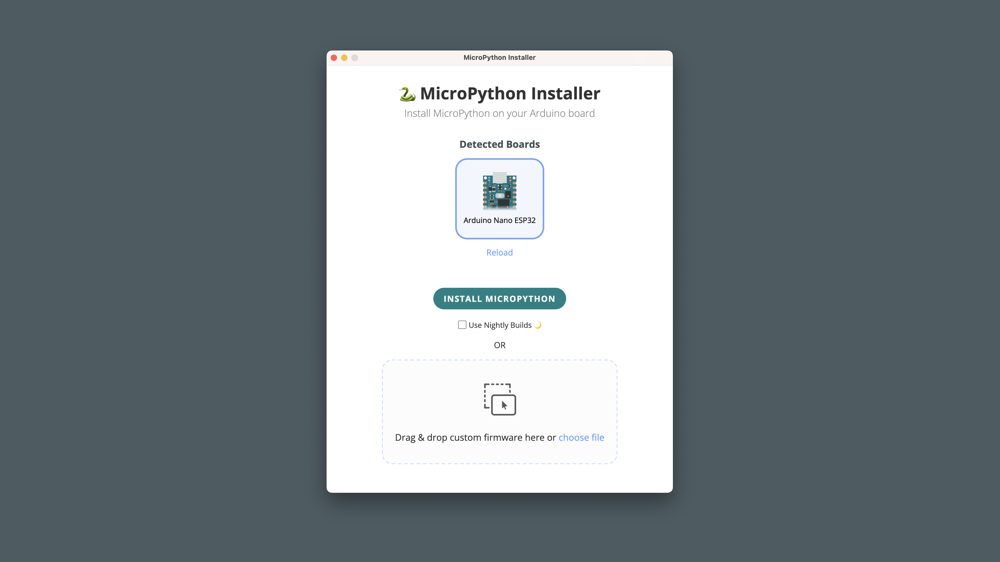
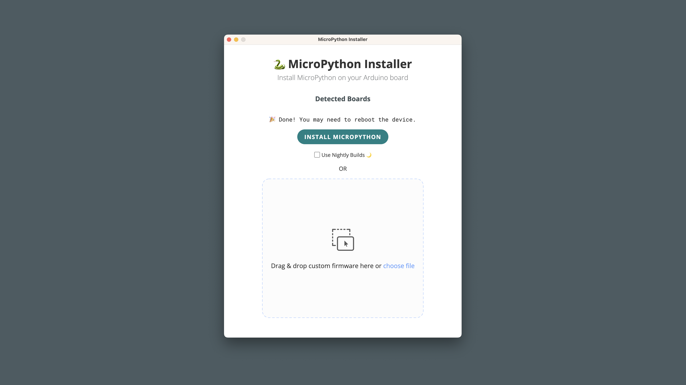
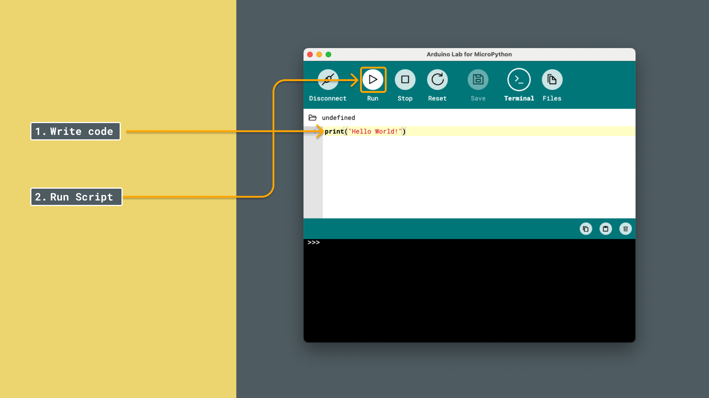
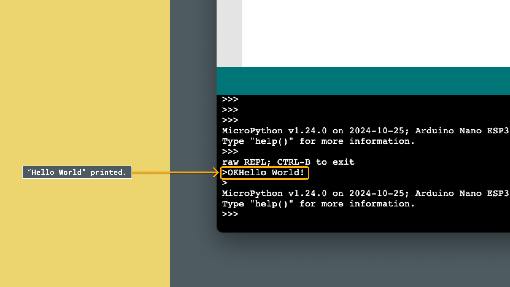

# Installing MicroPython

In this article, we will go through the necessary tools needed to install and run MicroPython on an Arduino board. By the end of this guide, we will be ready to write and run our first MicroPython script. Let's get started!

## Requirements

Before we start, let's check the requirements:

### MicroPython Compatible Arduino Boards

MicroPython is officially supported on several Arduino boards. Here’s a list of the compatible boards:

- [Portenta C33](https://store.arduino.cc/products/portenta-c33)
- [Arduino GIGA R1 WiFi](https://store.arduino.cc/products/arduino-giga-r1-wifi)
- [Portenta H7](https://store.arduino.cc/products/portenta-h7)
- [Portenta H7 Lite](https://store.arduino.cc/products/portenta-h7-lite)
- [Portenta H7 Lite Connected](https://store.arduino.cc/products/portenta-h7-lite-connected)
- [Arduino Nano RP2040 Connect](https://store.arduino.cc/products/arduino-nano-rp2040-connect)
- [Nicla Vision](https://store.arduino.cc/products/nicla-vision)
- [Arduino Nano 33 BLE](https://store.arduino.cc/products/arduino-nano-33-ble)
- [Arduino Nano 33 BLE Rev2](https://store.arduino.cc/products/nano-33-ble-rev2)
- [Arduino Nano 33 BLE Sense Rev2](https://store.arduino.cc/products/arduino-nano-33-ble-sense-rev2)
- [Arduino Nano ESP32](https://store.arduino.cc/products/arduino-nano-esp32)

### Software Requirements

- [MicroPython Firmware Installer](https://labs.arduino.cc/en/labs/micropython-installer) - the firmware installer is needed to install MicroPython on our Arduino board. 
- [Arduino Lab for Micropython](https://labs.arduino.cc/en/labs/micropython) - Arduino Lab for MicroPython is an editor where we can create and run MicroPython scripts on our Arduino board.

***Note that the editor is also available online, at [Arduino Cloud - Arduino Labs for MicroPython](https://lab-micropython.arduino.cc/)***

## Install MicroPython

1. First, download the [Micropython Firmware Installer](https://labs.arduino.cc/en/labs/micropython-installer) and launch it.
2. Connect your board to your computer, it should be recognized by the installer.
    
3. Press **INSTALL MICROPYTHON**. A loading animation will appear.

    Once the firmware is installed a "Installation successful" message will appear. At this point you can safely close the  installer as your board is now ready for tinkering!
    

## Editor Setup

After installing MicroPython on your board, we will need an editor to write code. We now have the option to choose the **offline** or **online** option.

### Offline Setup

First, download the latest version of [Arduino Lab for MicroPython](https://labs.arduino.cc/en/labs/micropython) for your operative system. See instructions for MacOS / Windows below:

#### MacOS

Unzip the downloaded file, and run the application.

#### Windows

Unzip the downloaded file, and run the executable file (`.exe`). 

### Online Setup

Alternatively, we can use the IDE without the need of installing anything. Simply visit the link below:
- [Arduino Lab for MicroPython (online)](https://lab-micropython.arduino.cc/).

## Connecting Board and IDE

At this point in the tutorial, we have
- Installed MicroPython on our board
- Downloaded and installed the editor (or opted for the online version).

We will now try out running a script on the board, to make sure things are working properly.

1. Plug the Arduino board into the computer using a USB cable.
    
2. Press the connection button on the top left corner of the window. The connected Arduino board should appear (by its port name), and we can click it:
    

We have now set up all necessary steps for running a script!

## Running a Test Script

With the installation and setup complete, let's try out running a very simple script: **Hello World!**

1. In the text area field of the editor, write `print("Hello World!")`, and then click on the play symbol (RUN). 
   
2. After running it, you should see `Hello World!` in the black box. This is the board sending the **"Hello World!"** back to you, because the script is run on the board, not on the computer. This means everything is successful, and you are ready to start writing MicroPython scripts! 
   

## Troubleshooting

If you run into any issues during installation, here are some common problems and solutions:

- **Board Not Detected** - if you cannot locate your board, ensure that your board is properly connected and the correct USB drivers are installed. Try using a different USB cable, or double tap the reset button on the board. If a light starts fading, it means it is in default mode, and is ready to be installed!

- **Unable to Install Firmware** - double-check that the MicroPython Firmware Installer was able to install the firmware and that your board is compatible (it will not show up on the installer if it is not). Also, verify that no other software is using the same serial port.

## Summary

By following these steps, you should be able to successfully install MicroPython on your Arduino board and run your first script.

### Next Steps

This tutorial is **Part Two** of the **"First Steps"** series. We recommend you following the next tutorial that will allow you to control the Arduino board's LED.
- [First Steps - My First Script](/micropython/first-steps/first-script)
 

