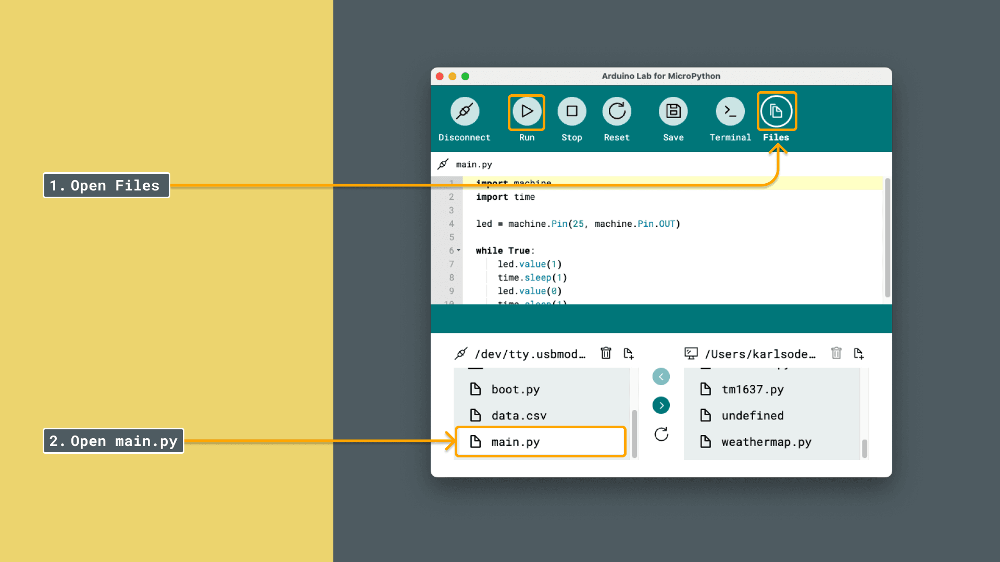
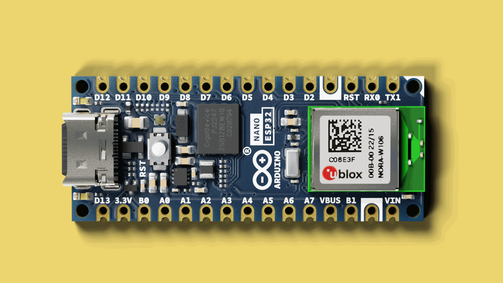

In this tutorial, we will create our very first MicroPython script that will run on an Arduino board. Starting of simple, we will make an LED blink, a classic beginner project that will get us familiar with the MicroPython programming environment.

## Requirements

Before we start, let's check the requirements:

### MicroPython Compatible Arduino Boards

MicroPython is officially supported on several Arduino boards. Here’s a list of the compatible boards:

- [Portenta C33](https://store.arduino.cc/products/portenta-c33)
- [Arduino GIGA R1 WiFi](https://store.arduino.cc/products/arduino-giga-r1-wifi)
- [Portenta H7](https://store.arduino.cc/products/portenta-h7)
- [Portenta H7 Lite](https://store.arduino.cc/products/portenta-h7-lite)
- [Portenta H7 Lite Connected](https://store.arduino.cc/products/portenta-h7-lite-connected)
- [Arduino Nano RP2040 Connect](https://store.arduino.cc/products/arduino-nano-rp2040-connect)
- [Nicla Vision](https://store.arduino.cc/products/nicla-vision)
- [Arduino Nano 33 BLE](https://store.arduino.cc/products/arduino-nano-33-ble)
- [Arduino Nano 33 BLE Rev2](https://store.arduino.cc/products/nano-33-ble-rev2)
- [Arduino Nano 33 BLE Sense Rev2](https://store.arduino.cc/products/arduino-nano-33-ble-sense-rev2)
- [Arduino Nano ESP32](https://store.arduino.cc/products/arduino-nano-esp32)


### Software Requirements

- [Arduino Lab for Micropython](https://labs.arduino.cc/en/labs/micropython) - Arduino Lab for MicroPython is an editor where we can create and run MicroPython scripts on our Arduino board.

***Note that the editor is also available online, at [Arduino Cloud - Arduino Labs for MicroPython](https://lab-micropython.arduino.cc/)***

## Board and Editor Setup

1. Open the [Arduino Lab for MicroPython](https://labs.arduino.cc/en/labs/micropython) application.
2. Plug the Arduino board into the computer using a USB cable.
    
3. Press the connection button on the top left corner of the window. The connected Arduino board should appear (by its port name), and we can click it:
    

***Need help installing MicroPython on your board? Visit the [MicroPython installation guide](/micropython/first-steps/install-guide).***

## First Script (LED Blink)

Once your board is connected, we can start writing code! Below you will find a basic example, that will flash the built in LED on your board every second. 

1. First, open the `main.py` file on your board. We write in this file, because once saved, the code will run even if you reset the board.
   

2. Copy and paste the following code into your editor:
  ```python
  import machine
  import time

  # The pin used for built-in LED varies
  # GIGA: 0 (green), Nano ESP32: 0 (green), Nano RP2040 Connect: 25
  # Nano BLE Sense: 13
  led = machine.Pin(25, machine.Pin.OUT)

  while True:
      led.value(1)
      time.sleep(1)
      led.value(0)
      time.sleep(1)
  ```

  ***Note: The built-in LED pin varies from board to board. For example, on the Arduino Nano RP2040 Connect, the built-in LED is on pin `25`.***

3. Click the **Run** button in your editor to transfer the script to your board.
   

Once the script is running, the LED on the board should start blinking at one-second intervals. This means our MicroPython script has loaded successfully.



### Code Breakdown

Let's take a look at the code, line by line, to understand what is happening:

- **Import Modules**:

  ```python
  import machine
  import time
  ```

  We import the `machine` and `time` modules to access hardware functions and time delays.

- **Initialize the LED Pin**:

  ```python
  led = machine.Pin(25, machine.Pin.OUT)
  ```

  We create a `Pin` object named `led`, set to pin number `25`, and configure it as an output.

- **Infinite Loop**:

  ```python
  while True:
      led.value(1)
      time.sleep(1)
      led.value(0)
      time.sleep(1)
  ```

  Inside the loop, we:

  - Turn the LED on by setting its value to `1`.
  - Wait for 1 second.
  - Turn the LED off by setting its value to `0`.
  - Wait for another second.
  - Repeat the cycle.

## Understanding Programming Concepts

Let's break down the key programming concepts used in this script:

### `machine` Module

The machine module is a built-in MicroPython library that provides direct access to your board's hardware components. It allows you to control and interact with the microcontroller's features, such as:

- **Pins:** Configure and control digital and analog pins.
- **Timers:** Set up timers for scheduling tasks.
- **Communication Interfaces:** Use protocols like I2C, SPI, and UART.
- **Hardware-Specific Functions:** Access features unique to your microcontroller.

In our script, we use the `machine.Pin` class to interact with a specific pin on the board. By creating a `Pin` object, we can control the voltage level of that pin, which in turn controls the LED.

### `time` Module

The time module provides functions for managing time-related tasks. It allows you to add delays, measure time intervals, and schedule events. Key functions include:

- `time.sleep(seconds)` Pauses the execution of your script for the specified number of seconds. It accepts floating-point numbers for sub-second delays.

### `while True` Loop

A `while True` loop creates an infinite loop, allowing the code inside it to run repeatedly. This is essential for tasks that need to run continuously, like blinking an LED.

## Modification: Make the LED Blink Faster

Let's modify the script to make the LED blink faster. We'll change the delay from 1 second to 0.2 seconds.

### Modified Code

```python
import machine
import time

led = machine.Pin(25, machine.Pin.OUT)

while True:
    led.value(1)
    time.sleep(0.5) # 0.5 seconds
    led.value(0)
    time.sleep(0.5) # 0.5 seconds
```

### Steps

1. Change the `time.sleep(1)` lines to `time.sleep(0.5)`.
2. Upload the modified script to your board.
3. Observe that the LED now blinks faster, turning on and off every 0.5 seconds.

## Summary

Great work! We have now written and modified our first MicroPython script on an Arduino board. This exercise introduced:

- Importing modules (`machine`, `time`)
- Initializing hardware components (LED)
- Using loops (`while`)
- Controlling time delays (`time.sleep()`)

These concepts are key for a vast majoraty of operations we can perform while writing MicroPython programs.

