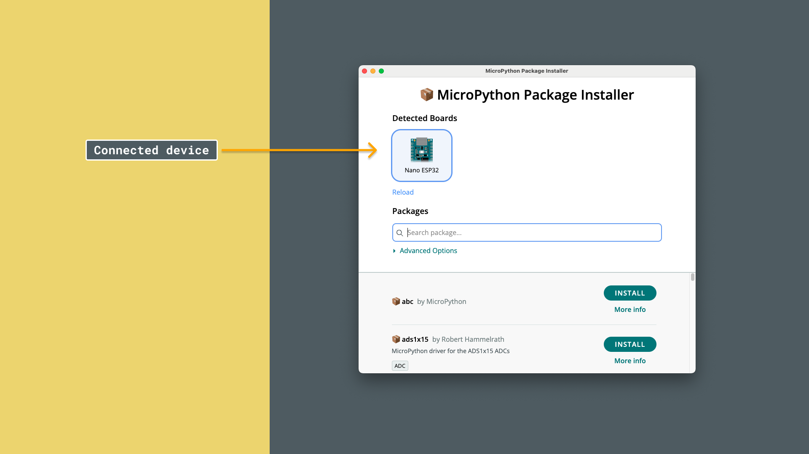
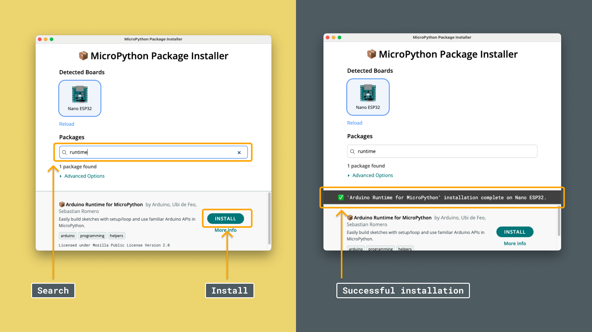

The [Arduino Runtime Package](https://github.com/arduino/arduino-runtime-mpy/tree/main) is a MicroPython package that allows you to write and program your board using the classic `setup()` and `loop()` constructs.

The package was designed to make it easier to create programs, particularly for those familiar with the Arduino C++ environment.

In this tutorial, you will learn how the package works, along with a set of examples that will get you started.

## Requirements

To follow this tutorial, you will need to have the following requirements ticked:

### Hardware Requirements

- [A MicroPython compatible board](/micropython/first-steps/install-guide/#micropython-compatible-arduino-boards) (in this tutorial, we will be using an [Arduino Nano ESP32](https://store.arduino.cc/products/nano-esp32))
- MicroPython installed on your board (see [installation instructions for MicroPython](/micropython/first-steps/install-guide/)).

### Software Requirements

- [Arduino Lab for Micropython](https://labs.arduino.cc/en/labs/micropython) - an editor where we can create and run MicroPython scripts on an Arduino board.
- [Arduino MicroPython Package Installer](https://labs.arduino.cc/en/labs/micropython-package-installer) - for installing **MicroPython packages** on an Arduino board.

## Installation

To use the runtime package, we will need to install it first.

1. Download and install the [Arduino MicroPython Package Installer](https://labs.arduino.cc/en/labs/micropython-package-installer).
2. Connect your board to your computer.
3. Run the tool. In the tool, you should now see your board connected.

   

4. After verifying that your board is connected, click on the search field, and search for **runtime**. Install the package.

   

5. When the installation is complete, we are ready to use the package.

## Basic Example

We will begin by one of the most known example: blinking an LED. Let's take a look at the code example below:

```python
from arduino import *

led = 'LED_BUILTIN'
def setup():
  print('starting my program')

def loop():
  print('loopy loop')
  digital_write(led, HIGH)
  delay(500)
  digital_write(led, LOW)
  delay(500)

start(setup, loop)
```

This program has two main functions: `setup()` and `loop()`. If you are unfamiliar with this concept, here's how it works:

- `setup()` - this function will run just once, at the start of a program. Like in this example, we use `print('starting my program')`.
- `loop()` - this function will continue to run, until you disrupt the program by disconnecting the board or stopping the script.

Inside of the functions, you can see that we are using `digital_write(led, HIGH)`. This is a function that will enable a pin on the board, and write it high (or low). Since we configured it at the top as `'LED_BUILTIN'`, we will control that LED on the board.

At the bottom of the program, we have something called `start()`. This function will launch the program and concurrently run the `loop()` function.

## Common Examples

Arduino Runtime was created to simplify the code creation when programming in MicroPython, providing a more user-friendly syntax that allows you to understand the programs you create a bit better.

Now that we have everything installed, and our basic example tested out, let's take a look at some of the more common examples.

***The API is listed at [the end of this article](#runtime-api). You can also view the [source code on GitHub](https://github.com/arduino/arduino-runtime-mpy/tree/main) for further understanding.***

### Pin Mode

- `pin_mode(pin, mode)`

Configures a pin as an input or an output.

```python
pin = "D6"

def setup():
  pin_mode(pin, OUTPUT)
```

### Analog Read

- `analog_read(pin)`

Analog read is a classic example where you read the voltage from an analog pin.

```python
pin = "A0"

def setup():
  print("Analog Read Example")

def loop():
  value = analog_read(pin)
  print(value)

start(setup, loop)
```

### Analog Write (PWM)

- `analog_write(pin, duty_cycle)`

To write an analog signal (using PWM), we can use the `analog_write()` method. This function takes a `pin` and the `duty_cycle` (0-255) as input.

The example below sets the pin to "half capacity", and if you connect an LED to this pin, it will shine at half brightness.

```python
pin = "LED_BUILTIN"
brightness = 127 #half brightness

def setup():
    print("Analog Write Example")

def loop():
    analog_write(pin, brightness)

start(setup, loop)
```

### Digital Read

- `digital_read(pin)`

Reads a digital pin and returns a HIGH (1) or LOW (0) value.

```python
pin = "D2"

def setup():
    print("Digital Read Example")

def loop():
    value = digital_read(pin)
    print(value)

start(setup, loop)
```

### Digital Write

- `digital_write(pin)`

Writes a **HIGH (1)** or **LOW (0)** value to a digital pin.

```python
pin = "LED_BUILTIN"

def setup():
    print("Digital Write Example")

def loop():
    digital_write(pin, HIGH)

start(setup, loop)
```

### Delay

- `delay(time)`

Freezes the program for the duration specified in _milliseconds_.

Below is a demonstration of the classic blink example:

```python
led = "LED_BUILTIN"

def setup():
    print("Delay Example")
    pin_mode(led, OUTPUT)

def loop():
    digital_write(led, HIGH)
    delay(1000)
    digital_write(led, LOW)
    delay(1000)

start(setup, loop)
```

## Runtime API

The API for the runtime package can be found below. See the table for a quick overview:

| Function            | Description                                    | Parameters                                                    | Returns                  | Alias            |
| ------------------- | ---------------------------------------------- | ------------------------------------------------------------- | ------------------------ | ---------------- |
| `start`             | Begins main loop with hooks                    | `preload`, `setup`, `loop`, `cleanup`                         | None                     | None             |
| `map_float`         | Maps a value from one range to another (float) | `x`, `in_min`, `in_max`, `out_min`, `out_max`                 | Mapped value (float/int) | None             |
| `map_int`           | Maps a value from one range to another (int)   | Same as `map_float`                                           | Mapped value (int)       | None             |
| `random`            | Generates a pseudo-random integer              | `low`, `high` (optional)                                      | Random integer           | None             |
| `constrain`         | Clamps value within min and max                | `val`, `min_val`, `max_val`                                   | Clamped value            | None             |
| `lerp`              | Linear interpolation between two values        | `start`, `stop`, `amount`                                     | Interpolated value       | None             |
| `pin_mode`          | Sets GPIO pin mode                             | `pin`, `mode`                                                 | Configured `Pin` object  | `pinMode()`      |
| `digital_write`     | Writes digital value to a pin                  | `pin`, `state`                                                | None                     | `digitalWrite()` |
| `digital_read`      | Reads digital state from a pin                 | `pin`                                                         | `0` or `1`               | `digitalRead()`  |
| `analog_read`       | Reads analog value from a pin                  | `pin`                                                         | 0–65535                  | `analogRead()`   |
| `analog_write`      | Writes PWM duty cycle to a pin                 | `pin`, `duty_cycle` (0–255)                                   | None                     | `analogWrite()`  |
| `delay`             | Pauses execution in milliseconds               | `ms`                                                          | None                     | None             |
| `get_template_path` | Gets path to default sketch template           | None                                                          | Template path (string)   | None             |
| `create_sketch`     | Creates new sketch from template               | `sketch_name`, `destination_path`, `overwrite`, `source_path` | Created sketch path      | None             |
| `copy_sketch`       | Copies existing sketch to new location         | `source_path`, `destination_path`, `name`, `overwrite`        | Copied sketch path       | None             |

### start(setup=None, loop=None, cleanup=None, preload=None)

Begins the main execution loop, calling user-defined hooks.

- **Parameters:**
  - `preload`: Function run once before setup.
  - `setup`: Initialization function.
  - `loop`: Function called repeatedly in a loop.
  - `cleanup`: Function called on exception or interrupt.
- **Returns:** None.
- **Alias:** None.

### map_float(x, in_min, in_max, out_min, out_max)

Maps a numeric value from one range to another, allowing floating-point output.

- **Parameters:**
  - `x`: Input value to map.
  - `in_min`: Lower bound of input range.
  - `in_max`: Upper bound of input range.
  - `out_min`: Lower bound of output range.
  - `out_max`: Upper bound of output range.
- **Returns:** The mapped value (float or int).
- **Alias:** None.

### map_int(x, in_min, in_max, out_min, out_max)

Maps a numeric value from one range to another and returns an integer.

- **Parameters:** same as `map_float`.
- **Returns:** The mapped value as int.
- **Alias:** None.

### random(low, high=None)

Generates a pseudo-random integer within a specified range.

- **Parameters:**
  - `low`: If `high` is `None`, acts as upper bound (exclusive); otherwise, lower bound (inclusive).
  - `high` (optional): Upper bound (exclusive).
- **Returns:** A random integer in the computed range.
- **Alias:** None.

### constrain(val, min_val, max_val)

Clamps a value to lie within a specified minimum and maximum.

- **Parameters:**
  - `val`: Value to clamp.
  - `min_val`: Minimum allowable value.
  - `max_val`: Maximum allowable value.
- **Returns:** The clamped value.
- **Alias:** None.

### lerp(start, stop, amount)

Performs linear interpolation between two numeric values.

- **Parameters:**
  - `start`: Start value.
  - `stop`: End value.
  - `amount`: Interpolation factor (0.0 = `start`, 1.0 = `stop`).
- **Returns:** The interpolated value.
- **Alias:** None.

### pin_mode(pin, mode)

Configures a GPIO pin mode.

- **Parameters:**
  - `pin`: Pin identifier or number.
  - `mode`: `INPUT` or `OUTPUT`.
- **Returns:** Configured `Pin` object.
- **Alias:** `pinMode()`.

### digital_write(pin, state)

Writes a digital state to a pin configured as output.

- **Parameters:**
  - `pin`: Pin number.
  - `state`: `HIGH` or `LOW`.
- **Returns:** None.
- **Alias:** `digitalWrite()`.

### digital_read(pin)

Reads a digital state from a pin configured as input.

- **Parameters:**
  - `pin`: Pin number.
- **Returns:** `0` or `1`.
- **Alias:** `digitalRead()`.

### analog_read(pin)

Reads a 16-bit ADC value from a pin.

- **Parameters:**
  - `pin`: Pin number.
- **Returns:** Integer between 0 and 65535.
- **Alias:** `analogRead()`.

### analog_write(pin, duty_cycle)

Writes a PWM duty cycle (0–255) to a pin.

- **Parameters:**
  - `pin`: Pin number.
  - `duty_cycle`: 0–255 duty value.
- **Returns:** None.
- **Alias:** `analogWrite()`.

### delay(ms)

Pauses execution for a specified number of milliseconds.

- **Parameters:**
  - `ms`: Milliseconds to sleep.
- **Returns:** None.
- **Alias:** None.

### get_template_path()

Retrieves the filesystem path to the default sketch template.

- **Parameters:** none.
- **Returns:** Template file path (string).
- **Alias:** None.

### create_sketch(sketch_name=None, destination_path='.', overwrite=False, source_path=None)

Generates a new sketch file from a template.

- **Parameters:**
  - `sketch_name` (optional): Desired filename without extension.
  - `destination_path` (optional): Directory to create the sketch in.
  - `overwrite` (optional): Overwrite existing file if `True`.
  - `source_path` (optional): Custom template path.
- **Returns:** Path to the created sketch file.
- **Alias:** None.

### copy_sketch(source_path='', destination_path='.', name=None, overwrite=False)

Duplicates an existing sketch file to a new location/name.

- **Parameters:** same as `create_sketch` except uses existing source file.
- **Returns:** Path to the copied sketch.
- **Alias:** None.