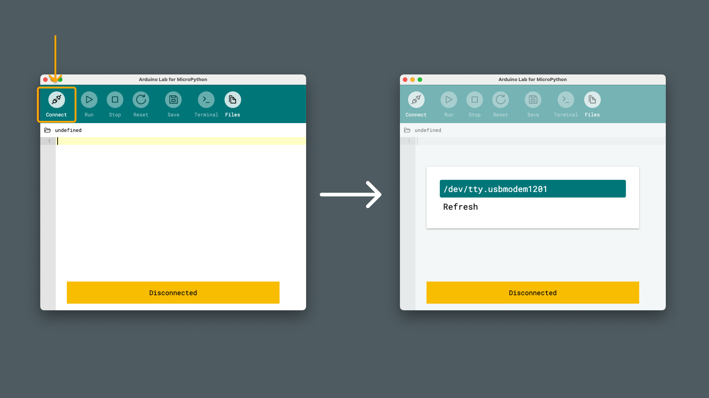
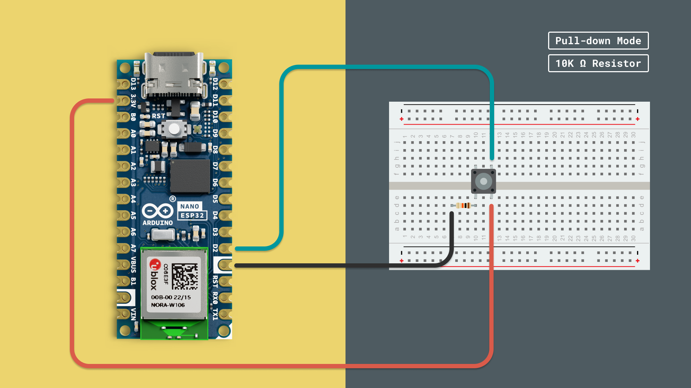

Digital pins are fundamental for interacting with the physical world using your Arduino board. With them, you can:

- Control outputs, such as turning an LED on and off.
- Read inputs, like detecting the state of a button.

Digital signals have two distinct values:

- **HIGH (1)**: Represents a voltage level close to the board's operating voltage (e.g., 3.3V or 5V).
- **LOW (0)**: Represents a voltage level close to 0V (ground).

Although they can only represent two states, digital signals are highly useful. Being binary in nature, they directly interface with microcontrollers and processors, making them ideal for tasks requiring fast, on/off communication, such as reading sensors or controlling simple outputs. Their simplicity also gives them a natural resilience to electrical noise, as noise only disrupts digital signals when it is strong enough to cross the threshold between HIGH and LOW states. This makes them reliable for clear, consistent communication in various environments.

In this chapter, we'll explore how to use digital pins in MicroPython.

## Requirements

Before we start, let's check the requirements:

### MicroPython Compatible Arduino Boards

MicroPython is officially supported on several Arduino boards. Here’s a list of the compatible boards:

- [Portenta C33](https://store.arduino.cc/products/portenta-c33)
- [Arduino GIGA R1 WiFi](https://store.arduino.cc/products/arduino-giga-r1-wifi)
- [Portenta H7](https://store.arduino.cc/products/portenta-h7)
- [Portenta H7 Lite](https://store.arduino.cc/products/portenta-h7-lite)
- [Portenta H7 Lite Connected](https://store.arduino.cc/products/portenta-h7-lite-connected)
- [Arduino Nano RP2040 Connect](https://store.arduino.cc/products/arduino-nano-rp2040-connect)
- [Nicla Vision](https://store.arduino.cc/products/nicla-vision)
- [Arduino Nano 33 BLE](https://store.arduino.cc/products/arduino-nano-33-ble)
- [Arduino Nano 33 BLE Rev2](https://store.arduino.cc/products/nano-33-ble-rev2)
- [Arduino Nano 33 BLE Sense Rev2](https://store.arduino.cc/products/arduino-nano-33-ble-sense-rev2)
- [Arduino Nano ESP32](https://store.arduino.cc/products/arduino-nano-esp32)

### Hardware Components

In this guide, we will be using some additional electronic components:
- LEDs (optional if using the onboard LED)
- Current-limiting resistor (e.g. 220Ω) if using an external LED
- Jumper wires
- Pushbutton
- Breadboard

### Software Requirements

- [Arduino Lab for Micropython](https://labs.arduino.cc/en/labs/micropython) - Arduino Lab for MicroPython is an editor where we can create and run MicroPython scripts on our Arduino board.

***Note that the editor is also available online, at [Arduino Cloud - Arduino Labs for MicroPython](https://lab-micropython.arduino.cc/)***

## Board and Editor Setup

1. Open the [Arduino Lab for MicroPython](https://labs.arduino.cc/en/labs/micropython) application.
2. Plug the Arduino board into the computer using a USB cable.
    
3. Press the connection button on the top left corner of the window. The connected Arduino board should appear (by its port name), and we can click it:
    

***Need help installing MicroPython on your board? Visit the [MicroPython installation guide](/micropython/first-steps/install-guide).***

## Digital Outputs

To control digital outputs in MicroPython, we use the `Pin` class from the `machine` module. Setting a pin as an output allows you to control devices like LEDs, relays, or other actuators.

Let's create the classic "Blink" example, where we turn an LED on and off at regular intervals.

### Circuit Diagram

Connect an LED to the Arduino board, following the circuit diagram below:

- Connect the anode (+) of the LED to a digital output pin.
- Connect the cathode (-) of the LED through a resistor to `GND`.


***You can also use the built-in LED on your board, if you do not have an external LED.***

After completing the circuit diagram, copy the following code into your editor, and run the script.

```python
from machine import Pin
import time

# Initialize the LED pin
# Uncomment the line that matches your board
led = Pin(25, Pin.OUT)     # For Arduino Nano RP2040 Connect
# led = Pin(13, Pin.OUT)   # For Arduino Nano 33 BLE / Sense (built-in LED)
# led = Pin(2, Pin.OUT)    # For Arduino Portenta H7

while True:
    led.value(1)  # Turn LED on
    time.sleep(1)  # Wait for 1 second
    led.value(0)  # Turn LED off
    time.sleep(1)  # Wait for 1 second
```

Let's take a look at what's included in this code example:

- **Import Modules**: We import `Pin` from `machine` and `time` for delays.
- **Initialize LED Pin**: with the `Pin` object, we set the pin number and direction (`Pin.OUT`).
- **Main Loop**:
  - `led.value(1)` - Sets the pin to HIGH, turning the LED on.
  - `time.sleep(1)` - Pauses the program for 1 second.
  - `led.value(0)` - Sets the pin to LOW, turning the LED off.
  - `while True:` - The loop repeats indefinitely, causing the LED to blink.


## Digital Inputs

Reading digital inputs allows your program to respond to external events, like button presses or sensor signals. In MicroPython, we use the `Pin` class to set up pins as inputs, and we can specify pull modes to stabilize the input readings.

In this section, we will explain the different pull modes, and then try them out, by connecting a **pushbutton** to the Arduino.

### Understanding Pull Modes

When a digital input pin is not connected to a definite HIGH or LOW voltage, it is said to be "floating," which can result in unreliable readings due to electrical noise. To prevent this, we use internal pull-up or pull-down resistors, activated by specifying the pull mode in the `Pin` constructor.

- **Pull-Up Mode (`Pin.PULL_UP`)**: Connects the input pin internally to a HIGH voltage level, ensuring the pin reads HIGH when not connected to anything else.
- **Pull-Down Mode (`Pin.PULL_DOWN`)**: Connects the input pin internally to GND, ensuring the pin reads LOW when not connected to anything else.

These internal resistors are built into the microcontroller and can be enabled in your code, eliminating the need for external resistors.

### Example: Pull-Up Mode

In pull-up mode, the input pin is internally connected to a HIGH voltage level. When the input device (like a button) is activated and connects the pin to GND, the pin reads LOW (`0`).

- Connect one side of the button to **GND**.
- Connect the other side to a digital input pin.


After completing the circuit diagram, copy the following code into your editor, and run the script.

```python
from machine import Pin
import time

# Initialize the button pin with internal pull-up resistor
button = Pin(14, Pin.IN, Pin.PULL_UP)  # Replace 14 with your input pin number

while True:
    button_state = button.value()
    if button_state == 0:
        print("Button Pressed")
    else:
        print("Button Released")
    time.sleep(0.1)
```

Let's take a look at what's included in this code example:

- **Initialize Button Pin**:
  - We set up the pin as an input with a pull-up mode (`Pin.PULL_UP`), enabling the internal pull-up resistor.
  - This means the pin reads HIGH (`1`) when the button is not pressed.
- **Reading the Pin**:
  - When the button is **not pressed**, the pin is pulled HIGH internally (`button.value()` returns `1`).
  - When the button is **pressed**, it connects the pin to GND, making `button.value()` return `0`.
- **Main Loop**:
  - Reads the button state and prints a message accordingly.
  - A short delay helps debounce the button.

### Example: Pull-Down Mode

In pull-down mode, the input pin is internally connected to GND. When the input device is activated and connects the pin to a HIGH voltage level (e.g., 3.3V), the pin reads HIGH (`1`).

- Connect one side of the button to **3.3V** (or **5V**, depending on your board's logic level).
- Connect the other side to a digital input pin.



After completing the circuit diagram, copy the following code into your editor, and run the script.

```python
from machine import Pin
import time

# Initialize the button pin with internal pull-down resistor
button = Pin(14, Pin.IN, Pin.PULL_DOWN)  # Replace 14 with your input pin number

while True:
    button_state = button.value()
    if button_state == 1:
        print("Button Pressed")
    else:
        print("Button Released")
    time.sleep(0.1)
```

Let's take a look at what's included in this code example:

- **Initialize Button Pin**:
  - We set up the pin as an input with a pull-down mode (`Pin.PULL_DOWN`), enabling the internal pull-down resistor.
  - This means the pin reads LOW (`0`) when the button is not pressed.
- **Reading the Pin**:
  - When the button is **not pressed**, the pin is pulled LOW internally (`button.value()` returns `0`).
  - When the button is **pressed**, it connects the pin to HIGH voltage, making `button.value()` return `1`.
- **Main Loop**:
  - Reads the button state and prints a message accordingly.
  - A short delay helps debounce the button.

## Summary

In this guide, we have looked at different ways of interacting with digital pins on an Arduino, using MicroPython:
- How to use digital outputs (turning on/off an LED)
- How the different pull modes work (`PULL_DOWN`, `PULL_UP`)
- How to read a button press using either pull modes.