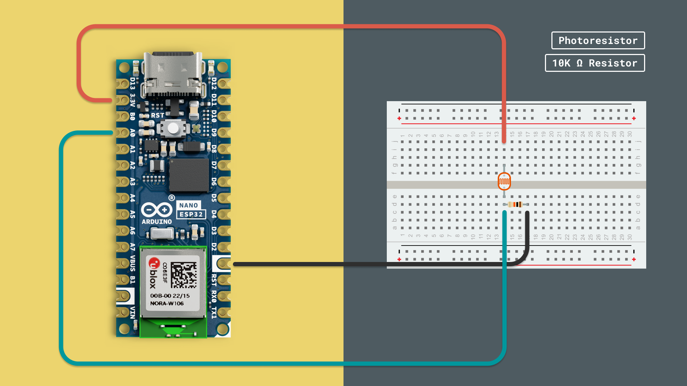
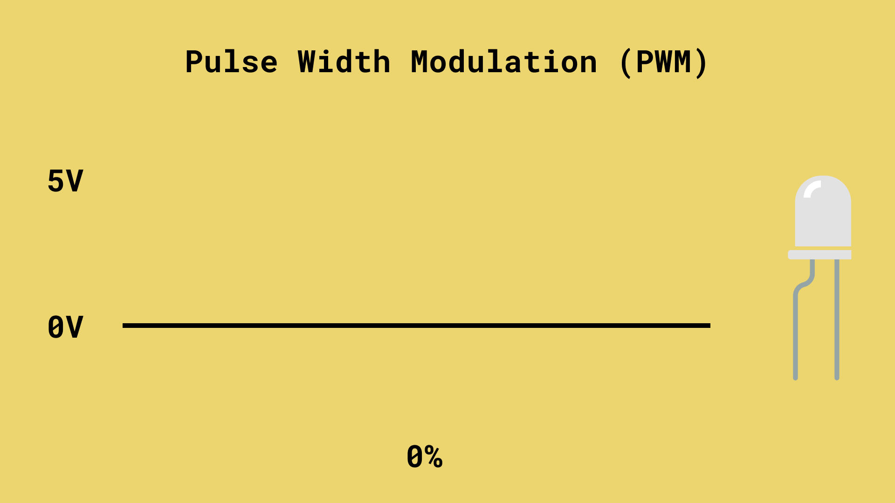
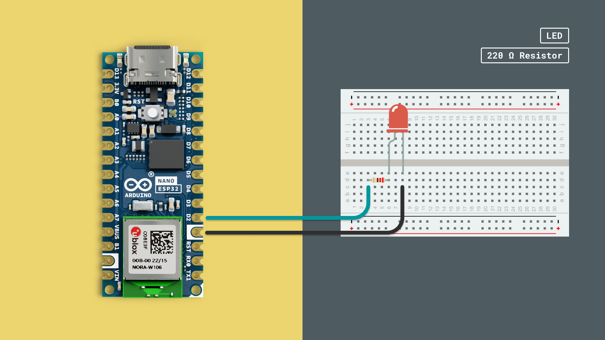
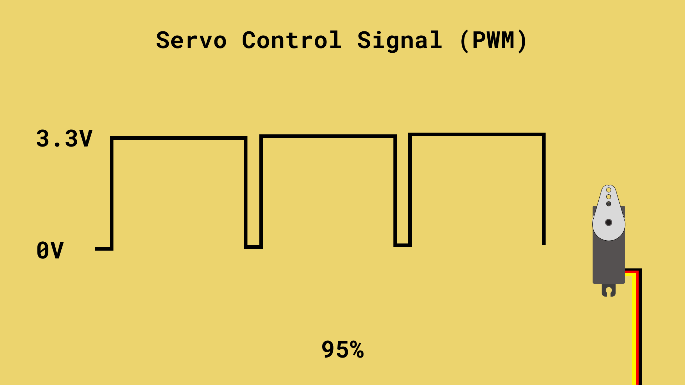
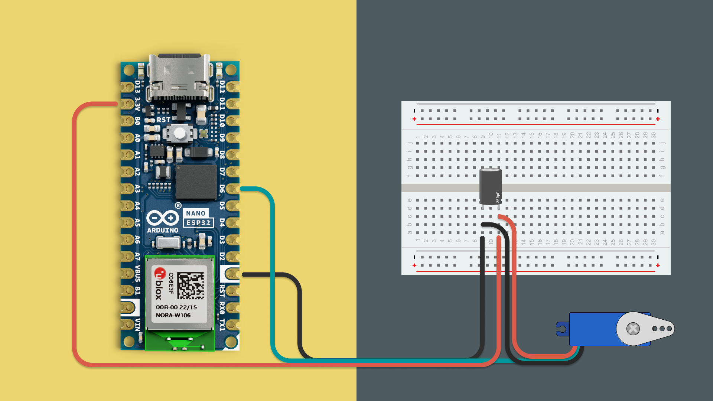

Analog inputs and outputs (I/O) are essential for handling a range of values rather than simple on/off states, allowing for more nuanced control over devices and inputs in your projects. In this chapter, we’ll cover how to work with analog I/O using MicroPython, focusing on how to:

- Read analog values, such as a light sensor or potentiometer.
- Generate analog outputs, like controlling LED brightness or the speed of a motor.

Analog signals differ from digital signals in that they represent a continuous range of values. This flexibility enables more refined interactions with the physical world, making analog I/O indispensable for many types of sensors and actuators.

## Requirements

Before we start, let's check the requirements:

### MicroPython Compatible Arduino Boards

MicroPython is officially supported on several Arduino boards. Here’s a list of the compatible boards:

- [Portenta C33](https://store.arduino.cc/products/portenta-c33)
- [Arduino GIGA R1 WiFi](https://store.arduino.cc/products/arduino-giga-r1-wifi)
- [Portenta H7](https://store.arduino.cc/products/portenta-h7)
- [Portenta H7 Lite](https://store.arduino.cc/products/portenta-h7-lite)
- [Portenta H7 Lite Connected](https://store.arduino.cc/products/portenta-h7-lite-connected)
- [Arduino Nano RP2040 Connect](https://store.arduino.cc/products/arduino-nano-rp2040-connect)
- [Nicla Vision](https://store.arduino.cc/products/nicla-vision)
- [Arduino Nano 33 BLE](https://store.arduino.cc/products/arduino-nano-33-ble)
- [Arduino Nano 33 BLE Rev2](https://store.arduino.cc/products/nano-33-ble-rev2)
- [Arduino Nano 33 BLE Sense Rev2](https://store.arduino.cc/products/arduino-nano-33-ble-sense-rev2)
- [Arduino Nano ESP32](https://store.arduino.cc/products/arduino-nano-esp32)

### Hardware Components

In this guide, we will be using some additional electronic components:
- LEDs 
- Current-limiting resistor (e.g. 220Ω) if using an external LED
- Jumper wires
- Breadboard

### Software Requirements

- [Arduino Lab for Micropython](https://labs.arduino.cc/en/labs/micropython) - Arduino Lab for MicroPython is an editor where we can create and run MicroPython scripts on our Arduino board.

***Note that the editor is also available online, at [Arduino Cloud - Arduino Labs for MicroPython](https://lab-micropython.arduino.cc/)***

## Board and Editor Setup

1. Open the [Arduino Lab for MicroPython](https://labs.arduino.cc/en/labs/micropython) application.
2. Plug the Arduino board into the computer using a USB cable.
    
3. Press the Connect button on the top left corner of the window. The connected Arduino board should appear (by its port name), and we can click it:
    

***Need help installing MicroPython on your board? Visit the [MicroPython installation guide](/micropython/first-steps/install-guide).***

## Analog Inputs

Analog input signals allow you to interact with the world more fluidly by capturing gradual changes rather than absolute states. Analog sensors output a range of voltages to reflect changes in physical conditions. By converting these values into digital numbers, your Arduino board can interpret real-world signals, and convert them into known properties, such as light intensity or temperature.

### Analog-to-Digital Converter (ADC)

To read analog values, we use an Analog-to-Digital Converter (ADC). This takes an input voltage, and converts it to a digital value, that can then be used by the Arduino. Analog inputs measure voltage levels that range continuously between two values, often 0V (LOW) and the board's operating voltage, like 3.3V or 5V.

Using MicroPython, we use a specific method to access the ADC: `read_u16()`. The "16" indicates a 16-bit resolution, which means we can capture a range between 0-65535\*.

***\*What does a 16-bit resolution mean? Find out at the [end of this article](#analog-resolution).***

### Code Example: Reading a Light Sensor

We will now try an example, where we will read the light intensity of a photoresistor.

For this example, we will need the following external components:

- Breadboard
- Photo resistor
- Jumper wires
- 10k Ω resistor

Connect the photoresistor to the Arduino board, following the circuit diagram below:



After completing the circuit diagram, copy the following code into your editor, and run the script.

```python
from machine import ADC
import time

# Initialize ADC for the analog pin
light_sensor = ADC(0)  # Replace '0' with the correct ADC channel for your board

while True:
    light_level = light_sensor.read_u16()  # Reads a 16-bit value (0-65535)
    print("Light level:", light_level)
    time.sleep(1)
```

Let's take a look at what's included in this code example:

- **ADC Initialization**: We initialize the `ADC` class, passing the analog channel as an argument.
- **Reading Values**: `read_u16()` reads a 16-bit integer (0-65535), where `0` represents 0V and `65535` represents the board's maximum operating voltage.
- **Loop**: The sensor reading is printed every second, showing how the value changes based on light intensity.

## Analog Outputs

Unlike analog input, analog output on microcontrollers doesn’t provide a truly continuous range of voltages. Instead, we use **Pulse Width Modulation** (PWM) to simulate varying voltage levels. PWM rapidly switches a digital output between HIGH and LOW at a specified duty cycle, creating the illusion of analog output by controlling the amount of time the signal stays HIGH.

### Pulse Width Modulation (PWM)

True analog signals involve a continuous voltage range, but since microcontrollers primarily handle digital signals (on or off), PWM bridges the gap by rapidly switching the signal between HIGH and LOW. By adjusting the time the signal remains in the HIGH state (known as the "duty cycle"), PWM simulates varying voltage levels.

PWM is especially useful in applications where true analog output is not possible but smooth transitions are necessary. Common scenarios include:

- **LED Dimming**: PWM allows for adjusting brightness levels by controlling how long the LED is ON versus OFF within a given time frame.
- **Motor Control**: By modifying the duty cycle, PWM can control the speed of motors for robotics or other mechanical devices, as the motor responds to the average power supplied over time.
- **Audio Signals**: Some sound applications also use PWM to generate varying sound frequencies or control speaker volume.

The main advantage of PWM is that it allows you to control analog-like behavior using digital pins, adding versatility to your projects while keeping power consumption efficient.



### Code Example: Dimming an LED with PWM

We will now try an example, where we will dim an LED using PWM.

For this example, we will need the following external components:

- Breadboard
- LED
- Current-limiting resistor (e.g., 220Ω)
- Jumper wires

Connect the LED to the Arduino board, following the circuit diagram below:



After completing the circuit diagram, copy the following code into your editor, and run the script.

```python
from machine import Pin, PWM
import time

# Initialize PWM for the LED pin
led_pwm = PWM(Pin(5))  # Replace '5' with the correct pin for your board
led_pwm.freq(1000)     # Set frequency to 1 kHz

# Gradually change the LED brightness
while True:
    for duty in range(0, 65536, 1024):  # 0 to 65535 for 16-bit PWM
        led_pwm.duty_u16(duty)
        time.sleep(0.01)
    for duty in range(65535, -1, -1024):
        led_pwm.duty_u16(duty)
        time.sleep(0.01)
```

Let's take a look at what's included in this code example:

- **PWM Initialization**: We create a `PWM` object and set the frequency to 1 kHz, which works well for LEDs.
- **Duty Cycle**: `duty_u16()` takes a value between 0 and 65535. The higher the value, the longer the signal stays HIGH, making the LED brighter.
- **Loop**: The brightness gradually increases and decreases by adjusting the duty cycle in small steps, causing the LED to fade in and out.

### Servo Motor Control with PWM

Servo motors are precise actuators that can rotate to specific angles, making them ideal for robotics, automated mechanisms, and precise positioning tasks. Think of a servo as a highly trained dancer who can move to exact positions and hold them steady unlike regular motors that spin continuously, servos respond to specific commands to rotate to precise angles between 0° and 180°.

Servos use PWM signals, but in a special way. Instead of varying brightness like with LEDs, servos interpret the width of PWM pulses as position commands. The servo expects pulses every 20 milliseconds (50Hz frequency), and the width of each pulse determines the angle: a 1ms pulse commands 0°, a 1.5ms pulse commands 90°, and a 2ms pulse commands 180°.



Important: Even small servos use much more power than LEDs or sensors so they can cause voltage drops in your circuit. Adding a 100-470µF capacitor near the servo helps smooth out these power demands and prevents erratic behavior.

### Code Example: Servo Sweep

For this example, we will need the following external components:

- Breadboard
- Servo motor
- Jumper wires
- Optional but recommended: 100-470µF electrolytic capacitor

Connect the servo to the Arduino board:
- **Red wire** (power) to **3.3V** (check your servo's specifications)
- **Black/Brown wire** (ground) to **GND**
- **Orange/Yellow wire** (signal) to a PWM-capable digital pin
- If using capacitor: Connect positive leg to **3.3V**, negative leg to GND



After completing the circuit, copy the following code into your editor and run the script.

```python
from machine import Pin, PWM
import time

# Initialize PWM for the servo pin
servo = PWM(Pin(9))  # Replace '9' with your PWM pin number
servo.freq(50)       # Set frequency to 50Hz (example)

def set_servo_angle(angle):
    # Convert angle (0-180) to duty cycle for 16-bit PWM
    # Servo expects pulses between 1ms (0°) and 2ms (180°)
    # For 50Hz: 1ms = ~3277, 1.5ms = ~4915, 2ms = ~6553
    min_duty = 3277   # ~1ms pulse width (0 degrees)
    max_duty = 6553   # ~2ms pulse width (180 degrees)
    duty = int(min_duty + (angle / 180) * (max_duty - min_duty))
    servo.duty_u16(duty)

# Continuous sweeping motion
while True:
    # Sweep from 0 to 180 degrees
    for angle in range(0, 181, 2):  # Step by 2 degrees
        set_servo_angle(angle)
        time.sleep(0.02)  # Small delay for smooth motion
    
    # Sweep back from 180 to 0 degrees
    for angle in range(180, -1, -2):  # Step by 2 degrees backwards
        set_servo_angle(angle)
        time.sleep(0.02)  # Small delay for smooth motion
```

Let's examine this code:

- **PWM Setup**: Creates a `PWM` object and set the frequency to 50Hz—the standard frequency servos expect for position updates.
- **Angle Conversion**: The `set_servo_angle()` function converts degrees (0-180) into the appropriate 16-bit duty cycle values that correspond to the pulse widths the servo understands.
- **Sweeping Motion**: The servo continuously sweeps back and forth between 0° and 180°, moving in 2-degree increments with a small delay between each step to create smooth, fluid motion.

## Analog Resolution

The resolution of an ADC can simply be explained as how detailed it is. When using MicroPython, the default is **16-bits**, while using the Arduino programming language it is **10-bits**. So what is the difference?

When we read something in 16-bit resolution, we receive a range of 0-65535. Let's say the voltage range is 0-3.3V, as is standard in most modern boards. If we were to read 3.3V, it means "max" or "65535". If we read half of that voltage (1.65V), it would be 65535/2 = 32767.

Now let's say we have an analog sensor reading temperature. If the temperature is at its very max for that component, and it outputs 3.3V, we will read 65535. If it is not outputting any voltage (which is unlikely), we would read 0.

If we are using a different resolution, such as **10-bits**, the range would instead be **0-1023**. The voltage remains the same, but the value we read is different.

Why does it work this way? See, bits are used to represent information. A single bit can hold only two values: 0 or 1, while 2 bits can be between 0-3, 3 bits between 0-8 and so on. See below:
- 1-bit = 0-1
- 2-bits = 0-3
- 4-bits = 0-8
- 8-bits = 0-255
- 10-bits = 0-1023
- 16-bits = 0-65535
- 32-bits = 0-4,294,967,295

## Summary

In this guide we have learned about analog inputs, outputs & resolution. We have also gone through a number of fundamental examples to understand how it works in practice. 
