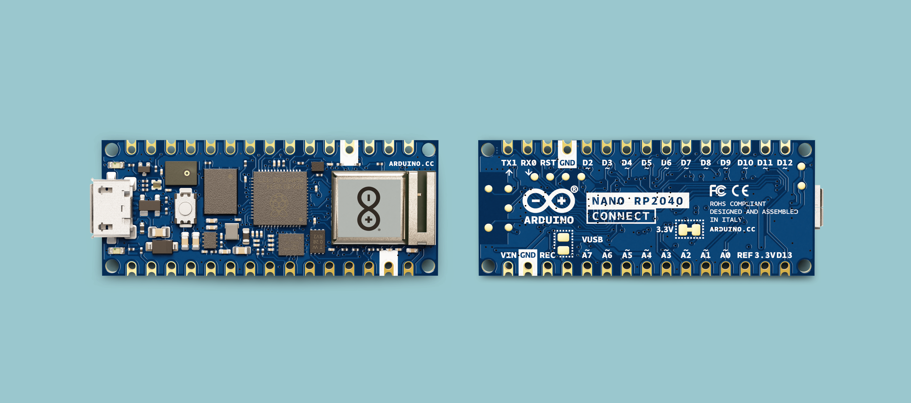

So what do you need to start your first project with MicroPython and Arduino? First, you will need a compatible board. In this page, you will find the compatible boards, with instructions on how to install them.

In order to understand which board is more suitable to your project, you can visit the documentation of each board.

## Supported Boards

The following boards support MicroPython:
- [Nano BLE](https://store.arduino.cc/products/arduino-nano-33-ble) / [Nano BLE Sense](https://store.arduino.cc/products/arduino-nano-33-ble-sense) / [Nano BLE Sense Rev2](https://store.arduino.cc/products/nano-33-ble-sense-rev2)
- [Nano RP2040 Connect](https://store.arduino.cc/products/arduino-nano-rp2040-connect)
- [Nano ESP32](https://store.arduino.cc/products/nano-esp32)
- [Nicla Vision](https://store.arduino.cc/products/nicla-vision)
- [GIGA R1 WiFi](https://store.arduino.cc/products/giga-r1-wifi)
- [Portenta H7](https://store.arduino.cc/collections/portenta-family/products/portenta-h7)
- [Portenta C33](https://store.arduino.cc/collections/portenta-family/products/portenta-c33)


## Arduino MicroPython Installer

We have developed a tool for installing the MicroPython firmware to your Arduino boards with a simple click. This tool lets you plug in the board, select it from a menu, and automatically flash the latest firmware, or a custom one of your choice to the board. 

Download [Arduino MicroPython Installer here](https://labs.arduino.cc/en/labs/micropython-installer). 

Arduino MicroPython Installer is part of [Arduino Labs](https://labs.arduino.cc), and is therefore considered experimental software.

To get started, open the app and plug in your board to the computer. You should now see it pop up ready to be selected in the list. If it doesn't, try putting it in bootloader mode by double tapping the reset button. 


Now, uploading the MicroPython firmware is as easy as pressing **"install MicroPython"** and waiting for a couple of seconds while the installer tool takes care of everything else.


If you don't want to use the Arduino MicroPython Installer tool, these are the per-board steps for manual installation:

## Nano ESP32

Software required:
- MicroPython Firmware
- [esptool.py](https://github.com/espressif/esptool) installed
- [Python](https://www.python.org) installed on your computer
​
First prepare the board for a new firmware upload by shorting the B1 pin to GND and pressing the reset button.

Then run the following esptool command to erase the flash, replace `{port-name}` with the name of the port your board is connected to:

​
```
esptool.py --chip esp32s3 --port {port-name} erase_flash
```
​
Then run this command to upload the new firmware, replace `{firmware.bin}` with the name of your firmware binary file, and `{port-name}` with the name of the port your board is connected to:


​
```
esptool.py --chip esp32s3 --port {port-name} write_flash -z 0 {firmware.bin}

```
​
Now your board should be prepared to be programmed with MicroPython!

## Nano 33 BLE & Nano 33 BLE Sense

- [Nano 33 BLE documentation](/hardware/nano-33-ble).
- [Nano 33 BLE Sense documentation.](/hardware/nano-33-ble-sense)
- [Nano 33 BLE Sense Rev2 documentation.](/hardware/nano-33-ble-sense-rev2)


The process for flashing the firmware on the Nano 33 BLE requires to first update the bootloader and SoftDevice. Once this is done you can flash the MicroPython firmware to your board.

This process requires a version of the [Arduino IDE](https://www.arduino.cc/en/main/software) installed, which is explained in the next step.

**Step 1: Installing the Core**

Start by making sure that you have the respective core installed. Open the **Arduino IDE** (not Arduino Lab for MicroPython) and navigate to the boards manager. Search for your board (Nano 33 BLE), and make sure you have the latest version of the core installed. More detailed information about this step can be found [here](/software/ide-v2/tutorials/ide-v2-board-manager).


This is not only needed to upload the next sketch, but you're also going to dive into the core files themselves to find a specific tool in an upcoming step.

**Step 2: Update Bootloader**

In the Nano 33 BLE core is an example sketch that you will use to update the bootloader and SoftDevice of your board. Go back to the Arduino IDE and navigate to `File > Examples > Nano33BLE_System > Nano33_updateBLandSoftDevice` and open the sketch.


Upload the sketch to your board. Beware! the bootloader is not updated just yet! Once the sketch is uploaded, you can interface with your board through the serial monitor to actually update the bootloader.

In the Serial monitor, you are asked to confirm that you want to update the bootloader. In the message text box in the top of the serial monitor, write a **"y"** and press enter to send it to your board. 

You can now watch as the bootloader update process progresses, **do not disconnect or reset your board during this process** or you could brick your board.

Once this bar completes, you will be prompted with another choice. This time it asks if you want to update the SoftDevice on your board. Repeat the process of sending a **"y"** to the board, and watch the progress of this too.

When this bar fills and the SoftDevice update completes, the board will restart, and you've successfully made it through the procedure. 

***Note: An important thing to do at this point which is easily forgotten is to close the serial monitor, we will need to use the serial port for other things very soon and if you leave the monitor open it will be busy and won't be able to receive any new interactions.***

**Step 3: Download Firmware**

Now you will need to find the specific firmware that you need to flash to your board. You can find the available firmware on the [MicroPython](/micropython) Documentation site. 

Download the `.bin` file that corresponds to the board you have. 

Now you will need to dive into the core files you downloaded in the first step to find a command line tool that is included called BOSSAC. This process will be different for you depending on if you're on a Windows or MacOS computer.


**Step 4a: Flash Firmware (Windows)**

>Instructions for MacOS are available just below this section.

The file you will is named `bossac.exe` and can be found in the following directory:

```
C:\Users\[your-username]\AppData\Local\Arduino15\staging\packages\bossac-1.9.1-arduino2-windows.tar.gz\bossac-1.9.1-arduino2-windows.tar\bin\` 
```

One you've found the file, extract it from the `.tar` archive and copy it somewhere else, your desktop for example. 

Open a command terminal and start typing in `start`, now drag and drop the bossac.exe file you've found into the terminal, and press enter.

If successful, another command terminal window should open in which you are able to execute the command that will flash your board with the MicroPython firmware.

Execute the following command, but replace the port with the name of the port where your board is connected, and the firmware file with the directory where you have placed the firmware you downloaded previously:

```
bossac -e -w --offset=0x16000 --port=[port] -i -d -U -R [firmware]
```

Don't disconnect or power off your board during this part of the process, watch the progress of flashing the firmware to your board. Once complete, you're all set and you're ready to start programming the board in MicroPython.

Go to the Arduino Lab MicroPython IDE and press connect in the top left, choose the port, and you are now ready to program your Nano 33 BLE.

**Step 4b: Flash Firmware (MacOS)**

The file you will need to access is called `bossac` and can be found in the following directory: 

```
Users/[your-user]/Library/Arduino15/packages/arduino/tools/bossac/1.9.1-arduino2
```

***Note: The `"Library"` directory is hidden, press `Shift + Command + . ` to reveal hidden directories.***

Open a terminal window and drag and drop the `bossac` file into the terminal window.

Now, you should be able to execute the command that will flash your board with the MicroPython firmware.

Execute the following command, but replace the port with the name of the port where your board is connected, and the firmware file with the directory where you have placed the firmware you downloaded previously:

```
bossac -e -w --offset=0x16000 --port=[port] -i -d -U -R [firmware]
```

Again, don't disconnect or power off your board during this part of the process, watch the progress of flashing the firmware to your board. Once complete, you're all set and you're ready to start programming the board in MicroPython.

Go to the Arduino Lab MicroPython IDE and press connect in the top left, choose the port, and you are now ready to program your Nano 33 BLE!

## Nano RP2040 Connect

- [Arduino Nano RP2040 Documentation](https://docs.arduino.cc/hardware/nano-rp2040-connect)



To program your Nano RP2040 Connect board with MicroPython, follow the instructions below. The installation for Nano RP2040 Connect requires no additional software tools for installation.

Follow the steps below to install MicroPython on the Nano RP2040 Connect board.

1. Download the `.uf2` firmware file from the [MicroPython](/micropython) page.
2. Connect the `REC` pin to `GND` (they are placed next to each other) and press the reset button. This exposes the board's file system to your computer.
3. Drag and drop the firmware file onto the boards flash storage which shows up as an external storage device on your computer
4. Go to the Arduino Lab MicroPython IDE and press connect in the top left, choose the port.

Congratulations, you are now ready to program your Nano RP2040 Connect with MicroPython.

## GIGA R1 WiFi

- [Arduino GIGA R1 WiFi documentation](/hardware/giga-r1-wifi)


The installation instructions for the **GIGA R1 WiFi** is identical to the **Portenta H7** instructions found just below. 

You will however need a different firmware, which you can download from the link below:

- [Download GIGA R1 WiFi MicroPython firmware (dfu)](/resources/firmware/GIGAR1_MP_FW.dfu)

***The GIGA R1 WiFi and Portenta H7 boards are based on the same microcontroller, [STM32H747XI](static/resources/datasheets/stm32h747xi.pdf) and therefore share the same installation instructions.***

## Portenta H7

- [Arduino Portenta H7 Documentation](https://docs.arduino.cc/hardware/portenta-h7)


To install MicroPython on the Portenta H7 you will first need to install the corresponding core which also installs the required command line tool, called `dfu-util`.  

This tool can be used to directly flash a binary to your board, in this case, a MicroPython build. 

***The instructions below uses the `dfu-util` that is bundled with the Arduino IDE. You can also obtain the `dfu-util` directly, through the [dfu-util home page](https://dfu-util.sourceforge.net/) or via package management systems such as [Homebrew](https://formulae.brew.sh/formula/dfu-util) (MacOS / Linux).***

**Step 1: Install Arduino IDE**

First, download and install the [Arduino IDE](https://arduino.cc/en/software) for your operating system.

Open the Arduino IDE (not Arduino Lab for MicroPython) and navigate to the boards manager. Search for "Portenta H7", and make sure you have the latest version of the core installed.


**Step 2: Download Firmware**

Now you will need to find the specific firmware that you need to flash to your board. You can find the available firmware on the [MicroPython with Arduino](https://docs.arduino.cc/micropython/) home page. The firmware is available as a `.dfu` file for the Portenta H7.

In the next step you will be diving into the core files you downloaded in the first step to find a command line tool called **dfu-util**. This process is differs depending on if you're on a Windows or MacOS computer. MacOS instructions are available further below.

**Step 3a: Install Firmware (Windows)**

To flash your board, you will need a file named `dfu-util.exe`. This is found in your following directory:

```     
C:\Users\<your-username>\AppData\Local\Arduino15\staging\packages\dfu-util-0.10.0-arduino1-windows.tar.bz2\dfu-util-0.10.0-arduino1-windows.tar\windows\ 
```

One you've found the file, extract it from the .tar archive and copy it somewhere else, your desktop for example. 

Open a command terminal and start typing in `start`, now drag and drop the dfu-util.exe file you've found into the terminal, and press enter.

If successful, another command terminal window should open in which you are able to execute the command that will flash your board with the MicroPython firmware.

Double tap the reset button on your board to put it in DFU mode, and execute the following command, but replace the path of the firmware file with the directory where you have placed the firmware you downloaded previously:

```
dfu-util -a 0 -d 0x2341:0x035b -D <firmware>.dfu
```

Again, don't disconnect or power off your board during this part of the process, watch the progress of flashing the firmware to your board.

You should now see **two** progress bars appear in one after the other. The first one is showing the progress of erasing the firmware that was previously on the board, and the second one is showing the progress of flashing the new firmware. 

Once complete, you're all set and you're ready to start programming the board in MicroPython.

Go to the Arduino Lab MicroPython IDE and press connect in the top left, choose the port, and code away!

**Step 3b: Install Firmware (MacOS)**

The file you will need to access is named `dfu-util` and can be found in the following directory: 

```
Users/[your-username]/Library/Arduino15/packages/arduino/tools/dfu-util/0.10.0-arduino1/dfu-util
```

***Note: The `"Library"` directory is hidden, press `Shift + Command + . ` to reveal hidden directories.*** 

Open a terminal window and drag and drop the dfu-util file into the terminal window.

Now, you should be able to execute the command that will flash your board with the MicroPython firmware.

Double tap the reset button on your board to put it in DFU mode, and execute the following command, but replace the path of the firmware file with the directory where you have placed the firmware you downloaded previously:

```
dfu-util -a 0 -d 0x2341:0x035b -D <firmware>.dfu
```

Do not disconnect your board during this part of the process, watch the progress of flashing the firmware to your board. 

Once complete, you're all set and you're ready to start programming the board in MicroPython.

Go to the Arduino Lab MicroPython IDE and press connect in the top left corner, choose the port and you are ready to load scripts to your board.

## Portenta C33

To install the MicroPython firmware to the Portenta C33 board you can use the Arduino MicroPython Installer. This tool lets you plug in the board, select it from a menu, and automatically flash the latest firmware, or a custom one of your choice to the board. 

You can download the [Arduino MicroPython Installer here](https://labs.arduino.cc/en/labs/micropython-installer). 

***The Arduino MicroPython Installer is part of [Arduino Labs](https://labs.arduino.cc), and is therefore considered experimental software.***

To get started, open the installer and plug in your board to your computer; you should now see it pop up ready to be selected. If it does not pop ups, try putting it in bootloader mode by double tapping your board's reset button. 


To install the MicroPython firmware, press the **INSTALL MICROPYTHON** and waiting for a couple of seconds while the installer tool takes care of everything else.

