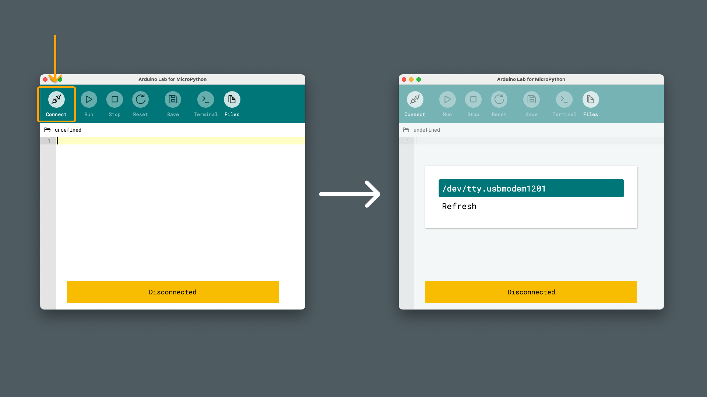

Loops are fundamental constructs in all programming languages, that allow you to execute a block of code multiple times. In MicroPython, loops help you perform repetitive tasks efficiently and are an awesome tool to keep in your coder's toolbox. 

In this guide, we will explore the different loop structures available.

## Requirements

Before we start, let's check the requirements:

### MicroPython Compatible Arduino Boards

MicroPython is officially supported on several Arduino boards. Here’s a list of the compatible boards:

- [Portenta C33](https://store.arduino.cc/products/portenta-c33)
- [Arduino GIGA R1 WiFi](https://store.arduino.cc/products/arduino-giga-r1-wifi)
- [Portenta H7](https://store.arduino.cc/products/portenta-h7)
- [Portenta H7 Lite](https://store.arduino.cc/products/portenta-h7-lite)
- [Portenta H7 Lite Connected](https://store.arduino.cc/products/portenta-h7-lite-connected)
- [Arduino Nano RP2040 Connect](https://store.arduino.cc/products/arduino-nano-rp2040-connect)
- [Nicla Vision](https://store.arduino.cc/products/nicla-vision)
- [Arduino Nano 33 BLE](https://store.arduino.cc/products/arduino-nano-33-ble)
- [Arduino Nano 33 BLE Rev2](https://store.arduino.cc/products/nano-33-ble-rev2)
- [Arduino Nano 33 BLE Sense Rev2](https://store.arduino.cc/products/arduino-nano-33-ble-sense-rev2)
- [Arduino Nano ESP32](https://store.arduino.cc/products/arduino-nano-esp32)

### Software Requirements

- [Arduino Lab for Micropython](https://labs.arduino.cc/en/labs/micropython) - Arduino Lab for MicroPython is an editor where we can create and run MicroPython scripts on our Arduino board.

***Note that the editor is also available online, at [Arduino Cloud - Arduino Labs for MicroPython](https://lab-micropython.arduino.cc/)***

## Board and Editor Setup

1. Open the [Arduino Lab for MicroPython](https://labs.arduino.cc/en/labs/micropython) application.
2. Plug the Arduino board into the computer using a USB cable.
    
3. Press the connection button on the top left corner of the window. The connected Arduino board should appear (by its port name), and we can click it:
    

***Need help installing MicroPython on your board? Visit the [MicroPython installation guide](/micropython/first-steps/install-guide).***

## Loop Structures in MicroPython

MicroPython supports two primary loop structures, each with a specific purpose:

- **`for` loops**: for loops iterate over a predefined sequence, such as a list, tuple, or string. The loop automatically retrieves each item in the sequence, one at a time, and performs actions until every item has been handled.

- **`while` loops**: while loops continue executing as long as a specified condition is true. Unlike `for` loops, which depend on a sequence, `while` loops rely on a conditional expression that determines when the loop should stop.

To better understand these loops, let’s imagine them as tasks at the supermarket:

- **for loops** - imagine walking down a supermarket aisle with a shopping list that specifies exactly how many items to pick up, one by one, in order. Once you’ve gathered all the items on your list, your task is complete. This is like a `for` loop iterating over a sequence, handling each specified item one at a time.

- **while loops** - imagine going to the supermarket to buy a certain product that’s on sale, as long as it stays in stock. You keep coming back, day after day, until the sale ends or the stock runs out. In a `while` loop, you keep “coming back” as long as a condition (like the sale continuing) remains true.


## For Loops

The `for` loop is used for iterating over a sequence. It automatically retrieves each item in the sequence one after another.

```python
for variable in sequence:
    # Code block to execute
```

- **`for`**: Keyword that starts the loop.
- **`variable`**: Takes the value of each item in the sequence during iteration this is where you will get the value for each iteration of a collection.
- **`in`**: Keyword used to specify the sequence to iterate over.
- **`sequence`**: The collection (like a list, tuple, or string) over which the loop iterates.
- **Code block**: The indented block of code that runs on each iteration.

### Example Code

Let's try out making a for loop. In this example, we set `i` which stands for *iteration*, in a range of 5.

```python
for i in range(5):
    print(i)
```

Running this script will result in printing `i` for five times. Each time the loop is run, `i` is increased, so in the REPL, we should see:

```
0
1
2
3
4
```

This is because we start counting from 0. So the first time the loop runs, we print `0`, the second time it runs `1` and so on.

## While Loops

A `while` loop continues to execute as long as a specified condition is true.

```python
while condition:
    # Code block to execute
```

- **`while`**: Keyword that starts the loop.
- **`condition`**: A boolean expression evaluated before each iteration; if `True`, the loop continues.
- **Code block**: The indented block of code that runs on each iteration.

### Example Code

Let's try making a while loop! In the example below, we have a counter, which we print to the REPL. This is to track how many times the loop has run. We pause between each print using the `time.sleep(1)` function, so that it is easier to read in the REPL.

```python
import time
counter = 0

while True:
    counter += 1
    print('Number of iterations: ' + str(counter))
    time.sleep(1)
```

In this example, we used:

- `while True:` - this keeps a while loop running forever.
- `print('Number of iterations: ' + str(counter))`, to print out the current iteration.
- because we cannot mix numeric values with strings when using the `print()` function, we need to use `str(counter)` when printing to the REPL.

The result will be an infinite loop, that will print the current iteration:

```python
Number of iterations: 10
Number of iterations: 11
Number of iterations: 12
.....
Number of iterations: 99999 # this loop has been running for a long time..
```

## Control Statements

While inside a loop, we can control how it should behave using control statements: **continue** and **break**

### Continue

The `continue` statement can be used to skip past an iteration. For example, if we for some reason want to skip every fifth iteration, we could use the following code:

```python
for i in range(10)
    if i == 5:
        continue
    print(i)
```

Running this script will result in:

```python
0
1
2
3
4
6 # we skip the 5th iteration
7
8
9
10
```

### Break

The `break` statement can be used to break out of a loop before it finishes all iterations. This can be useful to for example cancel a process if something unexpected happens.

```python
for i in range(10)
    if i == 5:
        break
    print(i)
```

Running this script will result in:

```python
0
1
2
3
4
```

## Conclusion

Loops are essential for automating repetitive tasks in MicroPython. Understanding how to use different loop structures allows you to write more efficient and effective code. 

In these examples, we've demonstrated how to create loops that can: 
- Run *for* a specific amount of iterations (for loops)
- Loops that can run *while* a condition is met (while loops)

