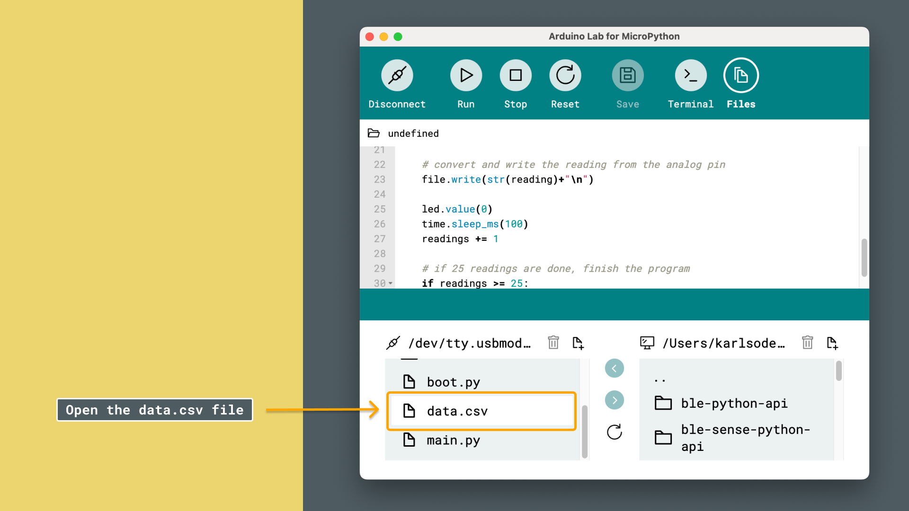

Data logging using MicroPython is a great feature, as we can use the board's file system to create files and store data in them.

In this tutorial, we will create a `.csv` file, make some readings from an analog pin, and store the data in the file. The file can then be accessed via the Arduino Lab for MicroPython editor.

***To learn more about the MicroPython file system, visit [this article](/micropython/environment/file-system).***

## Requirements

Before we start, let's check the requirements:

### MicroPython Compatible Arduino Boards

MicroPython is officially supported on several Arduino boards. Here’s a list of the compatible boards:

- [Portenta C33](https://store.arduino.cc/products/portenta-c33)
- [Arduino GIGA R1 WiFi](https://store.arduino.cc/products/arduino-giga-r1-wifi)
- [Portenta H7](https://store.arduino.cc/products/portenta-h7)
- [Portenta H7 Lite](https://store.arduino.cc/products/portenta-h7-lite)
- [Portenta H7 Lite Connected](https://store.arduino.cc/products/portenta-h7-lite-connected)
- [Arduino Nano RP2040 Connect](https://store.arduino.cc/products/arduino-nano-rp2040-connect)
- [Nicla Vision](https://store.arduino.cc/products/nicla-vision)
- [Arduino Nano 33 BLE](https://store.arduino.cc/products/arduino-nano-33-ble)
- [Arduino Nano 33 BLE Rev2](https://store.arduino.cc/products/nano-33-ble-rev2)
- [Arduino Nano 33 BLE Sense Rev2](https://store.arduino.cc/products/arduino-nano-33-ble-sense-rev2)
- [Arduino Nano ESP32](https://store.arduino.cc/products/arduino-nano-esp32)

### Software Requirements

- [Arduino Lab for Micropython](https://labs.arduino.cc/en/labs/micropython) - Arduino Lab for MicroPython is an editor where we can create and run MicroPython scripts on our Arduino board.

***Note that the editor is also available online, at [Arduino Cloud - Arduino Labs for MicroPython](https://lab-micropython.arduino.cc/)***

## Board and Editor Setup

1. Open the [Arduino Lab for MicroPython](https://labs.arduino.cc/en/labs/micropython) application.
2. Plug the Arduino board into the computer using a USB cable.
    
3. Press the connection button on the top left corner of the window. The connected Arduino board should appear (by its port name), and we can click it:
    

***Need help installing MicroPython on your board? Visit the [MicroPython installation guide](/micropython/first-steps/install-guide).***

## Data Logger Example

Copy and paste the script below, and run it:

```python
import machine
from machine import Pin
import time

adc_pin = machine.Pin("A1") 
adc = machine.ADC(adc_pin)
led = Pin("D13", Pin.OUT)
readings = 0

# create a file named "data.csv"
file=open("data.csv","w") 
file.write("data"+"\n")

while True:
    
    led.value(1)
    reading = adc.read_u16()     
    print("ADC: ",reading)
    
    time.sleep_ms(100)
    
    # convert and write the reading from the analog pin
    file.write(str(reading)+"\n")
    
    led.value(0)
    time.sleep_ms(100)
    readings += 1
    
    # if 25 readings are done, finish the program
    if readings >= 25:
        file.close()
        break
```

### How it Works

The data logger example works as follows:

- First, we create a `.csv` file, and open it using `file.open()`.
- Then, we read the value of an analog pin, and log it, using the `file.write()` function.
- We repeat 25 times and then finish script by closing the file with `file.close()`.
- Each time a reading is recorded, the built-in LED flashes.

At the end of the script, a file will appear in your file system called `data.csv`. This is now accessible in the editor, where you can open it, and move it over to your computer.

### Access the File

To access the data, click the "Files" button, and navigate to the `data.csv` file. Open it, and you will see the data inside it. You can now move it to the computer by using the arrows, or simply copy the whole content of the file.



