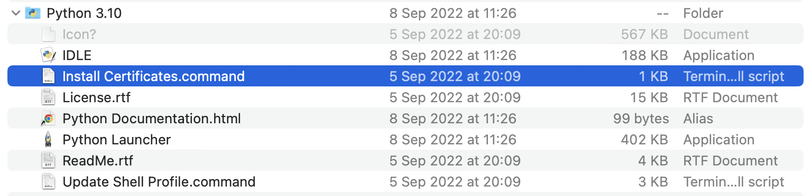

Your MicroPython installation comes with a set of modules built-in to the firmware. If you are using any external components such as sensors, displays or neopixels, you will need to install these manually.

There are currently two methods available when installing a module on your board running MicroPython:
- Using the `mip` module on your **board**, (download and install via Wi-Fi® connection),
- using `mpremote` on your **computer** (download and install through a USB connection),

In this article, we will cover these two methods, as well as how to remove them from your board.

***Please note: installing packages that contain 2-byte characters (such as emojis, Chinese symbols), is currently not supported in the [Arduino Lab for MicroPython editor](https://labs.arduino.cc/en/labs/micropython). You will however receive a "successful installation" response, which is a bug being investigated.***

## Hardware & Software Needed

- [A MicroPython compatible board](/micropython/basics/board-installation#supported-boards),

- [Arduino Lab for MicroPython editor](https://labs.arduino.cc/en/labs/micropython),
- [mpremote](https://pypi.org/project/mpremote/) (optional).

## Option 1: MIP

***Please note that the `mip` module requires a stable Internet connection via Wi-Fi. Installation may fail if connection is unstable.***

[mip](https://docs.micropython.org/en/latest/reference/packages.html#installing-packages-with-mip) is a module that allows you to install external packages/libraries/modules remotely. This module is built in to your MicroPython firmware.

To use the `mip` module, you will however need to connect to Internet via a Wi-Fi network first. To do so, open the **Arduino Lab for MicroPython editor**, and run the following code:

***Note: Replace "YOUR_NETWORK_NAME" and "" YOUR_NETWORK_PASSWORD" with the SSID and password for your Wi-Fi® network.***


```python
import network

WIFI_NETWORK='YOUR_NETWORK_NAME'
WIFI_PASSWORD='YOUR_NETWORK_PASSWORD'

wlan = network.WLAN(network.STA_IF)
wlan.active(True)
wlan.connect(WIFI_NETWORK, WIFI_PASSWORD)

print()
print("Connected to ",WIFI_NETWORK)
```

Once you are connected, you can use the `mip` module to install external modules. 

You can install by specifying the **organisation** and **repository**:

```python
import mip
mip.install(github:org/repo)
```

Or you can specify the url to the file you want to install:

```
mip.install("https://raw.githubusercontent.com/tinypico/tinypico-micropython/master/lis3dh%20library/lis3dh.py")

```

Files are added to a folder named `lib` on your board.

***There are a number of ways you can use the `install()` method, read more about this in the [MIP documentation](https://docs.micropython.org/en/latest/reference/packages.html#installing-packages-with-mip).***

### Complete Example

In this example, we first connect to Wi-Fi®, and then proceed to install the `[arduino-iot-cloud-py](https://github.com/arduino/arduino-iot-cloud-py) module. 

```python
import network
import mip

# enter wi-fi creds
WIFI_NETWORK='YOUR_NETWORK_NAME'
WIFI_PASSWORD='YOUR_NETWORK_PASSWORD'

# connect to wi-fi
wlan = network.WLAN(network.STA_IF)
wlan.active(True)
wlan.connect(WIFI_NETWORK, WIFI_PASSWORD)

print()
print("Connected to ",WIFI_NETWORK)

# install the arduino-iot-cloud module
mip.install("github:arduino/arduino-iot-cloud-py")
```

***Running this example twice will result in a `202` error, as you have already connected to Wi-Fi. Once you have connected once to Wi-Fi, you only need to use the `mip.install()` method.***

### Failed Installation

Installation via `mip` may fail due to an unstable Internet connection. If you have installed a module but you are receiving errors, make sure your Internet connection is good (your board is within reach of your router), and run the installation again.

This is typically not an issue with smaller installations (like single files), but when installing larger packages it is increased.  

You can install the same module again, it will only overwrite the existing version.

## Option 2: Mpremote

To install a MicroPython module on your board, you can use the Python based tool `mpremote`. This requires Python to be installed. On macOS and Linux Python usually comes pre-installed. If it's not installed on your system you may download it from [here](https://www.python.org/downloads/). Then, to install `mpremote` you can use pip:

```bash
$ pip install mpremote
```

Run `mpremote connect list` to retrieve the serial number of your device. The output will look similar to this:

```
/dev/cu.usbmodem3871345733302 335B34603532 2341:055b Arduino Portenta Virtual Comm Port in HS Mode
```

Pass this serial number (the second value) to the install command:

```bash
$ mpremote connect id:335B34603532 mip install github:arduino/arduino-iot-cloud-py
```

This will install the library and all required dependencies on the board.

### Error: Certificate Verify Fail (MacOS)

On some computers, you may receive error:

```
[SSL: CERTIFICATE_VERIFY_FAILED] certificate verify failed:
unable to get local issuer certificate (_ssl.c:1002)
```

This indicates a problem with the Python version installed, and that it is unable to locate the SSL certificate. To work around this, navigate to your Python installation (typically **Applications > Python 3.X**), and run the `Install Certificates.command` script.



## Delete Files

To delete a file from your board, open the **Arduino Lab for MicroPython** editor, connect to your board, and click the **"File"** button. This will open your local files as well as your board's files.

If you want to remove a file, simply mark it and click on the trashcan icon in the top right of the file window, as the image below shows:

