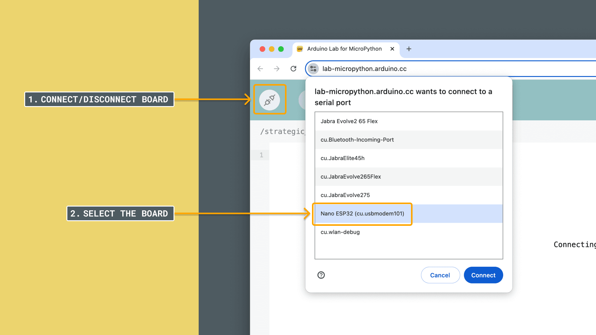
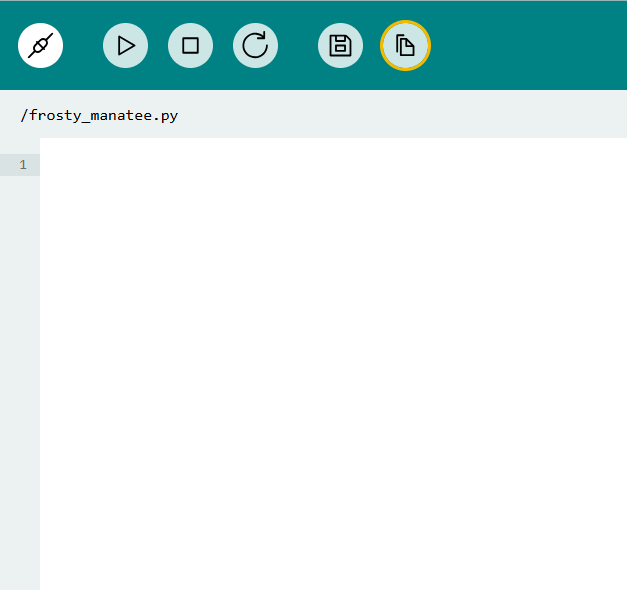
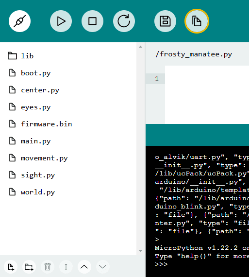
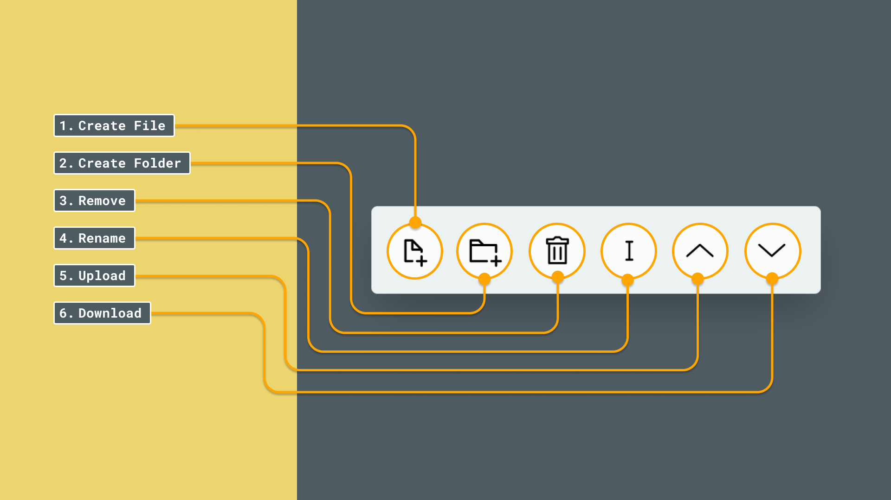

The [Arduino Lab for MicroPython](https://lab-micropython.arduino.cc/) is an online code editor that allows you to load MicroPython scripts to your Arduino board. This editor is part of the [Arduino Cloud](https://app.arduino.cc/), and is free to use for everyone.

In this tutorial, we will take a look at how we can access it, and test it out by writing a simple script.

***Note that this tutorial does not go in depth on how the Arduino Lab for MicroPython works. For more details, you can visit the [guide to the Arduino Lab for MicroPython](/micropython/environment/code-editor).***

## Requirements

- **Google Chrome, Opera, Edge** - these are the currently supported browsers.
- [Arduino Cloud account registered](https://login.arduino.cc/login)
- [A MicroPython compatible board](/micropython/first-steps/install-guide/#micropython-compatible-arduino-boards)

## Setting Up

***To follow these steps, you will need to have MicroPython installed on your board. Haven't done this yet? Don't worry, check out the [Installing MicroPython](/micropython/first-steps/install-guide) guide.***

Setting up the online environment is quick and easy. Follow the steps below to achieve it:

1. Go to [Arduino Cloud](https://app.arduino.cc/) and log in / create an account.
2. Navigate to [lab-micropython.arduino.cc](https://lab-micropython.arduino.cc/). This is accessible through the cloud interface, under **Resources > Online Lab for MicroPython**.
   
3. Click on the **"Connect"** button, and select our board from the list.
   
4. With the board connected, in the text area, copy and paste the following:
   ```python
   print("Hello World!")
   ```
5. We should now see `Hello World!` printed in the REPL.

## Online vs. Offline Editors: Key Differences

Note that some features might look different if you are using the Online IDE. Fear not, all code and files are interpreted the same regardless of the IDE you choose; however, the UI of the Online IDE displays files differently.

You can open the file manager using the button:  


The files will then be displayed in a side bar, also in a different arrangement. In the online IDE, files can be viewed in a side bar:  


A few options are available at the bottom, these are: `create new a file`, `create new a folder`, `delete a file`, `rename`, `upload` and `download`, located at the bottom:  



## Troubleshooting

- If the "RUN" button is faded out, it means the board is not connected. Click the "Connect" button to get a list of available boards connected.
- Make sure MicroPython is installed on your board.
- If you have recently installed MicroPython on your board, try resetting the board by pressing the reset button (once), or disconnect & reconnect the USB cable.

