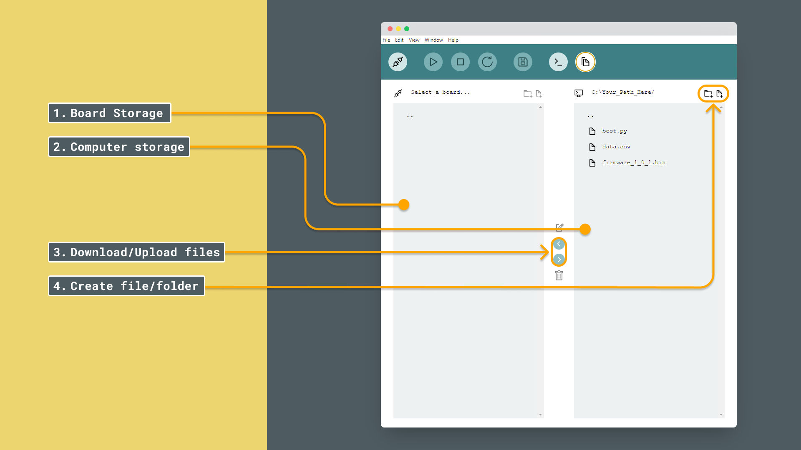

Arduino Lab for MicroPython includes a user-friendly code editor that helps us write, format, and run MicroPython code with ease. In this article, we’ll explore how the code editor works, key formatting rules for MicroPython, and some useful tips to keep our code clean and error-free.

## Requirements

- [Arduino Lab for MicroPython](https://labs.arduino.cc/en/labs/micropython)
- **MicroPython compatible board** (not required for using the editor, but for running any code).

***Note that the Arduino Lab for MicroPython is now also available online, as part of the Arduino Cloud platform. You will find it here: [Arduino Cloud - Arduino Lab for MicroPython](/micropython/environment/code-editor).***

## Arduino Labs for MicroPython

The code editor in Arduino Labs is designed to streamline our coding experience, providing tools to:

- Write and format MicroPython code.
- View and manage indentation easily.
- Run our code and view results directly in the REPL.

As we get familiar with the editor, remember that MicroPython has a few syntax rules that differ from other languages we might know.

### Overview

The Arduino Lab for MicroPython editor provides several essential tools to make coding intuitive and efficient:

1. **Connect/Disconnect Board**: Use this button to connect or disconnect your MicroPython-compatible board. This allows the code editor to communicate with your board for running and testing code.
2. **Run/Stop Script**: Click this button to run or stop your script. The output will be displayed in the REPL, providing immediate feedback or error messages.
3. **File Management**: This option lets you manage files on your MicroPython board. You can upload, download, and organize your scripts.
4. **Edit Script**: The main area of the editor where you write and modify your MicroPython code. It provides features like syntax highlighting to enhance readability.
5. **Expand Terminal**: Use this button to expand or collapse the terminal section, which displays the REPL output, helping you debug and interact with your code in real time.


### Files

Managing files in the Arduino Lab for MicroPython is straightforward and allows for efficient organization and transfer between your board and computer:

1. **Board Storage**: This section displays the files stored on your MicroPython-compatible board. You can view and manage scripts or data saved directly on the board.
2. **Computer Storage**: This section shows the files on your computer, allowing you to select and manage files for uploading or downloading.
3. **Download/Upload Files**: Use this option to transfer files between your computer and your board. You can upload new scripts or download data logs from your board.
4. **Create File/Folder**: This option lets you create new files or folders directly on the board or in your project directory, making it easy to organize your code and assets.



***For a detailed tutorial on using the file system, please refer to the [File System Tutorial](/micropython/environment/file-system).***

### REPL

The REPL can be found by expanding the terminal. Here you can interact with the terminal. The buttons allow for basic features like copy and pasting as the shortcuts like `CTRL+C will` not work on this window.


***For a detailed tutorial on using the REPL, please refer to the [REPL Tutorial](/micropython/environment/repl).***

## Code Editor

### Indentation

In MicroPython, indentation (using spaces or tabs) is essential for defining the structure of our code. Unlike many other languages, MicroPython relies on indentation instead of symbols like `{ }` to define code blocks.

- **Indent with Consistency**: Typically, each block of code (such as inside a function, loop, or conditional) is indented by four spaces. Make sure all lines in the same block are indented with the same number of spaces.
- **Nested Blocks**: For nested code, simply increase the indentation by another four spaces or one tab.

**Example of Proper Indentation:**

```python
def greet(name):
    if name:
        print(f"Hello, {name}!")
    else:
        print("Hello, world!")
```

In this example, each level of code indentation clearly defines which lines belong to which block. The `print` statements align under the `if` and `else` statements, showing they’re part of those blocks.

#### Avoiding Common Indentation Mistakes

- **Mixing Tabs and Spaces**: Use either spaces or tabs consistently. Mixing them can lead to indentation errors. Tabs are generally preferred as these are easier to keep consistency.
- **Missing Indentation**: Every line within a block (like the lines inside the `if` statement) must be indented correctly. If not, we’ll encounter syntax errors.

### Comments: Inline and Multiline

Comments are essential for making our code understandable and documenting complex logic. In MicroPython:

- **Inline Comments**: Use `#` to add a comment on a single line. Anything following the `#` symbol will be ignored by the interpreter.

  ```python
  print("Hello, world!")  # This prints a greeting
  ```

- **Multiline Comments**: While MicroPython doesn’t have a dedicated multiline comment syntax, we can use multiple inline comments to achieve the same effect, or use a multiline string with triple quotes (`""" ... """`) as a workaround.

  ```python
  # This is a comment
  # that spans multiple lines.

  """
  Alternatively, we can use
  triple quotes to comment on
  multiple lines.
  """
  ```

Using comments effectively helps both us and others understand the code’s purpose and logic.

### MicroPython Syntax: No Semicolons Needed!

In MicroPython, each statement ends automatically at the end of a line, so there’s no need to use semicolons (`;`) as in languages like C++ or Java. This simplifies code and makes it cleaner and easier to read. 

```python
# In C++: 
# int a = 5; 
# int b = 10;

# In MicroPython:
a = 5
b = 10
```

If we’d like to place two commands on the same line, however, we can use a semicolon:

```python
a = 5; b = 10
```

But this is generally discouraged, as it can make the code harder to read.

## Running and Compiling Code

In MicroPython, code isn’t “compiled” like in traditional Arduino sketches. Instead, it’s **interpreted** line by line, making MicroPython highly interactive and flexible for rapid testing and development.

- **Writing Code**: We write our code in the editor as usual.
- **Running Code**: When we run our code, Arduino Labs for MicroPython sends it to the REPL, which reads and executes each line in real-time.
- **Seeing Results**: The output (or any errors) appears immediately, allowing us to test code quickly and see immediate feedback.

## Best Practices for Using the Editor

Here are a few quick tips to make the most of our time in the code editor:

- **Use Descriptive Names**: Name variables and functions clearly to make the code readable.
- **Keep It Modular**: Split complex code into functions for easier maintenance.
- **Comment as We Go**: Leave helpful comments explaining why we wrote certain sections of code.
- **Indent Carefully**: Pay attention to indentation for clean, error-free code.