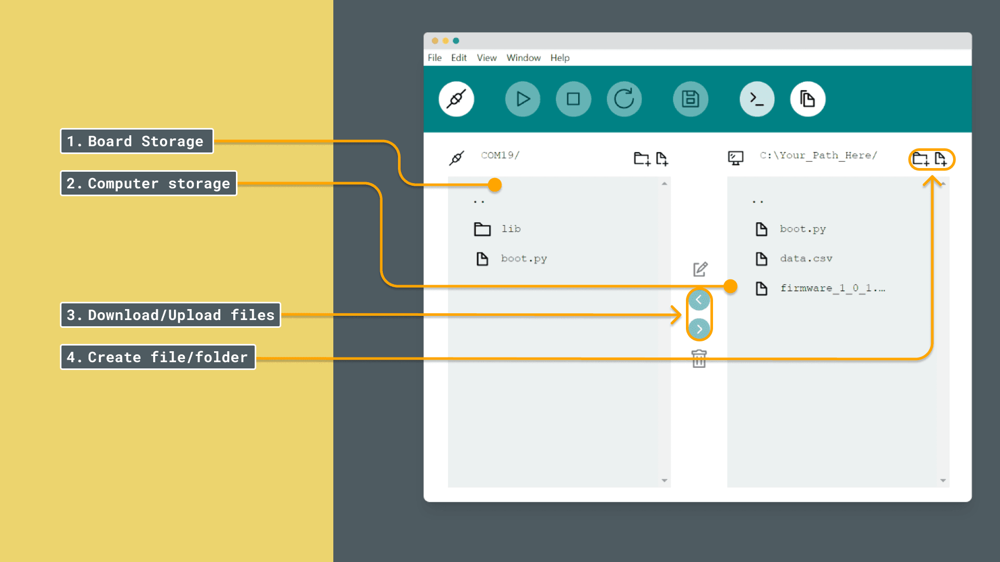
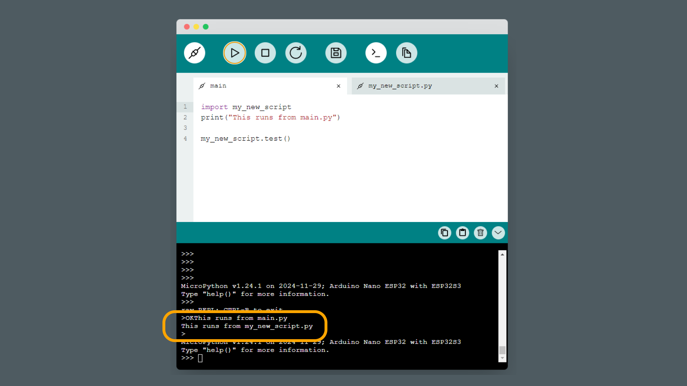
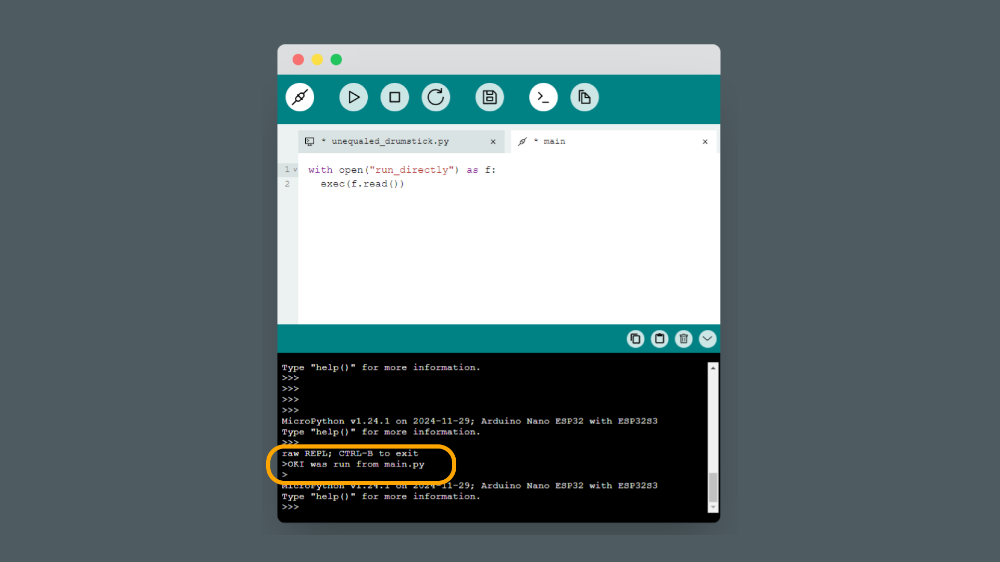

When working with MicroPython, we’re not limited to a single program file like in traditional Arduino sketches (using C++). Instead, MicroPython provides a file system, enabling us to store and manage multiple files on our microcontroller. This opens up powerful capabilities for organizing code, managing assets, and creating modular projects.

In this article, we'll explore how the MicroPython file system works, how to organize files effectively, and the typical structure of MicroPython projects.


## The MicroPython File System: Key Differences

In traditional Arduino programming, we upload a single compiled file directly to the microcontroller, where it runs immediately. In MicroPython we work within a file system that can store multiple files. This file system allows us to:

- **Upload and Download Files**: We can save individual scripts, libraries, and assets directly on the device.
- **Organize Project Files**: Create folders, save multiple scripts, and organize files for a modular approach.
- **Edit Files Directly on the Device**: Modify files without needing to overwrite everything, making adjustments faster and more flexible.
- **Run Different Scripts**: while we have `boot.py` (runs at start) and `main.py` (runs after start), we can also create more scripts that we can run, either from the editor, or from the board itself.

## Accessing the MicroPython File System

To interact with the MicroPython file system, we’ll use Arduino Labs for MicroPython, which provides tools to manage and view files directly on our device. Here’s how to get started:

1. **Connect to Your Device**: Open Arduino Labs for MicroPython and establish a connection to our microcontroller.
2. **Upload and Download Files**: Use the file manager to upload files from our computer to the microcontroller or download files back to our computer.
3. **Organize Files**: We can create folders and store multiple files, making it easy to organize our project.



## Basic MicroPython File Structure

A typical MicroPython project includes a `main.py` file, `boot.py` file, libraries, and any supporting files our project needs. Here’s a standard layout:

```
/ (Root Directory)
├── boot.py
├── main.py
```

### Key Files

- **`boot.py`**: Runs once at startup, before `main.py`, and is typically used for system configurations that need to be set when the device first powers on.
- **`main.py`**: This is the primary script, similar to the `setup()` and `loop()` structure in Arduino. It runs automatically after `boot.py` finishes.

## Example: Importing Code from Scripts

With the MicroPython file system, we can create our own scripts and import them in the `main.py` script. This can be helpful in avoiding long scripts, as we instead can store the code in other files. This approach also makes it more modular.

To run code from a separate script in our `main.py` file, we can follow the instructions below:

1. Create a file named `my_new_script.py`, and add the following function:

    ```python
    def test():
     print("This runs from my_new_script.py")
    ```

2. In `main.py`, we run some initial code and then switches to executing a function from `my_new_script.py`. Here's an example:
    
    ```python
    import my_new_script
    print("This runs from main.py")

    my_new_script.test()
    ```

3. Check the REPL, we should see:

    ```bash
    This runs from main.py # executed from main.py
    This runs from my_new_script #executed from my_new_script
    ```

Essentially, this is how [modules](/micropython/environment/modules) work. You import a module, and use a function from that module.



## Example: Directly Executing a Script

We can also directly execute another script stored on the device. For this example, let's create a script and name it `run_directly.py`.

1. In the script, store this code:

    ```python
    print("I was run from main.py")
    ```

2. Then in `main.py`, we will use the `open()`, `exec()` and `read()` functions.

    ```python
    with open("run_directly.py") as f:
        exec(f.read())
    ```

- `open()` - opens a file
- `exec()` - executes a file
- `read()` - reads a file

As a result, we should read `"I was run from main.py"` in the REPL. How this differs from the previous example, is that the `run_directly.py` script was just run from top to bottom, as opposed to importing a specific segment of code.




## Organizing Code with Modules and Libraries

When you start importing custom modules or libraries, MicroPython will automatically create a `/lib` folder to store them. This helps keep external libraries or reusable functions separate from your main code. You can use this structure to further organize your project, making it easy to manage larger codebases.

For example:

```
/ (Root Directory)
├── boot.py
├── main.py
├── /lib
│   ├── my_custom_library.py
```

### Using Libraries in `main.py`

After placing reusable code in `/lib`, you can import it directly in `main.py`:

```python
from lib.my_custom_library import some_function

some_function()
```

This structure allows for cleaner, more modular code that’s easy to scale as your project grows.

## Conclusion

MicroPython’s file system brings flexibility and structure to embedded programming, enabling a more organized and modular approach. By understanding the typical file structure and how to manage files, we’ll be able to create more complex and maintainable projects.

**Tips for Organizing Our MicroPython Projects**

- **Modularize Code with Additional Scripts**: Store reusable or specific tasks in separate files, making `main.py` clean and focused on high-level logic.
- **Leverage the `/lib` Folder**: Use the automatically created `/lib` folder to keep libraries organized and separate from your main application code.
- **Edit and Manage Files Easily**: Arduino Labs for MicroPython’s file management tools make it easy to upload, download, and modify files on the device.

With a well-organized file system, we can streamline our development process and unlock new possibilities with MicroPython!