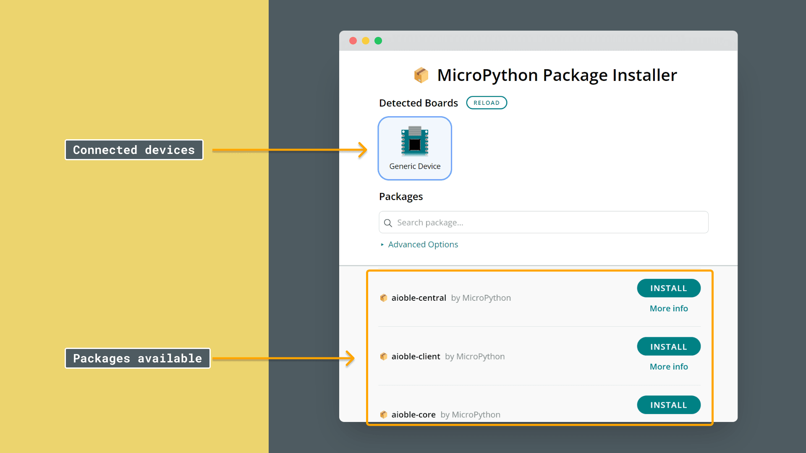
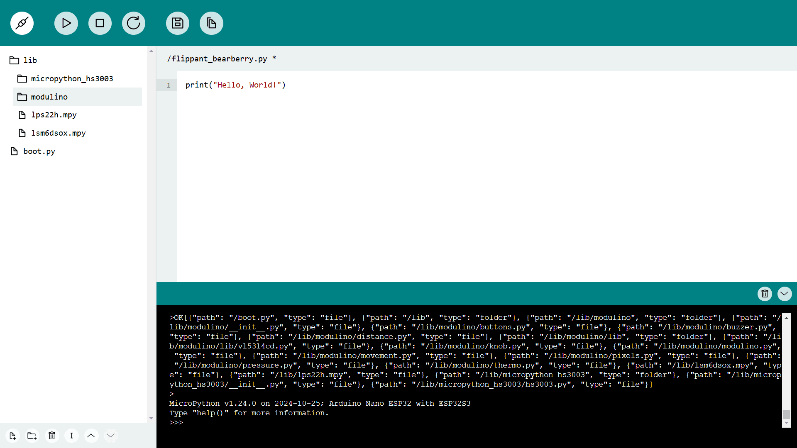

In this guide, we’ll cover how modules work in MicroPython, explore a few built-in modules, and demonstrate how to install an external package like Modulino to extend our MicroPython project’s functionality.

## What Are Modules?

Modules are collections of functions, classes, and variables organized into separate files, which we can import and use in our main program. Modules allow us to:

- **Reuse Code**: We can import useful functionality instead of writing everything from scratch.
- **Organize Code**: Breaking code into modules makes projects more readable and maintainable.
- **Access Special Functionality**: Some tasks require advanced functions (e.g., time delays or hardware communication) that are available only through modules.

## Built-in Modules

MicroPython comes with a set of built-in modules that provide essential functions for programming tasks. For instance:

- **`time`**: This module allows us to add time delays, get timestamps, and measure durations in code.
- **`os`**: Provides functions to manage the file system, such as creating files or listing directories.
- **`machine`**: A module designed for hardware interaction, allowing us to control pins, I2C, and more.

We can access built-in modules directly without any installation. Here’s a quick example using the `time` module to add a delay:

```python
import time

print("Starting countdown...")
time.sleep(3)  # Pauses the program for 3 seconds
print("Countdown complete!")
```

In this example, `time.sleep()` introduces a delay. Built-in modules like `time` are pre-installed with MicroPython, so we don’t need to install anything extra to use them.

## External Modules

Some modules aren’t included with the default MicroPython installation and need to be installed separately. External modules, often provided by the community or specific hardware packages, extend MicroPython’s functionality. For example, the [Modulino library](https://github.com/arduino/arduino-modulino-mpy) is an external module that provides tools for working with Arduino Modulino nodes.

To demonstrate how to use external modules, we’ll go through the steps to install the Modulino package on an Arduino board.

### Step 1: Install MicroPython on Your Board

Before we can install external modules, we need to have MicroPython running on our board. Use the [MicroPython Installer](https://labs.arduino.cc/en/labs/micropython-installer) to install it:

- Open the installer.
- Connect the board to your computer.
- Press the "Refresh" button if the board does not appear.
- Click "**Install MicroPython**" and wait for the installation to complete.

***For more details, visit the [MicroPython installation guide](/micropython/first-steps/install-guide)***

### Step 2: Install a Package

There are multiple ways to install external modules in MicroPython. We’ll cover two common methods:  
- **Using the MicroPython Package Installer (GUI)** (Recommended for ease of use)
- **Using `mpremote` (Command-line installation)**

#### Option 1: Using the MicroPython Package Installer (Recommended)
The **MicroPython Package Installer** is a graphical tool that makes it easy to install external MicroPython packages.

1. **Download and install** the [MicroPython Package Installer](https://github.com/arduino/lab-micropython-package-installer/releases).
2. **Open the tool** and plug in your board.

   
If the board does not appear in the `Detected Boards` section, click `Reload`.
If the board is still not detected, ensure no other programs (e.g., a code editor) are using the board's COM port.

1. **Search for a package** using the search feature.
2. Click **Install** and wait for the installation confirmation.
3. **Disconnect the board** from the tool before returning to your code editor to avoid conflicts due to the COM port being busy.

  

#### Option 2: Using `mpremote` (Command Line Installation)
For those who prefer the command line, we can use `mpremote`, a Python tool that allows direct installation from the terminal.

1. Make sure **Python** is installed on your computer.  
2. Open a terminal and install `mpremote` with:

   ```bash
   pip install mpremote 
   ```  

3. Run the following command to find your board's serial port:  

   ```bash
   mpremote connect list
   ```  

   Example output:  

   ```
   /dev/cu.usbmodem101 ecda3b60a4dccb3f 2341:056b Arduino Nano ESP32
   ```

   - Copy the **port**, e.g., `/dev/cu.usbmodem101`.

4. Use the following command to install the Modulino package (or any other package), replacing `<PORT>` with your board’s serial port:

   ```bash
   mpremote connect <PORT> mip install github:arduino/arduino-modulino-mpy
   ```

5. After installation, open **Arduino Labs for MicroPython** and connect your board. You should see a `/lib` folder with the Modulino library inside, confirming a successful installation.



## Organizing and Using Modules

With the Modulino package installed, we’ll see a `/lib` folder in Arduino Labs, where MicroPython automatically stores external modules. This directory structure is commonly used for organizing additional libraries, making it easy to import and use custom functions in our main program.

### Using an External Module

To use a function from the Modulino library, simply import it in `main.py`:

```python
from modulino import distance_sensor  # Example function

# Example usage
distance = distance_sensor.read_distance()
print("Distance:", distance)
```

This setup keeps `main.py` clean and makes it easy to incorporate external functionality without crowding the main script.

## Conclusion

MicroPython modules—whether built-in or external—allow us to keep our code organized, reduce duplication, and add powerful functionality to our projects. Some modules, like `time`, are included by default, while others, like the Modulino library, require installation.

- **Built-in Modules**: Modules like `time` and `machine` are part of MicroPython and need no installation.
- **External Modules**: Packages like Modulino must be installed separately, typically into the `/lib` folder.
- **Using Modules**: Once installed, we can import modules into our main program to extend functionality and keep our code modular.