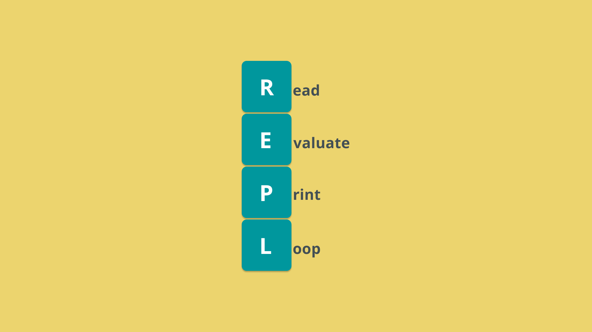
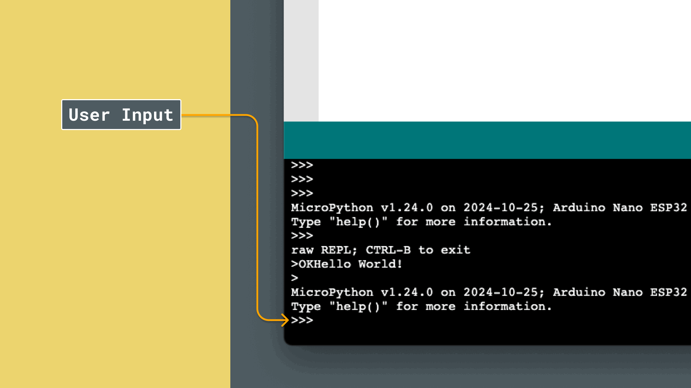

**REPL**, short for **Read-Eval-Print Loop**, is an interactive environment that makes programming in MicroPython fast and flexible. REPL allows you to enter code line-by-line and see the results immediately. Although sometimes overlooked it is a great way for testing and debugging on the fly.

In this guide, we’ll go through how the REPL functions, why it’s useful, and how you can use it to enhance your MicroPython experience.

## What is REPL?



The REPL process involves four basic steps:

- **R - ead**: Reads and accepts your code input line-by-line.
- **E - val**: Evaluates the entered code.
- **P - rint**: Displays the result of the code execution.
- **L - oop**: Repeats the process, allowing you to enter new code immediately.

Think of REPL as a conversation between you and your MicroPython environment, where each line you type gets an instant response, making it ideal for exploring ideas and troubleshooting.

## How REPL Works in MicroPython

In MicroPython, REPL can be accessed via Arduino Labs for MicroPython terminal, enabling you to run code in real-time directly on your device. Here’s a step-by-step guide on using it:

1. **Connect to REPL**: Open Arduino Labs for MicroPython and establish a connection to your microcontroller. Once connected, you’ll see a prompt (`>>>`), indicating the REPL is ready.
2. **Enter Code**: Type any valid MicroPython code directly after the prompt. When you press Enter, REPL will execute your code.
3. **See Results Instantly**: Any output, return values, or errors are displayed right away. If your code contains expressions, REPL will evaluate and print them for you.
4. **Iterate**: The loop resets, and you can immediately enter more code, building on previous commands or testing new lines independently.

## Example: Store and Print Your Name

Let's create a REPL session, where you will enter your name, and then print it.

Connect your board, and click on the **RUN** button with an empty script, then enter the following things in the REPL, line by line.

```
>>> name = "Pedro"
>>> name
```

When writing `name` in the REPL, (after `name = "Pedro"`), we should get:

```
'Pedro'
```



## Example: Perform a Calculation in the REPL

Now let's create a REPL session that performs a calculation, by adding two numbers together:

```python
>>> a = 5
>>> b = 3
>>> a + b
8
```

In this REPL session, we:

- Defined variables by setting `a` to `5` and `b` to `3`.
- Performed a calculation by entering `a + b`, which immediately returns `8`, showing the result without having to write a full script.

## Common Uses of REPL

REPL is particularly useful for:

- **Testing code snippets**: Quickly check how individual pieces of code behave.
- **Debugging**: Test small parts of a larger project interactively.
- **Learning**: Practice MicroPython commands and get instant feedback, ideal for beginners.

## Summary

REPL in MicroPython is an useful tool that enables instant testing and feedback, making coding more interactive and efficient. Whether you're learning, debugging, or exploring ideas, REPL provides a flexible and powerful coding experience.

**Experiment with REPL**

- **Explore Built-in Functions**: Use functions like `len()`, `sum()`, or `type()` and see the results immediately, allowing you to get a quick feel for MicroPython’s standard library.
- **Test Sensor and Pin Outputs**: Quickly check real-time data from sensors or pin states by writing simple lines to read values directly, helping you troubleshoot hardware setups.
- **Debug Variable Values**: Enter and modify variables on the spot to test changes in data or simulate inputs, allowing you to observe how your program behaves step-by-step.
- **Practice Logical Expressions**: Experiment with logical statements and conditionals to understand how `if` statements, comparisons, and loops work in MicroPython.

By mastering REPL, you’ll be well-equipped to make the most of MicroPython’s interactive capabilities and streamline your development process.