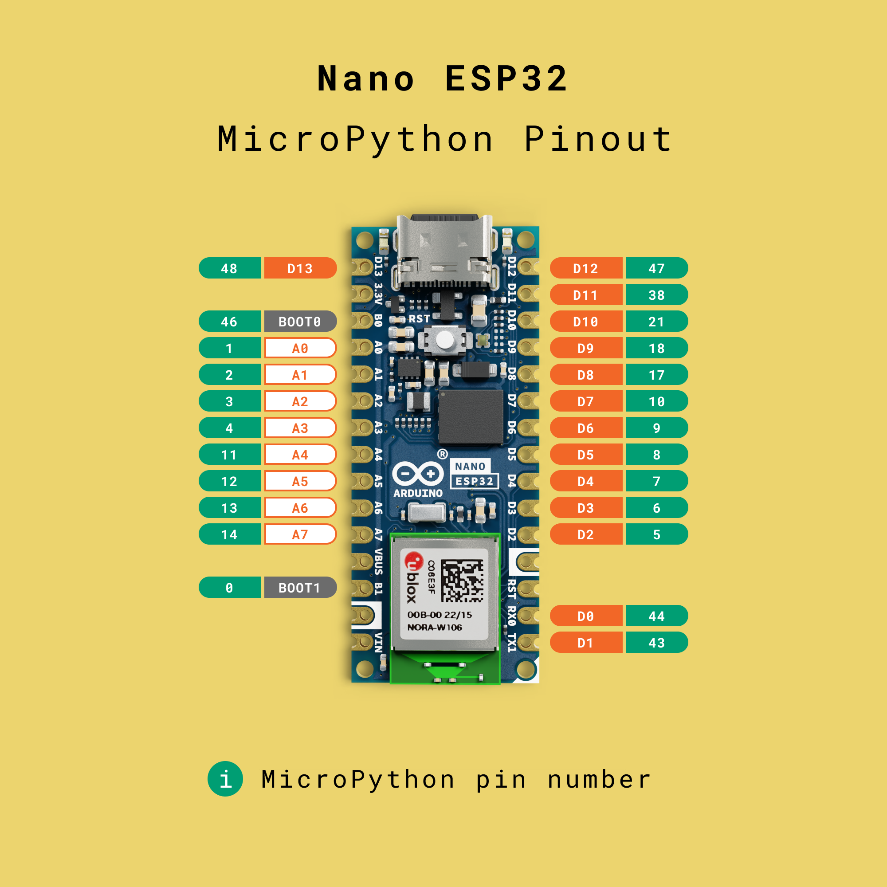
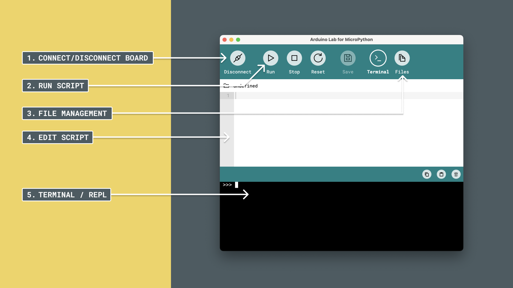
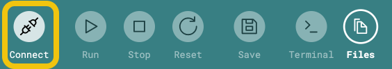
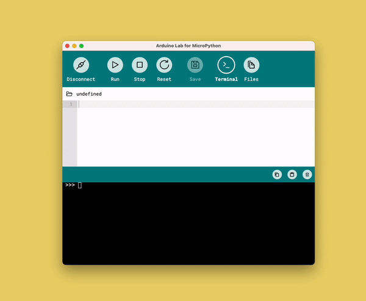
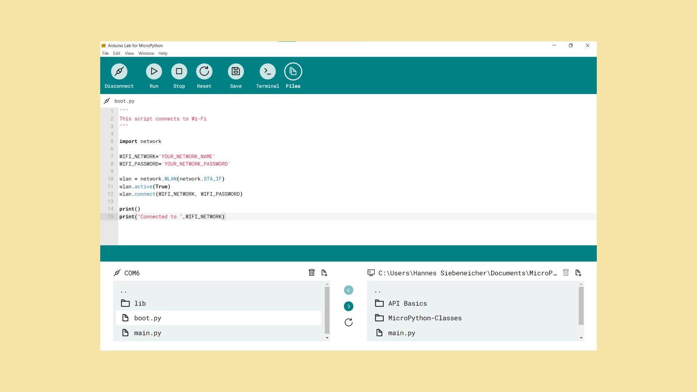
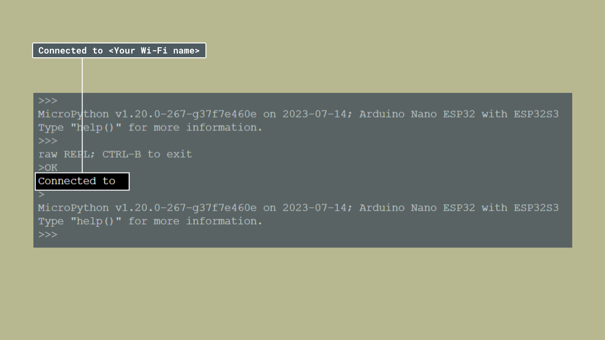
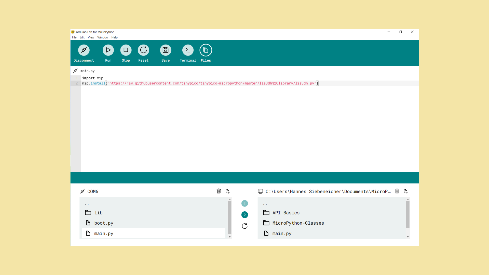
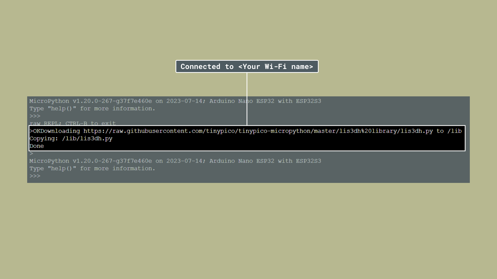

MicroPython is an implementation of the popular Python® programming language, with a target for microcontrollers (hence the "micro").

Python has become one of the most popular languages worldwide, with one of its key characteristics being an easier language to learn. This makes it suitable for beginners that have little to no experience in writing text-based code but want to achieve great things.

## Nano ESP32 / MicroPython Pinout

The pins used in MicroPython are very different from what the pin numbering on your board states. In the pinout below, you can see in **green**, which pins you need to use when using MicroPython.



Why is there a difference in pins? The MicroPython implementation follows the pin numbering on the ESP32-S3, making it compatible with all other boards based on the ESP32-S3.

Therefore it is necessary to keep track on two sets of pins:
- The **Nano ESP32 pins** which are labeled on the board.
- The **MicroPython pins** which are used in the code.

## The MicroPython Environment

MicroPython includes the standard Python API, but also a series of modules that are hardware specific. After you have installed it in your board, commands written in Python that you send to the board will be executed directly.

This is quite different from the "standard" Arduino (C++) way of programming, where you compile your code before sending it to your board. The MicroPython way allows you to change the program instantly.

When using MicroPython, we don't write sketches, we write **scripts**. A script can be written in a [MicroPython compatible editor](https://labs.arduino.cc/en/labs/micropython) which can then be saved on the board. To send a script, you need to have the board connected to your computer.

Since MicroPython implements a filesystem, you can access your board similar to how you access a USB drive.

## MicroPython Editor

A MicroPython editor is a special code editor with built-in functions for communicating with your board.

There are several editors available, but in this course, we will use the [Arduino Lab for MicroPython](https://labs.arduino.cc/en/labs/micropython).



***The [next chapter](/micropython/micropython-course/course/installation) is dedicated to using the Arduino Lab for MicroPython editor.***

## Connect to Your Board

Any time we want to interact and program our Nano ESP32, we need to connect to it. This requires the board to have MicroPython installed, which is covered in the [next chapter (installation)](/micropython/micropython-course/course/installation).

To connect to your board, click on the **"Connect"** button in the editor.



## What is a Script?

A MicroPython script is a piece of code that can be run on your board. It could contain just the simplest mathematic equation, `1+1` (which is 2), or a script that controls a robotic arm that serves you a cup of tea.

Inside a MicroPython editor, you simply write the code you want to run and click on the **"Run"** button.


If there is anything wrong with your code, you will receive an error. If not, it will run the instructions in the scripts from top to bottom. To stop the script, you can click on the **"Stop"** button right next to the Run button.

## Loops

If you have previous experience with Arduino, you may know the concept of a **loop**. This is not a requirement when using MicroPython. You can write a program that either just runs once, or continues to loop over and over.

To make a program loop continuously, you will need to use a **while loop** inside your script.

```python
while(True):
    # code placed here will execute over and over again
    # in a similar fashion to the void loop() function
```

## Main & Boot Files

There are two files that are important to consider in the MicroPython environment:
- `boot.py` - a script that will run as the board starts (in other words, **boots**).
- `main.py` - a script that will run immediately after `boot.py`.

You can consider `main.py` file to be your "main" script as it will execute any time after the board boots. Inside a MicroPython editor, we can open this file and edit it directly. When we save, we save it to the board, and the instructions are updated. To access your files, click the **"Files"** button.


This is a bit different if you are used to programming Arduino boards using the Arduino IDE / C++ because there you need to compile and upload for every change you make.

## Saving Files

As MicroPython has a file system, it is possible to save your code directly on the board. You can edit your files freely and the changes will **not save automatically**, but if you click on the **"Save"** button, this will overwrite anything previously stored in that file.


If you save it on for example the `main.py` file, you can disconnect the board, come back another day, connect the board, and your file will be there! It works like a normal file you edit on your computer.

***Be cautious with the "Save" option, as it will overwrite everything, and there's no way of recovering it.***

## REPL

The **REPL**, also often referred to as the **terminal**, is a command line interface inside your editor. When you input instructions or a message, the **interpreter** on your Arduino will evaluate it, and return the result.

The REPL / Terminal is accessed by clicking on the **"Terminal"** button in the top right corner.


In the  could for example write `1+1`, which the REPL will reply with a `2`. This computation is performed on your Arduino, and sent back to you!



When we run a script, and don't worry, we will come back to this topic, we can use the `print()` function to print things in the REPL. This is a great way of knowing what goes on on your board. An example is:

```python
print(1+1)
print("Computation performed, yay!")
```


## Modules

As you progress with MicroPython, you will come across a very important term: **modules**.

Modules are code files that can be imported into your script which provides an additional set of functionalities. For example, the `time` module allows you to control how often something should occur, or the `machine` module contains hardware specific functions. To use a module, we can simply `import` it in the script, as follows:

```python
# import the "time" module
import time

# import the "pin" function from the "machine" module
from machine import Pin
```

Once the module is imported, you can use it in your script, like:

```python
import time

# freeze the program for one second
time.sleep(1)
```

## External Modules

Not all modules are built-in to the MicroPython installation. This would be impossible because we have a very limited memory space.

For example, to use a module for a specific sensor, we need to install it **externally**. Installing external modules can be done in several different ways, but below we will demonstrate a safe and straightforward approach.

### Install External Modules

To install an external module, we are going to use a package manager called `mip`. With `mip`, we can install a module on the board by connecting to Wi-Fi® and downloading the module directly to the board. Installing external modules is done in two steps:

1. Establish a Wi-Fi connection.

2. Download the module from a specific URL using `mip`.

To connect to your local Wi-Fi you can upload the following script to `boot.py` file. We choose `boot.py` because we want to make sure our board connects to the internet as soon as it boots up.

**Connect to Wi-Fi**



***Please note that you need to add your own Wi-Fi network and password in the `WIFI_NETWORK` and `WIFI_PASSWORD` fields.***

```python
"""
This script connects to Wi-Fi
"""

import network

WIFI_NETWORK='YOUR_NETWORK_NAME'
WIFI_PASSWORD='YOUR_NETWORK_PASSWORD'

wlan = network.WLAN(network.STA_IF)
wlan.active(True)
wlan.connect(WIFI_NETWORK, WIFI_PASSWORD)

print()
print("Connected to ",WIFI_NETWORK)
```
 Press run and you should see `Connected to <your Wi-Fi>` being printed inside the REPL.

 

 **Install external modules**

 Next, you need to run a script that installs the external module from a specific URL. Upload the following script to `main.py`.



```python
'''
This script installs external modules using mip
'''

import mip
mip.install("https://raw.githubusercontent.com/tinypico/tinypico-micropython/master/lis3dh%20library/lis3dh.py")
```

Press run and you should see the following inside the REPL:



In this case, we will provide a URL to a file stored on GitHub (the raw file). The script installs the `lis3dh` module, which will be used later on in this course.

You can verify that the module was installed correctly by pressing `Files` and checking inside the `lib` folder. You should see a file called `lis3dh.py` inside.


When asked later in the course to install external modules simply paste the provided script into `main.py` and press run.

### Removing Modules

If you want to uninstall a module, you can delete it in the editor using the "Files" tab. This is a good idea to do if you have installed many modules, as eventually you will run out of memory space.

Select the file you want to remove, and click on the **"Delete"** icon. You will be prompted to remove the file.


### Troubleshooting

**1. Invalid URL:** if you have specified an invalid URL, you will get an error that looks like this:

```
Package not found: https://micropython.org/pi/v2/package/6/<url>/latest.json
```

Double check to make sure your URL is correct if this occurs.

**2. OSError: -202:**

The following error can occur when running the installation script.

```
Traceback (most recent call last):
  File "<stdin>", line 24, in <module>
  File "mip/__init__.py", line 1, in install
  File "mip/__init__.py", line 1, in _install_package
  File "mip/__init__.py", line 1, in _install_json
  File "urequests.py", line 180, in get
  File "urequests.py", line 76, in request
OSError: -202
```

Some things to check are:
- Did you enter your network credentials properly?
- Did you already connect to Wi-Fi?

If the error persists, you can try to "soft-reset" the board, by clicking the **"Reset"** button, and run the script again.


## Summary

In this chapter, we learned a little bit about the key components in the MicroPython environment.

- [Next chapter: Python Crash Course](/micropython/micropython-course/course/python-cc)