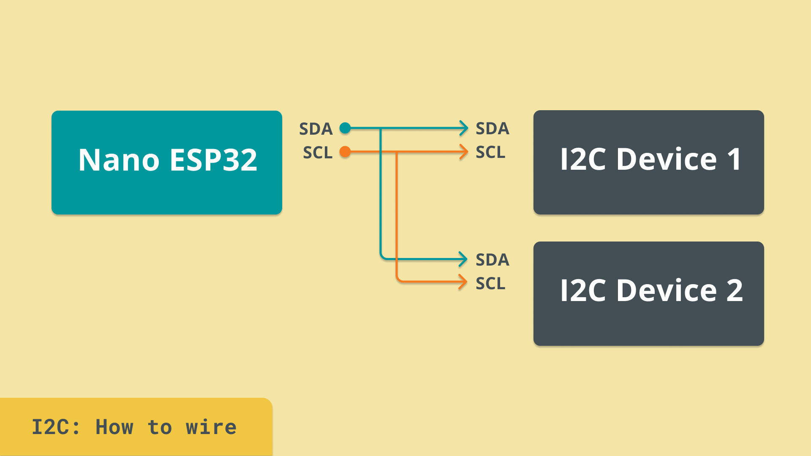
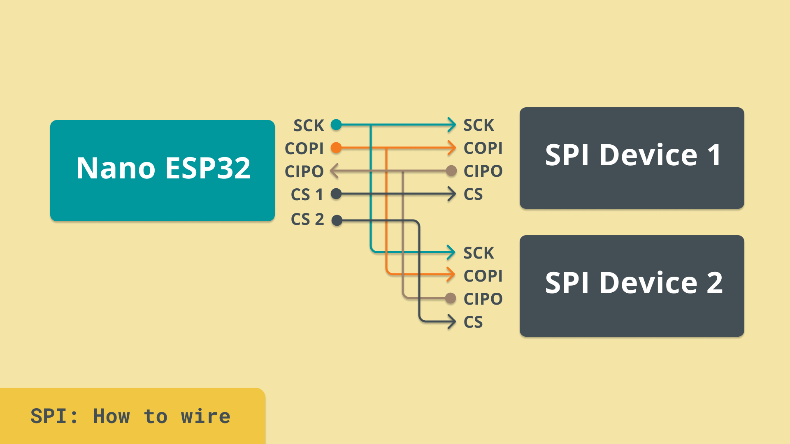
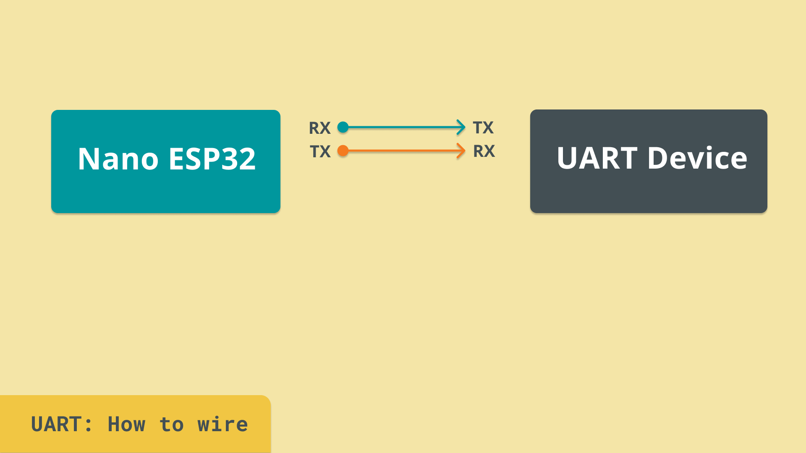
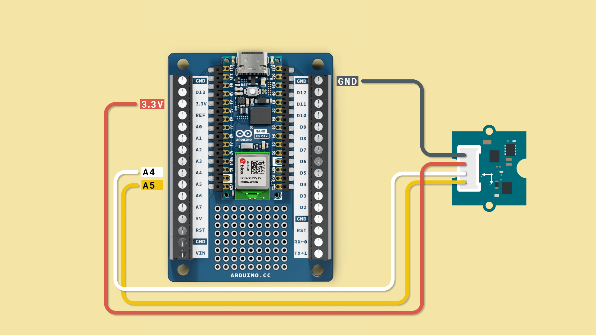
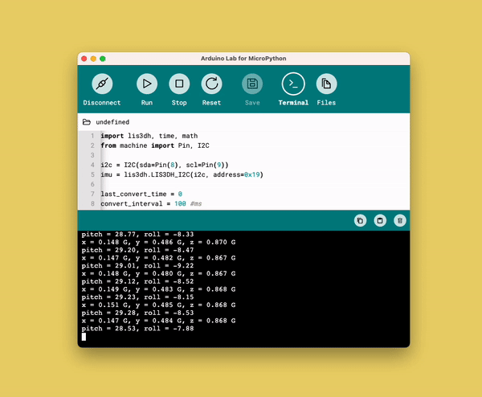

Serial protocols are fundamental in any electronic design, as they are the method of transporting data between different circuits and components.

They consist of digital signals that are used in clever ways to send 1's and 0's between systems. There are many, many serial protocols out there, but in this chapter we will focus on the three most important ones when working with Arduino: **I2C, SPI** and **UART**.

You will learn the following in this chapter:
- What I2C, SPI and UART is, and a brief introduction to how they work,
- how to read a sensor's data using I2C.

***This chapter introduces more advanced topics than previous chapters. It provides however some essential knowledge that will make your interaction with more complex (but also more fun) devices a little bit easier.*** 

## Serial Protocols

Serial protocols is a collective term for techniques that sends data electronically, bit by bit in a **serial** fashion. We have previously learned about digital signals, and how they have only two states: 1 (HIGH) and 0 (LOW). 

We will now take a look at how digital signals can be used to transfer data accurately at very fast rates. This is a fundamental technique not only to Arduino, but is used in practically any computer system in the world.

But to understand serial protocols, we need to have a quick introduction to what **bits** and **binaries** are.

### Bits & Binaries

A bit is a piece of information, that can only hold two values: a 0 or a 1. As we know, digital signals can create, or read, either a 0, or a 1.

But to use just two values is quite primitive, either something is ON, or something is OFF. This is where we introduce the binary number system. This system is represented by only 0s or 1s, like for example this:

- `0101`

Now we are used to the **decimal system**. For example, if we see the number `5`, we know, it is the number `5`. But in binary, the number `5` is expressed as `0101`.

Why is this important? Well, we know that `0101` = `5`, so with that knowledge, if we use a digital signal we can actually send the number 5 by:
- First sending a "low" signal (0),
- then sending a "high" signal (1),
- then sending a "low" signal (0),
- and finally, sending a "high" signal (1).

If we send this to a system that is set up to look for these patterns, it will receive the number 5, and magically, we have sent **data over serial**. And this is how computers talk with each other.

Now that was just a very rough idea how they work. In reality, it is much more complex. Fortunately, we have **serial protocols** that help us to send and receive this data in a much easier fashion!

With some fundamental knowledge in this, we can now move on to learn about the I2C, SPI and UART protocols. All protocols mentioned in this article have bidirectional communication support, meaning that data can be send in either direction.

### Inter-Integrated Circuit (I2C)



I2C is a serial protocol that allows you to connect many devices (up to 128) on the **same two wires**. These wires are called Serial Data (SDA) and Serial Clock (SCL).

How this works is that each component that uses I2C, has a unique address (like `0x0C`), and using the I2C protocol, we can access just that address, and either write or read from it, using another set of addresses.

For example, we can connect a sensor, and a display to the same pins, and read the sensor data and write the value to the display.

This is currently one of the most used protocols in Arduino and many sensors rely on this protocol to function.

### Serial Peripheral Interface (SPI)



SPI is a 4-wire serial protocol and is also used for communication between systems. Many sensors, displays and such use the SPI protocol as it is in general twice as fast as I2C, but with more complexity in adding more devices to it.

To use SPI, we need four dedicated pins:
- **COPI** - Controller Out, Peripheral In
- **CIPO** - Controller In, Peripheral Out
- **SCK** - Serial Clock
- **CS** - Chip Select

The COPI/CIPO are used to transfer the data, while SCK is used to synchronize the data transmission.

Finally, the chip select pin is used as to determine whether the device should communicate with a controller or ignore it.

### Universal Asynchronous Receiver-Transmitter (UART)

UART is one of the oldest and historically most used serial protocols. With a UART controller, we have two lines (TX/RX), which is used to connect two devices. 

Bits of information is then sent sequentially from one device to another, where the receiving end reconstructs the bits into complete bytes.

UART is ideal for one-to-one communication between two devices, and requires only two wires and no additional clock to function. It is significantly slower than SPI, but is rather easy to set up and use, and of course, uses less wires.



## Example: I2C Sensor

In this exercise, we are going to read the value of a sensor connected via **I2C**. We are going to use a popular sensor **LIS3DHTR**, which is an accelerometer.

Follow the circuit diagram below to connect the accelerometer to your board.



To use this module, you need to have the `lis3dh` module installed. Install it by running the following command:

```python
mip.install("https://raw.githubusercontent.com/tinypico/tinypico-micropython/master/lis3dh%20library/lis3dh.py")
```

***For how to use `mip.install()`, please see the instructions in the [Install External Modules](/micropython-course/course/introduction-python#install-external-modules) section in the "Introduction to MicroPython" chapter.***

Open the code editor, and copy paste the following script to the `main.py` file, then click on the **"Run"** button to run it.

```python
import lis3dh, time, math
from machine import Pin, I2C

i2c = I2C(sda=Pin(8), scl=Pin(9))
imu = lis3dh.LIS3DH_I2C(i2c, address=0x19)

last_convert_time = 0
convert_interval = 100 #ms
pitch = 0
roll = 0


# Convert acceleration to Pitch and Roll
def convert_accell_rotation( vec ):
    x_Buff = vec[0] # x
    y_Buff = vec[1] # y
    z_Buff = vec[2] # z

    global last_convert_time, convert_interval, roll, pitch

    # We only want to re-process the values every 100 ms
    if last_convert_time < time.ticks_ms():
        last_convert_time = time.ticks_ms() + convert_interval

        roll = math.atan2(y_Buff , z_Buff) * 57.3
        pitch = math.atan2((- x_Buff) , math.sqrt(y_Buff * y_Buff + z_Buff * z_Buff)) * 57.3

    # Return the current values in roll and pitch
    return ( roll, pitch )

# If we have found the LIS3DH
if imu.device_check():
    # Set range of accelerometer (can be RANGE_2_G, RANGE_4_G, RANGE_8_G or RANGE_16_G).
    imu.range = lis3dh.RANGE_2_G

    # Loop forever printing values
    while True:
        # Read accelerometer values (in m / s ^ 2).  Returns a 3-tuple of x, y,
        # z axis values.  Divide them by 9.806 to convert to Gs.
        x, y, z = [value / lis3dh.STANDARD_GRAVITY for value in imu.acceleration]
        print("x = %0.3f G, y = %0.3f G, z = %0.3f G" % (x, y, z))

        # Convert acceleration to Pitch and Roll and print values
        p, r = convert_accell_rotation( imu.acceleration )
        print("pitch = %0.2f, roll = %0.2f" % (p,r))

        # Small delay to keep things responsive but give time for interrupt processing.
        time.sleep(0.1)
```

In the terminal, we should now see the data from the accelerometer being posted every second. This data is fetched directly from the sensor, using the I2C protocol.



Congratulations, you have now connected two complex systems and made them communicate with each other!

## Summary

In this chapter, we learned about the three most common serial protocols in Arduino: **I2C, SPI** and **UART**. We covered the basics of these serial protocols, and introduced an example that reads sensor data over I2C.

Serial protocols is an advanced topic, and in this chapter we have only covered a fraction, so that you have an idea on how the examples work.

To learn more about serial protocols, you can visit the ["communication" section in docs.arduino.cc](https://docs.arduino.cc/learn/#communication).

- [Next Chapter: Internet of Things with MicroPython](/micropython-course/course/internet-of-things)

