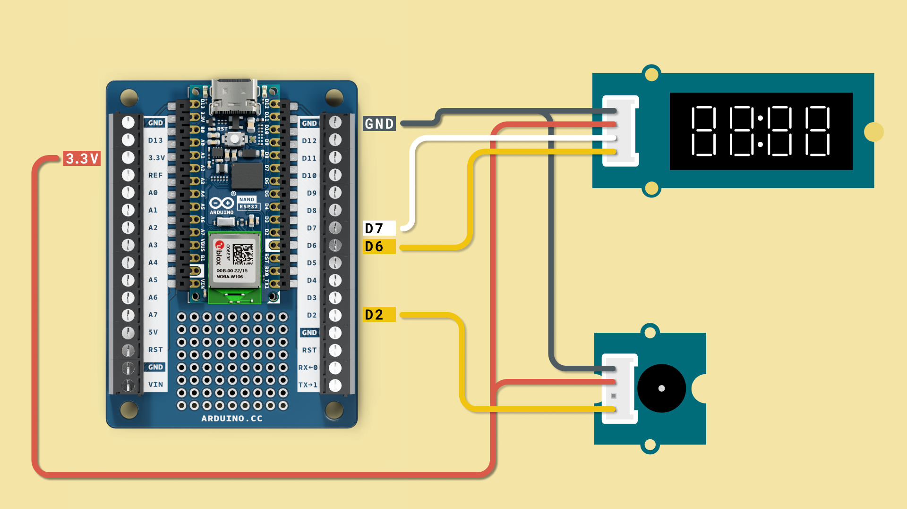

***Please complete the basic installation-chapters before starting a project.***

This project will use the `ntptime` module to keep track of the time and display it on a 4-digit-display. An alarm can then be set in the code, which will turn on the buzzer at a specified time. To keep track of time accurately the board will also connect to a Wi-Fi® network.

## Required Hardware

You will need the following to build this project:

- [Nano ESP32](https://store.arduino.cc/products/nano-esp32)
- [Nano Screw Terminal Adapter](https://store.arduino.cc/products/nano-screw-terminal)
- [4-digit-display](https://store.arduino.cc/products/grove-4-digit-display)
- [Piezo buzzer](https://store.arduino.cc/products/grove-buzzer-piezo)
- [Grove to male cables](https://store.arduino.cc/products/grove-4-pin-male-to-grove-4-pin-cable-5-pcs)

## Circuit

Assemble the components according to the circuit diagram below:



## Code

Read the comments in the code and change the variables as necessary then upload it to your board.

In order to use the 4-digit-display you will need to install the following module:

```python
mip.install("https://raw.githubusercontent.com/mcauser/micropython-tm1637/master/tm1637.py")
```

***If you are unsure how to install external modules you can read up on it [here](https://docs.arduino.cc/micropython-course/course/introduction-python#external-modules)***

```python
from machine import Pin, PWM, RTC
import time
from time import sleep
import tm1637
import ntptime
import network

UTC_OFFSET = 0 * 60 * 60   # change the '0' according to your timezone
actual_time = time.localtime(time.time() + UTC_OFFSET)

# Frequency and duration of the sound
FREQUENCY = 220  # Hz
DURATION = 2  # seconds

# Create a controllable Pin for the speaker
speaker = PWM(Pin(5))

tm = tm1637.TM1637(clk=Pin(9), dio=Pin(8))

connection = network.WLAN(network.STA_IF)

def connect(ssid, password):
  ssid = ssid
  password = password
  if connection.isconnected() == True:
    print("Already connected")
    return
  connection.active(True)
  connection.connect(ssid, password)
  while connection.isconnected() == False:
    pass
  print("Connection successful")
  print(connection.ifconfig())

# Function to play a sound
def play_sound(frequency, duration):
    speaker.freq(frequency)
    speaker.duty(512)
    time.sleep(duration)
    speaker.duty(0)


connect("SSID", "password") #Replace the SSID with the name of your network and password with the networks password
rtc = RTC()

alarm = [08, 30, 1] #The time for the set alarm [hour, minutes, enabled status(1=true)]
isPoint = True

while(1):
    printTimeH = int("{3:02d}".format(*actual_time))
    printTimeM = int("{4:02d}".format(*actual_time))
    if alarm[2] == 1 and alarm[0] == printTimeH and alarm[1] == printTimeM:
        play_sound(FREQUENCY, DURATION) # Play the sound
    
    tm.numbers(printTimeH, printTimeM, isPoint)
```
