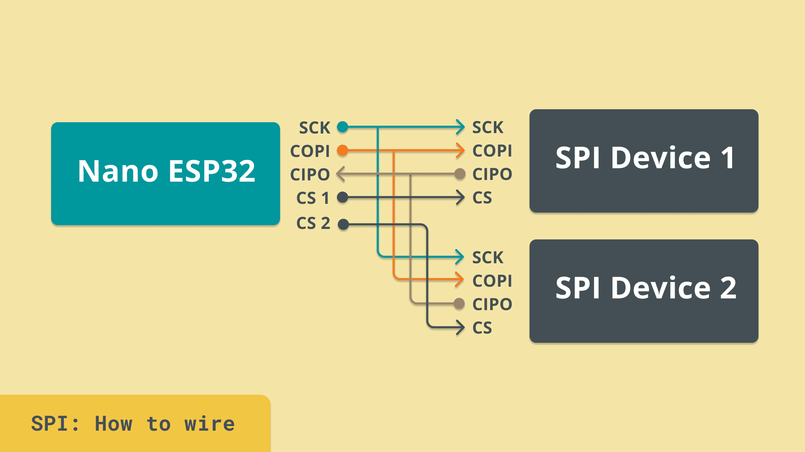

#### Introduction
The **Serial Peripheral Interface (SPI)** is a high-speed serial communication protocol widely used in embedded systems, including Arduino. It allows data exchange between devices using a straightforward and fast four-wire setup. Having a known and stadertized pinout makes easier to add new modules to your project as they remain the same across manufacturers (and product lines).

#### How SPI Works
SPI communication uses four main lines:
- **COPI (Controller Out, Peripheral In):** Sends data from the controller to the peripheral.
- **CIPO (Controller In, Peripheral Out):** Sends data from the peripheral to the controller.
- **SCK (Serial Clock):** Synchronizes data transfer between devices.
- **CS (Chip Select):** Activates a specific peripheral for communication.

The controller initiates communication by enabling the peripheral through the **CS** line. Data is transmitted bit by bit in synchronization with the clock signal on the **SCK** line.

#### Key Features of SPI
1. **Full-Duplex Communication:** Simultaneous data transmission and reception.
2. **High Speed:** Faster than I2C, suitable for performance-critical applications.
3. **Multiple Devices:** Supports multiple peripherals, each with a dedicated **CS** line.
4. **Simple Protocol:** No addressing required, reducing communication overhead.

#### Example: Connecting an SPI Device
In this example, we explore how to wire and interact with SPI devices using an Arduino. Many sensors and displays use SPI for their speed and reliability.

**Wiring Diagram:**

**Key Pins:**
1. **COPI** (Controller Out, Peripheral In) – Sends data to the peripheral.
2. **CIPO** (Controller In, Peripheral Out) – Receives data from the peripheral.
3. **SCK** (Serial Clock) – Synchronizes data transfer.
4. **CS** (Chip Select) – Enables the specific peripheral.

**Example Operation:**
SPI communication involves enabling a peripheral via the **CS** line, sending data through **COPI**, and receiving responses via **CIPO**.

#### SPI in Practice
Many common devices, such as high-speed sensors, displays, and memory modules, utilize SPI for its speed and efficient design. The protocol's simplicity makes it a go-to choice for connecting peripherals requiring high data throughput.

#### Summary
SPI is a robust, high-speed protocol that provides an efficient means of communication between an Arduino and peripherals. Its simplicity, speed, and flexibility make it an indispensable tool for a wide variety of electronics projects. With SPI, you can reliably handle everything from sensors to displays in performance-critical environments.