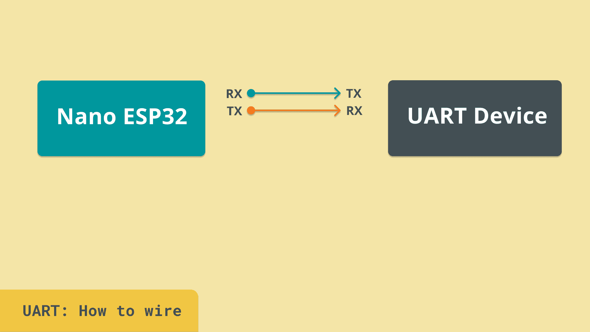

#### Introduction
The **Universal Asynchronous Receiver-Transmitter (UART)** protocol is one of the simplest and most commonly used communication protocols. It is ideal for straightforward one-to-one communication between devices, making it a staple in embedded systems, including Arduino projects.

#### How UART Works
UART operates using two main lines:
- **TX (Transmit):** Sends data from one device to another.
- **RX (Receive):** Receives data from the transmitting device.

Unlike protocols like I2C or SPI, UART is asynchronous, meaning it does not require a clock signal to synchronize communication. Instead, both devices agree on a common baud rate, which determines the speed of data transmission.

#### Key Features of UART
1. **Two-Wire Simplicity:** Minimal wiring requirements with only TX and RX lines.
2. **Asynchronous Communication:** No clock line needed.
3. **Configurable Baud Rates:** Common rates include 9600, 115200, and others.
4. **One-to-One Communication:** Designed for direct communication between two devices.

#### Example: Communicating via UART
UART is widely used for debugging, serial monitors, and communication with modules like GPS or GSM. In this example, we connect an Arduino to a UART-enabled device.

**Wiring Diagram:**

**Key Pins:**
1. **TX:** Connects to the RX pin of the receiving device.
2. **RX:** Connects to the TX pin of the transmitting device.
3. **GND:** Establishes a common ground between devices.

#### Practical Example
The example provided in the original article demonstrates how UART facilitates direct, real-time communication between devices. When implemented, UART ensures reliable transmission of data, making it invaluable for basic communication needs.

#### Summary
UART remains a cornerstone protocol for simple, direct communication between devices. Its ease of use and minimal hardware requirements make it an essential tool for debugging and connecting peripherals in Arduino and other embedded systems.