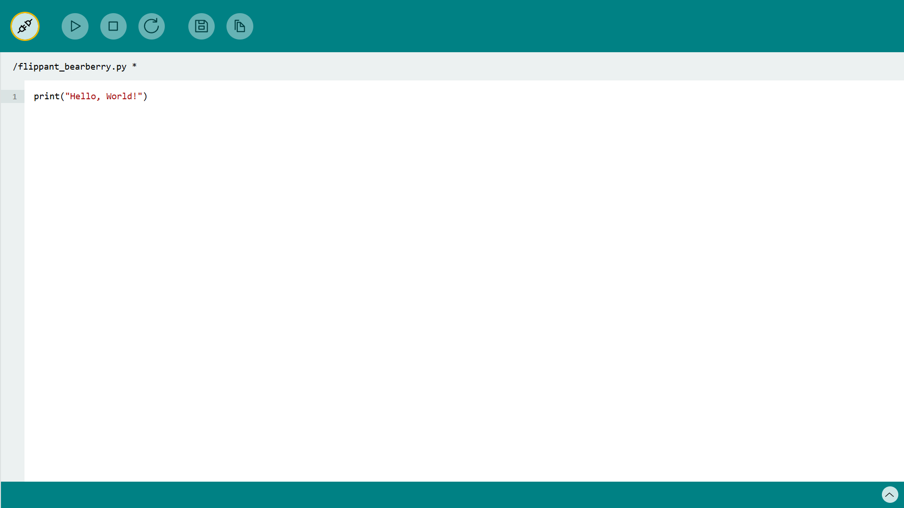

---

title: 'Modulino Installation'
description: 'Get started with using the Modulinos'
author: 'Hannes Siebeneicher, Sebastian Romero'
hero_image: "./hero-banner.png"

---

This article will guide you through the installation process for programming the Arduino Modulinos with Micropython. 

## Goals

The goals of this tutorial are:

- learn how to install MicroPython on your Arduino board.
- learn how to install MicroPython packages.
- learn how to run a simpe sketch using MicroPython labs.

## Hardware & Software Needed

- [MicroPython Labs](https://lab-micropython.arduino.cc/)
- [Arduino Nano ESP32](https://store.arduino.cc/products/nano-esp32?queryID=undefined)
- [MicroPython Installer](https://labs.arduino.cc/en/labs/micropython-installer)
- [Modulino MicroPython Package](https://github.com/arduino/arduino-modulino-mpy)

## Install MicroPython

If you haven't done so already, you need to install MicroPython on your Arduino board. The easiest way is to install it using the [MicroPython Installer](https://labs.arduino.cc/en/labs/micropython-installer).

- Open the installer
- Connect your board. 
- If it does not appear press the refresh button.
- Press "Install MicroPython".
- Wait for the installation to finish.


## Install Modulino Package

To program Modulinos using MicroPython you must first install the Modulino Package. It's where all the code, necessary to interact with the Modulinos is being stored.

The easiest way of installing it is using `mpremote`.

***If this is your first time using `mpremote`, check out the [Getting Started article]().***

Once you have everything set up, run:

```bash
mpremote connect <PORT> mip install github:arduino/arduino-modulino-mpy
```


This will install all necessary packages on your Arduino board.

## MicroPython Labs

Let's verify that everything was installed and is working correctly. Go to [MicroPython Labs](https://lab-micropython.arduino.cc/) and click on the connect icon in the top left corner.



Select the board and press select "connect". You should, now be connected to your Arduino board.

***If you experience any issues, try disconnecting and connecting the board again and reinstall MicroPython using the [MicroPython Installer](https://labs.arduino.cc/en/labs/micropython-installer).***

To verify that the Modulino package has been installed correctly, click on the file icon in the top bar of the Labs editor.

You should see a folder called `lib` and a file called `boot.py`. Go ahead and press on the `lib` folder and you should see several files and a folder called `modulino`.


If you see this, it means the package has been installed successfully. If you want to to go even deeper, you can open the modulino folder and have a look at the individual Modulino packages. Don't worry, you don't have to understand what those files mean exactly to continue.

## First Sketch

Copy the following line to the MicroPython Labs Editor and press "Run".

```python
print("Hello, World!")
```

You should see "Hello, World", being printed in the commandline.

## Next Steps

Now that you have successfully installed everything it's time to program your first Modulino.