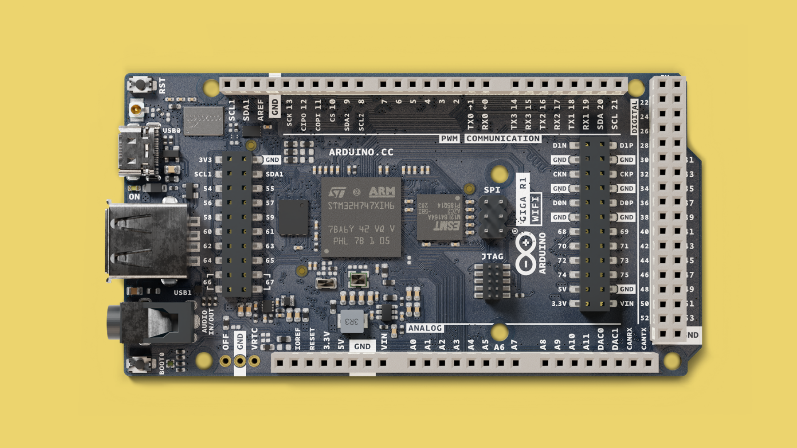
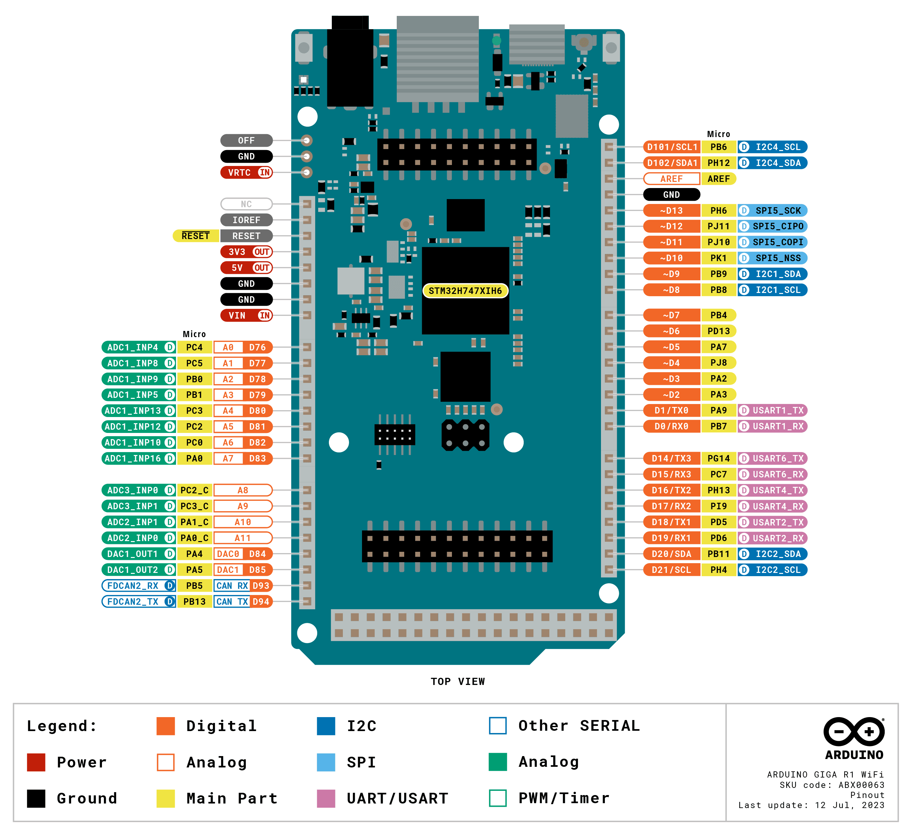

In this guide, you will find information specific to the [GIGA R1 WiFi board](https://store.arduino.cc/products/giga-r1-wifi), such as supported serial protocols, built-in peripherals, and how to access the wireless features.

For installation instructions, please visit the link below:  
- [Installing MicroPython](https://labs.arduino.cc/en/labs/micropython-installer)

## Pinout

The pinout for the GIGA R1 WiFi can be found in the image below.



***For more details on this product, visit the [hardware product page](/hardware/giga-r1-wifi/).***

## Board-Specific Features

The GIGA R1 WiFi has several board-specific features that we can access through MicroPython:

- **Dual-core STM32H7**: Leverage the power of two cores (Cortex-M7 and Cortex-M4) and RPC for advanced multitasking applications.
- **RGB LED**: A built-in RGB LED that can be controlled by setting `r`, `g`, and `b` values.
- **Wireless Connectivity**: Supports both **Wi-Fi®** and **Bluetooth®** using the integrated Murata 1DX module.
- **High-speed Connectivity**: Includes a USB-C® connector, high-speed UART, and CAN bus support.

## Dual-Core Programming

The GIGA R1 WiFi supports dual-core programming, where the Cortex-M7 and Cortex-M4 cores can execute separate tasks simultaneously. Below is an example of how to run MicroPython on one core while offloading specific tasks to the other:

**Example:** Running MicroPython on Cortex-M7 and using the M4 for auxiliary tasks.  

```python
from machine import freq
import _thread

# Function to run on Cortex-M4 core
def auxiliary_task():
    while True:
        print("Running auxiliary task on M4")
        time.sleep(1)

# Run main task on M7 core
def main_task():
    print("Main task on M7 core")
    _thread.start_new_thread("Aux", auxiliary_task, ())

main_task()
```

**Note**: Dual-core programming is an advanced topic and requires proper synchronization to avoid resource conflicts.

## RGB LED

The GIGA R1 WiFi has a built-in RGB LED that can be easily controlled to turn on each color individually. The following example shows how to cycle through red, green, and blue, waiting a second between each, and then turning off all colors before looping back.

```python
from machine import Pin
import time

# Initialize pins for the RGB LED
red = Pin("LED_RED", Pin.OUT)     # LED_RED GPIO
green = Pin("LED_GREEN", Pin.OUT) # LED_GREEN GPIO
blue = Pin("LED_BLUE", Pin.OUT)   # LED_BLUE GPIO

# Function to turn off all colors
def turn_off_all():
    red.value(0)
    green.value(0)
    blue.value(0)

# Cycle through colors
while True:
    red.value(1)      # Turn on Red
    time.sleep(1)     # Wait for 1 second
    red.value(0)      # Turn off Red

    green.value(1)    # Turn on Green
    time.sleep(1)     # Wait for 1 second
    green.value(0)    # Turn off Green

    blue.value(1)     # Turn on Blue
    time.sleep(1)     # Wait for 1 second
    blue.value(0)     # Turn off Blue

    turn_off_all()    # Ensure all colors are off
```


## PWM on the GIGA R1 WiFi

On STM32 boards like the Arduino GIGA R1 WiFi, PWM is handled differently than on typical MicroPython boards. Instead of directly using the `PWM` class, you need to use the `Timer` class in combination with the `Pin` class from the `pyb` module.

Below is an example of how to set up PWM on the GIGA R1 WiFi:

```python
from pyb import Pin, Timer

# Set up the PWM pin
p = Pin('A13')  # Replace 'A13' with your desired PWM-capable pin

# Initialize a timer for PWM
tim = Timer(2, freq=1000)  # Timer 2 with a frequency of 1 kHz

# Create a PWM channel on the timer
ch = tim.channel(1, Timer.PWM, pin=p)

# Set the duty cycle
ch.pulse_width_percent(25)  # 25% duty cycle
```

- **Pin Setup**:  
   `p = Pin('A13')` initializes the pin `A13` for PWM output. Replace `'A13'` with another PWM-capable pin if needed. Note that on the GIGA R1 WiFi, `A13` is marked as **DAC1** on the pinout.

- **Timer Initialization**:  
   `tim = Timer(2, freq=1000)` initializes **Timer 2** with a frequency of 1000 Hz.

- **Channel Setup**:  
   `ch = tim.channel(1, Timer.PWM, pin=p)` creates a PWM channel on Timer 2, Channel 1, and associates it with pin `p`.

- **Set Duty Cycle**:  
   `ch.pulse_width_percent(25)` sets the duty cycle of the PWM signal to 25%. You can adjust this value between `0` and `100` to control the signal's ON time.


## RPC

The **msgpackrpc** library provides the same functionality as the Arduino RPC library for MicroPython, allowing seamless communication between the two cores (M7 and M4) on the GIGA R1 WiFi. This library enables binding of local functions or objects, starting the M4 core, and invoking remote calls from Python scripts.

### Key Features:
- **Dual-Core Support**: Execute tasks on the M4 core while the main MicroPython code runs on the M7 core.
- **Ease of Use**: The library is built-in and enabled by default in compatible Arduino boards, starting with MicroPython release v1.23.
- **No External Dependencies**: The library is included in the MicroPython firmware and does not require additional installations.


### Restrictions:

While powerful, the **msgpackrpc** library has some limitations:
1. Arduino sketches can only run on the **M4 core**.
2. **SDRAM-based firmware** is not supported.
3. **Flash-based firmware** must use a 1.5MB M7 + 0.5MB M4 flash partitioning scheme.


### Example

Here’s how to bind a function on the M7 core and call it from the M4 core:

**On the M7 Core:**

```python
from rpc import RPCServer

# Define a function to bind
def hello_world():
    return "Hello from M7!"

# Start the RPC server
rpc_server = RPCServer()
rpc_server.bind_function("hello_world", hello_world)

# Keep the server running
rpc_server.run()
```

**On the M4 Core:**

```python
from rpc import RPCClient

# Connect to the M7 core
rpc_client = RPCClient()

# Call the bound function on the M7 core
result = rpc_client.call_function("hello_world")
print(result)  # Outputs: Hello from M7!
```

For a detailed explanation of the RPC library, including advanced use cases and configuration, visit the [RPC Library with MicroPython guide](https://docs.arduino.cc/tutorials/giga-r1-wifi/giga-dual-core/#using-the-rpc-library-with-micropython).

## Summary

The GIGA R1 WiFi is a robust microcontroller packed with advanced features for embedded programming with MicroPython. From dual-core programming to high-speed connectivity and wireless communication, this guide provides the essentials to get started with this powerful board.

For more advanced projects and examples, visit the [Arduino Docs - MicroPython](https://docs.arduino.cc/micropython/).
