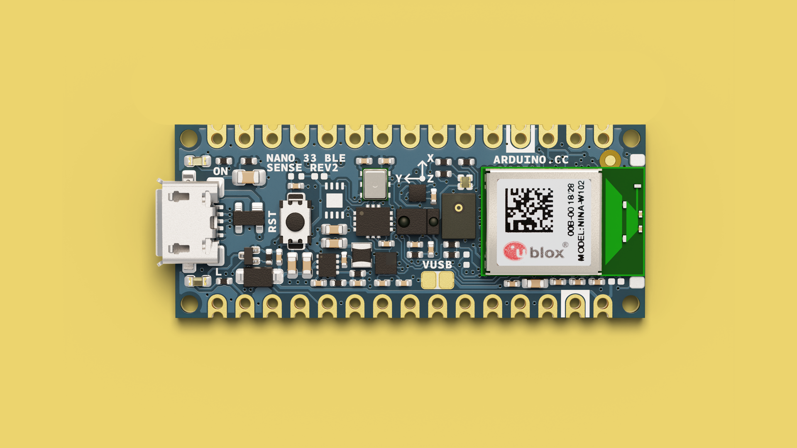
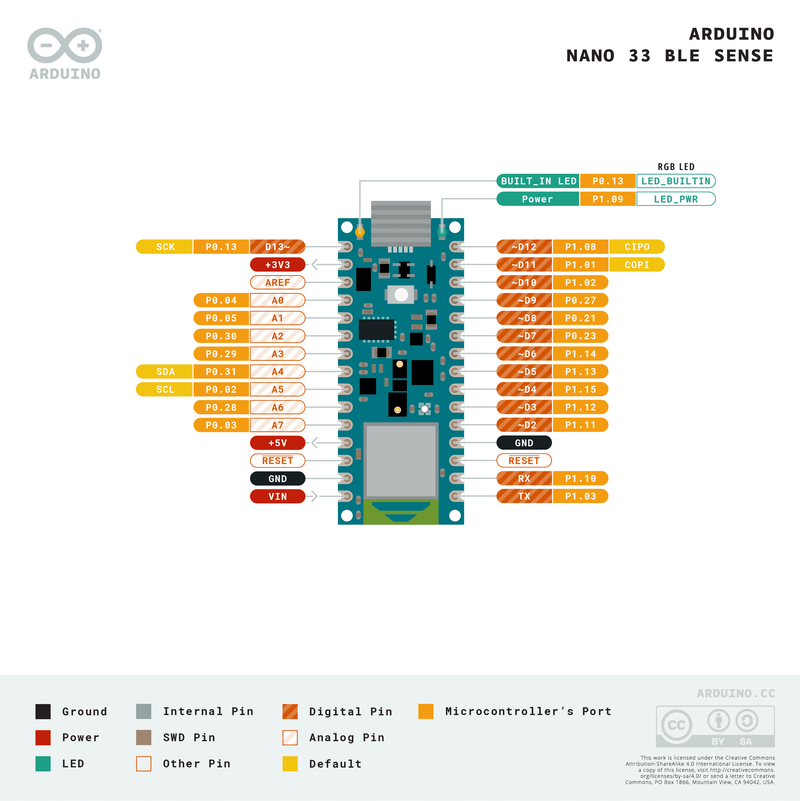

In this guide, you will find information specific to the [Nano BLE Sense board](https://store.arduino.cc/products/nano-33-ble-sense-rev2), such as supported serial protocols and built-in sensors that can be accessed.

For installation instructions, please visit the link below.
- [Installing MicroPython](/micropython/first-steps/install-guide)

## Pinout

The pinout for the Nano BLE Sense can be found in the image below.



***For more details on this product, visit the [hardware product page](/hardware/nano-33-ble-sense-rev2/).***

## Board Specific Features

The Nano BLE Sense has a number of board-specific features that can be accessed through MicroPython:

- **Built-in LED** - a small single pixel LED on the board.
- **RGB LED** - a simple RGB pixel that can be controlled by setting `r`, `g` and `b` values.
- **Microphone (MP34DT05)** - a microphone for recording audio samples.
- **Gesture Sensor (APDS9960)** - measure ambient light and proximity.
- **Pressure Sensor (LPS22)** - measure air pressure for weather applications.
- **Temperature and Humidity - HTS221 (Rev1), HS3003 (Rev2)** - record temperature and relative humidity.
- **IMU - LSM9DS1 (Rev1), BMI270 + BMM150 (Rev2)** - read gyroscope and accelerometer data.

## RGB LED

To use the RGB pixel, we can control it by using the `1`, `2` and `3` pins. Below is an example that will blink the main colors in sequence:

```python
from board import LED
import time 

led_red = LED(1)
led_green = LED(2)
led_blue = LED(3)

while (True):
   
    # Turn on LEDs
    led_red.on()
    led_green.on()
    led_blue.on()

    # Wait 0.25 seconds
    time.sleep_ms(250)
    
    # Turn off LEDs
    led_red.off()
    led_green.off()
    led_blue.off()

    # Wait 0.25 seconds
    time.sleep_ms(250)
```

## Built-in LED

The classic blink example! Blink the built-in LED every 0.25 seconds.

```python
from board import LED
import time 

led_builtin = LED(4)

while (True):
   
    # Turn on LED
    led_builtin.on()

    # Wait 0.25 seconds
    time.sleep_ms(250)
    
    # Turn off LED
    led_builtin.off()

    # Wait 0.25 seconds
    time.sleep_ms(250)

```

## IMU (LSM9DS1, BMI270 + BMM150)

Access the `accelerometer`, `magnetometer`, and `gyroscope` data from the IMU module.

```python
import time
import imu
from machine import Pin, I2C

bus = I2C(1, scl=Pin(15), sda=Pin(14))
imu = imu.IMU(bus)

while (True):
    print('Accelerometer: x:{:>8.3f} y:{:>8.3f} z:{:>8.3f}'.format(*imu.accel()))
    print('Gyroscope:     x:{:>8.3f} y:{:>8.3f} z:{:>8.3f}'.format(*imu.gyro()))
    print('Magnetometer:  x:{:>8.3f} y:{:>8.3f} z:{:>8.3f}'.format(*imu.magnet()))
    print("")
    time.sleep_ms(100)
```

## Temperature & Humidity (HTS221)

Access the `temperature` & `humidity` values from the HTS221 sensor (Nano 33 BLE Sense).

```python
import time
import hts221
from machine import Pin, I2C

bus = I2C(1, scl=Pin(15), sda=Pin(14))
hts = hts221.HTS221(bus)

while (True):
    rH   = hts.humidity()
    temp = hts.temperature()
    print ("rH: %.2f%% T: %.2fC" %(rH, temp))
    time.sleep_ms(100)
```

## Temperature & Humidity (HS3003)

Access the `temperature` & `humidity` values from the HTS221 sensor (Nano 33 BLE Sense Rev2).

```python
import time
from hs3003 import HS3003
from machine import Pin, I2C

bus = I2C(1, scl=Pin(15), sda=Pin(14))
hts = HS3003(bus)

while True:
    rH   = hts.humidity()
    temp = hts.temperature()
    print ("rH: %.2f%% T: %.2fC" %(rH, temp))
    time.sleep_ms(100)
```

## Pressure (LPS22)

Access the `pressure` values from the LPS22 sensor.

```python
import time
import lps22h
from machine import Pin, I2C

bus = I2C(1, scl=Pin(15), sda=Pin(14))
lps = lps22h.LPS22H(bus)

while (True):
    pressure = lps.pressure()
    temperature = lps.temperature()
    print("Pressure: %.2f hPa Temperature: %.2f C"%(pressure, temperature))
    time.sleep_ms(100)
```

## Ambient Light (APDS9960)

Access the `Ambient Light` values from the APDS9960 sensor.

```python
from time import sleep_ms
from machine import Pin, I2C
from apds9960.const import *
from apds9960 import uAPDS9960 as APDS9960

bus = I2C(1, sda=Pin(13), scl=Pin(14))
apds = APDS9960(bus)

print("Light Sensor Test")
print("=================")
apds.enableLightSensor()

while True:
    sleep_ms(250)
    val = apds.readAmbientLight()
    print("AmbientLight={}".format(val))
```

## Proximity (APDS9960)

Access the `Proximity values` from the APDS9960 sensor.

```python
from time import sleep_ms
from machine import Pin, I2C

from apds9960.const import *
from apds9960 import uAPDS9960 as APDS9960

bus = I2C(1, sda=Pin(13), scl=Pin(14))
apds = APDS9960(bus)

apds.setProximityIntLowThreshold(50)

print("Proximity Sensor Test")
print("=====================")
apds.enableProximitySensor()

while True:
    sleep_ms(250)
    val = apds.readProximity()
    print("proximity={}".format(val))
```

## Microphone (MP34DT05)

Below example can be used with OpenMV's frame buffer window (top right corner).

```python
import image, audio, time
from ulab import numpy as np
from ulab import scipy as sp

CHANNELS = 1
SIZE = 256//(2*CHANNELS)

raw_buf = None
fb = image.Image(SIZE+50, SIZE, image.RGB565, copy_to_fb=True)
audio.init(channels=CHANNELS, frequency=16000, gain_db=80, highpass=0.9883)

def audio_callback(buf):
    # NOTE: do Not call any function that allocates memory.
    global raw_buf
    if (raw_buf == None):
        raw_buf = buf

# Start audio streaming
audio.start_streaming(audio_callback)

def draw_fft(img, fft_buf):
    fft_buf = (fft_buf / max(fft_buf)) * SIZE
    fft_buf = np.log10(fft_buf + 1) * 20
    color = (0xFF, 0x0F, 0x00)
    for i in range(0, SIZE):
        img.draw_line(i, SIZE, i, SIZE-int(fft_buf[i]), color, 1)

def draw_audio_bar(img, level, offset):
    blk_size = SIZE//10
    color = (0xFF, 0x00, 0xF0)
    blk_space = (blk_size//4)
    for i in range(0, int(round(level/10))):
        fb.draw_rectangle(SIZE+offset, SIZE - ((i+1)*blk_size) + blk_space, 20, blk_size - blk_space, color, 1, True)

while (True):
    if (raw_buf != None):
        pcm_buf = np.frombuffer(raw_buf, dtype=np.int16)
        raw_buf = None

        if CHANNELS == 1:
            fft_buf = sp.signal.spectrogram(pcm_buf)
            l_lvl = int((np.mean(abs(pcm_buf[1::2])) / 32768)*100)
        else:
            fft_buf = sp.signal.spectrogram(pcm_buf[0::2])
            l_lvl = int((np.mean(abs(pcm_buf[1::2])) / 32768)*100)
            r_lvl = int((np.mean(abs(pcm_buf[0::2])) / 32768)*100)

        fb.clear()
        draw_fft(fb, fft_buf)
        draw_audio_bar(fb, l_lvl, 0)
        if CHANNELS == 2:
            draw_audio_bar(fb, r_lvl, 25)
        fb.flush()

# Stop streaming
audio.stop_streaming()
```

## Communication

The Nano BLE Sense supports **I2C**, **UART** and **SPI**. Below you will find examples on how to use them.

### I2C

The I2C bus on the Nano BLE Sense is available through the **A4/A5** pins. Below is an example for how to use it:

```python
from machine import Pin, I2C

# Initialize I2C with SCL on A5 and SDA on A4
i2c = I2C(0, scl=Pin(5), sda=Pin(4))
devices = i2c.scan()

print("I2C devices found:", devices)
```

***Read more about I2C in [this article](/micropython/communication/i2c).***

### UART

The Nano BLE Sense supports **UART** through the **D0/D1** pins. Below is an example for how to use it:

```python
from machine import UART

# Initialize UART on pins 16 (TX) and 17 (RX)
uart = UART(1, baudrate=9600, tx=16, rx=17)

# Send and receive data
uart.write("Hello from Nano BLE Sense!")
data = uart.read()
print("Received:", data)
```

### SPI

The Nano BLE Sense supports **SPI** through the following pins:
- **(CIPO)** - D12
- **(COPI)** - D11
- **(SCK)** - D13
- **(CS)** - Any GPIO (except for A6/A7)

Below is an example for how to use it:

```python
from machine import Pin, SPI

# Initialize SPI with SCK on pin 18, MOSI on pin 23, and MISO on pin 19
spi = SPI(1, baudrate=1000000, polarity=0, phase=0, sck=Pin(18), mosi=Pin(23), miso=Pin(19))

print("SPI initialized")
```