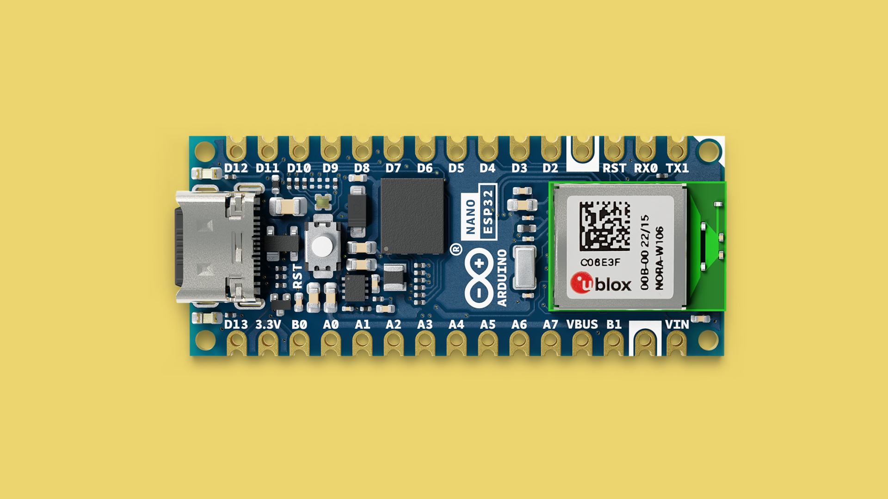

In this guide, you will find information specific to the [Nano ESP32 board](https://store.arduino.cc/products/nano-esp32), such as supported serial protocols, built-in sensors, and how to access the wireless features.

For installation instructions, please visit the link below:  
- [Installing MicroPython](https://labs.arduino.cc/en/labs/micropython-installer)

## Pinout

The pinout for the Nano ESP32 can be found in the image below.


***For more details on this product, visit the [hardware product page](/hardware/nano-esp32/).***

## Board-Specific Features

The Nano ESP32 has several board-specific features that we can access through MicroPython:

- **RGB LED**: A built-in RGB LED that can be controlled by setting `r`, `g`, and `b` values.
- **Touch Pins**: Capacitive touch sensors available on multiple pins.
- **ESP-NOW**: A wireless communication protocol developed by Espressif that enables low-power, peer-to-peer communication without the need for a Wi-Fi router. ESP-NOW is particularly useful for creating mesh networks or communicating with other ESP32 devices with low latency and minimal setup.

### ESP-NOW

ESP-NOW is a powerful feature of the ESP32 that allows devices to communicate directly with each other using a simple, lightweight protocol. This is useful for applications where quick data transfer is needed between devices, such as in sensor networks or remote control systems.

**Example:**  
Here's a basic outline of how you can set up ESP-NOW communication between two ESP32 boards using MicroPython:

```python
import espnow
import network

# Initialize the Wi-Fi interface in station mode
wifi = network.WLAN(network.STA_IF)
wifi.active(True)

# Initialize ESP-NOW
esp_now = espnow.ESPNow()
esp_now.init()

# Add a peer device (MAC address needed)
peer_mac = b'\x24\x0A\xC4\x12\x34\x56'  # Replace with the MAC address of the peer
esp_now.add_peer(peer_mac)

# Send a message
esp_now.send(peer_mac, b'Hello, ESP-NOW!')

# Receive messages
def on_recv_msg(mac, msg):
    print("Received message from:", mac, "Message:", msg)

esp_now.on_recv(on_recv_msg)
```

> **Note**: ESP-NOW requires you to know the MAC address of the peer device in advance and does not require a Wi-Fi router or internet connection.


## Communication Protocols

The Nano ESP32 supports **I2C**, **UART**, and **SPI** for communication with external devices. Here are examples of how to use them in MicroPython.

### I2C

The I2C bus on the Nano ESP32 is available on pins **A4 (SDA)** and **A5 (SCL)**. Here is how to set it up:

```python
from machine import Pin, I2C

# Initialize I2C with SCL on A5 and SDA on A4
i2c = I2C(0, scl=Pin(5), sda=Pin(4))
devices = i2c.scan()

print("I2C devices found:", devices)
```

***Read more about I2C in [this article](/micropython/communication/i2c).***

### UART

The Nano ESP32 can communicate using UART, available on specific pins. Here’s how to set it up:

```python
from machine import UART

# Initialize UART on pins 16 (TX) and 17 (RX)
uart = UART(1, baudrate=9600, tx=16, rx=17)

# Send and receive data
uart.write("Hello from Nano ESP32!")
data = uart.read()
print("Received:", data)
```

### SPI

SPI communication is also supported on the Nano ESP32, which is useful for high-speed data transfer with peripherals:

```python
from machine import Pin, SPI

# Initialize SPI with SCK on pin 18, MOSI on pin 23, and MISO on pin 19
spi = SPI(1, baudrate=1000000, polarity=0, phase=0, sck=Pin(18), mosi=Pin(23), miso=Pin(19))

print("SPI initialized")
```

## Additional Features

The Nano ESP32 includes other features that can be explored:

- **Analog Pins**: Use `ADC` to read analog values from sensors.
- **PWM**: Use `PWM` for pulse-width modulation to control motors or LEDs.

## Summary

The Nano ESP32 is a powerful microcontroller that supports a variety of features for embedded programming with MicroPython. From controlling the built-in RGB LED to using capacitive touch sensors and establishing wireless connections, this guide covers the essentials to get started.

For more advanced projects and examples, visit the [Arduino Docs - MicroPython](https://docs.arduino.cc/micropython/).